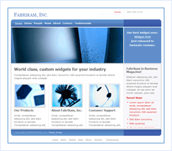

Small Business Starter Kit
====================
> The Small Business Starter Kit provides a sample of a business promotion website suitable for small and medium-sized businesses. It provides a template for customizing and creating a site for your own business out-of-the-box, with advanced features including integration with SQL and XML data sources for content and data management.
> 
> - [Download the Small Business Site Starter Kit](https://msdn.microsoft.com/en-us/cc533514.aspx)

[Try it Live!](https://starterkits.asp.net/SmallBusiness/)

The key pages of the Small Business Site starter kit are:

- **Catalogs**  
 Display complete range of products and services offered by your business.
- **News**  
 Press room for the business where the relevant news and press releases can be posted.
- **Testimonials**  
 Showcase testimonials given by customers regarding their experience with your product or service.
- **People**  
 Provide summary and in-depth info about the professionals running your business.

The content of each page is dynamically displayed from a data source, making it easy for you to extend the site to suit your particular business. For the catalog pages, you may have arbitrarily nested categories, and items that may belong to multiple categories.

Technologies and design approaches demonstrated:

- **Provider Model**  
 Use either SQL data sources or XML data sources simply by changing settings in the web.config file.
- **Databinding**  
 Using ObjectDataSource, DetailsView and GridView controls.
- **Navigation Controls**  
 TreeView and Menu controls.