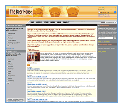

[Edit .md file](C:\Projects\msc\dev\Msc.Www\Web.ASP\App_Data\github\downloads\starter-kits\the-beer-house.md) | [Edit dev content](http://www.aspdev.net/umbraco#/content/content/edit/36287) | [View dev content](http://docs.aspdev.net/tutorials/downloads/starter-kits/the-beer-house.html) | [View prod content](http://www.asp.net/downloads/starter-kits/the-beer-house) | Picker: 36287

TheBeerHouse: CMS and E-Commerce Starter Kit
====================
> TheBeerHouse starter kit enables you to implement a website with functionality typically associated with a CMS/e-commerce site. This website demonstrates key features of ASP.NET 2.0 and is the sample used in the book, "[ASP.NET 2.0 Website Programming / Problem - Design - Solution](https://www.amazon.com/gp/product/0764584642?ie=UTF8&amp;tag=aspnettelligent-20&amp;linkCode=as2&amp;camp=1789&amp;creative=9325&amp;creativeASIN=0764584642)."
> 
> - [Download TheBeerHouse Starter Kit](http://www.codeplex.com/TheBeerHouse/Release/ProjectReleases.aspx)
> - [Review the Features](http://www.codeplex.com/Wiki/View.aspx?ProjectName=TheBeerHouse)

### Overview

- Layout with user-selectable Themes
- Homepage personalization with WebParts
- News and events, organized into categories
- Opinion polls with support for multiple active and archived polls
- Mailing lists with real-time AJAX-based feedback
- Forums with support for multiple categories, custom pagination, avatars and more
- E-commerce store with support for real-time credit card processing
- Localization

### ASP.NET features used

- Master pages
- Themes
- Personalization
- Membership &amp; Profile modules
- WebParts
- Data-bound controls such as GridView, DetailsView, and FormView
- Caching with database dependency