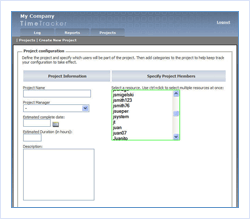

Time Tracker Starter Kit
====================
> A business web application for keeping track of hours spent on a project with the ability to handle multiple resources as well as multiple projects.
> 
> - [Download the Time Tracker Web Site Starter Kit](https://msdn.microsoft.com/en-us/cc533488.aspx)
> - [View Discussion Forum](https://forums.asp.net/1005.aspx/1?Time+Tracker+Starter+Kit)

[Try it Live!](https://starterkits.asp.net/TimeTracker/)

Login Information:

Username: Manager  
Password: 1.manager.1

Username: Consultant  
Password: 1.consultant.1

### Create Projects

- Define project name and description
- Create Tasks categories

### Create and Track Tasks

- Log work completed
- Track time spent each day

### Create Reports

- Track overall progress
- Track time spent in each area

### Technologies and Design Approaches Demonstrated:

- Three-tier architecture with ASP.NET
- User controls