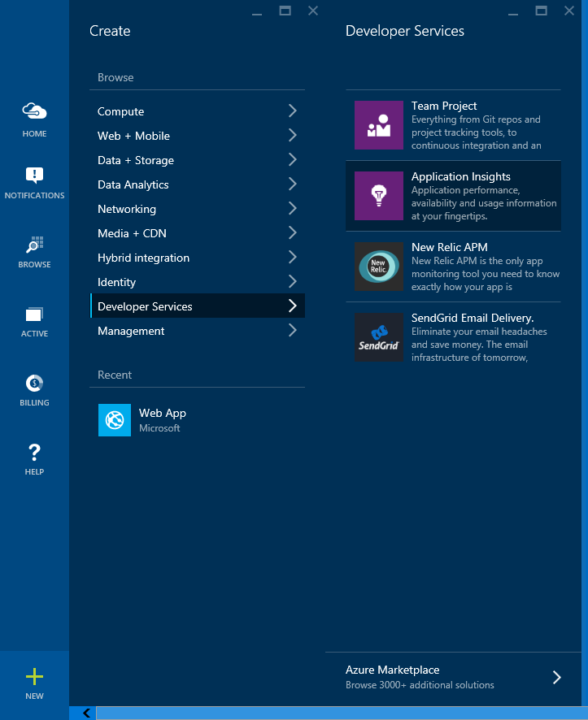
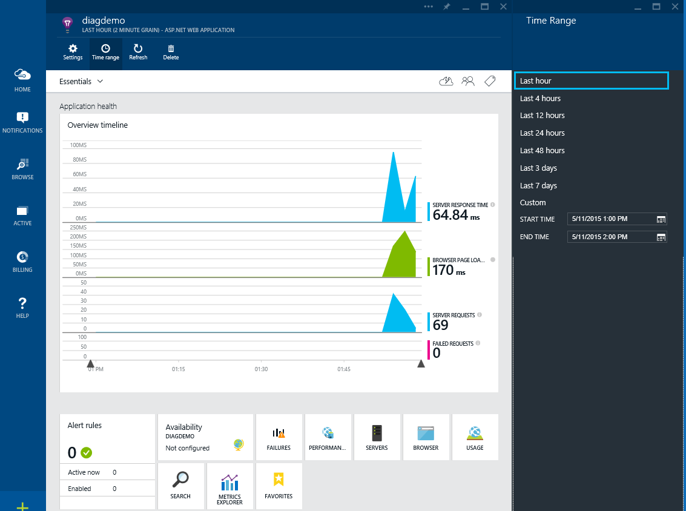

Application Insights
====================

By `Steve Smith`_

`Application Insights <http://azure.microsoft.com/services/application-insights/>`_ provides development teams with a 360 |deg| view across their live application's performance, availability, and usage. It can also `detect and diagnose issues and exceptions <http://azure.microsoft.com/documentation/articles/app-insights-detect-triage-diagnose/>`_ in these applications. Telemetry data may be collected from web servers and web clients, as well as desktop  and mobile applications.

.. |deg| unicode:: 0x00B0
	:ltrim:

In this article:
	- `Getting started`_
	- `Viewing activity`_
	
`View or download sample on GitHub <https://github.com/aspnet/Docs/tree/master/docs/fundamentals/application-insights/sample>`_.

Getting started
---------------

*Application Insights, like ASP.NET 5, is in preview.*

To get started with Application Insights, you will need a subscription to Microsoft Azure. If your team or organization already has a subscription, you can ask the owner to add you to it using your Microsoft account.

Sign in to the `Azure portal <http://portal.azure.com/>`_ with your account and create a new Application Insights resource. 

Choose ASP.NET as the application type. Note the *Instrumentation Key* (under Settings, Properties) associated with the Application Insights resource you've created (`see detailed instructions with more screenshots here <http://azure.microsoft.com/documentation/articles/app-insights-start-monitoring-app-health-usage/>`_). You will need the instrumentation key in a few moments when you configure your ASP.NET 5 application to use Application Insights.

Next, update ``project.json`` to add a new reference to ``Microsoft.ApplicationInsights.AspNet`` in your ``dependencies`` section, as shown:

.. literalinclude:: application-insights/sample/AppInsightsDemo/src/AppInsightsDemo/project.json
  :linenos:
  :language: json
  :lines: 6-30
  :dedent: 4
  :emphasize-lines: 29

Saving the ``project.json`` file will download and install the required packages.
	
Next, edit (or create) the ``config.json`` file, adding the instrumentation key you noted above from your Application Insights resource in Windows Azure. Specify an "ApplicationInsights" section with a key named "InstrumentationKey". Set its value to the instrumentation key.

.. literalinclude:: application-insights/sample/AppInsightsDemo/src/AppInsightsDemo/config.json
  :linenos:
  :language: json
  :emphasize-lines: 2-4

Next, in ``Startup.cs`` you need to configure Application Insights in a few places. In the constructor, where you configure ``Configuration``, add a block to configure Application Insights for development:

.. literalinclude:: application-insights/sample/AppInsightsDemo/src/AppInsightsDemo/Startup.cs
  :linenos:
  :language: c#
  :lines: 38-46
  :dedent: 12
  :emphasize-lines: 8

.. note:: Setting AppInsights in developerMode (``configuration.AddApplicationInsightsSettings(developerMode: true)``) will expedite your telemetry through the pipeline so that you can see results immediately (`learn more <http://azure.microsoft.com/documentation/articles/app-insights-api-custom-events-metrics/#debug>`_).

Add the Application Insights telemetry services in your ``ConfigureServices()`` method:

.. literalinclude:: application-insights/sample/AppInsightsDemo/src/AppInsightsDemo/Startup.cs
  :linenos:
  :language: c#
  :lines: 54-58
  :dedent: 8
  :emphasize-lines: 4

Then, in the ``Configure()`` method add middleware to allow Application Insights to track exceptions and log information about individual requests. Note that the request tracking middleware should be as the first middleware in the pipeline, while the exception middleware should follow the configuration of error pages or other error handling middleware.

An edited ``Startup.cs`` is shown below, highlighting the necessary Application Insights code (`view full Startup.cs <https://github.com/aspnet/Docs/tree/master/docs/fundamentals/application-insights/sample/AppInsightsDemo/src/AppInsightsDemo/Startup.cs>`_):

.. literalinclude:: application-insights/sample/AppInsightsDemo/src/AppInsightsDemo/Startup.cs
  :linenos:
  :language: c#
  :lines: 98-124
  :dedent: 8
  :emphasize-lines: 9,26

Now add the Application Insights scripts to your views. Add the following to the very top of the ``_ViewImports.cshtml`` file:

.. literalinclude:: application-insights/sample/AppInsightsDemo/src/AppInsightsDemo/Views/_ViewImports.cshtml
  :linenos:
  :emphasize-lines: 5

Then, add the following line of code in your ``_Layouts.cshtml`` file at the end of the ``<head>`` section (before any other JavaScript blocks specified there):

.. literalinclude:: application-insights/sample/AppInsightsDemo/src/AppInsightsDemo/Views/Shared/_Layout.cshtml
  :linenos:
  :language: html
  :lines: 3-23
  :dedent: 4
  :emphasize-lines: 20

Viewing activity
----------------

You can view the activity from your site once it's been configured and you've made some requests to it by navigating to the Azure portal. There, you will find the Application Insights resource you configured previously, and you will be able to view charts showing performance and activity data:

In addition to tracking activity and performance data on every page, you can also track specific events. For instance, if you want to know any time a user completes a certain transaction, you can create and track such events individually. To do so, you should inject the TelemetryClient into the controller in question, and call its ``TrackEvent`` method. In the included sample, we've added event tracking for user registration and successful and failed login attempts. You can see the required code in the excerpt from AccountController.cs shown below:

.. literalinclude:: application-insights/sample/AppInsightsDemo/src/AppInsightsDemo/Controllers/AccountController.cs
  :linenos:
  :language: c#
  :lines: 1-47,58-96,106-135,486-
  :emphasize-lines: 17,30,38,45,64,77,108

With this in place, testing the application's registration and login feature results in the following activity available for analysis:

.. image:: application-insights/_static/view-custom-events.png

.. note:: Application Insights is still in development. To view the latest release notes and configuration instructions, please `refer to the project wiki <https://github.com/Microsoft/ApplicationInsights-aspnet5/wiki/Getting-Started>`_.

Summary
-------

Application Insights allows you to easily add application activity and performance tracking to any ASP.NET 5 app. With Application Insights in place, you can view live reports showing information about the users of your application and how it is performing, including both client and server performance information. In addition, you can track custom events, allowing to you capture user activities unique to your application.

Additional Resources
--------------------

- `Application Insights API for custom events and metrics <http://azure.microsoft.com/documentation/articles/app-insights-api-custom-events-metrics/>`_
- `Application Insights for ASP.NET 5 <http://blogs.msdn.com/b/webdev/archive/2015/05/19/application-insights-for-asp-net-5-you-re-in-control.aspx>`_

