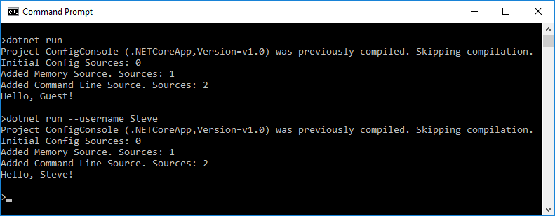
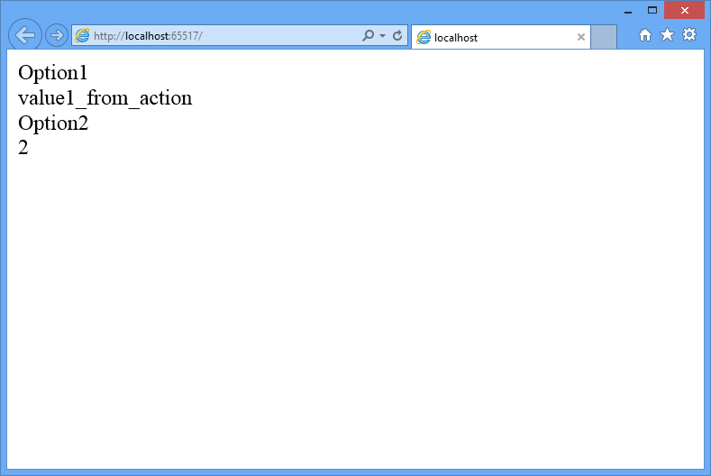
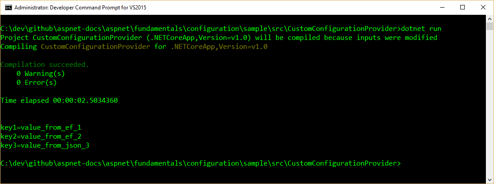

Configuration
=============
By `Steve Smith`_ and `Daniel Roth`_

ASP.NET 5 supports a variety of different configuration options. Application configuration data can come from files using built-in support for JSON, XML, and INI formats, as well as from environment variables. You can also write your own :ref:`custom configuration provider <custom-config-providers>`.

In this article:
  - `Getting and setting configuration settings`_
  - `Using the built-in providers`_
  - `Using Options and configuration objects`_
  - `Writing custom providers`_

`Download sample from GitHub <https://github.com/aspnet/docs>`_. 

Getting and setting configuration settings
------------------------------------------

ASP.NET 5's configuration system has been re-architected from previous versions of ASP.NET, which relied on ``System.Configuration`` and XML configuration files like ``web.config``. The new `configuration model <https://github.com/aspnet/Configuration>`_ provides streamlined access to key/value based settings that can be retrieved from a variety of sources. Applications and frameworks can then access configured settings using the new :ref:`Options pattern <options-config-objects>`

To work with settings in your ASP.NET application, it is recommended that you only instantiate an instance of ``Configuration`` in your application's ``Startup`` class. Then, use the :ref:`Options pattern <options-config-objects>` to access individual settings.

At its simplest, the ``Configuration`` class is just a collection of ``Sources``, which provide the ability to read and write name/value pairs. You must configure at least one source in order for ``Configuration`` to function correctly. The following sample shows how to test working with ``Configuration`` as a key/value store:

.. code-block:: c#
  :linenos:

  // assumes using Microsoft.Framework.ConfigurationModel is specified
  var builder = new ConfigurationBuilder();
  builder.Add(new MemoryConfigurationSource());
  var config = builder.Build();
  config.Set("somekey", "somevalue");

  // do some other work

  string setting = config.Get("somekey"); // returns "somevalue"
  // or
  string setting2 = config["somekey"]; // also returns "somevalue"

.. note:: You must set at least one configuration source.

It's not unusual to store configuration values in a hierarchical structure, especially when using external files (e.g. JSON, XML, INI). In this case, configuration values can be retrieved using a ``:`` separated key, starting from the root of the hierarchy. For example, consider the following *appsettings.json* file:

.. _config-json:

.. literalinclude:: /../common/samples/WebApplication1/src/WebApplication1/appsettings.json
  :linenos:
  :language: json

The application uses configuration to configure the right connection string. Access to the ``ConnectionString`` setting is achieved through this key: ``Data:DefaultConnection:ConnectionString``.

The settings required by your application and the mechanism used to specify those settings (configuration being one example) can be decoupled using the :ref:`options pattern <options-config-objects>`. To use the options pattern you create your own settings class (probably several different classes, corresponding to different cohesive groups of settings) that you can inject into your application using an options service. You can then specify your settings using configuration or whatever mechanism you choose.

.. note:: You could store your ``Configuration`` instance as a service, but this would unnecessarily couple your application to a single configuration system and specific configuration keys. Instead, you can use the :ref:`Options pattern <options-config-objects>` to avoid these issues.

Using the built-in providers
----------------------------

The configuration framework has built-in support for JSON, XML, and INI configuration files, as well as support for in-memory configuration (directly setting values in code) and the ability to pull configuration from environment variables and command line parameters. Developers are not limited to using a single configuration source. In fact several may be set up together such that a default configuration is overridden by settings from another source if they are present.

Adding support for additional configuration file sources is accomplished through extension methods. These methods can be called on a ``ConfigurationBuilder`` instance in a standalone fashion, or chained together as a fluent API, as shown.

.. _custom-config:

.. literalinclude:: configuration/sample/src/CustomConfigurationSource/Program.cs
  :linenos:
  :dedent: 12
  :language: c#
  :lines: 14-17

The order in which configuration sources are specified is important, as this establishes the precedence with which settings will be applied if they exist in multiple locations. In the example above, if the same setting exists in both *appsettings.json* and in an environment variable, the setting from the environment variable will be the one that is used. Essentially, the last configuration source specified "wins" if a setting exists in more than one location.

.. note:: To override nested keys through environment variables in shells that don't support ``:`` in variable names replace them with ``__`` (double underscore).

It can be useful to have environment-specific configuration files. This can be achieved using the following:

.. literalinclude:: /../common/samples/WebApplication1/src/WebApplication1/Startup.cs
  :linenos:
  :dedent: 8
  :language: c#
  :lines: 19-34
  :emphasize-lines: 1,6

The ``IHostingEnvironment`` service is used to get the current environment. In the ``Development`` environment, the highlighted line of code above would look for a file named ``appsettings.Development.json`` and use its values, overriding any other values, if it's present. Learn more about :doc:`environments`.

.. warning:: You should never store passwords or other sensitive data in source code or in plain text configuration files. You also shouldn't use production secrets in your development or test environments. Instead, such secrets should be specified outside the project tree, so they cannot be accidentally committed into the source repository. Learn more about :doc:`environments` and managing :doc:`/security/app-secrets`.

One way to leverage the order precedence of ``Configuration`` is to specify default values, which can be overridden. In this simple console application, a default value for the ``username`` setting is specified in a ``MemoryConfigurationSource``, but this is overridden if a command line argument for ``username`` is passed to the application. You can see in the output how many configuration sources are configured at each stage of the program.

.. literalinclude:: configuration/sample/src/ConfigConsole/Program.cs
  :linenos:
  :language: c#

When run, the program will display the default value unless a command line parameter overrides it.

.. _options-config-objects:

Using Options and configuration objects
---------------------------------------

Using `Options <https://github.com/aspnet/Options>`_ you can easily convert any class (or POCO - Plain Old CLR Object) into a settings class. It's recommended that you create well-factored settings objects that correspond to certain features within your application, thus following the Interface Segregation Principle (ISP) (classes depend only on the configuration settings they use) as well as Separation of Concerns (settings for disparate parts of your app are managed separately, and thus are less likely to negatively impact one another).

A simple ``MyOptions`` class is shown here:

.. literalinclude:: configuration/sample/src/UsingOptions/Models/MyOptions.cs
  :linenos:
  :language: c#
  :lines: 8-12
  :dedent: 4

Options can be injected into your application using the ``IOptions<TOptions>`` service. For example, the following :ref:`MVC <mvc:index>` controller uses ``IOptions<MyOptions>`` to access the settings it needs to render the ``Index`` view:

.. literalinclude:: configuration/sample/src/UsingOptions/Controllers/HomeController.cs
  :linenos:
  :language: c#
  :lines: 11-24
  :dedent: 4

Learn more about :doc:`dependency-injection`.

To setup the ``IOptions<TOption>`` service you call the ``AddOptions()`` extension method during startup in your ``ConfigureServices`` method:

.. literalinclude:: configuration/sample/src/UsingOptions/Startup.cs
  :linenos:
  :language: c#
  :lines: 26-29,41
  :dedent: 8

.. _options-example:

The ``Index`` view displays the configured options:

You configure options using the ``Configure<TOption>`` extension method. You can configure options using a delegate or by binding your options to configuration:

.. literalinclude:: configuration/sample/src/UsingOptions/Startup.cs
  :language: c#
  :linenos:
  :lines: 26-41
  :dedent: 8
  :emphasize-lines: 7,10-13

When you bind options to configuration each property in your options type is bound to a configuration key of the form ``property:subproperty:...``. For example, the ``MyOptions.Option1`` property is bound to the key ``Option1``, which is read from the ``option1`` property in *appsettings.json*. Note that configuration keys are case insensitive.

Each call to ``Configure<TOption>`` adds an ``IConfigureOptions<TOption>`` service to the service container that is used by the ``IOptions<TOption>`` service to provide the configured options to the application or framework. If you want to configure your options some other way (ex. reading settings from a data base) you can use the ``ConfigureOptions<TOptions>`` extension method to you specify a custom ``IConfigureOptions<TOption>`` service directly. 

You can have multiple ``IConfigureOptions<TOption>`` services for the same option type and they are all applied in order. In the :ref:`example <options-example>` above value of Option1 and Option2 are both specified in `appsettings.json`, but the value of Option1 is overridden by the configured delegate.

.. _custom-config-providers:

Writing custom providers
------------------------

In addition to using `the built-in configuration source providers <https://github.com/aspnet/Configuration/tree/dev/src>`_, you can also write your own. To do so, you simply inherit from ``ConfigurationSource``, and populate the ``Data`` property with the settings from your configuration source.

Example: Entity Framework Settings
^^^^^^^^^^^^^^^^^^^^^^^^^^^^^^^^^^

You may wish to store some of your application's settings in a database, and access them using Entity Framework (EF). There are many ways in which you could choose to store such values, ranging from a simple table with a column for the setting name and another column for the setting value, to having separate columns for each setting value. In this example, I'm going to create a simple configuration source that reads name-value pairs from a database using EF.

To start off we'll define a simple ``ConfigurationValue`` entity for storing configuration values in the database:

.. literalinclude:: configuration/sample/src/CustomConfigurationSource/ConfigurationValue.cs
  :linenos:
  :language: c#
  :lines: 8-12
  :dedent: 4

We also need a ``ConfigurationContext`` to store and access the configured values using EF:

.. literalinclude:: configuration/sample/src/CustomConfigurationSource/ConfigurationContext.cs
  :linenos:
  :language: c#
  :lines: 10-17
  :dedent: 4

Next, create the custom configuration source by inheriting from ``ConfigurationSource``. The configuration data is loaded by overriding the ``Load`` method, which reads in all of the configuration data from the configured database. For demonstration purposes, the configuration source also takes care of initializing the database if it hasn't already been created and populated:

.. literalinclude:: configuration/sample/src/CustomConfigurationSource/EntityFrameworkConfigurationSource.cs
  :linenos:
  :language: c#
  :lines: 10-46
  :dedent: 4

By convention we also add an ``AddEntityFramework`` extension method for adding the configuration source:

.. literalinclude:: configuration/sample/src/CustomConfigurationSource/EntityFrameworkConfigurationSource.cs
  :linenos:
  :language: c#
  :lines: 48-54
  :dedent: 4

You can see an example of how to use this custom ``ConfigurationSource`` in your application in the following example. Create a new ``ConfigurationBuilder`` to setup your configuration sources. To add the ``EntityFrameworkConfigurationSource`` you first need to specify the data provider and connection string. How should you configure the connection string? Using configuration of course! Add a *appsettings.json* file as a configuration source to bootstrap setting up the ``EntityFrameworkConfigurationSource``. By reusing the same ``ConfigurationBuilder`` any settings specified in the database will override settings specified in *appsettings.json*:

.. literalinclude:: configuration/sample/src/CustomConfigurationSource/Program.cs
  :linenos:
  :language: c#
  :lines: 10-28
  :dedent: 4

Run the application to see the configured values:

Summary
-------

ASP.NET 5 provides a very flexible configuration model that supports a number of different file-based options, as well as command-line, in-memory, and environment variables. It works seamlessly with the options model so that you can inject strongly typed settings into your application or framework. You can create your own custom configuration source providers as well, which can work with or replace the built-in providers, allowing for extreme flexibility. 
