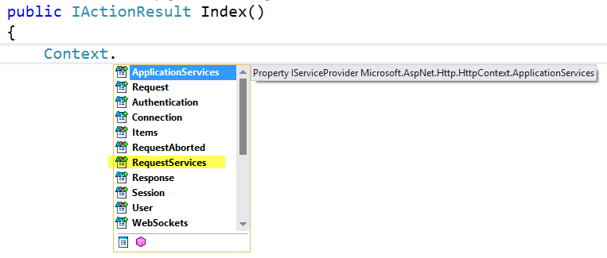

.. _fundamentals-dependency-injection:

Dependency Injection
====================
By `Steve Smith`_

ASP.NET 5 is designed from the ground up to support and leverage dependency injection. ASP.NET 5 applications can leverage built-in framework services by having them injected into methods in the Startup class, and application services can be configured for injection as well. The default services container provided by ASP.NET 5 provides a minimal feature set and is not intended to replace other containers.

.. contents:: In this article:
  :local:
  :depth: 1

`Download sample from GitHub <https://github.com/aspnet/Docs/tree/master/aspnet/fundamentals/dependency-injection/sample>`_. 

What is Dependency Injection?
-----------------------------

Dependency injection (DI) is a technique for achieving loose coupling between objects and their collaborators, or dependencies. Rather than directly instantiating collaborators, or using static references, the objects a class needs in order to perform its actions are provided to the class in some fashion. Most often, classes will declare their dependencies via their constructor, allowing them to follow the `Explicit Dependencies Principle <http://deviq.com/explicit-dependencies-principle/>`_. This approach is known as "constructor injection".

When classes are designed with DI in mind, they are more loosely coupled because they do not have direct, hard-coded dependencies on their collaborators. This follows the `Dependency Inversion Principle <http://deviq.com/dependency-inversion-principle/>`_, which states that *"high level modules should not depend on low level modules; both should depend on abstractions."* Instead of referencing specific implementations, classes request abstractions (typically ``interfaces``) which are provided to them when they are constructed. Extracting dependencies into interfaces and providing implementations of these interfaces as parameters is also an example of the `Strategy design pattern <http://deviq.com/strategy-design-pattern/>`_.

When a system is designed to use DI, with many classes requesting their dependencies via their constructor (or properties), it's helpful to have a class dedicated to creating these classes with their associated dependencies. These classes are referred to as *containers*, or more specifically, `Inversion of Control (IoC) <http://deviq.com/inversion-of-control/>`_ containers or Dependency Injection (DI) containers. A container is essentially a factory that is responsible for providing instances of types that are requested from it. If a given type has declared that it has dependencies, and the container has been configured to provide the dependency types, it will create the dependencies as part of creating the requested instance. In this way, complex dependency graphs can be provided to classes without the need for any hard-coded object construction. In addition to creating objects with their dependencies, containers typically manage object lifetimes within the application.

ASP.NET 5 includes a simple built-in container (represented by the ``IServiceProvider`` interface) that supports constructor injection by default, and ASP.NET makes certain services available through DI. ASP.NET's container refers to the types it manages as *services*. Throughout the rest of this article, *services* will refer to types that are managed by ASP.NET 5's IoC container. You configure the built-in container's services in the ``ConfigureServices`` method in your application's ``Startup`` class.

.. note:: Martin Fowler has written an extensive article on `Inversion of Control Containers and the Dependency Injection Pattern <http://www.martinfowler.com/articles/injection.html>`_. Microsoft Patterns and Practices also has a great description of `Dependency Injection <https://msdn.microsoft.com/en-us/library/dn178469(v=pandp.30).aspx>`_.

.. note:: This article covers Dependency Injection as it applies to all ASP.NET applications. Dependency Injection within ASP.NET MVC is covered in :ref:`Dependency Injection and Controllers <mvc:dependency-injection-controllers>`.

Using Framework-Provided Services
---------------------------------

The ``ConfigureServices`` method in the ``Startup`` class is responsible for defining the services the application will use, including platform features like Entity Framework and ASP.NET MVC. Initially, the ``IServiceCollection`` provided to ``ConfigureServices`` has just a handful of services defined. The default web template shows an example of how to add additional services to the container using a number of extensions methods like ``AddEntityFramework``, ``AddIdentity``, and ``AddMvc``.

.. literalinclude:: ../../common/samples/WebApplication1/src/WebApplication1/Startup.cs
  :language: c#
  :linenos:
  :lines: 39-56
  :dedent: 8
  :emphasize-lines: 4,9,13

The features and middleware provided by ASP.NET, such as MVC, follow a convention of using a single ``AddService()`` extension method to register all of the services required by that feature. 

.. note:: You can request certain framework-provided services within ``Startup`` methods - see :doc:`startup` for more details.

Of course, in addition to configuring the application to take advantage of various framework features, you can also use ``ConfigureServices`` to configure your own application services.

Registering Your Own Services
-----------------------------

In the default web template example above, two application services are added to the ``IServiceCollection``. 

.. literalinclude:: ../../common/samples/WebApplication1/src/WebApplication1/Startup.cs
  :language: c#
  :linenos:
  :lines: 53-55
  :dedent: 12
  :emphasize-lines: 2-3

.. note:: Keep in mind, in addition to these two types, everything else in ``ConfigureServices`` is about adding services. For example, ``services.AddMvc()`` adds the services MVC requires.

The ``AddTransient`` method is used to map abstract types to concrete services that are instantiated separately for every object that requires it. This is known as the service's *lifetime*, and additional lifetime options are described below. It is important to choose an appropriate lifetime for each of the services you register. Should a new instance of the service be provided to each class that requests it? Should one instance be used throughout a given web request? Or should a single instance be used for the lifetime of the application?

In the sample for this article, there is a simple controller that displays character names, called ``CharacterController``. Its ``Index`` method displays the current list of characters that have been stored in the application, and initializes the collection with a handful of characters if none exist. Note that although this application uses Entity Framework and the ``ApplicationDbContext`` class for its persistence, none of that is apparent in the controller. Instead, the specific data access mechanism has been abstracted behind an interface, ``ICharacterRepository``, which follows the `repository pattern <http://deviq.com/repository-pattern/>`_. An instance of ``ICharacterRepository`` is requested via the constructor and assigned to a private field, which is then used to access characters as necessary.

.. literalinclude:: dependency-injection/sample/src/DependencyInjectionSample/Controllers/CharactersController.cs
  :language: c#
  :linenos:
  :lines: 1-32
  :emphasize-lines: 10,12,14,20,23-27

The `ICharacterRepository` simply defines the two methods the controller needs to work with `Character` instances.

.. literalinclude:: dependency-injection/sample/src/DependencyInjectionSample/Interfaces/ICharacterRepository.cs
  :language: c#
  :linenos:

This interface is in turn implemented by a concrete type, ``CharacterRepository``, that is used at runtime.

.. note:: The way DI is used with the ``CharacterRepository`` class is a general model you can follow for all of your application services, not just in "repositories" or data access classes.

.. literalinclude:: dependency-injection/sample/src/DependencyInjectionSample/Models/CharacterRepository.cs
  :language: c#
  :linenos:

Note that ``CharacterRepository`` requests an ``ApplicationDbContext`` in its constructor. It is not unusual for dependency injection to be used in a chained fashion like this, with each requested dependency in turn requesting its own dependencies. The container is responsible for resolving all of the dependencies in the tree and returning the fully resolved service.

.. note:: Creating the requested object, and all of the objects it requires, and all of the objects those require, is sometimes referred to as an `object graph`. Likewise, the collective set of dependencies that must be resolved is typically referred to as a `dependency tree` or `dependency graph`.

In this case, both ``ICharacterRepository`` and in turn ``ApplicationDbContext`` must be registered with the services container in ``ConfigureServices`` in ``Startup``. ``ApplicationDbContext`` is configured via the call to the extension method ``AddEntityFramework`` which includes an extension for adding a ``DbContext`` (``AddDbContext<T>``). Registration of the repository is done at the bottom end of ``ConfigureServices``:

.. literalinclude:: dependency-injection/sample/src/DependencyInjectionSample/Startup.cs
  :language: c#
  :lines: 62-63
  :linenos:
  :dedent: 12
  :emphasize-lines: 4

Entity Framework contexts should be added to the services container using the ``Scoped`` lifetime. This is taken care of automatically if you use the helper methods as shown above. Repositories that will make use of Entity Framework should use the same lifetime.

.. warning:: The main danger to be wary of is resolving a ``Scoped`` service from a singleton. It's likely in such a case that the service will have incorrect state when processing subsequent requests.

Service Lifetimes and Registration Options
------------------------------------------

ASP.NET services can be configured with the following lifetimes:

Transient
  Transient lifetime services are created each time they are requested. This lifetime works best for lightweight, stateless service.

Scoped
  Scoped lifetime services are created once per request.

Singleton
  Singleton lifetime services are created the first time they are requested, and then every subsequent request will use the same instance. If your application requires singleton behavior, allowing the services container to manage the service's lifetime is recommended instead of implementing the singleton design pattern and managing your object's lifetime in the class yourself.

Instance
  You can choose to add an instance directly to the services container. If you do so, this instance will be used for all subsequent requests (this technique will create a Singleton-scoped instance). One key difference between ``Instance`` services and ``Singleton`` services is that the ``Instance`` service is created in ``ConfigureServices``, while the ``Singleton`` service is lazy-loaded the first time it is requested.

Services can be registered with the container in several ways. We have already seen how to register a service implementation with a given type by specifying the concrete type to use. In addition, a factory can be specified, which will then be used to create the instance on demand. The third approach is to directly specify the instance of the type to use, in which case the container will never attempt to create an instance.

To demonstrate the difference between these four lifetime and registration options, consider a simple interface that represents one or more tasks as an *operation* with a unique identifier, ``OperationId``. Depending on how we configure the lifetime for this service, the container will provide either the same or different instances of the service to the requesting class. To make it clear which lifetime is being requested, we will create one type per lifetime option:

.. literalinclude:: dependency-injection/sample/src/DependencyInjectionSample/Interfaces/IOperation.cs
  :language: c#
  :linenos:
  :emphasize-lines: 7

We also implement all of these interfaces using a single class, ``Operation``, that simply accepts a ``Guid`` in its constructor, or uses a new ``Guid`` if none is provided.

Next, in ``ConfigureServices``, each type is added to the container according to its named lifetime:

.. literalinclude:: dependency-injection/sample/src/DependencyInjectionSample/Startup.cs
  :language: c#
  :lines: 65-69
  :linenos:
  :dedent: 12

Note that the *instance* lifetime type has been added with a known ID of ``Guid.Empty`` so it will be clear when this type is in use. We have also registered an ``OperationService`` that depends on each of the other ``Operation`` types, so that it will be clear within a request whether this service is getting the same instance as the controller, or a new one, for each operation type.

.. literalinclude:: dependency-injection/sample/src/DependencyInjectionSample/Services/OperationService.cs
  :language: c#
  :linenos:

To demonstrate the object lifetimes within and between separate individual requests to the application, the sample includes an ``OperationsController`` that requests each kind of ``IOperation`` type as well as an ``OperationService``. The ``Index`` action then displays all of the controller's and service's ``OperationId`` values.

.. literalinclude:: dependency-injection/sample/src/DependencyInjectionSample/Controllers/OperationsController.cs
  :language: c#
  :linenos:

Now two separate requests are made to this controller action:

.. image:: dependency-injection/_static/lifetimes_request1.png
.. image:: dependency-injection/_static/lifetimes_request2.png

Observe which of the ``OperationId`` values varies within a request, and between requests.

- *Transient* objects are always different; a new instance is provided to every controller and every service.
- *Scoped* objects are the same within a request, but different across different requests
- *Singleton* objects are the same for every object and every request
- *Instance* objects are the same for every object and every request, and are the exact instance that was specified in ``ConfigureServices``

Request Services and Application Services
-----------------------------------------

The services available within an ASP.NET request from ``HttpContext`` fall into two collections: *ApplicationServices* and *RequestServices*.

Request Services represent the services you configure and request as part of your application. Application Services are limited to those things that are available on application startup. Anything that is scoped is only available as part of Request Services, not Application Services. When your objects specify dependencies, these are satisfied by the types found in ``RequestServices``, not ``ApplicationServices``.

Generally, you shouldn't use these properties directly, preferring instead to request the types your classes you require via your class's constructor, and letting the framework inject these dependencies. This yields classes that are easier to test (see :doc:`/testing/index`) and are more loosely coupled.

.. note:: The important things to remember are that your application will almost always use ``RequestServices``, and in any case you shouldn't access these properties directly. Instead, request the services you need via your class's constructor. 

Designing Your Services For Dependency Injection
------------------------------------------------

You should design your services to use dependency injection to get their collaborators. This means avoiding the use of stateful static method calls (which result in a code smell known as `static cling <http://deviq.com/static-cling/>`_) and the direct instantiation of dependent classes within your services. It may help to remember the phrase, `New is Glue <http://ardalis.com/new-is-glue>`_, when choosing whether to instantiate a type or to request it via dependency injection. By following the `SOLID Principles of Object Oriented Design <http://deviq.com/solid/>`_, your classes will naturally tend to be small,  well-factored, and easily tested.

What if you find that your classes tend to have way too many dependencies being injected? This is generally a sign that your class is trying to do too much, and is probably violating SRP - the `Single Responsibility Principle <http://deviq.com/single-responsibility-principle/>`_. See if you can refactor the class by moving some of its responsibilities into a new class. Keep in mind that your ``Controller`` classes should be focused on UI concerns, so business rules and data access implementation details should be kept in classes appropriate to these `separate concerns <http://deviq.com/separation-of-concerns/>`_.

With regard to data access specifically, you can easily inject Entity Framework ``DbContext`` types into your controllers, assuming you've configured EF in your ``Startup`` class. However, it is best to avoid depending directly on ``DbContext`` in your UI project. Instead, depend on an abstraction (like a Repository interface), and restrict knowledge of EF (or any other specific data access technology) to the implementation of this interface. This will reduce the coupling between your application and a particular data access strategy, and will make testing your application code much easier.

Replacing the default services container
----------------------------------------

The built-in services container is mean to serve the basic needs of the framework and most consumer applications built on it. However, developers who wish to replace the built-in container with their preferred container can easily do so. The ``ConfigureServices`` method typically returns ``void``, but if its signature is changed to return ``IServiceProvider``, a different container can be configured and returned. There are `many IOC containers available for .NET <https://github.com/danielpalme/IocPerformance/blob/master/README.md>`_. This article will attempt to add links to DNX implementations of containers as they become available. In this example, the `Autofac <http://autofac.org/>`_ package is used.

First, add the appropriate container package(s) to the dependencies property in project.json:

.. code-block:: json

  "dependencies" : {
    "Autofac": "4.0.0-rc1",
    "Autofac.Extensions.DependencyInjection": "4.0.0-rc1"
  },

Next, configure the container in ``ConfigureServices`` and return an ``IServiceProvider``:

.. code-block:: c#
  :emphasize-lines: 1,11
  :linenos:

  public IServiceProvider ConfigureServices(IServiceCollection services)
  {
    services.AddMvc();
    // add other framework services
    
    // Add Autofac
    var containerBuilder = new ContainerBuilder();
    containerBuilder.RegisterModule<DefaultModule>();
    containerBuilder.Populate(services);
    var container = containerBuilder.Build();
    return container.Resolve<IServiceProvider>();
  }

.. note:: When using a third-party DI container, you must change ``ConfigureServices`` so that it returns ``IServiceProvider`` instead of ``void``.

Finally, configure Autofac as normal in ``DefaultModule``:

.. code-block:: c#

  public class DefaultModule : Module
  {
    protected override void Load(ContainerBuilder builder)
    {
      builder.RegisterType<CharacterRepository>().As<ICharacterRepository>();
    }
  }

Now at runtime, Autofac will be used to resolve types and inject dependencies.

.. list-table:: ASP.NET 5 / DNX Containers (in alphabetical order)
   :header-rows: 1

   * - Package (Nuget)
     - Project Site
   * - `Autofac.Dnx <http://www.nuget.org/packages/Autofac.Dnx/>`_
     - http://autofac.org
   * - `StructureMap.Dnx <http://www.nuget.org/packages/StructureMap.Dnx>`_
     - http://structuremap.github.io

Recommendations
---------------

When working with dependency injection, keep the following recommendations in mind:

- DI is for objects that have complex dependencies. Controllers, services, adapters, and repositories are all examples of objects that might be added to DI.
- Avoid storing data and configuration directly in DI. For example, a user's shopping cart shouldn't typically be added to the services container. Configuration should use the :ref:`Options Model <options-config-objects>`. Similarly, avoid "data holder" objects that only exist to allow access to some other object. It's better to request the actual item needed via DI, if possible.
- Avoid static access to services.
- Avoid service location in your application code.
- Avoid static access to ``HttpContext``.

.. note:: Like all sets of recommendations, you may encounter situations where ignoring one is required. We have found exceptions to be rare -- mostly very special cases within the framework itself.

Remember, dependency injection is an *alternative* to static/global object access patterns. You will not be able to realize the benefits of DI if you mix it with static object access.

Additional Resources
--------------------

- :doc:`startup`
- :doc:`/testing/index`
- :ref:`options-config-objects`
- `Explicit Dependencies Principle <http://deviq.com/explicit-dependencies-principle/>`_
- `Inversion of Control Containers and the Dependency Injection Pattern <http://www.martinfowler.com/articles/injection.html>`_ (Fowler)
