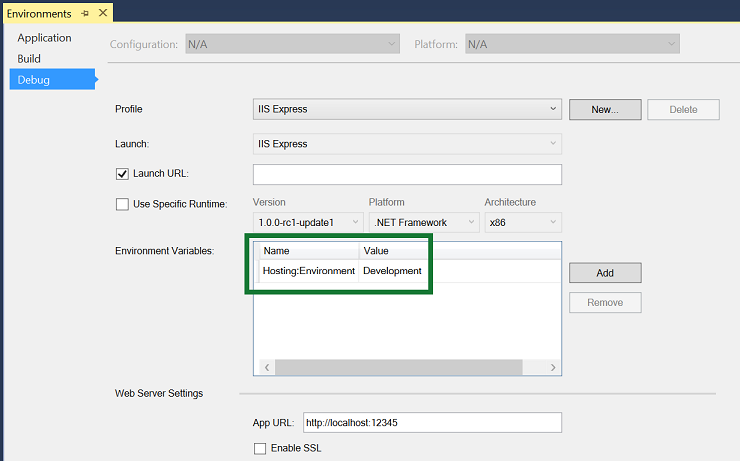

Working with Multiple Environments
==================================

By `Steve Smith`_

ASP.NET 5 introduces improved support for controlling application behavior across multiple environments, such as development, staging, and production. Environment variables are used to indicate which environment the application is running in, allowing the app to be configured appropriately.

In this article:
	- `Development, Staging, Production`_
	- `Determining the environment at runtime`_
	- `Startup conventions`_

`Browse or download samples on GitHub <https://github.com/aspnet/Docs/tree/master/docs/fundamentals/environments/sample>`_.

Development, Staging, Production
--------------------------------

ASP.NET 5 references a particular `environment variable <https://github.com/aspnet/Home/wiki/Environment-Variables>`_, ``ASPNET_ENV``, to describe the environment the application is currently running in. This variable can be set to any value you like, but three values are used by convention: ``Development``, ``Staging``, and ``Production``. You will find these values used in the samples and templates provided with ASP.NET 5.

The current environment setting can be detected programmatically from within ASP.NET 5. In addition, ASP.NET MVC 6 introduces an `Environment Tag Helper <http://docs.asp.net/en/latest/mvc/views/tag-helpers/index.html>`_ that allows MVC Views to include certain sections based on the current application environment.

.. note:: The specified environment name is case insensitive. Whether you set the variable to ``Development`` or ``development`` or ``DEVELOPMENT`` the results will be the same.

Development
^^^^^^^^^^^

This should be the environment used when developing an application. When using Visual Studio 2015, this setting can be specified in your project's debug profiles, such as for IIS Express, shown here:

When you modify the default settings created with the project, your changes are persisted in ``launchSettings.json`` in the ``Properties`` folder. After modifying the ``ASPNET_ENV`` variable in the ``web`` profile to be set to ``Staging``, the ``launchSettings.js`` file in our sample project is shown below:

.. literalinclude:: environments/sample/src/Environments/Properties/launchSettings.json
	:language: javascript
	:caption: launchSettings.json
	:emphasize-lines: 7,13

.. note:: Changes made to project profiles or to ``launchSettings.json`` directly will not take effect until the web server being used is restarted.

Staging
^^^^^^^

By convention, a ``Staging`` environment is a pre-production environment used for final testing before deployment to production. Ideally, its physical characteristics should mirror that of production, so that any issues that may arise in production occur first in the staging environment, where they can be addressed without impact to users.

Production
^^^^^^^^^^

The ``Production`` environment is the environment in which the application runs when it is live and being used by end users. This environment should be configured to maximize security, performance, and application robustness. Some common settings that a production environment might have that would differ from development include:

- Turn on caching
- Ensure all client-side resources are bundled, minified, and potentially served from a CDN
- Turn off diagnostic ErrorPages
- Turn on friendly error pages
- Enable production logging and monitoring (e.g. AppInsights)

This is by no means meant to be a complete list. It's best to avoid scattering environment checks in many parts of your application. Instead, the recommended approach is to perform such checks within the application's ``Startup`` class(es) wherever possible

Determining the environment at runtime
--------------------------------------

The ``IHostingEnvironment`` service provides the core abstraction for working with environments. This service is provided by the ASP.NET hosting layer, and can be injected into your startup logic via :doc:`dependency-injection`. The ASP.NET 5 web site template in Visual Studio uses this approach to load environment-specific configuration files (if present) and to customize the app's error handling settings. In both cases, this behavior is achieved by referring to the currently specified environment by calling ``EnvironmentName`` or ``IsEnvironment`` on the instance of ``IHostingEnvironment`` passed into the appropriate method.

If you need to check whether the application is running in a particular environment, use ``env.IsEnvironment("environmentname")`` since it will correctly ignore case (instead of checking if ``env.EnvironmentName == "Development"`` for example).

The following code is taken from the default ASP.NET 5 web site template:

.. literalinclude:: /../common/samples/WebApplication1/src/WebApplication1/Startup.cs
	:language: c#
	:caption: Startup.cs (some parts removed for brevity)
	:linenos:
	:dedent: 4
	:lines: 27-47,89-109,134-135
	:emphasize-lines: 8,10-15,30-41

The highlighted sections in the example above show several examples of adjusting application configuration based on environment.

In the ``Startup()`` method (constructor), the configuration of the application is set up to optionally allow for environment-specific configuration files (e.g. ``config.Development.json``) that will override any other config settings (because the file is added last in the configuration setup chain - :doc:`learn more about ASP.NET configuration <configuration>`). A call to ``IsEnvironment()`` is also used to ensure that User Secrets are only configured for use in ``Development`` (learn more about User Secrets and the `Secret Manager <https://github.com/aspnet/Home/wiki/DNX-Secret-Configuration>`_).

In ``Configure()``, the environment is checked once more, and if the app is running in a ``Development`` environment, then it enables BrowserLink and error pages (which typically should not be run in production). Otherwise, if the app is not running in a development environment, a standard error handling page is configured to be displayed in response to any unhandled exceptions.

Startup conventions
-------------------

ASP.NET 5 supports a convention-based approach to configuring an application's startup based on the current environment. You can also programmatically control how your application behaves according to which environment it is in, allowing you to create and manage your own conventions.

When an ASP.NET 5 application starts, the ``Startup`` class is used to bootstrap the application, load its configuration settings, etc. (:doc:`learn more about ASP.NET startup <startup>`). However, if a class exists named ``Startup{EnvironmentName}``, e.g. ``StartupDevelopment``, and the ``ASPNET_ENV`` environment variable matches that name, then that ``Startup`` class is used instead. Thus, you could configure ``Startup`` for development, but have a separate ``StartupProduction`` that would be used when the app is run in production. Or vice versa.

The following ``StartupDevelopment`` file from this article's sample project is run when the application is set to run in a Development environment:

.. literalinclude:: environments/sample/src/Environments/StartupDevelopment.cs
	:language: c#
	:caption: StartupDevelopment.cs
	:linenos:
	:emphasize-lines: 5

Run the application in development, and a welcome screen is displayed. The sample also includes a ``StartupStaging`` class:

.. literalinclude:: environments/sample/src/Environments/StartupStaging.cs
	:language: c#
	:caption: StartupStaging.cs
	:linenos:
	:emphasize-lines: 6

When the application is run with ``ASPNET_ENV`` set to ``Staging``, this ``Startup`` class is used, and the application will simply display a string stating it's running in a staging environment. The application's default ``Startup`` class will only run when the environment is not set to either ``Development`` or ``Staging`` (presumably, this would be when it is set to ``Production``, but you're not limited to only these three options. Also note that if no environment is set, the default ``Startup`` will run).

In addition to using an entirely separate ``Startup`` class based on the current environment, you can also make adjustments to how the application is configured within a ``Startup`` class. The ``Configure()`` and ``ConfigureServices()`` methods support environment-specific versions similar to the ``Startup`` class itself, of the form ``Configure[Environment]()`` and ``Configure[Environment]Services()``. If you define a method ``ConfigureDevelopment()`` it will be called instead of ``Configure()`` when the environment is set to development. Likewise, ``ConfigureDevelopmentServices()`` would be called instead of ``ConfigureServices()`` in the same environment.

Summary
-------

ASP.NET 5 provides a number of features and conventions that allow developers to easily control how their applications behave in different environments. When publishing an application from development to staging to production, environment variables set appropriately for the environment allow for optimization of the application for debugging, testing, or production use, as appropriate.

Additional Resources
--------------------

- `Tag Helpers in ASP.NET MVC 6 <http://docs.asp.net/en/latest/mvc/views/tag-helpers/index.html>`_ including the Environment Tag Helper
- :doc:`configuration`

