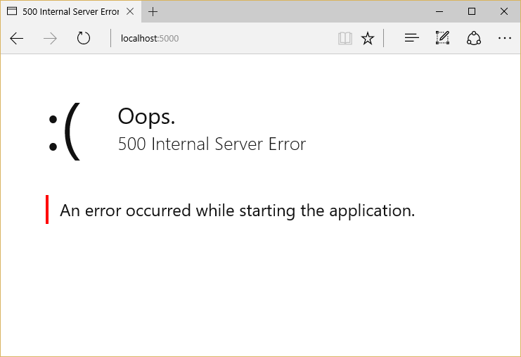

:version: 1.0.0

Hosting
=======

By `Steve Smith`_

To run an ASP.NET Core app, you need to configure and launch a host using ``WebHostBuilder``.

.. contents:: Sections:
  :local:
  :depth: 1

`View or download sample code <https://github.com/aspnet/Docs/tree/master/aspnet/fundamentals/hosting/sample>`__

What is a Host?
---------------

ASP.NET Core apps require a *host* in which to execute. A host must implement the :dn:iface:`~Microsoft.AspNetCore.Hosting.IWebHost` interface, which exposes collections of features and services, and a ``Start`` method. The host is typically created using an instance of a :dn:class:`~Microsoft.AspNetCore.Hosting.WebHostBuilder`, which in builds and returns a  :dn:class:`~Microsoft.AspNetCore.Hosting.WebHost` instance. The ``WebHost`` has a private ``Server`` property that is used once the application is up and running to handle requests. Learn more about :doc:`servers <servers>`.

What is the difference between a host and a server?
^^^^^^^^^^^^^^^^^^^^^^^^^^^^^^^^^^^^^^^^^^^^^^^^^^^

The host is responsible for ensuring the application's services and the server are available and properly configured. You can think of the host as being a wrapper around the server. The host is configured to use a particular server; the server is unaware of its host.

Setting up a Host
-----------------

You create a host using an instance of ``WebHostBuilder``. This is typically done in your app's entry point, which by default will be located in a *Program.cs* file. A typical *Program.cs*, shown below, demonstrates how to use a ``WebHostBuilder`` to build a host. 

.. literalinclude:: /../common/samples/WebApplication1/src/WebApplication1/Program.cs
  :emphasize-lines: 14-21
  :language: c#
  :caption: Program.cs

The ``WebHostBuilder`` is responsible for creating the host that will bootstrap the server for the app. ``WebHostBuilder`` supports many optional extensions, but the specification of an ``IServer`` is required. The built-in server is Kestrel. Use ``UseKestrel`` (with options, if desired) to set it up as your app's server.

The server's *content root* determines where it searches for content files, like MVC View files. The default content root is the folder from which the application is run. Specifying ``Directory.GetCurrentDirectory`` as the content root will use the web project's root folder as the app's content root when the app is started from this folder (for example, calling ``dotnet run`` from the web project folder).

If the app should work with IIS, the ``UseIISIntegration`` method should be called as part of building the host. Note that this does not configure a *server*, like ``UseKestrel`` does. To use IIS with ASP.NET Core, you must specify both ``UseKestrel`` and ``UseIISIntegration``.

A ``Startup`` class can be specified by calling the ``UseStartup<T>`` generic method.

A minimal implementation of configuring a host (and an ASP.NET app) would include just a server and configuration of the app's request pipeline:

.. code-block:: c#

    var host = new WebHostBuilder()
        .UseKestrel()
        .Configure(app => 
        {
            app.Run(async (context) => await context.Response.WriteAsync("Hi!"));
        })
        .Build();

    host.Run();

.. note:: When setting up a host, you can provide ``Configure`` and ``ConfigureServices`` methods, instead of or in addition to specifying a ``Startup`` class (which must also define these methods - see :doc:`startup`).

Configuring a Host
------------------

The ``WebHostBuilder`` provides useful methods for setting most of the available configuration values for the host, which can also be set directly using ``UseSetting`` and associated key. For example, to specify the application name:

.. code-block:: c#

    .UseSetting("applicationName", "MyApp")

Host Configuration Values
^^^^^^^^^^^^^^^^^^^^^^^^^

Application Name ``string``
    Key: ``applicationName``. This configuration setting specifies the value that will be returned from ``IHostingEnvironment.ApplicationName``.

Capture Startup Errors ``bool``
    Key: ``captureStartupErrors``. Defaults to ``false``. When ``false``, errors during startup result in the host exiting. When ``true``, the host will capture any exceptions from the ``Startup`` class, and attempt to start the server anyway, displaying an error page (generic, or detailed, based on the Detailed Errors setting, below) in response to every request. Set using the ``CaptureStartupErrors`` method.

.. code-block:: c#

    .CaptureStartupErrors(true)

Content Root ``string``
    Key: ``contentRoot``. Defaults to the folder where the application assembly resides (for Kestrel; IIS will use the web project root by default). This setting determines where ASP.NET Core will begin searching for content files, such as MVC Views. Also used as the base path for the Web Root setting, below. Set using the ``UseContentRoot`` method. Path must exist, or host will fail to start.

.. code-block:: c#

    .UseContentRoot("c:\\mywebsite")

Detailed Errors ``bool``
    Key: ``detailedErrors``. Defaults to ``false``. When ``true`` (or when Environment is set to "Development"), the app will display details of startup exceptions, instead of just a generic error page. Set using ``UseSetting``.

.. code-block:: c#

    .UseSetting("detailedErrors", "true")

When Detailed Errors is set to ``false`` and Capture Startup Errors is ``true``, a generic error page is displayed in response to every request to the server.

When Detailed Errors is set to ``true`` and Capture Startup Errors is ``true``, a detailed error page is displayed in response to every request to the server.

.. image:: hosting/_static/detailed-error-page.png

Environment ``string``
    Key: ``environment``. Defaults to "Production". May be set to any value. Predefined values include "Development" and "Staging" in addition to "Production". Values are not case sensitive. See :doc:`environments`. Set using the ``UseEnvironment`` method.

.. code-block:: c#

    .UseEnvironment("Development")

.. note:: By default, the environment is read from the ``ASPNETCORE_ENVIRONMENT`` environment variable. When using Visual Studio, the environment will be based on settings in the *launchSettings.json* file.

Server URLs ``string``
    Key: ``urls``. Set to a semicolon (;) separated list of URL prefixes to which the server should response. For example, "http://localhost:123". The domain/host name can be replaced with "*" to indicate the server listen to any request coming to any IP address or host on the specified port (for example, "http://*:5000").

.. code-block:: c#

    .UseUrls("http://*:5000;http://localhost:5001;http://hostname:5002")

Startup Assembly ``string``
    Key: ``startupAssembly``. Determines the assembly to search for the ``Startup`` class (unless specified using ``WebHostBuilder.UseStartup<StartupType>``, which overrides this setting). Set using non-generic ``UseStartup`` method.

.. code-block:: c#

    .UseStartup("StartupAssemblyName")

Web Root ``string``
    Key: ``webroot``. If not specified, Web Root will use the Content Root path. Determines default root location for static files to be served by the app (relative to Content Root). Set using ``UseWebRoot``.

.. code-block:: c#

    .UseWebRoot("public")

A host can use :doc:`configuration` to set its values, which may be subsequently overridden. This is specified using the ``UseConfiguration`` method.

.. code-block:: c#
  :emphasize-lines: 6

  public static void Main(string[] args)
  {
    var config = new ConfigurationBuilder()
      .AddCommandLine(args)
      .AddJsonFile("hosting.json", optional: true)
      .Build();

      var host = new WebHostBuilder()
        .UseConfiguration(config)
        .UseKestrel()
        .Configure(app => 
        {
            app.Run(async (context) => await context.Response.WriteAsync("Hi!"));
        })
        .Build();

    host.Run();
  }
        
  var host = new WebHostBuilder()    
      .UseConfiguration(config)
      .Build();

    
Once a host is built using ``WebHostBuilder``, it is started by calling its ``Run`` extension method, which starts the web application and blocks the calling thread until the host shutdown.

.. code-block:: c#

    host.Run();

You can run the host by calling its ``Start`` method:

.. code-block:: c#

  using (host)
  {
    host.Start();
    Console.ReadLine();
  }

Important methods to call and ordering. Refer to hosting samples in hosting repo when working on this doc. (https://github.com/aspnet/Hosting/tree/dev/samples/SampleStartups ) (note samples don't run they're just for reference)

Note that environment variables are loaded first, automatically.
You can specify explicit configuration (with settings for command line, files, whatever) and it will use the keys shown above). This will override anything that was set in environment.

Differences between IIS Integration and Kestrel
-----------------------------------------------

UseKestrel vs. UseIISIntegration are totally different things. We just use IIS as a reverse proxy.
UseKestrel says this is the server I want to use, running on this port, and it hosts the code. It registers Kestrel as an IServerFactory. At runtime, will get the actual IServer service, instantiate it, and run it.
UseIISIntegration will look at environment variables used by IIS/IISExpress and will make a bunch of decisions about running on a dynamic port, things with headers, etc. This method doesn't deal with or create an IServer. It calls UseUrls with the dynamic port and registers some middleware.

Host Configuration References
-----------------------------

IIS (point to publishing on IIS doc)
ngenx (point to hosting on linux doc)
as a Windows Service (point to doc)
embedded in an application (you can host ASPNET inside another app as a subcomponent)
