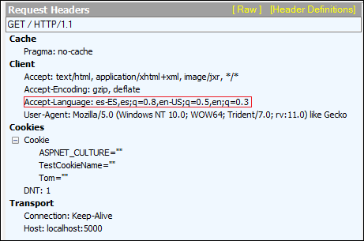
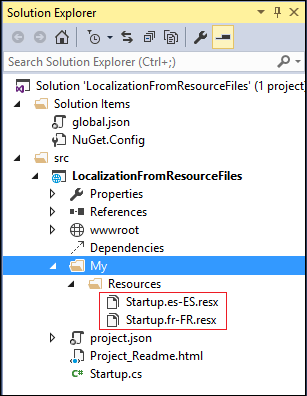

ASP.NET Localization
====================

By `Tom Archer`_

The ASP.NET 5 localization support enables you to customize your application for a given culture and locale. Localization consists primarily of translating the user interface. The ASP.NET 5 localization support provides middleware for establishing the correct culture and UI culture on the thread based on the request, and mechanisms for accessing localized content based on the current culture. In this article, you'll learn how to enable localization and establish the culture using both built-in culture providers. You'll also see how to implement your own custom culture provider.

Enabling localization and establishing culture
-----------------------------------------------

The first step to enabling localization for an ASP.NET 5 app is to add the necessary packages to the project's *project.json* file.

.. code-block:: json
	:emphasize-lines: 4-5

	"dependencies": {
		"Microsoft.AspNet.IISPlatformHandler": "1.0.0-beta8",
		"Microsoft.AspNet.Server.Kestrel": "1.0.0-beta8",
		"Microsoft.AspNet.Localization": "1.0.0-beta8",
		"Microsoft.Framework.Localization": "1.0.0-beta8"
  },

ASP.NET provides request localization middleware for determining the user's locale and culture based on the request data and then persisting the user's culture on the current thread. Add the request localization middleware to the request pipeline from the ``Startup`` class with a call to the ``IApplicationBuilder.UseRequestLocalization`` extension method. The ``IApplicationBuilder.UseRequestLocalization`` extension method has two overloaded versions: a parameter-less version that instantiates and uses a default ``RequestLocalizationOptions`` object and a version that allows you to specify a ``RequestLocalizationOptions`` object as a parameter.

.. code-block:: c#
	:emphasize-lines: 5-6

	public void Configure(IApplicationBuilder app, IStringLocalizer<Startup> SR)
	{
		...

		var options = new RequestLocalizationOptions();
		app.UseRequestLocalization(options);

		...
	}

The ``RequestLocalizationOptions`` class defines a collection property - ``RequestLocalizationOptions.RequestCultureProviders`` - that represents an ordered list of objects that implement the ``IRequestCultureProvider`` interface.

There are three intrinsic implementations of the ``IRequestCultureProvider`` interface - each of which attempts to establish the correct culture and UI culture on the thread based on various aspects of the incoming request:

- ``QueryStringRequestCultureProvider`` attempts to determine the culture based on the query string.
- ``CookieRequestCultureProvider`` attempts to determine the culture based on a client-side cookie.
- ``AcceptLanguageHeaderRequestCultureProvider`` attempts to determine the culture based on the Accept-Language value in the request header.

When you instantiate a ``RequestLocalizationOptions`` object, the constructor instantiates all three of the aforementioned culture providers and adds them to the ``RequestLocalizationOptions.RequestCultureProviders`` collection.

The order in which these providers is added to the collection is important as the first provider to return a non-null value from its implemented ``IRequestCultureProvider.DetermineRequestCulture`` method "wins". For example, let's say the URI includes a query string that specifies Spanish as the culture, but the Accept-Language value in the HTTP request header is set to English. Assuming the provider order above, the ``QueryStringRequestCultureProvider`` would return the culture for Spanish, so the ``AcceptLanguageHeaderRequestCultureProvider`` would not get a chance to evaluate the request.

To remove, add to, or change the ordering of the providers used - including specifying your own custom ``IRequestCultureProvider`` implementation - you simply modify the ``RequestLocalizationOptions.RequestCultureProviders`` member to suit your app's needs. In the following example, the code removes all of the providers from a ``RequestLocalizationOptions`` object and adds the single provider it wants used (``QueryStringRequestcultureProvider``).

.. code-block:: c#
	:emphasize-lines: 6-9

	public void Configure(IApplicationBuilder app, IStringLocalizer<Startup> SR)
	{
		// Add the platform handler to the request pipeline.
		app.UseIISPlatformHandler();

		var options = new RequestLocalizationOptions();
		options.RequestCultureProviders.Clear();
		options.RequestCultureProviders.Add(new QueryStringRequestCultureProvider());
		app.UseRequestLocalization(options);

		...
	}

Using the QueryStringRequestCultureProvider
^^^^^^^^^^^^^^^^^^^^^^^^^^^^^^^^^^^^^^^^^^^
When you instantiate a ``RequestLocalizationOptions`` object, the ``QueryStringRequestCultureProvider`` is added to the list of providers as the first provider to be used in attempting to determine the culture. The ``QueryStringRequestCultureProvider`` looks for the existence of two keys in the query string: "culture" and "ui-culture". If the provider finds a value for "culture", but not for "ui-culture", the UI culture is set to the culture value. Likewise, if the provider finds a value for "ui-culture", but not for culture, the culture is set to the UI culture value. Therefore, when using the ``QueryStringRequestCultureProvider``, all of the following URIs will result in a culture and UI culture of "Spanish-Spain".

::

	// All of these URIs will result in a culture and UI culture of Spanish.
	http://<yourApp>/?culture=es-ES&ui-culture=es-ES
	http://<yourApp>/?culture=es-ES
	http://<yourApp>/?ui-culture=es-ES

Note that while the query string keys are case insensitive, the locale value (es-ES, in this example) is case sensitive. Therefore, the following URIs will not result in a found culture as the locale is  not correctly cased:

::

	// The QueryStringRequestCultureProvider will not locate a valid culture
	// based on this URI as the correct locale is es-ES (case sensitive).
	http://<yourApp>/?ui-culture=es-es

One last note about the ``QueryStringRequestLocalizationProvider`` is that if either culture or ui-culture is not valid, the result is null - meaning that a culture was not located. The next provider in the list (if there is one) is then given the opportunity to determine the culture.

Using the CookieRequestCultureProvider
^^^^^^^^^^^^^^^^^^^^^^^^^^^^^^^^^^^^^^

The ``CookieRequestCultureProvider`` looks for the existence of a cookie whose name is represented by ``CookieRequestCultureProvider.CookieName``. When you instantiate a ``CookieRequestCultureProvider`` object, the ``CookieRequestCultureProvider.CookieName`` value is set to the value of ``CookieRequestCultureProvider.DefaultCookieName``.

The cookie consists of a single string value of the following format:

::

	c=[culture]|uic=[ui-culture]

As you can see from the syntax above, the culture is prefixed with "c=" and the UI culture is prefixed with "uic=". The two values are then delimited with a vertical bar (pipe character).

Using the AcceptLanguageHeaderRequestCultureProvider
^^^^^^^^^^^^^^^^^^^^^^^^^^^^^^^^^^^^^^^^^^^^^^^^^^^^

The ``AcceptLanguageHeaderRequestCultureProvider`` attempts to determine the culture by inspecting the `Accept-Language <http://www.w3.org/Protocols/rfc2616/rfc2616-sec14.html#sec14.4>`_ value in the request header. If an Accept-Language value is not present or doesn't contain at least one culture value, ``AcceptLanguageHeaderRequestCultureProvider`` will return null. In addition, since the Accept-Language value can hold multiple cultures,  ``AcceptLanguageHeaderRequestCultureProvider`` attempts to find a valid culture by inspecting the first `n` cultures found where `n` is represented by the ``AcceptLanguageHeaderRequestCultureProvider.MaximumAcceptLanguageHeaderValuesToTry`` property.

As Internet Explorer (IE) honors your operating system language settings, testing the ``AcceptLanguageHeaderRequestCultureProvider`` is easy. The following screen shot shows the request header in the Fiddler tool after setting the Windows language to Spanish.

Implementing a custom IRequestCultureProvider
^^^^^^^^^^^^^^^^^^^^^^^^^^^^^^^^^^^^^^^^^^^^^

As you've seen, ASP.NET defines culture providers that attempt to establish the culture based on the Accept-Language value, a value in the query string, or a cookie. However, there might be cases not covered by these built-in providers. For example, let's say you have an app that saves user settings - such as language - on a server so that when the user logs in to your app from any machine, the user always enjoys the same experience. This is accomplished by defining your own class that implements the ``IRequestCultureProvider`` interface.

In the following code snippet, I've defined a class called ``MyRequestCultureProvider`` that returns the Spanish culture. In a real-world app, you would insert your own app-specific logic here - such as reading the culture from a database - to determine the correct culture for the user.

.. code-block:: c#
	:emphasize-lines: 3-11,21-24

	public class MyRequestCultureProvider : IRequestCultureProvider
	{
		public Task<RequestCulture> DetermineRequestCulture(HttpContext httpContext)
		{
			// Replace the following with your own logic to determine what
			// culture should be used. For example, you could read the culture
			// information from a database keyed by the logged-in user.
			var culture = new CultureInfo("es-ES");
			var uiCulture = new CultureInfo("en-ES");
			return Task.FromResult(new RequestCulture(culture, uiCulture));
		}
	}

	public class Startup
	{
		public void Configure(IApplicationBuilder app, IStringLocalizer<Startup> SR)
		{
			// Add the platform handler to the request pipeline.
			app.UseIISPlatformHandler();

			var options = new RequestLocalizationOptions();
			options.RequestCultureProviders.Clear();
			options.RequestCultureProviders.Add(new MyRequestCultureProvider() );
			app.UseRequestLocalization(options);

			...
		}
	}

Accessing localized content with IStringLocalizer
-------------------------------------------------

Once the request localization middleware establishes the current culture, the ``IStringLocalizer`` then provides access to localized content based on the current culture. To enable support for these localization services, you call the ``IServiceCollection.AddLocalization`` extension method specifying a setup action to configure the service. The most common way to call ``IServiceCollection.AddLocalization`` is as follows where the ``ResourcePath`` specifies the path where the localized resources are located. In this example, the resource files reside in a directory named `My/Resources` relative to the application root.

.. code-block:: c#
	:emphasize-lines: 3

	public void ConfigureServices(IServiceCollection services)
	{
		services.AddLocalization(options => options.ResourcesPath = "My/Resources");
	}

The following screen shot shows the resx files stored in the "My/Resources" directory in a sample project.

As you can see from the figure, your resx files must be named according to a specific pattern:

::

	<type>.<locale>.resx

To access your localized strings, simply use the IStringLocalizer indexer as follows:

	await context.Response.WriteAsync(SR["Hello"]);

IStringLocalizer Example
^^^^^^^^^^^^^^^^^^^^^^^^

Now, that you've seen the steps needed to set up localization in your ASP.NET 5 app, let's look at a full example of how to put it all together.

#. Create an empty ASP.NET 5 Web app project called `LocalizationFromResourceFiles`.
#. Open `project.json` and add the following highlighted dependencies:

	.. code-block:: c#
	  :emphasize-lines: 8-9

		{
		  "webroot": "wwwroot",
		  "version": "1.0.0-*",

		  "dependencies": {
		    "Microsoft.AspNet.IISPlatformHandler": "1.0.0-beta8",
		    "Microsoft.AspNet.Server.Kestrel": "1.0.0-beta8",
		    "Microsoft.AspNet.Localization": "1.0.0-beta8",
		    "Microsoft.Framework.Localization": "1.0.0-beta8"
		  },

#. In Solution Explorer, add a subdirectory called `My/Resources` to the project's root directory.

#. Within the `MyResources` directory, create a .NET resource file (.resx) called `Startup.es-ES.resx`. This file contains your localized strings for the Spanish language.

	.. image:: localization/_static/my-resources.png

#. The `Startup.es-ES.resx` file contains rows of simple name/value pairs where the name is the key to the row and the value is the localized value for that key. Open the `Startup.es-ES.resx` file and add an entry to localize the string "Hello" as in the following figure.

	.. image:: localization/_static/startup-es.png

#. Open `Startup.cs` and add the following ``using`` directives.

	.. code-block:: c#

		using Microsoft.Framework.Localization;
		using Microsoft.AspNet.Localization;

#. From the ``Startup.ConfigureServices`` method, call the ``IServiceCollection.AddLocalization`` extension method to to enable localization and tell the framework where to find the localized resources in the project.

	.. code-block:: c#
		:emphasize-lines: 3

		public void ConfigureServices(IServiceCollection services)
		{
			services.AddLocalization(options => options.ResourcesPath = "My/Resources");
		}

#. Modify the ``Startup.Configure`` method as follows to take an ``IStringLocalizer`` object as a parameter.

	.. code-block:: c#

		public void Configure(IApplicationBuilder app, IStringLocalizer<Startup>SR)

#. Add the following code to the ``Startup.Configure`` method.

	.. code-block:: c#

		var options = new RequestLocalizationOptions();
		app.UseRequestLocalization(options);

#. Change the default line of code that writes the "Hello, World" text as follows:

	.. code-block:: c#

		await context.Response.WriteAsync(SR["Hello"]);

#. Run the app and test localization by specifying a query string as shown in the following figure.

.. image:: localization/_static/querystring.png

Custom IStringLocalizer Example
^^^^^^^^^^^^^^^^^^^^^^^^^^^^^^^

The default implementation of the localization services is based on `System.Resources.ResourceManager`, which supports accessing localized content in satellite assemblies based on resx files. You can alternatively provide your own implementations for accessing localized content from different sources, like from a database. In this section, we'll walk through a sample that illustrates how to implement your own custom ``IStringLocalizer``.

#. Create an empty ASP.NET 5 Web app project called `LocalizationFromCustomStringLocalizer`.
#. Open `project.json` and add the following highlighted dependencies:

	.. code-block:: c#
	  :emphasize-lines: 8-9

		{
		  "webroot": "wwwroot",
		  "version": "1.0.0-*",

		  "dependencies": {
		    "Microsoft.AspNet.IISPlatformHandler": "1.0.0-beta8",
		    "Microsoft.AspNet.Server.Kestrel": "1.0.0-beta8",
		    "Microsoft.AspNet.Localization": "1.0.0-beta8",
		    "Microsoft.Framework.Localization": "1.0.0-beta8"
		  },

#. Create a class that implements ``IStringLocalizer``. This class is where you'll do the localization.

.. code-block:: c#

	public class MyStringLocalizer : IStringLocalizer
	{
			LocalizedString IStringLocalizer.this[string name]
			{
					get
					{
							throw new NotImplementedException();
					}
			}

			LocalizedString IStringLocalizer.this[string name, params object[] arguments]
			{
					get
					{
							throw new NotImplementedException();
					}
			}

			IEnumerable<LocalizedString> IStringLocalizer.GetAllStrings(bool includeAncestorCultures)
			{
					throw new NotImplementedException();
			}

			IStringLocalizer IStringLocalizer.WithCulture(CultureInfo culture)
			{
					throw new NotImplementedException();
			}
	}

#. Create a class that implements ``IStringLocalizerFactory`` and builds a ``MyStringLocalizer``.

.. code-block:: c#

	public class MyStringLocalizerFactory : IStringLocalizerFactory
	{
			IStringLocalizer IStringLocalizerFactory.Create(Type resourceSource)
			{
					return new MyStringLocalizer();
			}

			IStringLocalizer IStringLocalizerFactory.Create(string baseName, string location)
			{
					return new MyStringLocalizer();
			}
	}

#. Open `Startup.cs` and add the following ``using`` directives.

	.. code-block:: c#

		using Microsoft.Framework.Localization;
		using Microsoft.AspNet.Localization;

#. From the ``Startup.ConfigureServices`` method, tell the runtime that you have your own custom string localizer.

	.. code-block:: c#
		:emphasize-lines: 3

		public void ConfigureServices(IServiceCollection services)
		{
			services.AddTransient<IStringLocalizerFactory, MyStringLocalizerFactory>();
		}

#. Modify the ``Startup.Configure`` method as follows to take an ``IStringLocalizer`` object as a parameter.

	.. code-block:: c#

		public void Configure(IApplicationBuilder app, IStringLocalizer<Startup>SR)

#. Add the following code to the ``Startup.Configure`` method.

	.. code-block:: c#

		var options = new RequestLocalizationOptions();
		app.UseRequestLocalization(options);

#. Change the default line of code that writes the "Hello, World" text as follows:

	.. code-block:: c#

		await context.Response.WriteAsync(SR["Hello"]);

#. Run the app and test localization by specifying a query string as shown in the following figure.

.. image:: localization/_static/querystring.png

Summary
-------
