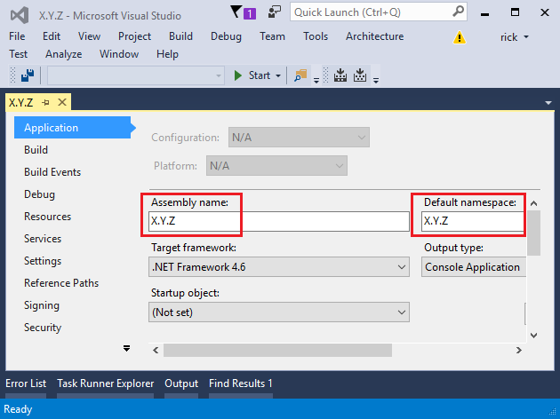

ASP.NET Core Internationalization, Localization and Globalization 
==================================================================

By `Rick Anderson`_ with assistance from `Damien Bowden <https://twitter.com/damien_bod>`_, `Bart Calixto @bartmax <https://twitter.com/bartmax>`_, and `Nadeem Afana <https://twitter.com/NadeemAfana>`__ 

Creating a multilingual website withe ASP.NET Core is not easy but it will allow your site to reach a wider audience. ASP.NET  has :doc:`/fundamentals/request-features` that provide support for localizing into different languages and cultures.

This sample is based on the ``Localization.StarterWeb`` project on `GitHub <https://github.com/aspnet/entropy>`__.

.. contents:: In this article:
  :local:
  :depth: 1
  
.. note:: Currently, resource files are not read when the project is run from Visual Studio. See `this issue <https://github.com/aspnet/dnx/issues/3047>`_ for more information.

IStringLocalizer
---------------------------------------------

Introduced in ASP.NET Core, ``IStringLocalizer`` was architected to maximize productivity when developing localized apps. 

The simple interface has an indexer and an ``IEnumerable`` for returning localized strings. Unlike previous localization approaches, ``IStringLocalizer`` doesn't require you to store the default language strings in a resource file. You can develop an app targeted for localization and not need to create resource files early in development. The recommendations is that you do **not** create a default language resource file. In previous version of ASP.NET, you had to move all your localization strings into a resource (.resx) file and change your app everywhere the strings were used, even for the default language. You no longer need to move your localized strings, you simply wrap them.

.. literalinclude:: localization/sample/Controllers/AboutController.cs
  :language: c#

In the code above, the ``IStringLocalizer`` implementation comes from :doc:`/fundamentals/dependency-injection`. If the localized value of "About Title" is not found, then the indexer key is returned, that is, the string "About Title". The recommended work flow is to leave the default language literal strings in the app and wrap them in the localizer. You can develop your app with your default language and prepare it for the localization step without first creating a default resource file. You can use the traditional approach and provide a key to retrieve the default language string, but the new workflow is optimized for reducing the overhead of localizing an app.

Use the ``IHtmlLocalizer`` implementation for resources that contain markup. ``IHtmlLocalizer`` encodes arguments that are formatted in the resource string, but not the resource string. In the sample highlighted below, only the ``name`` parameter is encoded.

.. literalinclude:: localization/sample/Controllers/BookController.cs
  :language: c#
  :linenos:
  :lines: 1-23
  :emphasize-lines: 3,5,20  

At the lowest level, you can get ``IStringLocalizerFactory`` out of :doc:`/fundamentals/dependency-injection`:

.. literalinclude:: localization/sample/Controllers/TestController.cs
  :language: c#
  :linenos:
  :lines: 9-27
  :emphasize-lines: 6-11 
  :dedent: 3

The code above demonstrates each of the two factory create methods. 

You can partition your localized strings by controller, area, or have just one container. In the sample app, a dummy class named ``SharedResource`` is used to contain shared resources. Some developers use the ``Startup`` class to contain global or shared strings.  In the sample below, the ``ZebraController`` and the ``SharedResource`` localizers are used:

.. literalinclude:: localization/sample/Controllers/ZebraController.cs
  :language: c#
  :linenos:
  :lines: 9-27
  :dedent: 3

View localization
--------------------

The ``IViewLocalizer`` service provides localized strings for a view. The ``ViewLocalizer`` class implements this interface and finds the resource location from the view file path. The following code shows how to use the default implementation of ``IViewLocalizer``:

.. literalinclude:: localization/sample/Views/Home/About.cshtml
  :language: c#
  
The default implementation of ``IViewLocalizer`` finds the resource file based on the view name, there is no option to use a global shared resource file. ``ViewLocalizer`` implements the localizer using ``IHtmlLocalizer``, so Razor doesn't encode the localized string. You can parameterize resource strings and ``IViewLocalizer`` will HTML encode the parameters, but not the resource string. Consider the following Razor markup:

.. code-block:: HTML

  @Localizer["<i>Hello</i> <b>{0}!</b>", UserManager.GetUserName(User)]
 
A French resource file could contain the following:

========================  ===============================  
Key                       Value    
========================  ===============================  
<i>Hello</i> <b>{0}!</b>  <i>Bonjour</i> <b>{0}!</b>  
========================  ===============================

The rendered view would contain the HTML markup from the resource file.

To use a shared resource file in a view, create a service that exposes ``IHtmlLocalizer``:

.. literalinclude:: localization/sample/Services/LocService.cs
  :language: c#
  :linenos:
  :lines: 5-17
  :dedent: 3

Register the service:

.. literalinclude:: localization/sample/StartupConfig.cs
  :language: c#
  :linenos:
  :lines: 44-45,55-63
  :dedent: 6
  :emphasize-lines: 10,11

Use the service in a view:

.. literalinclude:: localization/sample/Views/Test/About.cshtml
  :language: HTML
  :linenos:
  :emphasize-lines: 5,12

DataAnnotations localization
------------------------------------

DataAnnotations error messages are localized with ``IStringLocalizer<Type>``. Using the option ``ResourcesPath = "Resources"``, the error messages in ``RegisterViewModel`` can be stored in either of the following paths:

- Resources/ViewModels.Account.RegisterViewModel.fr.resx
- Resources/ViewModels/Account/RegisterViewModel.fr.resx
  
.. literalinclude:: localization/sample/ViewModels/Account/RegisterViewModel.cs
  :language: c#
  :lines: 9-26
  :dedent: 3
  
Currently, the run time doesn't lookup localized strings for non-validation attributes. In the code above, the "Email" (from ``[Display(Name = "Email")]``) will not be localized. We hope to add support for this `after RTM <https://github.com/aspnet/Mvc/issues/3518>`_.
  
Localization middleware
-----------------------------------

The current culture on a request is set in the localization :doc:`/fundamentals/middleware`. The localization middleware is enabled in the ``Configure`` method of *Startup.cs* file.

.. literalinclude:: localization/sample/StartupConfig.cs
  :language: c#
  :linenos:
  :lines: 106-107, 136-159
  :dedent: 6

``UseRequestLocalization`` initializes a ``RequestLocalizationMiddleware`` object. The ``Invoke`` method of the `RequestLocalizationMiddleware <https://github.com/aspnet/Localization/blob/dev/src/Microsoft.AspNetCore.Localization/RequestLocalizationMiddleware.cs>`__ class is called by the ASP.NET Core pipeline. The ``Invoke`` method enumerates the ``RequestCultureProviders`` list, and returns the first non-null provider. The default providers come from the ``RequestLocalizationOptions`` class:

#. ``QueryStringRequestCultureProvider``
#. ``CookieRequestCultureProvider``
#. ``AcceptLanguageHeaderRequestCultureProvider``

The default list goes from most specific to least specific. Later in the article I'll show how you can change the order and even add a custom localization provider. If there are no non-null providers, the ``DefaultRequestCulture`` is used.
    
QueryStringRequestCultureProvider
^^^^^^^^^^^^^^^^^^^^^^^^^^^^^^^^^^^^

Adding a query string to the URL is useful for debugging and testing code. Unless you change the ``RequestCultureProviders`` list, adding a query string to the URL will always win as the localization provider. You pass the query string parameters ``culture`` and ``ui-culture``. The following example sets the specific culture (language and region) to Spanish/Mexico:

``http://localhost:5000/?culture=es-MX&ui-culture=es-MX``

If you only pass in one of the two (``culture`` or ``ui-culture``), the query string provider will set both values using the one you passed in. For example, setting just the culture will set both the ``Culture`` and the ``UICulture``:

``http://localhost:5000/?culture=es-MX``

CookieRequestCultureProvider
^^^^^^^^^^^^^^^^^^^^^^^^^^^^^^^^^^^^^^^

Production app will often provide a mechanism to set the culture with the ``ASPNET_CULTURE`` cookie. The sample app provides code to set the cookie for French and English cultures.

The Accept-Language HTTP header
^^^^^^^^^^^^^^^^^^^^^^^^^^^^^^^^^

The Accept-Language HTTP header from a browser request is not an infallible way to detect the user's preferred language. This settings indicates what the browser has been set to send or has inherited from the underlying operating system. In a production app you should include a way for users to set the culture with the ``ASPNET_CULTURE`` cookie.

Use ``RequestLocalizationOptions`` to add or remove localization providers. You can use the ``Remove`` or ``RemoveAt`` method to remove a provider. For example, the following code removes the ``QueryStringRequestCultureProvider``:

.. code-block:: c#

    services.Configure<RequestLocalizationOptions>(options =>
    {
        var supportedCultures = new[]
        {
            new CultureInfo("en-US"),
            new CultureInfo("fr")
        };

        options.DefaultRequestCulture = new RequestCulture(culture: "en-US", uiCulture: "en-US");
        options.SupportedCultures = supportedCultures;
        options.SupportedUICultures = supportedCultures;
        options.RequestCultureProviders.RemoveAt(0);
    });

Suppose you want to let your customers store their language and culture in your databases. You could write a provider to look up these values for the user. The following code shows how to add a custom provider:

.. code-block:: c#

    services.Configure<RequestLocalizationOptions>(options =>
    {
        var supportedCultures = new[]
        {
            new CultureInfo("en-US"),
            new CultureInfo("fr")
        };

        options.DefaultRequestCulture = new RequestCulture(culture: "en-US", uiCulture: "en-US");
        options.SupportedCultures = supportedCultures;
        options.SupportedUICultures = supportedCultures;

        options.RequestCultureProviders.Insert(0, new CustomRequestCultureProvider(async context =>
        {
           // My custom request culture logic
          return new ProviderCultureResult("en");
        }));
    });

Configuring localization
----------------------------------

Localization is configured in the ``ConfigureServices`` method:

.. literalinclude:: localization/sample/StartupConfig.cs
  :language: c#
  :linenos:
  :lines: 44-45,55-61
  :dedent: 6

- ``AddLocalization`` Adds the localization services to the services container. The code above also sets the resources path to "Resources".
- ``AddViewLocalization`` Adds support for localized view files. In this sample view localization is based on the view file suffix. For example "fr" in the *Index.fr.cshtml* file.
- ``AddDataAnnotationsLocalization`` Adds support for localized ``DataAnnotations`` validation messages through ``IStringLocalizer`` abstractions.

Resource file naming
---------------------

When you create a new project with Visual Studio, the project name is used for the assembly name, project name and default namespace. For example, if you created a project named **X.Y.Z**, the assembly name, project name and default namespace would all be "X.Y.Z".

When you create a type in a subfolder, Visual Studio appends the folder name to the default namespace (it nests the namespace). C# uses the "." between nested namespaces and types. Using the **X.Y.Z** project, a class named ``Cat`` in the *Models* folder would have the namespace ``X.Y.Z.Models``:

.. code-block:: c# 

    namespace X.Y.Z.Models
    {
        class Cat
        {
            public string name { get; set; }
        }
    }

If you reference a type with the fully qualified namespace (longer than the default namespace), Visual Studio will warn you to use the nested or *simplified namespace*:

.. image:: localization/_static/simp2.png

In the image above, Visual Studio is warning you that ``Models.Cat`` can be used to for the type, because ``Models.Cat`` is in scope. The code below shows the ``Cat`` class with both the full namespace and the nested namespace.

.. code-block:: c# 

    namespace X.Y.Z
    {
        class Program
        {
            static void Main(string[] args)
            {
                X.Y.Z.Models.Cat cat2 = new X.Y.Z.Models.Cat();  // Full NS
                Models.Cat cat = new Models.Cat();               // Simplified NS
                cat.name = "spot";
                System.Console.WriteLine(cat.name);
            }
        }
    }

When you create resource files based on a type, the resource file path must include the type with the simplified namespace. In the sample project, the default namespace is ``Localization.StarterWeb``. The ``HomeController`` reference with a simplified namespace is ``Controllers.HomeController``, therefore the French resource file must be named *Controllers.HomeController.fr.resx*. The ``ConfigureServices`` method sets the ``ResourcesPath`` to "Resources", so the project relative path for the home controllers French resource file is *Resources/Controllers.HomeController.fr.resx*. Alternatively, you can use folders to organize resource files. For the home controller, the path would be *Resources/Controllers/HomeController.fr.resx*. If you don't use the ``ResourcesPath`` option, the *.resx* file would go in the  project base directory. The resource file for ``HomeController`` would be named *Controllers.HomeController.fr.resx*.

Resource files using ``@inject IViewLocalizer`` in Razor views follow a similar pattern. The resource file for a view can be named using either dot naming or file naming. Razor view resource files mimic the path of their associated view file. Assuming we set the ``ResourcesPath`` to "Resources", the French resource file associated with the *Views/Book/About.cshtml* view could be either of the following:

- Resources/Views/Home/About.fr.resx
- Resources/Views.Home.About.fr.resx

If you don't use the ``ResourcesPath`` option, the *.resx* file for a view would be located in the same folder as the view.

Generating resource files with Visual Studio
-----------------------------------------------

If you create a resource file in Visual Studio without a culture in the file name (for example, *MyStrings.resx*), Visual Studio will create a C# class with a property for each string.  That’s usually not what you want with ASP.NET Core; you typically don’t have a default resx resource file (A resx file without the culture name). We suggest you create the .resx file with a culture name (for example *MyStrings.fr.resx*). When you create a .resx file with a culture name, Visual Studio will not generate the class file.

If you remove the ".fr" culture designator AND you have the culture set to French (via cookie or other mechanism), the default resource file is read and strings are localized. This is expected behavior. \*.resx designates a default or fallback resource, so that when nothing meets your requested culture you’re served \*.resx. See `ASP.NET Web Page Resources Overview <https://msdn.microsoft.com/en-us/library/ms227427.aspx>`__ for more information. If you want to just return the key when missing a resource for the requested culture you must not have a default resource file.

Globalization and Localization in ASP.NET 5 and MVC 6
-------------------------------------------------------

Internationalization involves `Globalization <https://msdn.microsoft.com/en-us/library/aa292081(v=vs.71).aspx>`__ and `Localization <https://msdn.microsoft.com/en-us/library/aa292137(v=vs.71).aspx>`__. Globalization is the process of designing applications that support different cultures. Globalization adds support for input, display, and output of a defined set of language scripts that relate to specific geographic areas. 

Localization is the process of adapting a globalized application, which you have already processed for localizability, to a particular culture/locale. The process of localizing your application also requires a basic understanding of relevant character sets commonly used in modern software development and an understanding of the issues associated with them. Although all computers store text as numbers (codes), different systems can (and do) store the same text using different numbers. The localization process refers to translating the application user interface (UI) for a specific culture/locale. 

`Localizability <https://msdn.microsoft.com/en-us/library/aa292135(v=vs.71).aspx>`__ is an intermediate process for verifying that a globalized application is ready for localization

The format for the culture name is "<languagecode2>-<country/regioncode2>", where <languagecode2> is the language code and <country/regioncode2> is the subculture code. Examples include ``es-CL`` for Spanish (Chile), ``en-US`` for English (United States), and ``en-AU`` for English (Australia). See `Language Culture Name <https://msdn.microsoft.com/en-us/library/ee825488(v=cs.20).aspx>`__.

Internationalization is often abbreviated to "I18N". The abbreviation takes the first and last letters and the number of letters between them, so 18 stands for the number of letters between the first "I" and the last "N". The same applies to Globalization (G11N), and Localization (L10N).

The terms used so far:

- Globalization (G11N): The process of making an application support different languages and regions.
- Localization (L10N): The process of customizing an application for a given language and region.
- Internationalization (I18N): Describes both globalization and localization.
- Culture: It is a language and, optionally, a region.
- Neutral culture: A culture that has a specified language, but not a region. (for example "en", "es")
- Specific culture: A culture that has a specified language and region. (for example "en-US", "en-GB", "es-CL")
- Locale: A locale is the same as a culture.

ASP.NET 5 allows you to specify two culture values,  ``SupportedCultures`` and ``SupportedUICultures``. The `CultureInfo <https://msdn.microsoft.com/en-us/library/system.globalization.cultureinfo(v=vs.110).aspx>`__ object for ``SupportedCultures`` determines the results of culture-dependent functions, such as the date time, number, and currency formatting. ``SupportedCultures`` also determines the sorting order of text, casing conventions, and string comparisons. See `CultureInfo.CurrentCulture <https://msdn.microsoft.com/en-us/library/system.globalization.cultureinfo.currentculture%28v=vs.110%29.aspx>`__ for more info on how the server gets the Culture. The ``SupportedUICultures`` determines which resources are to be loaded for the page by the ResourceManager. The ResourceManager simply looks up culture-specific resources that is determined by ``CurrentUICulture``. Every thread in .NET has ``CurrentCulture`` and ``CurrentUICulture`` objects. ASP.NET Core inspects these values when rendering culture-dependent functions. For example, if current thread's culture  is set to "en-US" (English, United States), DateTime.Now.ToLongDateString() shows "	Thursday, February 18, 2016", but if CurrentCulture is set to "es-ES" (Spanish, Spain) the result will be "jueves, 18 de febrero de 2016"".

Additional Resources
------------------------

- `ASP.NET Web Page Resources Overview <https://msdn.microsoft.com/en-us/library/ms227427.aspx>`__

