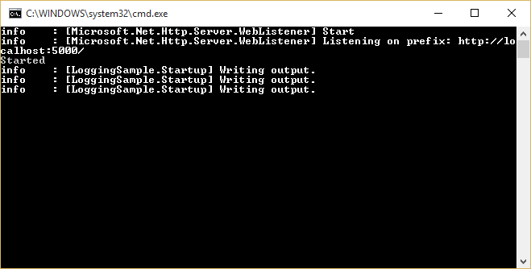
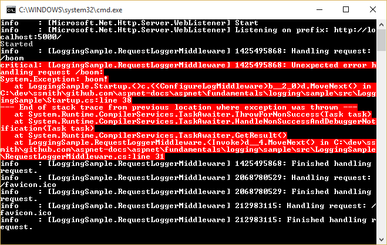
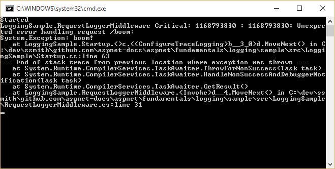
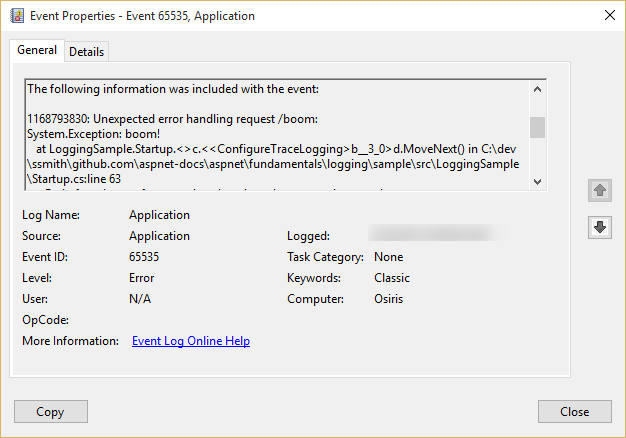

Logging
=======

By `Steve Smith`_

ASP.NET 5 has built-in support for logging, and allows developers to easily leverage their preferred logging framework's functionality as well. Implementing logging in your application requires a minimal amount of setup code. Once this is in place, logging can be added wherever it is desired.

In this article:
	- `Implementing Logging in your Application`_
	- `Configuring Logging in your Application`_
	
`View or download sample from GitHub <https://github.com/aspnet/Docs/tree/1.0.0-beta7/aspnet/fundamentals/logging/sample>`_.

Implementing Logging in your Application
----------------------------------------

Adding logging to a component in your application is done by requesting either an ``ILoggerFactory`` or an ``ILogger<T>`` via :doc:`dependency-injection`. If an ``ILoggerFactory`` is requested, a logger must be created using its ``CreateLogger`` method. The following example shows how to do this within the ``Configure`` method in the ``Startup`` class:

.. literalinclude:: logging/sample/src/LoggingSample/Startup.cs
	:language: c#
	:linenos:
	:lines: 17-27
	:dedent: 8
	:emphasize-lines: 2,8-9

When a logger is created, a category name or source must be provided. By convention this string is hierarchical, with categories separated by dot (``.``) characters. Some logging providers have filtering support that leverages this convention, making it easier to locate logging output of interest. In the above example, the logging is configured to use the built-in `ConsoleLogger <https://github.com/aspnet/Logging/blob/1.0.0-beta6/src/Microsoft.Framework.Logging.Console/ConsoleLogger.cs>`_ (see `Configuring Logging in your Application`_ below). To see the console logger in action, run the sample application using the ``web`` command, and make a request to configured URL (``localhost:5000``). You should see output similar to the following:

You may see more than one log statement per web request you make in your browser, since most browsers will make multiple requests (i.e. for the favicon file) when attempting to load a page. Note that the console logger displayed the log level (``info`` in the image above) followed by the category (``[LoggingSample.Startup]``), and then the message that was logged.

Logging Verbosity Levels
^^^^^^^^^^^^^^^^^^^^^^^^

When adding logging statements to your application, you must specify a `LogLevel <https://github.com/aspnet/Logging/blob/1.0.0-beta6/src/Microsoft.Framework.Logging.Abstractions/LogLevel.cs>`_. The LogLevel allows you to control the verbosity of the logging output from your application, as well as the ability to pipe different kinds of log messages to different loggers. For example, you may wish to log debug messages to a local file, but log errors to the machine's event log or a database.

ASP.NET 5 defines six levels of logging verbosity:

Debug
	Used for the most detailed log messages, typically only valuable to a developer debugging an issue. These messages may contain sensitive application data and so should not be enabled in a production environment. *Disabled by default.* Example: ``Credentials: {"User":"someuser", "Password":"P@ssword"}``
	
Verbose
	These messages have short-term usefulness during development. They contain information that may be useful for debugging, but have no long-term value. This is the default most verbose level of logging. Example: ``Entering method Configure with flag set to true``

Information
	These messages are used to track the general flow of the application. These logs should have some long term value, as opposed to ``Verbose`` level messages, which do not. Example: ``Request received for path /foo``

Warning
	The Warning level should be used for abnormal or unexpected events in the application flow. These may include errors or other conditions that do not cause the application to stop, but which may need to be investigated in the future. Handled exceptions are a common place to use the Warning log level. Examples: ``Login failed for IP 127.0.0.1`` or ``FileNotFoundException for file foo.txt``

Error
	An error should be logged when the current flow of the application must stop due to some failure, such as an exception that cannot be handled or recovered from. These messages should indicate a failure in the current activity or operation (such as the current HTTP request), not an application-wide failure. Example: ``Cannot insert record due to duplicate key violation``

Critical
	A critical log level should be reserved for unrecoverable application or system crashes, or catastrophic failure that requires immediate attention. Examples: data loss scenarios, stack overflows, out of disk space

The ``Logging`` packages provides `helper extension methods <https://github.com/aspnet/Logging/blob/1.0.0-beta6/src/Microsoft.Framework.Logging.Abstractions/LoggerExtensions.cs>`_ for each of these standard ``LogLevel``s, allowing you to call ``LogInformation`` rather than the more verbose Log(LogLevel.Information, ...) method. Each of the ``LogLevel``-specific extension methods has several overloads, allowing you to pass in some or all of the following parameters:

string data
	The message to log.

int eventId
	A numeric id to associate with the log, which can be used to associate a series of logged events with one another. Event IDs should be static and specific to a particular kind of event that is being logged. For instance, you might associate adding an item to a shopping cart as event id 1000 and completing a purchase as event id 1001. This allows intelligent filtering and processing of log statements.

string format
	A format string for the log message.

object[] args
	An array of objects to format.

Exception error
	An exception instance to log.

.. note:: Some loggers, such as the built-in ``ConsoleLogger`` used in this article, will ignore the ``eventId`` parameter. If you need to display it, you can include it in the message string. This is done in the following sample so you can easily see the eventId associated with each message, but in practice you would not typically include it in the log message.

The following logging middleware adds logging before and after ASP.NET requests are handled, and logs any unhandled exceptions using the ``Critical`` log level. In the sample code, note that the critical logging is wrapped in a condition that first confirms that logging is enabled for the ``Critical`` ``LogLevel``. This is especially important if expensive operations are being done as part of the log process, or if the logging operation itself will be called many times (such as within a loop).

In this example, event IDs have been defined for the beginning and end of requests, as well as exceptions.

.. literalinclude:: logging/sample/src/LoggingSample/RequestLoggerMiddleware.cs
	:language: c#
	:linenos:
	:lines: 10-48
	:dedent: 4
	:emphasize-lines: 6-8,19-21,28-34,37-38

This middleware is configured in a separate method in ``Startup.cs`` (``ConfigureLogMiddleware``). You can run this example by setting the ``ASPNET_ENV`` variable to ``LogMiddleware``. Learn more about :doc:`environments`.

.. literalinclude:: logging/sample/src/LoggingSample/Startup.cs
	:language: c#
	:linenos:
	:lines: 29-44
	:dedent: 8
	:emphasize-lines: 5, 9-12

This configuration will write "Hello, World!" to the response unless the request contains the string "boom", in which case it will throw an exception. When running the sample using this configuration and navigating to the path ``http://localhost:5000/boom`` the following output is sent to the console (note that ``Critical`` messages are formatted in red):

Note that in order to use formatting as well as logging the exception, we passed in the formatted message as an instance of ``FormattedLogValues``.

Scopes
^^^^^^

In the course of logging information within your application, you can group a set of logical operations within a *scope*. A scope is an ``IDisposable`` type returned by calling the ``BeginScopeImpl`` method, which lasts from the moment it is created until it is disposed. Not all loggers support scopes. For example, the `ConsoleLogger simply returns null <https://github.com/aspnet/Logging/blob/1.0.0-beta6/src/Microsoft.Framework.Logging.Console/ConsoleLogger.cs#L114>`_ from ``BeginScopeImpl``. The built-in `TraceSource logger <https://github.com/aspnet/Logging/blob/1.0.0-beta6/src/Microsoft.Framework.Logging.TraceSource/TraceSourceLogger.cs#L66-L69>`_ returns a `TraceSourceScope <https://github.com/aspnet/Logging/blob/1.0.0-beta6/src/Microsoft.Framework.Logging.TraceSource/TraceSourceScope.cs>`_, which is responsible for starting and stopping tracing operations. Any logging state, such as a transaction id, is attached to the scope when it is created.

Scopes are not required, and should be used sparingly, if at all. They're best used for operations that have a distinct beginning and end, such as an HTTP request or an MVC action.

Working with ILogger<T>
^^^^^^^^^^^^^^^^^^^^^^^

In addition to working with ``ILoggerFactory``, your application can request an instance of ``ILogger<T>`` as a dependency in a class's constructor, where ``T`` is the type performing logging. For example, an ASP.NET Controller called ``HomeController`` that needed to perform logging could include an ``ILogger<HomeController>`` parameter in its constructor. When this technique is used, the logger will automatically use the type's name as its category name.

You can see a simple example of this in action using middleware. The following middleware class requests an instance of ``ILogger<SimpleLoggerMiddleware>``. When it is created, an ``ILogger`` is provided with a category name already set to ``LoggingSample.SimpleLoggerMiddleware``.

.. literalinclude:: logging/sample/src/LoggingSample/SimpleLoggerMiddleware.cs
	:language: c#
	:linenos:
	:lines: 8-29
	:dedent: 4
	:emphasize-lines: 4,7,10

By requesting an instance of ``ILogger<T>``, your class doesn't need to create an instance of a logger via ``ILoggerFactory``. You can use this approach anywhere you don't need the additional functionality offered by ``ILoggerFactory``.

Configuring Logging in your Application
----------------------------------------

To configure logging in your ASP.NET application, you should resolve ``ILoggerFactory`` in the ``Configure`` method in your ``Startup`` class. ASP.NET will automatically provide an instance of ``ILoggerFactory`` using :doc:`dependency-injection` when you add a parameter of this type to the ``Configure`` method. Once you've added ``ILoggerFactory`` as a parameter, you configure loggers within the ``Configure`` method by calling methods (or extension methods) on the logger factory. We have already seen an example of this configuration at the beginning of this article, when we added console logging by simply calling ``loggerFactory.AddConsole``. In addition to adding loggers, you can also control the verbosity of the application's logging by setting the ``MinimumLevel`` property on the logger factory. The default verbosity is ``Verbose``.

.. note:: You can also specify the minimum level of logging to use on a per-logger basis as well. For example, the ``AddConsole`` extension method supports an optional parameter for setting its minimum ``LogLevel``.  

Configuring TraceSource Logging
^^^^^^^^^^^^^^^^^^^^^^^^^^^^^^^

The built-in `TraceSourceLogger <https://github.com/aspnet/Logging/blob/1.0.0-beta6/src/Microsoft.Framework.Logging.TraceSource/TraceSourceLogger.cs>`_ provides a simple way to configure log messages to use the existing `System.Diagnostics.TraceSource <https://msdn.microsoft.com/en-us/library/system.diagnostics.tracesource(v=vs.110).aspx>`_ libraries and providers, including easy access to the Windows event log. This proven means of routing messages to a variety of listeners is already in use by many organizations, and the ``TraceSourceLogger`` allows developers to continue leveraging this existing investment.

First, be sure to add the ``Microsoft.Framework.Logging.TraceSource`` package to your project (in ``project.json``):

.. literalinclude:: logging/sample/src/LoggingSample/project.json
	:language: javascript
	:linenos:
	:lines: 5-11
	:emphasize-lines: 6

The following example demonstrates how to configure two separate ``TraceSourceLogger``s for an application, both logging only ``Critical`` messages. Each call to ``AddTraceSource`` takes a ``TraceListener``. The first call configures a ``ConsoleTraceListener``; the second one configures an ``EventLogTraceListener`` to write to the ``Application`` event log. These two listeners are not available in DNX Core, so their configuration is wrapped in a conditional compilation statement (``#if DNX451``).

.. literalinclude:: logging/sample/src/LoggingSample/Startup.cs
	:language: c#
	:linenos:
	:lines: 56-80
	:emphasize-lines: 4,6-13

The sample above also demonstrates setting the ``MinimumLevel`` on the logger factory. However, this level is simply the default, and can be overridden by individually configured loggers. In this case, the ``sourceSwitch`` is configured to use ``SourceLevels.Critical``, so only ``Critical`` log messages are picked up by the two ``TraceListener``s. When the application is run (using the ``TraceLogging`` environment, on Windows), and a request is made to ``http://localhost:5000/boom``, the following is shown in the console output:

Examining the Application event log in the Windows Event Viewer, the following event has also been logged as a result of this request:

Configuring Other Providers
^^^^^^^^^^^^^^^^^^^^^^^^^^^

In addition to the built-in loggers, you can configure logging to use other providers, such as `NLog <https://github.com/aspnet/Logging/tree/1.0.0-beta6/src/Microsoft.Framework.Logging.NLog>`_ or `Serilog <https://github.com/serilog/serilog-framework-logging>`_. Add the appropriate package to your ``project.json`` file, and then configure it just like any other provider. Typically, these packages should include extension methods on ``ILoggerFactory`` to make it easy to add them. For example, to add support for NLog you would just call:

.. code-block:: c#

	loggerFactory.AddNLog(new NLog.LogFactory());

For Serilog, the code is similar:

.. code-block:: c#

	loggerFactory.AddSerilog();

You can create your own custom providers as well, to support other logging frameworks or your own internal logging requirements. The links above for NLog and Serilog provide good references to help you get started.

Logging Recommendations
-----------------------

The following are some recommendations you may find helpful when implementing logging in your ASP.NET applications.

1. Log using the correct ``LogLevel``. This will allow you to consume and route logging output appropriately based on the importance of the messages.

2. Log information that will enable errors to be identified quickly. Avoid logging irrelevant or redundant information.

3. Keep log messages concise without sacrificing important information.

4. Although loggers will not log if disabled, consider adding code guards around logging methods to prevent extra method calls and log message setup overhead, especially within loops and performance critical methods.

5. Name your loggers with a distinct prefix so they can easily be filtered or disabled. Remember the ``Create<T>`` extension will create loggers named with the full name of the class.

6. Use Scopes sparingly, and only for actions with a bounded start and end. For example, the framework provides a scope around MVC actions. Avoid nesting many scopes within one another.

7. Application logging code should be related to the business concerns of the application. Increase the logging verbosity to reveal additional framework-related concerns, rather than implementing yourself.

Summary
-------

ASP.NET provides built-in support for logging, which can easily be configured within the ``Startup`` class and used throughout the application. Logging verbosity can be configured globally and per logging provider to ensure actionable information is logged appropriately. Built-in providers for console and trace source logging are included in the framework; other logging frameworks can easily be configured as well.

