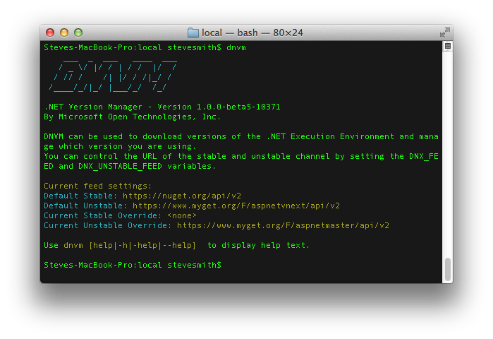

Installing ASP.NET 5 On Mac OS X
================================

By `Steve Smith`_

ASP.NET 5 runs on the .NET Execution Environment (DNX), which is available on multiple platforms, including OS X. This article describes how to install DNX, and therefore ASP.NET 5, on OS X, using `Homebrew <http://brew.sh/>`_. 

In this article:
	- `Install ASP.NET 5 on OS X`_

Install ASP.NET 5 on OS X
-------------------------

Install Mono
^^^^^^^^^^^^

Currently, ASP.NET 5 on OS X requires the `Mono <http://mono-project.com>`_ runtime. Mono is an ongoing effort to port the .NET Framework to other platforms. It is one of the ways .NET applications can run on platforms other than Windows.

Using the Mono Installer
""""""""""""""""""""""""

You can install the latest version of Mono from the `Mono project downloads page <http://www.mono-project.com/download/>`_, just select Mac OS X and click download. The latest version should be compatible with ASP.NET 5 (specifically, you need at least Mono 4.0.1). 

Using Homebrew
""""""""""""""

If you use the Homebrew_ package manager, you can install mono using the following command::

	brew install mono
	
Installing DNVM
^^^^^^^^^^^^^^^

Next, you need to install the .NET Version Manager (DNVM). You can do so by running an automatic installation script we provide. If you'd rather do it manually, instructions for manual installation are also provided.

Automated Install Script
""""""""""""""""""""""""

To install DNVM using the automatic installations script, run the following command from your Terminal::

	curl -sSL https://raw.githubusercontent.com/aspnet/Home/dev/dnvminstall.sh | sh && source ~/.dnx/dnvm/dnvm.sh

Manual Install
""""""""""""""

If you'd rather install DNVM manually, you can download the ``dnvm.sh`` file from the `aspnet/Home <https://github.com/aspnet/Home>`_ repository and place it in the ``/Users/[your user name here]/.dnx/dnvm`` directory on your file system. Then, add the following lines to your shell startup script (normally ``/Users/[your user name here]/.bash_profile``, or ``/Users/[your user name here]/.zshrc`` if you are using ZSH)::

	[ -s "~/.dnx/dnvm/dnvm.sh" ] && source "~/.dnx/dnvm/dnvm.sh"
	
Verifying your installation
"""""""""""""""""""""""""""

You can verify that DNVM is installed properly by running ``dnvm`` in a Terminal window. If your shell does not recognize it ``dnvm`` as a command, run ``source dnvm.sh`` to load it, then try running ``dnvm`` again. You should see something like this:

	
Installing DNX
^^^^^^^^^^^^^^

Once you have DNVM installed, you need to install the .NET Execution Environment (DNX). To install the latest version of DNX using DNVM, run: 

``dnvm upgrade``

Now that DNX is installed, you're ready to begin using ASP.NET 5! Learn how you can :doc:`create a cross-platform console application </dnx/console>` or a simple ASP.NET MVC application that runs within DNX.

.. TODO: create links to cross-platform console application and simple ASP.NET MVC application running in DNX/command line.

Summary
-------

ASP.NET 5 is built on the cross-platform .NET Execution Environment, which can be installed on OS X as well as Linux and Windows. Installing DNX and ASP.NET 5 on OS X takes just a few minutes, using a few Terminal commands. 

Related Resources
-----------------

- :doc:`Installing ASP.NET 5 on Windows <installing-on-windows>`
- :doc:`Your First ASP.NET 5 Application Using Visual Studio </tutorials/your-first-aspnet-application>`

