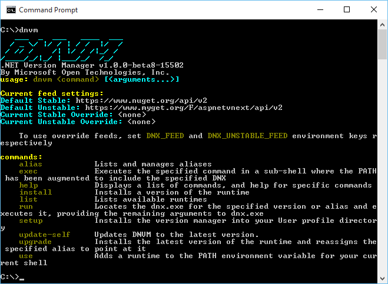
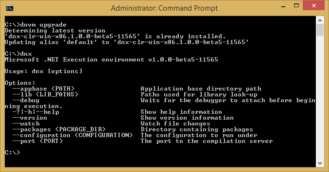

Installing ASP.NET 5 On Windows
===============================

By `Steve Smith`_

This article describes how to install ASP.NET 5 on Windows, showing both standalone installation as well as installation with Visual Studio 2015. 

In this article:
  - `Install ASP.NET with Visual Studio`_
  - `Install ASP.NET Standalone`_

Install ASP.NET with Visual Studio
----------------------------------

The easiest way to get started building applications with ASP.NET 5 is to install the latest version of Visual Studio 2015 (including the freely available Community edition). Visual Studio is an Integrated Development Environment (IDE), which means it's not just an editor, but also has many of the tools you need to build applications, in this case ASP.NET 5 web applications. 

1. Install `Visual Studio 2015 <http://go.microsoft.com/fwlink/?LinkId=532606>`__
2. Install the latest `ASP.NET 5 preview (Beta7) <http://go.microsoft.com/fwlink/?LinkId=623894>`_

When installing Visual Studio 2015, you'll want to be sure to specify that you want to install the Microsoft Web Developer Tools.

.. image:: installing-on-windows/_static/web-dev-tools.png

Once Visual Studio is installed, follow the instructions on the Download Center page for installing the latest `ASP.NET 5 preview (Beta7)`_.

Now you're ready to :doc:`build your first ASP.NET application </tutorials/your-first-aspnet-application>`.

Install ASP.NET Standalone
--------------------------

Visual Studio isn't the only way to install ASP.NET, and installing an IDE may not be appropriate in some scenarios. You can also install ASP.NET on its own from a command prompt. There are a few steps involved, since we'll need to install and configure the environment in which ASP.NET runs, known as the .NET Execution Environment (DNX). To install DNX, we need one more tool, the .NET Version Manager (DNVM).

Install the .NET Version Manager (DNVM)
^^^^^^^^^^^^^^^^^^^^^^^^^^^^^^^^^^^^^^^

The .NET Version Manager is used to install one or more versions of the .NET Execution Environment (DNX), and to manage which version is currently active. 

To install DNVM on Windows, download and run the appropriate installer for your operating system type (x64 is most common):
- `.NET Version Manager (x86) <http://download.microsoft.com/download/2/4/F/24FABE35-76C4-42DD-AA36-0909B18AD74B/DotNetVersionManager-x86.msi>`__
- `.NET Version Manager (x64) <http://download.microsoft.com/download/2/4/F/24FABE35-76C4-42DD-AA36-0909B18AD74B/DotNetVersionManager-x64.msi>`__

After installing DNVM open a new command prompt and confirm DNVM is working by typing: ``dnvm``. Assuming DNVM is configured correctly, you should see a result like this:

Install the .NET Execution Environment (DNX)
^^^^^^^^^^^^^^^^^^^^^^^^^^^^^^^^^^^^^^^^^^^^

To install the latest version of DNX using DNVM, run: ``dnvm upgrade``

This command downloads the latest version of DNX and puts it on your user profile so that it is ready to use. 

After this command completes, run: ``dnx`` to confirm DNX is configured correctly.

Now that DNX is installed, you're ready to begin using ASP.NET 5! 

Summary
-------

You can install ASP.NET 5 on Windows either as a standalone installation, or as part of Visual Studio 2015. In either case, installation is straightforward, and once complete, you're ready to get started building :doc:`your first ASP.NET application </tutorials/your-first-aspnet-application>`.

Related Resources
^^^^^^^^^^^^^^^^^

- :doc:`/tutorials/your-first-aspnet-application`
- :doc:`/client-side/yeoman`

