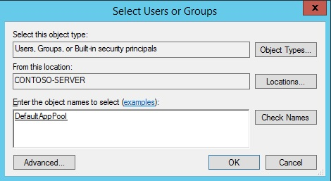

.. _apppool:

Application Pools
=================

By `Sourabh Shirhatti`

When hosting multiple web sites on a single server, you should consider isolating the applications from each other by running each application in its own application pool. This document provides an overview of how to set up Application Pools to securely host multiple web sites on a single server.

Application Pool Identity Account
---------------------------------

An application pool identity account allows you to run an application under a unique account without having to create and manage domains or local accounts. On IIS 8.0+ the IIS Admin Worker Process (WAS) will create a virtual account with the name of the new application pool and run the application pool's worker processes under this account by default.

Configuring IIS Application Pool Identities
-------------------------------------------

In the IIS Management Console, under **Advanced Settings** for your application pool ensure that `Identity` list item is set to use **ApplicationPoolIdentity** as shown in the image below.

.. image:: apppool/_static/apppool-identity.png

Securing Resources
------------------

The IIS management process creates a secure identifier with the name of the application pool in the Windows Security System. Resources can be secured by using this identity, however this identity is not a real user account and will not show up in the Windows User Management Console.

To grant the IIS worker process access to your application, you will need to modify the Access Control List (ACL) for the the directory containing your application. 

1. Open Windows Explorer and naviagate to the directory.
2. Right click on the directory and click properties.
3. Under the **Security** tab, click the **Edit** button and then the **Add** button
4. Click the **Locations** and make sure you select your server.

5. Enter **IIS AppPool\\DefaultAppPool** in **Enter the object names to select** textbox.
6. Click the **Check Names** button and then click **OK**.

You can also do this via the command-line by using **ICACLS** tool.

.. code:: bat

    ICACLS C:\sites\MyWebApp /grant "IIS AppPool\DefaultAppPool" :F

