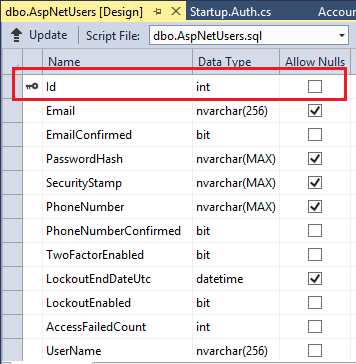

Change Primary Key for Users in ASP.NET Identity
====================
by [Tom FitzMacken](https://github.com/tfitzmac)

> In Visual Studio 2013, the default web application uses a string value for the key for user accounts. ASP.NET Identity enables you to change the type of the key to meet your data requirements. For example, you can change the type of the key from a string to an integer.
> 
> This topic shows how to start with the default web application and change the user account key to an integer. You can use the same modifications to implement any type of key in your project. It shows how to make these changes in the default web application, but you could apply similar modifications to a customized application. It shows the changes needed when working with MVC or Web Forms.
> 
> ## Software versions used in the tutorial
> 
> 
> - Visual Studio 2013 with Update 2 (or later)
> - ASP.NET Identity 2.1 or later

To perform the steps in this tutorial, you must have Visual Studio 2013 Update 2 (or later), and a web application created from the ASP.NET Web Application template. The template changed in Update 3. This topic shows how to change the template in Update 2 and Update 3.

This topic contains the following sections:

- [Change the type of the key in the Identity user class](#userclass)
- [Add customized Identity classes that use the key type](#customclass)
- [Change the context class and user manager to use the key type](#context)
- [Change start-up configuration to use the key type](#startup)
- [For MVC with Update 2, change the AccountController to pass the key type](#mvcupdate2)
- [For MVC with Update 3, change the AccountController and ManageController to pass the key type](#mvcupdate3)
- [For Web Forms with Update 2, change Account pages to pass the key type](#webformsupdate2)
- [For Web Forms with Update 3, change Account pages to pass the key type](#webformsupdate3)
- [Run application](#run)
- [Other resources](#other)

## Change the type of the key in the Identity user class

In your project created from the ASP.NET Web Application template, specify that the ApplicationUser class uses an integer for the key for user accounts. In IdentityModels.cs, change the ApplicationUser class to inherit from IdentityUser that has a type of **int** for the TKey generic parameter. You also pass the names of three customized class which you have not implemented yet.

[!code-csharp[Main](change-primary-key-for-users-in-aspnet-identity/samples/sample1.cs?highlight=1-2)]

You have changed the type of the key, but, by default, the rest of the application still assumes the key is a string. You must explicitly indicate the type of the key in code that assumes a string.

In the **ApplicationUser** class, change the **GenerateUserIdentityAsync** method to include int, as shown in the highlighted code below. This change is not necessary for Web Forms projects with the Update 3 template.

[!code-csharp[Main](change-primary-key-for-users-in-aspnet-identity/samples/sample2.cs?highlight=2)]

## Add customized Identity classes that use the key type

The other Identity classes, such as IdentityUserRole, IdentityUserClaim, IdentityUserLogin, IdentityRole, UserStore, RoleStore, are still set up to use a string key. Create new versions of these classes that specify an integer for the key. You do not need to provide much implementation code in these classes, you are primarily just setting int as the key.

Add the following classes to your IdentityModels.cs file.

[!code-csharp[Main](change-primary-key-for-users-in-aspnet-identity/samples/sample3.cs)]

## Change the context class and user manager to use the key type

In IdentityModels.cs, change the definition of the **ApplicationDbContext** class to use your new customized classes and an **int** for the key, as shown in the highlighted code.

[!code-csharp[Main](change-primary-key-for-users-in-aspnet-identity/samples/sample4.cs?highlight=1-2)]

The ThrowIfV1Schema parameter is no longer valid in the constructor. Change the constructor so it does not pass a ThrowIfV1Schema value.

[!code-csharp[Main](change-primary-key-for-users-in-aspnet-identity/samples/sample5.cs)]

Open IdentityConfig.cs, and change the **ApplicationUserManger** class to use your new user store class for persisting data and an **int** for the key.

[!code-csharp[Main](change-primary-key-for-users-in-aspnet-identity/samples/sample6.cs?highlight=1,3,12,14,32,37,48)]

In the Update 3 template, you must change the ApplicationSignInManager class.

[!code-csharp[Main](change-primary-key-for-users-in-aspnet-identity/samples/sample7.cs?highlight=1)]

## Change start-up configuration to use the key type

In Startup.Auth.cs, replace the OnValidateIdentity code, as highlighted below. Notice that the getUserIdCallback definition, parses the string value into an integer.

[!code-csharp[Main](change-primary-key-for-users-in-aspnet-identity/samples/sample8.cs?highlight=7-12)]

If your project does not recognize the generic implementation of the **GetUserId** method, you may need to update the ASP.NET Identity NuGet package to version 2.1

You have made a lot of changes to the infrastructure classes used by ASP.NET Identity. If you try compiling the project, you will notice a lot of errors. Fortunately, the remaining errors are all similar. The Identity class expects an integer for the key, but the controller (or Web Form) is passing a string value. In each case, you need to convert from a string to and integer by calling **GetUserId&lt;int&gt;**. You can either work through the error list from compilation or follow the changes below.

The remaining changes depend on the type of project you are creating and which update you have installed in Visual Studio. You can go directly to the relevant section through the following links

- [For MVC with Update 2, change the AccountController to pass the key type](#mvcupdate2)
- [For MVC with Update 3, change the AccountController and ManageController to pass the key type](#mvcupdate3)
- [For Web Forms with Update 2, change Account pages to pass the key type](#webformsupdate2)
- [For Web Forms with Update 3, change Account pages to pass the key type](#webformsupdate3)

## For MVC with Update 2, change the AccountController to pass the key type

Open the AccountController.cs file. You need to change the following methods.

**ConfirmEmail** method

[!code-csharp[Main](change-primary-key-for-users-in-aspnet-identity/samples/sample9.cs?highlight=1,3)]

**Disassociate** method

[!code-csharp[Main](change-primary-key-for-users-in-aspnet-identity/samples/sample10.cs?highlight=5,9)]

**Manage(ManageUserViewModel)** method

[!code-csharp[Main](change-primary-key-for-users-in-aspnet-identity/samples/sample11.cs?highlight=11,17,41)]

**LinkLoginCallback** method

[!code-csharp[Main](change-primary-key-for-users-in-aspnet-identity/samples/sample12.cs?highlight=10)]

**RemoveAccountList** method

[!code-csharp[Main](change-primary-key-for-users-in-aspnet-identity/samples/sample13.cs?highlight=3)]

**HasPassword** method

[!code-csharp[Main](change-primary-key-for-users-in-aspnet-identity/samples/sample14.cs?highlight=3)]

You can now [run the application](#run) and register a new user.

## For MVC with Update 3, change the AccountController and ManageController to pass the key type

Open the AccountController.cs file. You need to change the following method.

**ConfirmEmail** method

[!code-csharp[Main](change-primary-key-for-users-in-aspnet-identity/samples/sample15.cs?highlight=1,3)]

**SendCode** method

[!code-csharp[Main](change-primary-key-for-users-in-aspnet-identity/samples/sample16.cs?highlight=4)]

Open the ManageController.cs file. You need to change the following methods.

**Index** method

[!code-csharp[Main](change-primary-key-for-users-in-aspnet-identity/samples/sample17.cs?highlight=15-17)]

**RemoveLogin** methods

[!code-csharp[Main](change-primary-key-for-users-in-aspnet-identity/samples/sample18.cs?highlight=3,13,17)]

**AddPhoneNumber** method

[!code-csharp[Main](change-primary-key-for-users-in-aspnet-identity/samples/sample19.cs?highlight=9)]

**EnableTwoFactorAuthentication** method

[!code-csharp[Main](change-primary-key-for-users-in-aspnet-identity/samples/sample20.cs?highlight=3-4)]

**DisableTwoFactorAuthentication** method

[!code-csharp[Main](change-primary-key-for-users-in-aspnet-identity/samples/sample21.cs?highlight=3-4)]

**VerifyPhoneNumber** methods

[!code-csharp[Main](change-primary-key-for-users-in-aspnet-identity/samples/sample22.cs?highlight=4,18,21)]

**RemovePhoneNumber** method

[!code-csharp[Main](change-primary-key-for-users-in-aspnet-identity/samples/sample23.cs?highlight=3,8)]

**ChangePassword** method

[!code-csharp[Main](change-primary-key-for-users-in-aspnet-identity/samples/sample24.cs?highlight=10,13)]

**SetPassword** method

[!code-csharp[Main](change-primary-key-for-users-in-aspnet-identity/samples/sample25.cs?highlight=5,8)]

**ManageLogins** method

[!code-csharp[Main](change-primary-key-for-users-in-aspnet-identity/samples/sample26.cs?highlight=7,12)]

**LinkLoginCallback** method

[!code-csharp[Main](change-primary-key-for-users-in-aspnet-identity/samples/sample27.cs?highlight=8)]

**HasPassword** method

[!code-csharp[Main](change-primary-key-for-users-in-aspnet-identity/samples/sample28.cs?highlight=3)]

**HasPhoneNumber** method

[!code-csharp[Main](change-primary-key-for-users-in-aspnet-identity/samples/sample29.cs?highlight=3)]

You can now [run the application](#run) and register a new user.

## For Web Forms with Update 2, change Account pages to pass the key type

For Web Forms with Update 2, you need to change the following pages.

**Confirm.aspx.cx**

[!code-csharp[Main](change-primary-key-for-users-in-aspnet-identity/samples/sample30.cs?highlight=8)]

**RegisterExternalLogin.aspx.cs**

[!code-csharp[Main](change-primary-key-for-users-in-aspnet-identity/samples/sample31.cs?highlight=36)]

**Manage.aspx.cs**

[!code-csharp[Main](change-primary-key-for-users-in-aspnet-identity/samples/sample32.cs?highlight=3,22,47,52,69,85,93,98)]

You can now [run the application](#run) and register a new user.

## For Web Forms with Update 3, change Account pages to pass the key type

For Web Forms with Update 3, you need to change the following pages.

**Confirm.aspx.cx**

[!code-csharp[Main](change-primary-key-for-users-in-aspnet-identity/samples/sample33.cs?highlight=8)]

**RegisterExternalLogin.aspx.cs**

[!code-csharp[Main](change-primary-key-for-users-in-aspnet-identity/samples/sample34.cs?highlight=36)]

**Manage.aspx.cs**

[!code-csharp[Main](change-primary-key-for-users-in-aspnet-identity/samples/sample35.cs?highlight=11,27,32,34,82,87,99,108)]

**VerifyPhoneNumber.aspx.cs**

[!code-csharp[Main](change-primary-key-for-users-in-aspnet-identity/samples/sample36.cs?highlight=8,23,27)]

**AddPhoneNumber.aspx.cs**

[!code-csharp[Main](change-primary-key-for-users-in-aspnet-identity/samples/sample37.cs?highlight=7)]

**ManagePassword.aspx.cs**

[!code-csharp[Main](change-primary-key-for-users-in-aspnet-identity/samples/sample38.cs?highlight=11,47,50,68)]

**ManageLogins.aspx.cs**

[!code-csharp[Main](change-primary-key-for-users-in-aspnet-identity/samples/sample39.cs?highlight=16,23,32,41,45)]

**TwoFactorAuthenticationSignIn.aspx.cs**

[!code-csharp[Main](change-primary-key-for-users-in-aspnet-identity/samples/sample40.cs?highlight=14-15,29,53)]

## Run application

You have finished all of the required changes to the default Web Application template. Run the application and register a new user. After registering the user, you will notice that the AspNetUsers table has an Id column that is an integer.

If you have previously created the ASP.NET Identity tables with a different primary key, you need to make some additional changes. If possible, just delete the existing database. The database will be re-created with the correct design when you run the web application and add a new user. If deletion is not possible, run code first migrations to change the tables. However, the new integer primary key will not be set up as a SQL IDENTITY property in the database. You must manually set the Id column as an IDENTITY.

## Other resources

- [Overview of Custom Storage Providers for ASP.NET Identity](overview-of-custom-storage-providers-for-aspnet-identity.md)
- [Migrating an Existing Website from SQL Membership to ASP.NET Identity](../migrations/migrating-an-existing-website-from-sql-membership-to-aspnet-identity.md)
- [Migrating Universal Provider Data for Membership and User Profiles to ASP.NET Identity](../migrations/migrating-universal-provider-data-for-membership-and-user-profiles-to-aspnet-identity.md)
- [Sample application](https://aspnet.codeplex.com/SourceControl/latest#Samples/Identity/ChangePK/readme.txt) with changed primary key