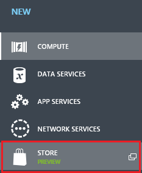
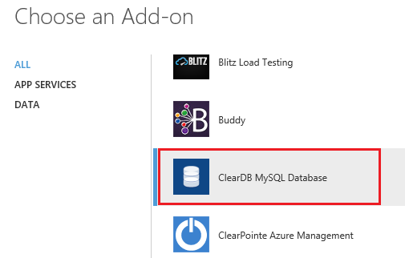
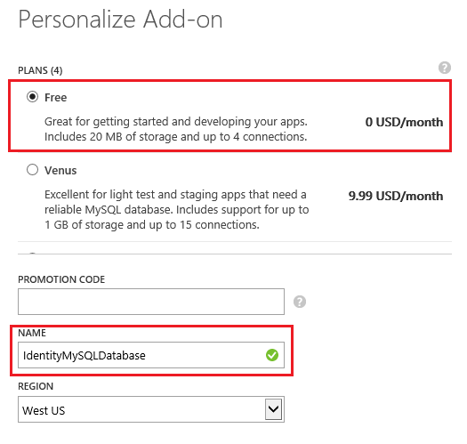
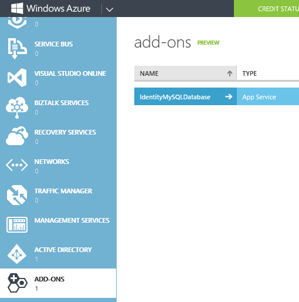
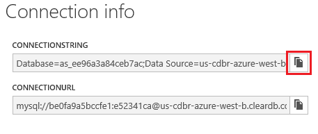
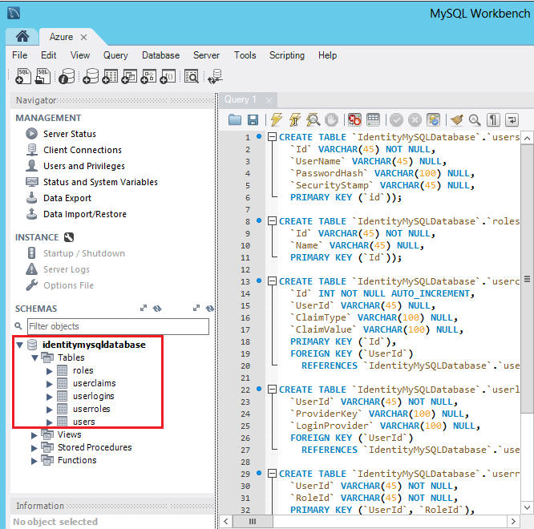
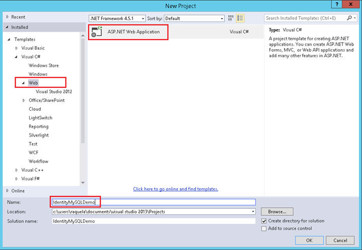
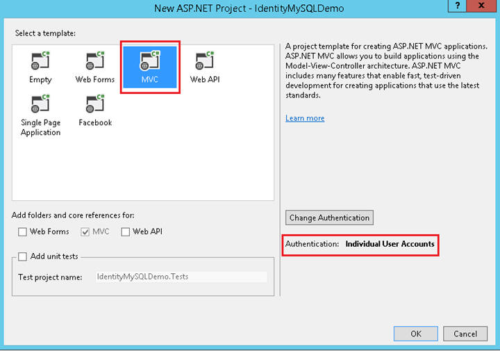
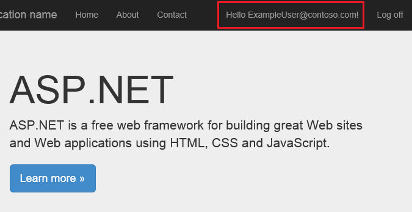
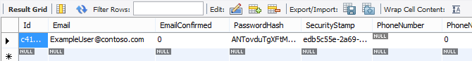

Implementing a Custom MySQL ASP.NET Identity Storage Provider
====================
by [Raquel Soares De Almeida](https://github.com/raquelsa), [Suhas Joshi](https://github.com/suhasj), [Tom FitzMacken](https://github.com/tfitzmac)

> ASP.NET Identity is an extensible system which enables you to create your own storage provider and plug it into your application without re-working the application. This topic describes how to create a MySQL storage provider for ASP.NET Identity. For an overview of creating custom storage providers, see [Overview of Custom Storage Providers for ASP.NET Identity](overview-of-custom-storage-providers-for-aspnet-identity.md).
> 
> To complete this tutorial, you must have Visual Studio 2013 with Update 2.
> 
> This tutorial will:
> 
> - Show how to create a MySQL database instance on Azure.
> - Show how to use a MySQL client tool (MySQL Workbench) to create tables and manage your remote database on Azure.
> - Show how to replace the default ASP.NET Identity storage implementation with our custom implementation on a MVC application project.
> 
> This tutorial was originally written by Raquel Soares De Almeida and Rick Anderson ( [@RickAndMSFT](https://twitter.com/#!/RickAndMSFT) ). The sample project was updated for Identity 2.0 by Suhas Joshi. The topic was updated for Identity 2.0 by Tom FitzMacken.

## Download completed project

At the end of this tutorial, you will have an MVC application project with ASP.NET Identity working with a MySQL database hosted on Azure.

You can download the completed MySQL storage provider at [AspNet.Identity.MySQL (CodePlex)](https://aspnet.codeplex.com/SourceControl/latest#Samples/Identity/AspNet.Identity.MySQL/).

## The steps you will perform

In this tutorial you will:

1. Create a MySQL database on Azure
2. Create the ASP.NET Identity tables in MySQL
3. Create an MVC application and configure it to use the MySQL provider
4. Run the app

This topic does not cover the architecture of ASP.NET Identity and the decisions you must make when implementing a customer storage provider. For that information, see [Overview of Custom Storage Providers for ASP.NET Identity](overview-of-custom-storage-providers-for-aspnet-identity.md).

## Review MySQL storage provider classes

Before jumping into the steps to create the MySQL storage provider, let's look at the classes that make up the storage provider. You will need classes that manage the database operations and classes that are called from the application to manage users and roles.

### Storage classes

- [IdentityUser](https://aspnet.codeplex.com/SourceControl/latest#Samples/Identity/AspNet.Identity.MySQL/IdentityUser.cs) - contains properties for the user.
- [UserStore](https://aspnet.codeplex.com/SourceControl/latest#Samples/Identity/AspNet.Identity.MySQL/UserStore.cs) - contains operations for adding, updating or retrieving users.
- [IdentityRole](https://aspnet.codeplex.com/SourceControl/latest#Samples/Identity/AspNet.Identity.MySQL/IdentityRole.cs) - contains properties for roles.
- [RoleStore](https://aspnet.codeplex.com/SourceControl/latest#Samples/Identity/AspNet.Identity.MySQL/RoleStore.cs) - contains operations for adding, deleting, updating and retrieving roles.

### Data access layer classes

For this example, the data access layer classes contain SQL statements for working with the tables; however, in your code you might want to use object-relational mapping (ORM) such as Entity Framework or NHibernate. In particular, your application may experience poor performance without an ORM that includes lazy loading and object caching. For more information, see [ASP.Net Identity 2.0 without Entity Framework?](https://aspnetidentity.codeplex.com/discussions/561828)

- [MySQLDatabase](https://aspnet.codeplex.com/SourceControl/latest#Samples/Identity/AspNet.Identity.MySQL/MySQLDatabase.cs) - contains the MySQL database connection and methods for performing database operations. UserStore and RoleStore are both instantiated with an instance of this class.
- [RoleTable](https://aspnet.codeplex.com/SourceControl/latest#Samples/Identity/AspNet.Identity.MySQL/RoleTable.cs) - contains database operations for the table that stores roles.
- [UserClaimsTable](https://aspnet.codeplex.com/SourceControl/latest#Samples/Identity/AspNet.Identity.MySQL/UserClaimsTable.cs) - contains database operations for the table that stores user claims.
- [UserLoginsTable](https://aspnet.codeplex.com/SourceControl/latest#Samples/Identity/AspNet.Identity.MySQL/UserLoginsTable.cs) - contains database operations for the table that stores user login information.
- [UserRoleTable](https://aspnet.codeplex.com/SourceControl/latest#Samples/Identity/AspNet.Identity.MySQL/UserRoleTable.cs) - contains database operations for the table that stores which users are assigned to which roles.
- [UserTable](https://aspnet.codeplex.com/SourceControl/latest#Samples/Identity/AspNet.Identity.MySQL/UserTable.cs) - contains database operations for the table that stores users.

## Create a MySQL database instance on Azure

1. Log in to the [Azure Portal](https://manage.windowsazure.com/).
2. Click **+NEW** at the bottom of the page, and then select **STORE**.  
    
3. In the **Choose and Add-on** wizard, select **ClearDB MySQL Database** and click on the next arrow at the bottom right of the dialog.  
    
4. Keep the default **Free** plan and change the **Name** to **IdentityMySQLDatabase**. Select the region nearest you and then click the next arrow.  
    
5. Click the checkmark to complete the database creation.  
    
6. After your database has been created, you can manage it from the **ADD-ONS** tab in the management portal.   
    
7. You can get the database connection information by clicking on **CONNECTION INFO** at the bottom of the page.  
    
8. Copy the connection string by clicking on the copy button and save it so you can use later in your MVC application.   
    

## Create the ASP.NET Identity tables in a MySQL database

### Install MySQL Workbench tool to connect and manage MySQL database

1. Install the **MySQL Workbench** tool from the [MySQL downloads page](http://dev.mysql.com/downloads/windows/installer/)
2. Launch the app and add click on the **MySQLConnections +** button to add a new connection. Use the connection string data you copied from the Azure MySQL database you created earlier in this tutorial.
3. After establishing the connection, open a new **Query** tab; paste the commands from [MySQLIdentity.sql](https://aspnet.codeplex.com/SourceControl/latest#Samples/Identity/AspNet.Identity.MySQL/MySQLIdentity.sql) into the query and execute it in order to create the database tables.
4. You now have all the ASP.NET Identity necessary tables created on a MySQL database hosted on Azure as shown below.  
    

## Create an MVC application project from template and configure it to use MySQL provider

If needed, install either [Visual Studio Express 2013 for Web](https://go.microsoft.com/fwlink/?LinkId=299058) or [Visual Studio 2013](https://go.microsoft.com/fwlink/?LinkId=306566) with Update 2.

### Download the ASP.NET.Identity.MySQL project from CodePlex

1. Browse to the repository URL at [AspNet.Identity.MySQL (CodePlex)](https://aspnet.codeplex.com/SourceControl/latest#Samples/Identity/AspNet.Identity.MySQL/).
2. Download the source code.
3. Extract the .zip file into a local folder.
4. Open the AspNet.Identity.MySQL solution and build it.

### Create a new MVC application project from template

1. Right click the **AspNet.Identity.MySQL** solution and **Add**, **New Project**
2. In the **Add New Project** Dialog select **Visual C#** on the left, then **Web** and then select **ASP.NET Web Application**. Name your project **IdentityMySQLDemo**; and then click OK.  
  
    
3. In the **New ASP.NET Project** dialog, select the MVC template with the default options (that includes **Individual User Accounts** as authentication method) and click **OK**.
4. In Solution Explorer, right-click your IdentityMySQLDemo project and select **Manage NuGet Packages**. In the search text box dialog, type **Identity.EntityFramework**. Select this package in the list of results and click **Uninstall**. You will be prompted to uninstall the dependency package EntityFramework. Click on Yes as we will no longer this package on this application.
5. Right click the IdentityMySQLDemo project, select **Add**, **Reference, Solution, Projects;** select the AspNet.Identity.MySQL project and click **OK**.
6. In the IdentityMySQLDemo project, replace all references to  
    `using Microsoft.AspNet.Identity.EntityFramework;`  
 with  
     `using AspNet.Identity.MySQL;`
7. In IdentityModels.cs, set **ApplicationDbContext** to derive from **MySqlDatabase** and include a contructor that take a single parameter with the connection name.  

    [!code-csharp[Main](implementing-a-custom-mysql-aspnet-identity-storage-provider/samples/sample1.cs)]
8. Open the IdentityConfig.cs file. In the **ApplicationUserManager.Create** method, replace instantiating UserManager with the following code:  

    [!code-csharp[Main](implementing-a-custom-mysql-aspnet-identity-storage-provider/samples/sample2.cs)]
9. Open the web.config file and replace the DefaultConnection string with this entry replacing the highlighted values with the connection string of the MySQL database you created on previous steps:  

    [!code-xml[Main](implementing-a-custom-mysql-aspnet-identity-storage-provider/samples/sample3.xml?highlight=2)]

## Run the app and connect to the MySQL DB

1. Right click the **IdentityMySQLDemo** project and select **Set as Startup Project**
2. Press **Ctrl + F5** to build and run the app.
3. Click on **Register** tab on the top of the page.
4. Enter a new user name and password and then click on **Register**.  
  
    
5. The new user is now registered and logged in.  
  
    
6. Go back to the MySQL Workbench tool and inspect the **IdentityMySQLDatabase** table's contents. Inspect the users table for the entries as you register new users.  
  
    

## Next Steps

For more information on how to enable other authentication methods on this app, refer to [Create an ASP.NET MVC 5 App with Facebook and Google OAuth2 and OpenID Sign-on](../../../mvc/overview/security/create-an-aspnet-mvc-5-app-with-facebook-and-google-oauth2-and-openid-sign-on.md).

To learn how to integrate your DB with OAuth and to set up roles to limit users access to your app, see [Deploy a Secure ASP.NET MVC 5 app with Membership, OAuth, and SQL Database to Azure](https://www.windowsazure.com/en-us/develop/net/tutorials/web-site-with-sql-database/).