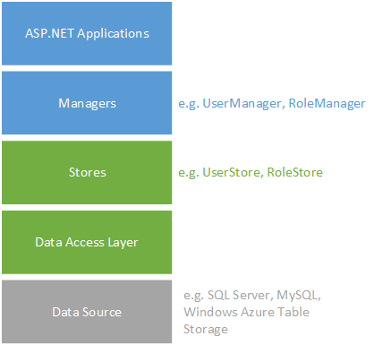
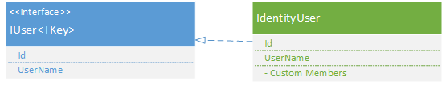
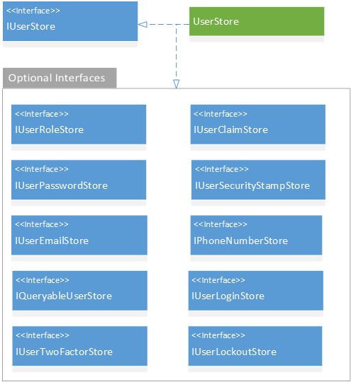
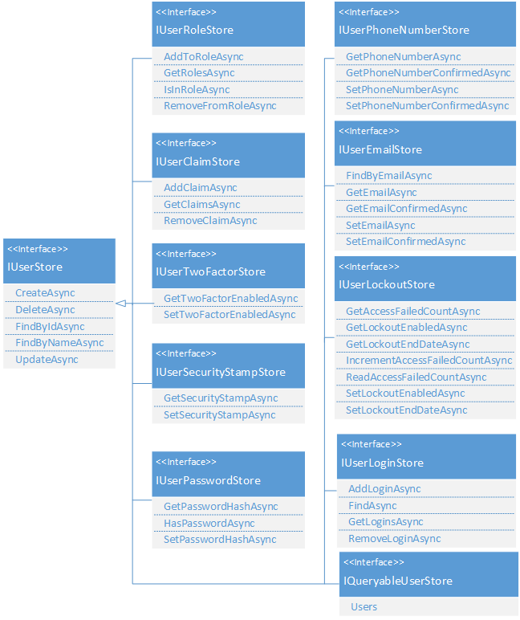
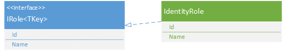
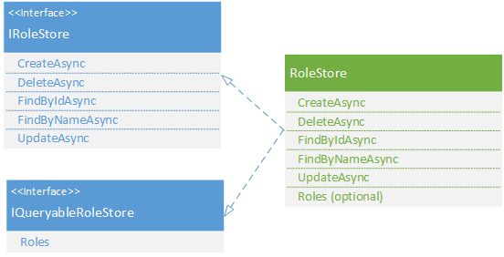
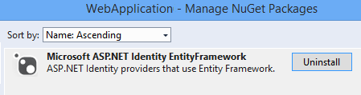

Overview of Custom Storage Providers for ASP.NET Identity
====================
by [Tom FitzMacken](https://github.com/tfitzmac)

> ASP.NET Identity is an extensible system which enables you to create your own storage provider and plug it into your application without re-working the application. This topic describes how to create a customized storage provider for ASP.NET Identity. It covers the important concepts for creating your own storage provider, but it is not step-by-step walkthrough of implementing a custom storage provider.
> 
> For an example of implementing a custom storage provider, see [Implementing a Custom MySQL ASP.NET Identity Storage Provider](implementing-a-custom-mysql-aspnet-identity-storage-provider.md).
> 
> This topic was updated for ASP.NET Identity 2.0.
> 
> ## Software versions used in the tutorial
> 
> 
> - Visual Studio 2013 with Update 2
> - ASP.NET Identity 2

## Introduction

By default, the ASP.NET Identity system stores user information in a SQL Server database, and uses Entity Framework Code First to create the database. For many applications, this approach works well. However, you may prefer to use a different type of persistence mechanism, such as Azure Table Storage, or you may already have database tables with a very different structure than the default implementation. In either case, you can write a customized provider for your storage mechanism and plug that provider into your application.

ASP.NET Identity is included by default in many of the Visual Studio 2013 templates. You can get updates to ASP.NET Identity through [Microsoft AspNet Identity EntityFramework NuGet package](http://www.nuget.org/packages/Microsoft.AspNet.Identity.EntityFramework/).

This topic includes the following sections:

- [Understand the architecture](#architecture)
- [Understand the data that is stored](#data)
- [Create the data access layer](#dal)
- [Customize the user class](#user)
- [Customize the user store](#userstore)
- [Customize the role class](#role)
- [Customize the role store](#rolestore)
- [Reconfigure application to use new storage provider](#reconfigure)
- [Other implementations of custom storage providers](#other)

## Understand the architecture

ASP.NET Identity consists of classes called managers and stores. Managers are high-level classes which an application developer uses to perform operations, such as creating a user, in the ASP.NET Identity system. Stores are lower-level classes that specify how entities, such as users and roles, are persisted. Stores are closely coupled with the persistence mechanism, but managers are decoupled from stores which means you can replace the persistence mechanism without disrupting the entire application.

The following diagram shows how your web application interacts with the managers, and stores interact with the data access layer.

To create a customized storage provider for ASP.NET Identity, you have to create the data source, the data access layer, and the store classes that interact with this data access layer. You can continue using the same manager APIs to perform data operations on the user but now that data is saved to a different storage system.

You do not need to customize the manager classes because when creating a new instance of UserManager or RoleManager you provide the type of the user class and pass an instance of the store class as an argument. This approach enables you to plug your customized classes into the existing structure. You will see how to instantiate UserManager and RoleManager with your customized store classes in the section [Reconfigure application to use new storage provider](#reconfigure).

## Understand the data that is stored

To implement a custom storage provider, you must understand the types of data used with ASP.NET Identity, and decide which features are relevant to your application.

| Data | Description |
| --- | --- |
| Users | Registered users of your web site. Includes the user Id and user name. Might include a hashed password if users log in with credentials that are specific to your site (rather than using credentials from an external site like Facebook), and security stamp to indicate whether anything has changed in the user credentials. Might also include email address, phone number, whether two factor authentication is enabled, the current number of failed logins, and whether an account has been locked. |
| User Claims | A set of statements (or claims) about the user that represent the user's identity. Can enable greater expression of the user's identity than can be achieved through roles. |
| User Logins | Information about the external authentication provider (like Facebook) to use when logging in a user. |
| Roles | Authorization groups for your site. Includes the role Id and role name (like "Admin" or "Employee"). |

## Create the data access layer

This topic assumes you are familiar with the persistence mechanism that you are going to use and how to create entities for that mechanism. This topic does not provide details about how to create the repositories or data access classes; instead, it provides some suggestions about the design decisions you need to make when working with ASP.NET Identity.

You have a lot of freedom when designing the repositories for a customized store provider. You only need to create repositories for features that you intend to use in your application. For example, if you are not using roles in your application, you do not need to create storage for roles or user roles. Your technology and existing infrastructure may require a structure that is very different from the default implementation of ASP.NET Identity. In your data access layer, you provide the logic to work with the structure of your repositories.

For a MySQL implemention of data repositories for ASP.NET Identity 2.0, see [MySQLIdentity.sql](https://aspnet.codeplex.com/SourceControl/latest#Samples/Identity/AspNet.Identity.MySQL/MySQLIdentity.sql).

In the data access layer, you provide the logic to save the data from ASP.NET Identity to your data source. The data access layer for your customized storage provider might include the following classes to store user and role information.

| Class | Description | Example |
| --- | --- | --- |
| Context | Encapsulates the information to connect to your persistence mechanism and execute queries. This class is central to your data access layer. The other data classes will require an instance of this class to perform their operations. You will also initialize your store classes with an instance of this class. | [MySQLDatabase](https://aspnet.codeplex.com/SourceControl/latest#Samples/Identity/AspNet.Identity.MySQL/MySQLDatabase.cs) |
| User Storage | Stores and retrieves user information (such as user name and password hash). | [UserTable (MySQL)](https://aspnet.codeplex.com/SourceControl/latest#Samples/Identity/AspNet.Identity.MySQL/UserTable.cs) |
| Role Storage | Stores and retrieves role information (such as the role name). | [RoleTable (MySQL)](https://aspnet.codeplex.com/SourceControl/latest#Samples/Identity/AspNet.Identity.MySQL/RoleTable.cs) |
| UserClaims Storage | Stores and retrieves user claim information (such as the claim type and value). | [UserClaimsTable (MySQL)](https://aspnet.codeplex.com/SourceControl/latest#Samples/Identity/AspNet.Identity.MySQL/UserClaimsTable.cs) |
| UserLogins Storage | Stores and retrieves user login information (such as an external authentication provider). | [UserLoginsTable (MySQL)](https://aspnet.codeplex.com/SourceControl/latest#Samples/Identity/AspNet.Identity.MySQL/UserLoginsTable.cs) |
| UserRole Storage | Stores and retrieves which roles a user is assigned to. | [UserRoleTable (MySQL)](https://aspnet.codeplex.com/SourceControl/latest#Samples/Identity/AspNet.Identity.MySQL/UserRoleTable.cs) |

Again, you only need to implement the classes that you intend to use in your application.

In the data access classes, you provide code to perform data operations for your particular persistence mechanism. For example, within the MySQL implementation, the UserTable class contains a method to insert a new record into the Users database table. The variable named `_database` is an instance of the MySQLDatabase class.

[!code-csharp[Main](overview-of-custom-storage-providers-for-aspnet-identity/samples/sample1.cs)]

After creating your data access classes, you must create store classes that call the specific methods in the data access layer.

## Customize the user class

When implementing your own storage provider, you must create a user class which is equivalent to the [IdentityUser](https://msdn.microsoft.com/en-us/library/microsoft.aspnet.identity.entityframework.identityuser(v=vs.108).aspx) class in the [Microsoft.ASP.NET.Identity.EntityFramework](https://msdn.microsoft.com/en-us/library/microsoft.aspnet.identity.entityframework(v=vs.108).aspx) namespace:

The following diagram shows the IdentityUser class that you must create and the interface to implement in this class.

The [IUser&lt;TKey&gt;](https://msdn.microsoft.com/en-us/library/dn613291(v=vs.108).aspx) interface defines the properties that the UserManager attempts to call when performing requested operations. The interface contains two properties - Id and UserName. The [IUser&lt;TKey&gt;](https://msdn.microsoft.com/en-us/library/dn613291(v=vs.108).aspx) interface enables you to specify the type of the key for the user through the generic **TKey** parameter. The type of the Id property matches the value of the TKey parameter.

The Identity framework also provides the [IUser](https://msdn.microsoft.com/en-us/library/microsoft.aspnet.identity.iuser(v=vs.108).aspx) interface (without the generic parameter) when you want to use a string value for the key.

The IdentityUser class implements IUser and contains any additional properties or constructors for users on your web site. The following example shows an IdentityUser class that uses an integer for the key. The Id field is set to **int** to match the value of the generic parameter. 

[!code-csharp[Main](overview-of-custom-storage-providers-for-aspnet-identity/samples/sample2.cs)]

 For a complete implementation, see [IdentityUser (MySQL)](https://aspnet.codeplex.com/SourceControl/latest#Samples/Identity/AspNet.Identity.MySQL/IdentityUser.cs). 

## Customize the user store

You also create a UserStore class that provides the methods for all data operations on the user. This class is equivalent to the [UserStore&lt;TUser&gt;](https://msdn.microsoft.com/en-us/library/dn315446(v=vs.108).aspx) class in the [Microsoft.ASP.NET.Identity.EntityFramework](https://msdn.microsoft.com/en-us/library/microsoft.aspnet.identity.entityframework(v=vs.108).aspx) namespace. In your UserStore class, you implement the [IUserStore&lt;TUser, TKey&gt;](https://msdn.microsoft.com/en-us/library/dn613276(v=vs.108).aspx) and any of the optional interfaces. You select which optional interfaces to implement based on on the functionality you wish to provide in your application.

The following image shows the UserStore class you must create and the relevant interfaces.

The default project template in Visual Studio contains code that assumes many of the optional interfaces have been implemented in the user store. If you are using the default template with a customized user store, you must either implement optional interfaces in your user store or alter the template code to no longer call methods in the interfaces you have not implemented.

 The following example shows a simple user store class. The **TUser** generic parameter takes the type of your user class which usually is the IdentityUser class you defined. The **TKey** generic parameter takes the type of your user key. 

[!code-csharp[Main](overview-of-custom-storage-providers-for-aspnet-identity/samples/sample3.cs)]

 In this example, the constructor that takes a parameter named *database* of type ExampleDatabase is only an illustration of how to pass in your data access class. For example, in the MySQL implementation, this constructor takes a parameter of type MySQLDatabase. 

Within your UserStore class, you use the data access classes that you created to perform operations. For example, in the MySQL implementation, the UserStore class has the CreateAsync method which uses an instance of UserTable to insert a new record. The **Insert** method on the **userTable** object is the same method that was shown in the previous section. 

[!code-csharp[Main](overview-of-custom-storage-providers-for-aspnet-identity/samples/sample4.cs)]

### Interfaces to implement when customizing user store

The next image shows more details about the functionality defined in each interface. All of the optional interfaces inherit from IUserStore.

- **IUserStore**  
 The [IUserStore&lt;TUser, TKey&gt;](https://msdn.microsoft.com/en-us/library/dn613278(v=vs.108).aspx) interface is the only interface you must implement in your user store. It defines methods for creating, updating, deleting, and retrieving users.
- **IUserClaimStore**  
 The [IUserClaimStore&lt;TUser, TKey&gt;](https://msdn.microsoft.com/en-us/library/dn613265(v=vs.108).aspx) interface defines the methods you must implement in your user store to enable user claims. It contains methods or adding, removing and retrieving user claims.
- **IUserLoginStore**  
 The [IUserLoginStore&lt;TUser, TKey&gt;](https://msdn.microsoft.com/en-us/library/dn613272(v=vs.108).aspx) defines the methods you must implement in your user store to enable external authentication providers. It contains methods for adding, removing and retrieving user logins, and a method for retrieving a user based on the login information.
- **IUserRoleStore**  
 The [IUserRoleStore&lt;TKey, TUser&gt;](https://msdn.microsoft.com/en-us/library/dn613276(v=vs.108).aspx) interface defines the methods you must implement in your user store to map a user to a role. It contains methods to add, remove, and retrieve a user's roles, and a method to check if a user is assigned to a role.
- **IUserPasswordStore**  
 The [IUserPasswordStore&lt;TUser, TKey&gt;](https://msdn.microsoft.com/en-us/library/dn613273(v=vs.108).aspx) interface defines the methods you must implement in your user store to persist hashed passwords. It contains methods for getting and setting the hashed password, and a method that indicates whether the user has set a password.
- **IUserSecurityStampStore**  
 The [IUserSecurityStampStore&lt;TUser, TKey&gt;](https://msdn.microsoft.com/en-us/library/dn613277(v=vs.108).aspx) interface defines the methods you must implement in your user store to use a security stamp for indicating whether the user's account information has changed. This stamp is updated when a user changes the password, or adds or removes logins. It contains methods for getting and setting the security stamp.
- **IUserTwoFactorStore**  
 The [IUserTwoFactorStore&lt;TUser, TKey&gt;](https://msdn.microsoft.com/en-us/library/dn613279(v=vs.108).aspx) interface defines the methods you must implement to implement two factor authentication. It contains methods for getting and setting whether two factor authentication is enabled for a user.
- **IUserPhoneNumberStore**  
 The [IUserPhoneNumberStore&lt;TUser, TKey&gt;](https://msdn.microsoft.com/en-us/library/dn613275(v=vs.108).aspx) interface defines the methods you must implement to store user phone numbers. It contains methods for getting and setting the phone number and whether the phone number is confirmed.
- **IUserEmailStore**  
 The [IUserEmailStore&lt;TUser, TKey&gt;](https://msdn.microsoft.com/en-us/library/dn613143(v=vs.108).aspx) interface defines the methods you must implement to store user email addresses. It contains methods for getting and setting the email address and whether the email is confirmed.
- **IUserLockoutStore**  
 The [IUserLockoutStore&lt;TUser, TKey&gt;](https://msdn.microsoft.com/en-us/library/dn613271(v=vs.108).aspx) interface defines the methods you must implement to store information about locking an account. It contains methods for getting the current number of failed access attempts, getting and setting whether the account can be locked, getting and setting the lock out end date, incrementing the number of failed attempts, and resetting the number of failed attempts.
- **IQueryableUserStore**  
 The [IQueryableUserStore&lt;TUser, TKey&gt;](https://msdn.microsoft.com/en-us/library/dn613267(v=vs.108).aspx) interface defines the members you must implement to provide a queryable user store. It contains a property that holds the queryable users.

 You implement the interfaces that are needed in your application; such as, the IUserClaimStore, IUserLoginStore, IUserRoleStore, IUserPasswordStore, and IUserSecurityStampStore interfaces as shown below. 

[!code-csharp[Main](overview-of-custom-storage-providers-for-aspnet-identity/samples/sample5.cs)]

For a complete implementation (including all of interfaces), see [UserStore (MySQL)](https://aspnet.codeplex.com/SourceControl/latest#Samples/Identity/AspNet.Identity.MySQL/UserStore.cs).

### IdentityUserClaim, IdentityUserLogin, and IdentityUserRole

The Microsoft.AspNet.Identity.EntityFramework namespace contains implementations of the [IdentityUserClaim](https://msdn.microsoft.com/en-us/library/dn613250(v=vs.108).aspx), [IdentityUserLogin](https://msdn.microsoft.com/en-us/library/dn613251(v=vs.108).aspx), and [IdentityUserRole](https://msdn.microsoft.com/en-us/library/dn613252(v=vs.108).aspx) classes. If you are using these features, you may want to create your own versions of these classes and define the properties for your application. However, sometimes it is more efficient to not load these entities into memory when performing basic operations (such as adding or removing a user's claim). Instead, the backend store classes can execute these operations directly on the data source. For example, the UserStore.GetClaimsAsync() method can call the userClaimTable.FindByUserId(user.Id) method to execute a query on that table directly and return a list of claims.

[!code-csharp[Main](overview-of-custom-storage-providers-for-aspnet-identity/samples/sample6.cs)]

## Customize the role class

When implementing your own storage provider, you must create a role class which is equivalent to the [IdentityRole](https://msdn.microsoft.com/en-us/library/microsoft.aspnet.identity.entityframework.identityrole(v=vs.108).aspx) class in the [Microsoft.ASP.NET.Identity.EntityFramework](https://msdn.microsoft.com/en-us/library/microsoft.aspnet.identity.entityframework(v=vs.108).aspx) namespace:

The following diagram shows the IdentityRole class that you must create and the interface to implement in this class.

The [IRole&lt;TKey&gt;](https://msdn.microsoft.com/en-us/library/dn613268(v=vs.108).aspx) interface defines the properties that the RoleManager attempts to call when performing requested operations. The interface contains two properties - Id and Name. The [IRole&lt;TKey&gt;](https://msdn.microsoft.com/en-us/library/dn613268(v=vs.108).aspx) interface enables you to specify the type of the key for the role through the generic **TKey** parameter. The type of the Id property matches the value of the TKey parameter.

The Identity framework also provides the [IRole](https://msdn.microsoft.com/en-us/library/microsoft.aspnet.identity.irole(v=vs.108).aspx) interface (without the generic parameter) when you want to use a string value for the key.

The following example shows an IdentityRole class that uses an integer for the key. The Id field is set to int to match the value of the generic parameter. 

[!code-csharp[Main](overview-of-custom-storage-providers-for-aspnet-identity/samples/sample7.cs)]

 For a complete implementation, see [IdentityRole (MySQL)](https://aspnet.codeplex.com/SourceControl/latest#Samples/Identity/AspNet.Identity.MySQL/IdentityRole.cs). 

## Customize the role store

You also create a RoleStore class that provides the methods for all data operations on roles. This class is equivalent to the [RoleStore&lt;TRole&gt;](https://msdn.microsoft.com/en-us/library/dn468181(v=vs.108).aspx) class in the Microsoft.ASP.NET.Identity.EntityFramework namespace. In your RoleStore class, you implement the [IRoleStore&lt;TRole, TKey&gt;](https://msdn.microsoft.com/en-us/library/dn613266(v=vs.108).aspx) and optionally the [IQueryableRoleStore&lt;TRole, TKey&gt;](https://msdn.microsoft.com/en-us/library/dn613262(v=vs.108).aspx) interface.

The following example shows a role store class. The TRole generic parameter takes the type of your role class which usually is the IdentityRole class you defined. The TKey generic parameter takes the type of your role key. 

[!code-csharp[Main](overview-of-custom-storage-providers-for-aspnet-identity/samples/sample8.cs)]

- **IRoleStore&lt;TRole&gt;**  
 The [IRoleStore](https://msdn.microsoft.com/en-us/library/dn468195.aspx) interface defines the methods to implement in your role store class. It contains methods for creating, updating, deleting and retrieving roles.
- **RoleStore&lt;TRole&gt;**  
 To customize RoleStore, create a class that implements the IRoleStore interface. You only have to implement this class if want to use roles on your system. The constructor that takes a parameter named *database* of type ExampleDatabase is only an illustration of how to pass in your data access class. For example, in the MySQL implementation, this constructor takes a parameter of type MySQLDatabase.  
  
 For a complete implementation, see [RoleStore (MySQL)](https://aspnet.codeplex.com/SourceControl/latest#Samples/Identity/AspNet.Identity.MySQL/RoleStore.cs) .

## Reconfigure application to use new storage provider

You have implemented your new storage provider. Now, you must configure your application to use this storage provider. If the default storage provider was included in your project, you must remove the default provider and replace it with your provider.

### Replace default storage provider in MVC project

1. In the **Manage NuGet Packages** window, uninstall the **Microsoft ASP.NET Identity EntityFramework** package. You can find this package by searching in the Installed packages for Identity.EntityFramework.  
     You will be asked if you also want to uninstall Entity Framework. If you do not need it in other parts of your application, you can uninstall it.
2. In the IdentityModels.cs file in the Models folder, delete or comment out the **ApplicationUser** and **ApplicationDbContext** classes. In an MVC application, you can delete the entire IdentityModels.cs file. In a Web Forms application, delete the two classes but make sure you keep the helper class that is also located in the IdentityModels.cs file.
3. If your storage provider resides in a separate project, add a reference to it in your web application.
4. Replace all references to `using Microsoft.AspNet.Identity.EntityFramework;` with a using statement for the namespace of your storage provider.
5. In the **Startup.Auth.cs** class, change the **ConfigureAuth** method to use a single instance of the appropriate context. 

    [!code-csharp[Main](overview-of-custom-storage-providers-for-aspnet-identity/samples/sample9.cs?highlight=3)]
6. In the App\_Start folder, open **IdentityConfig.cs**. In the ApplicationUserManager class, change the **Create** method to return a user manager that uses your customized user store. 

    [!code-csharp[Main](overview-of-custom-storage-providers-for-aspnet-identity/samples/sample10.cs?highlight=3)]
7. Replace all references to **ApplicationUser** with **IdentityUser**.
8. The default project includes some members in user class which are not defined in the IUser interface; such as Email, PasswordHash, and GenerateUserIdentityAsync. If your user class does not have these members, you must either implement them or change the code that uses these members.
9. If you have created any instances of RoleManager, change that code to use your new RoleStore class.  

    [!code-csharp[Main](overview-of-custom-storage-providers-for-aspnet-identity/samples/sample11.cs)]
10. The default project is designed for a user class that has a string value for the key. If your user class has a different type for the key (such as an integer), you must change the project to work with your type. See [Change Primary Key for Users in ASP.NET Identity](change-primary-key-for-users-in-aspnet-identity.md).
11. If needed, add the connection string to the Web.config file.

## Other resources

- Blog: [Implementing ASP.NET Identity](http://odetocode.com/blogs/scott/archive/2014/01/20/implementing-asp-net-identity.aspx)
- Tutorial and GIT code: [Simple.Data Asp.Net Identity Provider](http://designcoderelease.blogspot.co.uk/2015/03/simpledata-aspnet-identity-provider.html)
- Tutorial:[Setting up the basic Identity accounts, and pointing them at an external DB](http://typecastexception.com/post/2013/10/27/Configuring-Db-Connection-and-Code-First-Migration-for-Identity-Accounts-in-ASPNET-MVC-5-and-Visual-Studio-2013.aspx). By [@xivSolutions](https://twitter.com/xivSolutions).
- Tutorial[: Implementing a Custom MySQL ASP.NET Identity Storage Provider](implementing-a-custom-mysql-aspnet-identity-storage-provider.md)
- [CodeFluent Entities](http://blog.codefluententities.com/2014/04/30/asp-net-identity-v2-and-codefluent-entities/) by [SoftFluent](http://www.softfluent.com/)
- [Azure Table Storage](https://www.nuget.org/packages/accidentalfish.aspnet.identity.azure/) by James Randall.
- Azure Table Storage: [AspNet.Identity.TableStorage](https://github.com/stuartleeks/leeksnet.AspNet.Identity.TableStorage) by [@stuartleeks](https://twitter.com/stuartleeks).
- [CouchDB / Cloudant by Daniel Wertheim.](https://github.com/danielwertheim/mycouch.aspnet.identity)
- Elastic Searc[h: Elastic Identity](https://github.com/bmbsqd/elastic-identity) by Bombsquad AB.
- [MongoDB](http://www.nuget.org/packages/MongoDB.AspNet.Identity/) by Jonathan Sheely Jonathan Sheely.
- [NHibernate.AspNet.Identity](https://github.com/milesibastos/NHibernate.AspNet.Identity) by Antônio Milesi Bastos.
- [RavenDB](http://www.nuget.org/packages/AspNet.Identity.RavenDB/1.0.0) by [@tourismgeek](https://twitter.com/tourismgeek).
- [RavenDB.AspNet.Identity](https://github.com/ILMServices/RavenDB.AspNet.Identity) by [ILMServices](http://www.ilmservice.com/).
- Redis: [Redis.AspNet.Identity](https://github.com/aminjam/Redis.AspNet.Identity)
- T4 Templates to generate EF code for a "database first" user store: [AspNet.Identity.EntityFramework](https://github.com/cbfrank/AspNet.Identity.EntityFramework)