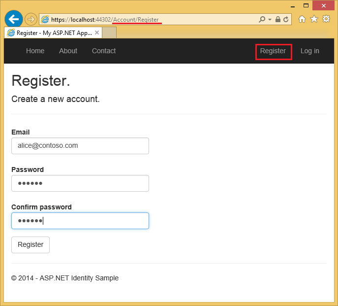
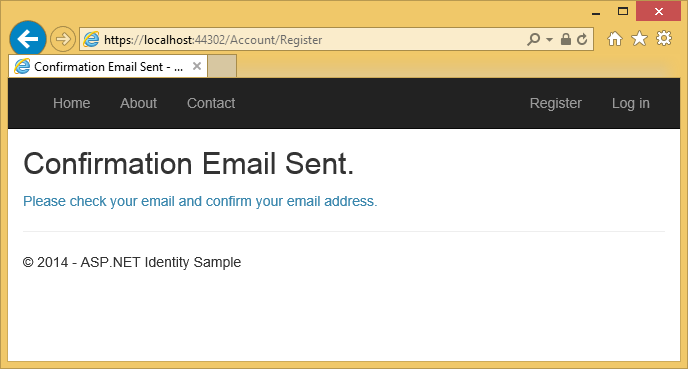
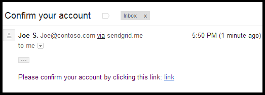
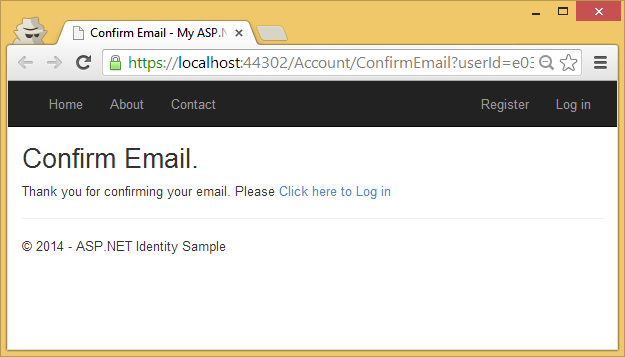
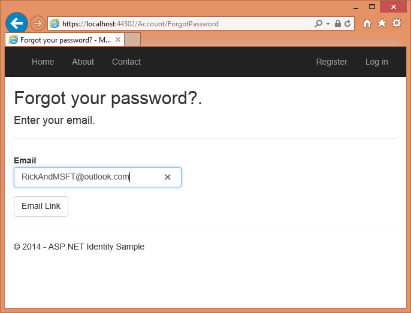
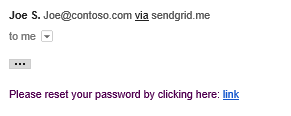
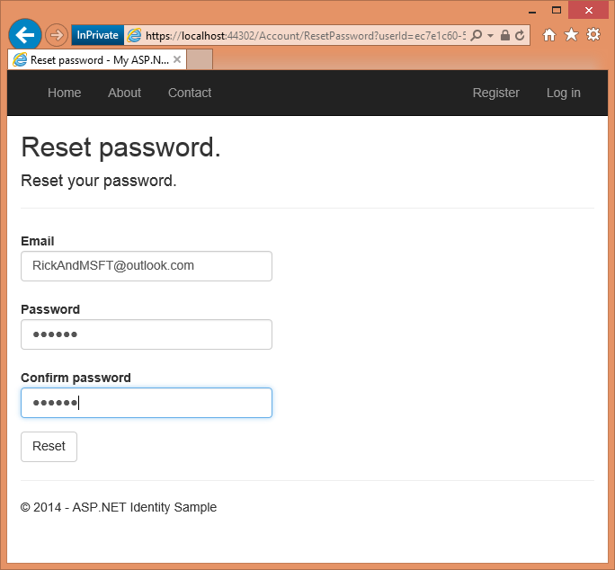
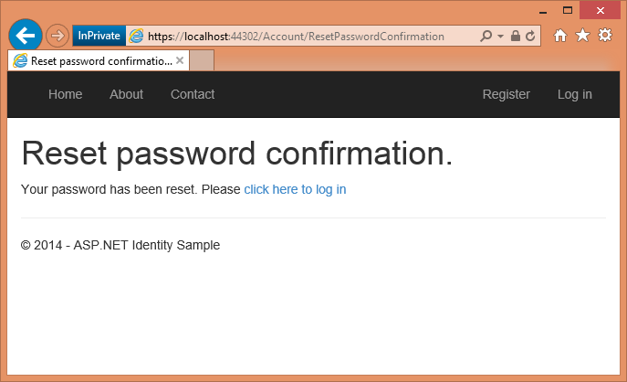
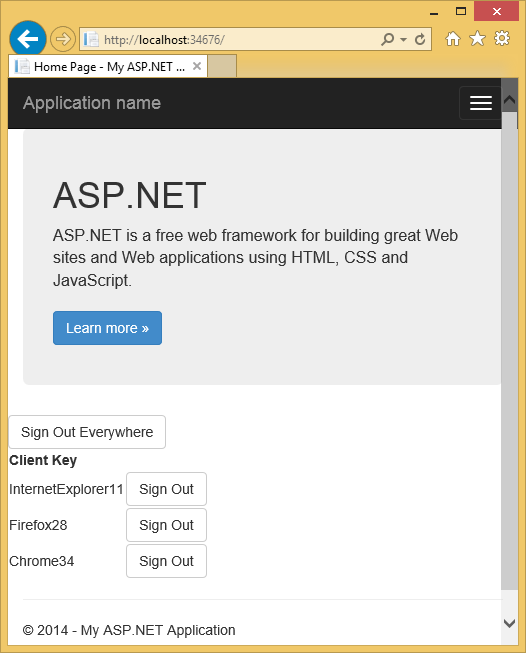

Account Confirmation and Password Recovery with ASP.NET Identity (C#)
====================
by [Hao Kung](https://github.com/HaoK), [Pranav Rastogi](https://github.com/rustd), [Rick Anderson](https://github.com/Rick-Anderson), [Suhas Joshi](https://github.com/suhasj)

> Before doing this tutorial you should first complete [Create a secure ASP.NET MVC 5 web app with log in, email confirmation and password reset](../../../mvc/overview/security/create-an-aspnet-mvc-5-web-app-with-email-confirmation-and-password-reset.md). This tutorial contains more details and will show you how to set up email for local account confirmation and allow users to reset their forgotten password in ASP.NET Identity. This article was written by Rick Anderson ([@RickAndMSFT](https://twitter.com/#!/RickAndMSFT)), Pranav Rastogi ([@rustd](https://twitter.com/rustd)), Hao Kung, and Suhas Joshi. The NuGet sample was written primarily by Hao Kung.

A local user account requires the user to create a password for the account, and that password is stored (securely) in the web app. ASP.NET Identity also supports social accounts, which don't require the user to create a password for the app. [Social accounts](../../../mvc/overview/security/create-an-aspnet-mvc-5-app-with-facebook-and-google-oauth2-and-openid-sign-on.md) use a third party (such as Google, Twitter, Facebook or Microsoft) to authenticate users. This topic covers the following:

- [Create an ASP.NET MVC app](#createMvc) and explore ASP.NET Identity features.
- [Building the Identity sample](#build)
- [Set up email confirmation](#email)

New users register their email alias, which creates a local account.

Clicking the Register button sends a confirmation email containing a validation token to their email address.

The user is sent an email with a confirmation token for their account.

Clicking the link confirms the account.

## Password recovery/reset

Local users who forget their password can have a security token sent to their email account, enabling them to reset their password.  
  
  
  
The user will soon get an email with a link allowing them to reset their password.  
  
  
Clicking the link will take them to the Reset page.  
  
  
  
Clicking the **Reset** button will confirm the password has been reset.  
  

## Create an ASP.NET Web app

Start by installing and running [Visual Studio Express 2013 for Web](https://go.microsoft.com/fwlink/?LinkId=299058) or [Visual Studio 2013](https://go.microsoft.com/fwlink/?LinkId=306566). Install Visual Studio [2013 Update 2](https://go.microsoft.com/fwlink/?LinkId=390521) or higher.

> [!NOTE]
> Warning: You must install Visual Studio [2013 Update 2](https://go.microsoft.com/fwlink/?LinkId=390521) to complete this tutorial.

1. Create a new ASP.NET Web project and select the MVC template. Web Forms also supports ASP.NET Identity, so you could follow similar steps in a web forms app.
2. Leave the default authentication as **Individual User Accounts**.
3. Run the app, click the **Register** link and register a user. At this point, the only validation on the email is with the [[EmailAddress]](https://msdn.microsoft.com/en-us/library/system.componentmodel.dataannotations.emailaddressattribute(v=vs.110).aspx) attribute.
4. In Server Explorer, navigate to **Data Connections\DefaultConnection\Tables\AspNetUsers**, right click and select **Open table definition**.

    The following image shows the `AspNetUsers` schema:

    
5. Right click on the **AspNetUsers** table and select **Show Table Data**.  
  
      
  
 At this point the email has not been confirmed.

The default data store for ASP.NET Identity is Entity Framework, but you can configure it to use other data stores and to add additional fields. See [Additional Resources](#addRes) section at the end of this tutorial.

The [OWIN startup class](../../../aspnet/overview/owin-and-katana/owin-startup-class-detection.md) ( *Startup.cs* ) is called when the app starts and invokes the `ConfigureAuth` method in *App\_Start\Startup.Auth.cs*, which configures the OWIN pipeline and initializes ASP.NET Identity. Examine the `ConfigureAuth` method. Each `CreatePerOwinContext` call registers a callback (saved in the `OwinContext`) that will be called once per request to create an instance of the specified type. You can set a break point in the constructor and `Create` method of each type (`ApplicationDbContext, ApplicationUserManager`) and verify they are called on each request. A instance of `ApplicationDbContext` and `ApplicationUserManager` is stored in the OWIN context, which can be accessed throughout the application. ASP.NET Identity hooks into the OWIN pipeline through cookie middleware. For more information, see [Per request lifetime management for UserManager class in ASP.NET Identity](https://blogs.msdn.com/b/webdev/archive/2014/02/12/per-request-lifetime-management-for-usermanager-class-in-asp-net-identity.aspx).

When you change your security profile, a new security stamp is generated and stored in the `SecurityStamp` field of the *AspNetUsers* table. Note, the `SecurityStamp` field is different from the security cookie. The security cookie is not stored in the `AspNetUsers` table (or anywhere else in the Identity DB). The security cookie token is self-signed using [DPAPI](https://msdn.microsoft.com/en-us/library/system.security.cryptography.protecteddata.aspx) and is created with the `UserId, SecurityStamp` and expiration time information.

The cookie middleware checks the cookie on each request. The `SecurityStampValidator` method in the `Startup` class hits the DB and checks security stamp periodically, as specified with the `validateInterval`. This only happens every 30 minutes (in our sample) unless you change your security profile. The 30 minute interval was chosen to minimize trips to the database. See my [two-factor authentication tutorial](index.md) for more details.

Per the comments in the code, the `UseCookieAuthentication` method supports cookie authentication. The `SecurityStamp` field and associated code provides an extra layer of security to your app, when you change your password, you will be logged out of the browser you logged in with. The `SecurityStampValidator.OnValidateIdentity` method enables the app to validate the security token when the user logs in, which is used when you change a password or use the external login. This is needed to ensure that any tokens (cookies) generated with the old password are invalidated. In the sample project, if you change the users password then a new token is generated for the user, any previous tokens are invalidated and the `SecurityStamp` field is updated.

The Identity system allow you to configure your app so when the users security profile changes (for example, when the user changes their password or changes associated login (such as from Facebook, Google, Microsoft account, etc.), the user is logged out of all browser instances. For example, the image below shows the [Single signout sample](https://aspnet.codeplex.com/SourceControl/latest#Samples/Identity/SingleSignOutSample/readme.txt) app, which allows the user to sign out of all browser instances (in this case, IE, Firefox and Chrome) by clicking one button. Alternatively, the sample allows you to only log out of a specific browser instance.

The [Single signout sample](https://aspnet.codeplex.com/SourceControl/latest#Samples/Identity/SingleSignOutSample/readme.txt) app shows how ASP.NET Identity allows you to regenerate the security token. This is needed to ensure that any tokens (cookies) generated with the old password are invalidated. This feature provides an extra layer of security to your application; when you change your password, you will be logged out where you have logged into this application.

The *App\_Start\IdentityConfig.cs* file contains the `ApplicationUserManager`, `EmailService` and `SmsService` classes. The `EmailService` and `SmsService` classes each implement the `IIdentityMessageService` interface, so you have common methods in each class to configure email and SMS. Although this tutorial only shows how to add email notification through [SendGrid](http://sendgrid.com/), you can send email using SMTP and other mechanisms.

The `Startup` class also contains boiler plate to add social logins (Facebook, Twitter, etc.), see my tutorial [MVC 5 App with Facebook, Twitter, LinkedIn and Google OAuth2 Sign-on](../../../mvc/overview/security/create-an-aspnet-mvc-5-app-with-facebook-and-google-oauth2-and-openid-sign-on.md) for more info.

Examine the `ApplicationUserManager` class, which contains the users identity information and configures the following features:

- Password strength requirements.
- User lock out (attempts and time).
- Two-factor authentication (2FA). I'll cover 2FA and SMS in another tutorial.
- Hooking up the email and SMS services. (I'll cover SMS in another tutorial).

The `ApplicationUserManager` class derives from the generic `UserManager<ApplicationUser>` class. `ApplicationUser` derives from [IdentityUser](https://msdn.microsoft.com/en-us/library/microsoft.aspnet.identity.entityframework.identityuser.aspx). `IdentityUser` derives from the generic `IdentityUser` class:

[!code-csharp[Main](account-confirmation-and-password-recovery-with-aspnet-identity/samples/sample1.cs)]

The properties above coincide with the properties in the `AspNetUsers` table, shown above.

Generic arguments on `IUser` enable you to derive a class using different types for the primary key. See the [ChangePK](https://aspnet.codeplex.com/SourceControl/latest#Samples/Identity/ChangePK/readme.txt) sample which shows how to change the primary key from string to int or GUID.

### ApplicationUser

`ApplicationUser` (`public class ApplicationUserManager : UserManager<ApplicationUser>`) is defined in *Models\IdentityModels.cs* as:

[!code-csharp[Main](account-confirmation-and-password-recovery-with-aspnet-identity/samples/sample2.cs?highlight=8-9)]

The highlighted code above generates a [ClaimsIdentity](https://msdn.microsoft.com/en-us/library/system.security.claims.claimsidentity.aspx). ASP.NET Identity and OWIN Cookie Authentication are claims-based, therefore the framework requires the app to generate a `ClaimsIdentity` for the user. `ClaimsIdentity` has information about all the claims for the user, such as the user's name, age and what roles the user belongs to. You can also add more claims for the user at this stage.

The OWIN `AuthenticationManager.SignIn` method passes in the `ClaimsIdentity` and signs in the user:

[!code-csharp[Main](account-confirmation-and-password-recovery-with-aspnet-identity/samples/sample3.cs?highlight=4-6)]

[MVC 5 App with Facebook, Twitter, LinkedIn and Google OAuth2 Sign-on](../../../mvc/overview/security/create-an-aspnet-mvc-5-app-with-facebook-and-google-oauth2-and-openid-sign-on.md) shows how you can add additional properties to the `ApplicationUser` class.

## Email confirmation

It's a good idea to confirm the email a new user register with to verify they are not impersonating someone else (that is, they haven't registered with someone else's email). Suppose you had a discussion forum, you would want to prevent `"bob@example.com"` from registering as `"joe@contoso.com"`. Without email confirmation, `"joe@contoso.com"` could get unwanted email from your app. Suppose Bob accidently registered as `"bib@example.com"` and hadn't noticed it, he wouldn't be able to use password recover because the app doesn't have his correct email. Email confirmation provides only limited protection from bots and doesn't provide protection from determined spammers, they have many working email aliases they can use to register.In the sample below, the user won't be able to change their password until their account has been confirmed (by them clicking on a confirmation link received on the email account they registered with.) You can apply this work flow to other scenarios, for example sending a link to confirm and reset the password on new accounts created by the administrator, sending the user an email when they have changed their profile and so on. You generally want to prevent new users from posting any data to your web site before they have been confirmed by email, a SMS text message or another mechanism. 

## Building a more complete sample

In this section, you'll use NuGet to download a more complete sample we will work with.

1. Create a new ***empty*** ASP.NET Web project.
2. In the Package Manager Console, enter the following the following commands: 

    [!code-console[Main](account-confirmation-and-password-recovery-with-aspnet-identity/samples/sample4.cmd)]

 In this tutorial, we'll use [SendGrid](http://sendgrid.com/) to send email. The `Identity.Samples` package installs the code we will be working with.
3. Set the [project to use SSL](../../../mvc/overview/security/create-an-aspnet-mvc-5-app-with-facebook-and-google-oauth2-and-openid-sign-on.md).
4. Test local account creation by running the app, clicking on the **Register** link, and posting the registration form.
5. Click the demo email link, which simulates email confirmation.
6. Remove the demo email link confirmation code from the sample (The `ViewBag.Link` code in the account controller. See the `DisplayEmail` and `ForgotPasswordConfirmation` action methods and razor views ).

> [!NOTE]
> Warning: If you change any of the security settings in this sample, productions apps will need to undergo a security audit that explicitly calls the changes made.

## Examine the code in App\_Start\IdentityConfig.cs

The sample shows how to create an account and add it to the *Admin* role. You should replace the email in the sample with the email you will be using for the admin account. The easiest way right now to create an administrator account is programmatically in the `Seed` method. We hope to have a tool in the future that will allow you to create and administer users and roles. The sample code does let you create and manage users and roles, but you must first have an administrators account to run the roles and user admin pages. In this sample, the admin account is created when the DB is seeded.

Change the password and change the name to an account where you can receive email notifications.

> [!WARNING]
> Security - Never store sensitive data in your source code.

As mentioned previously, the `app.CreatePerOwinContext` call in the startup class adds callbacks to the `Create` method of the app DB content, user manager and role manger classes. The OWIN pipeline calls the `Create` method on these classes for each request and stores the context for each class. The account controller exposes the user manager from the HTTP context (which contains the OWIN context):

[!code-csharp[Main](account-confirmation-and-password-recovery-with-aspnet-identity/samples/sample5.cs)]

When a user registers a local account, the `HTTP Post Register` method is called:

[!code-csharp[Main](account-confirmation-and-password-recovery-with-aspnet-identity/samples/sample6.cs)]

The code above uses the model data to create a new user account using the email and password entered. If the email alias is in the data store, account creation fails and the form is displayed again. The `GenerateEmailConfirmationTokenAsync` method creates a secure confirmation token and stores it in the ASP.NET Identity data store. The [Url.Action](https://msdn.microsoft.com/en-us/library/dd505232(v=vs.118).aspx) method creates a link containing the `UserId` and confirmation token. This link is then emailed to the user, the user can click on the link in their email app to confirm their account.

## Set up email confirmation

Go to the [Azure SendGrid sign up page](https://azure.microsoft.com/en-us/gallery/store/sendgrid/sendgrid-azure/) and register for free account. Add code similar to the following to configure SendGrid:

[!code-csharp[Main](account-confirmation-and-password-recovery-with-aspnet-identity/samples/sample7.cs?highlight=5)]

> [!NOTE]
> Email clients frequently accept only text messages (no HTML). You should provide the message in text and HTML. In the SendGrid sample above, this is done with the `myMessage.Text` and `myMessage.Html` code shown above.

The following code shows how to send email using the [MailMessage](https://msdn.microsoft.com/en-us/library/system.net.mail.mailmessage.aspx) class where `message.Body` returns only the link.

[!code-csharp[Main](account-confirmation-and-password-recovery-with-aspnet-identity/samples/sample8.cs)]

> [!WARNING]
> Security - Never store sensitive data in your source code. The account and credentials are stored in the appSetting. On Azure, you can securely store these values on the **[Configure](https://blogs.msdn.com/b/webdev/archive/2014/06/04/queuebackgroundworkitem-to-reliably-schedule-and-run-long-background-process-in-asp-net.aspx)** tab in the Azure portal. See [Best practices for deploying passwords and other sensitive data to ASP.NET and Azure](best-practices-for-deploying-passwords-and-other-sensitive-data-to-aspnet-and-azure.md).

Enter your SendGrid credentials, run the app, register with an email alias can click the confirm link in your email. To see how to do this with your [Outlook.com](http://outlook.com) email account, see John Atten's [C# SMTP Configuration for Outlook.Com SMTP Host](http://typecastexception.com/post/2013/12/20/C-SMTP-Configuration-for-OutlookCom-SMTP-Host.aspx) and his[ASP.NET Identity 2.0: Setting Up Account Validation and Two-Factor Authorization](http://typecastexception.com/post/2014/04/20/ASPNET-Identity-20-Setting-Up-Account-Validation-and-Two-Factor-Authorization.aspx) posts.

Once a user clicks the **Register** button a confirmation email containing a validation token is sent to their email address.

The user is sent an email with a confirmation token for their account.

## Examine the code

The following code shows the `POST ForgotPassword` method.

[!code-csharp[Main](account-confirmation-and-password-recovery-with-aspnet-identity/samples/sample9.cs)]

The method fails silently if the user email has not been confirmed. If an error was posted for an invalid email address, malicious users could use that information to find valid userId (email aliases) to attack.

The following code shows the `ConfirmEmail` method in the account controller that is called when the user clicks the confirmation link in the email sent to them:

[!code-csharp[Main](account-confirmation-and-password-recovery-with-aspnet-identity/samples/sample10.cs)]

Once a forgotten password token has been used, it's invalidated. The following code change in the `Create` method (in the *App\_Start\IdentityConfig.cs* file) sets the tokens to expire in 3 hours.

[!code-csharp[Main](account-confirmation-and-password-recovery-with-aspnet-identity/samples/sample11.cs?highlight=6-8)]

With the code above, the forgotten password and the email confirmation tokens will expire in 3 hours. The default `TokenLifespan` is one day.

The following code shows the email confirmation method:

[!code-csharp[Main](account-confirmation-and-password-recovery-with-aspnet-identity/samples/sample12.cs)]

 To make your app more secure, ASP.NET Identity supports Two-Factor authentication (2FA). See [ASP.NET Identity 2.0: Setting Up Account Validation and Two-Factor Authorization](http://typecastexception.com/post/2014/04/20/ASPNET-Identity-20-Setting-Up-Account-Validation-and-Two-Factor-Authorization.aspx) by John Atten. Although you can set account lockout on login password attempt failures, that approach makes your login susceptible to [DOS](http://en.wikipedia.org/wiki/Denial-of-service_attack) lockouts. We recommend you use account lockout only with 2FA.  

## Additional Resources

- [Overview of Custom Storage Providers for ASP.NET Identity](../extensibility/overview-of-custom-storage-providers-for-aspnet-identity.md)
- [MVC 5 App with Facebook, Twitter, LinkedIn and Google OAuth2 Sign-on](../../../mvc/overview/security/create-an-aspnet-mvc-5-app-with-facebook-and-google-oauth2-and-openid-sign-on.md) also shows how to add profile information to the users table.
- [ASP.NET MVC and Identity 2.0: Understanding the Basics](http://typecastexception.com/post/2014/04/20/ASPNET-MVC-and-Identity-20-Understanding-the-Basics.aspx) by John Atten.
- [Introduction to ASP.NET Identity](../getting-started/introduction-to-aspnet-identity.md)
- [Announcing RTM of ASP.NET Identity 2.0.0](https://blogs.msdn.com/b/webdev/archive/2014/03/20/test-announcing-rtm-of-asp-net-identity-2-0-0.aspx) by Pranav Rastogi.