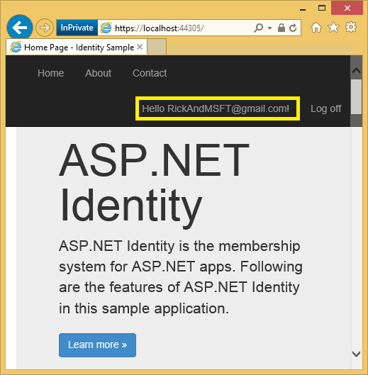
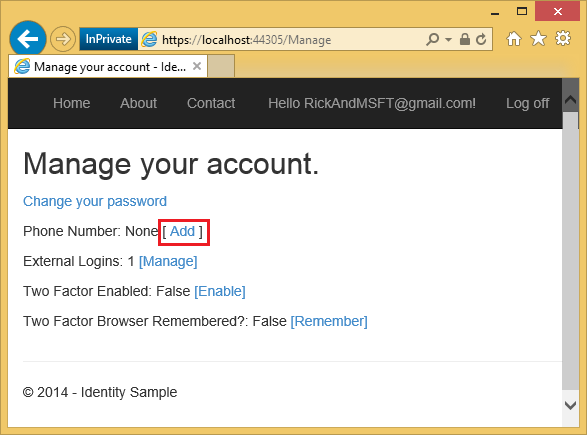
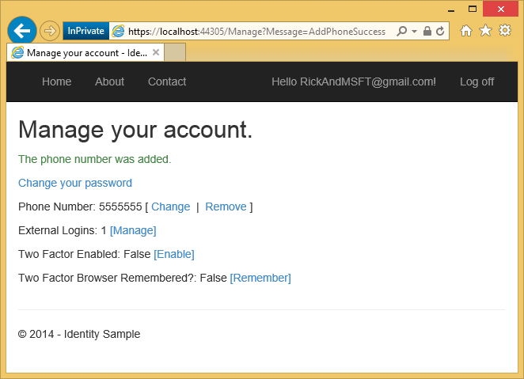
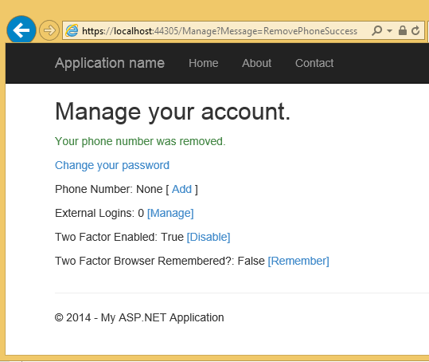
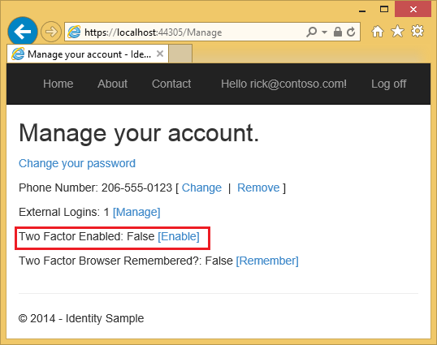
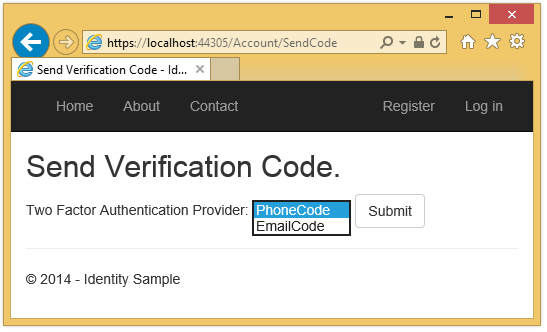
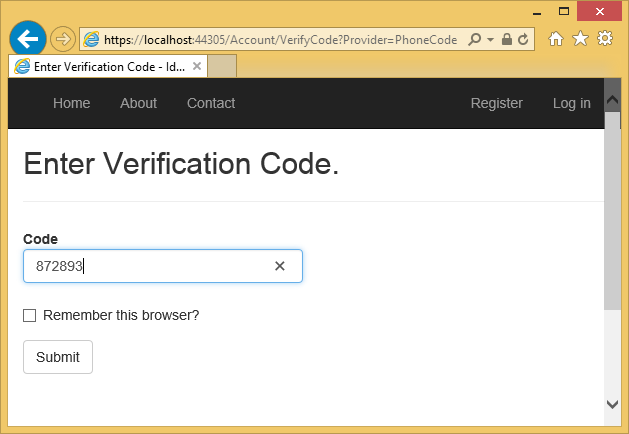
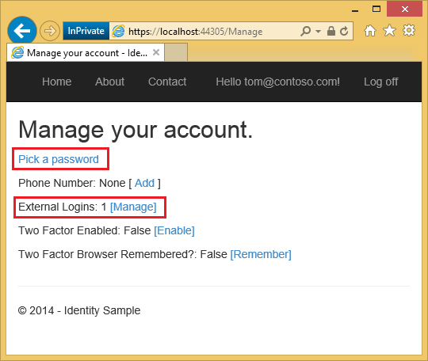
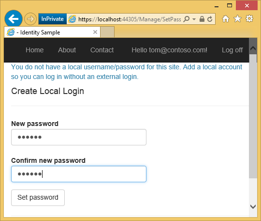

Two-factor authentication using SMS and email with ASP.NET Identity
====================
by [Hao Kung](https://github.com/HaoK), [Pranav Rastogi](https://github.com/rustd), [Rick Anderson](https://github.com/Rick-Anderson), [Suhas Joshi](https://github.com/suhasj)

> This tutorial will show you how to set up Two-factor authentication (2FA) using SMS and email.
> 
> This article was written by Rick Anderson ([@RickAndMSFT](https://twitter.com/#!/RickAndMSFT)), Pranav Rastogi ([@rustd](https://twitter.com/rustd)), Hao Kung, and Suhas Joshi. The NuGet sample was written primarily by Hao Kung.

This topic covers the following:

- [Building the Identity sample](#build)
- [Set up SMS for Two-factor authentication](#SMS)
- [Enable Two-factor authentication](#enable2)
- [How to register a Two-factor authentication provider](#reg)
- [Combine social and local login accounts](#combine)
- [Account lockout from brute force attacks](#lock)

## Building the Identity sample

In this section, you'll use NuGet to download a sample we will work with. Start by installing and running [Visual Studio Express 2013 for Web](https://go.microsoft.com/fwlink/?LinkId=299058) or [Visual Studio 2013](https://go.microsoft.com/fwlink/?LinkId=306566). Install Visual Studio [2013 Update 2](https://go.microsoft.com/fwlink/?LinkId=390521) or higher.

> [!NOTE]
> Warning: You must install Visual Studio [2013 Update 2](https://go.microsoft.com/fwlink/?LinkId=390521) to complete this tutorial.

1. Create a new ***empty*** ASP.NET Web project.
2. In the Package Manager Console, enter the following the following commands:  
  
    `Install-Package SendGrid`  
    `Install-Package -Prerelease Microsoft.AspNet.Identity.Samples`  
  
 In this tutorial, we'll use [SendGrid](http://sendgrid.com/) to send email and [Twilio](https://www.twilio.com/) or [ASPSMS](https://www.aspsms.com/asp.net/identity/testcredits/) for sms texting. The `Identity.Samples` package installs the code we will be working with.
3. Set the [project to use SSL](../../../mvc/overview/security/create-an-aspnet-mvc-5-app-with-facebook-and-google-oauth2-and-openid-sign-on.md).
4. *Optional*: Follow the instructions in my [Email confirmation tutorial](account-confirmation-and-password-recovery-with-aspnet-identity.md) to hook up SendGrid and then run the app and register an email account.
5. *Optional: *Remove the demo email link confirmation code from the sample (The `ViewBag.Link` code in the account controller. See the `DisplayEmail` and `ForgotPasswordConfirmation` action methods and razor views ).
6. *Optional: *Remove the `ViewBag.Status` code from the Manage and Account controllers and from the *Views\Account\VerifyCode.cshtml* and *Views\Manage\VerifyPhoneNumber.cshtml* razor views. Alternatively, you can keep the `ViewBag.Status` display to test how this app works locally without having to hook up and send email and SMS messages.

> [!NOTE]
> Warning: If you change any of the security settings in this sample, productions apps will need to undergo a security audit that explicitly calls out the changes made.

## Set up SMS for Two-factor authentication

This tutorial provides instructions for using either Twilio or ASPSMS but you can use any other SMS provider.

1. **Creating a User Account with an SMS provider**  
  
 Create a [Twilio](https://www.twilio.com/try-twilio) or an [ASPSMS](https://www.aspsms.com/asp.net/identity/testcredits/) account.
2. **Installing additional packages or adding service references**  
  
 Twilio:  
 In the Package Manager Console, enter the following command:  
    `Install-Package Twilio`  
  
 ASPSMS:  
 The following service reference needs to be added:  
  
      
  
 Address:  
    `https://webservice.aspsms.com/aspsmsx2.asmx?WSDL`  
  
 Namespace:  
    `ASPSMSX2`
3. **Figuring out SMS Provider User credentials**  
  
 Twilio:  
 From the **Dashboard** tab of your Twilio account, copy the **Account SID** and **Auth token**.  
  
 ASPSMS:  
 From your account settings, navigate to **Userkey** and copy it together with your self-defined **Password**.  
  
 We will later store these values in the variables `SMSAccountIdentification` and `SMSAccountPassword` .
4. **Specifying SenderID / Originator**  
  
 Twilio:  
 From the **Numbers** tab, copy your Twilio phone number.  
  
 ASPSMS:  
 Within the **Unlock Originators** Menu, unlock one or more Originators or choose an alphanumeric Originator (Not supported by all networks).  
  
 We will later store this value in the variable `SMSAccountFrom` .
5. **Transferring SMS provider credentials into app**  
  
 Make the credentials and sender phone number available to the app:

    [!code-csharp[Main](two-factor-authentication-using-sms-and-email-with-aspnet-identity/samples/sample1.cs)]

    > [!WARNING]
    > Security - Never store sensitive data in your source code. The account and credentials are added to the code above to keep the sample simple. See Jon Atten's [ASP.NET MVC: Keep Private Settings Out of Source Control](http://typecastexception.com/post/2014/04/06/ASPNET-MVC-Keep-Private-Settings-Out-of-Source-Control.aspx).
6. **Implementation of data transfer to SMS provider**  
  
 Configure the `SmsService`  class in the *App\_Start\IdentityConfig.cs* file.  
  
 Depending on the used SMS provider activate either the **Twilio** or the **ASPSMS** section: 

    [!code-csharp[Main](two-factor-authentication-using-sms-and-email-with-aspnet-identity/samples/sample2.cs)]
7. Run the app and log in with the account you previously registered.
8. Click on your User ID, which activates the `Index` action method in `Manage` controller.  
  
    
9. Click Add.  
  
    
10. In a few seconds you will get a text message with the verification code. Enter it and press **Submit**.  
  
    
11. The Manage view shows your phone number was added.  
  
    

### Examine the code

[!code-csharp[Main](two-factor-authentication-using-sms-and-email-with-aspnet-identity/samples/sample3.cs?highlight=2)]

The `Index` action method in `Manage` controller sets the status message based on your previous action and provides links to change your local password or add a local account. The `Index` method also displays the state or your 2FA phone number, external logins, 2FA enabled, and remember 2FA method for this browser(explained later). Clicking on your user ID (email) in the title bar doesn't pass a message. Clicking on the **Phone Number : remove** link passes `Message=RemovePhoneSuccess` as a query string.  
  
`https://localhost:44300/Manage?Message=RemovePhoneSuccess`

[]

The `AddPhoneNumber` action method displays a dialog box to enter a phone number that can receive SMS messages.

[!code-csharp[Main](two-factor-authentication-using-sms-and-email-with-aspnet-identity/samples/sample4.cs)]

Clicking on the **Send verification code** button posts the phone number to the HTTP POST `AddPhoneNumber` action method.

[!code-csharp[Main](two-factor-authentication-using-sms-and-email-with-aspnet-identity/samples/sample5.cs?highlight=12)]

The `GenerateChangePhoneNumberTokenAsync` method generates the security token which will be set in the SMS message. If the SMS service has been configured, the token is sent as the string &quot;Your security code is &lt;token&gt;&quot;. The `SmsService.SendAsync` method to is called asynchronously, then the app is redirected to the `VerifyPhoneNumber` action method (which displays the following dialog), where you can enter the verification code.

Once you enter the code and click submit, the code is posted to the HTTP POST `VerifyPhoneNumber` action method.

[!code-csharp[Main](two-factor-authentication-using-sms-and-email-with-aspnet-identity/samples/sample6.cs)]

The `ChangePhoneNumberAsync` method checks the posted security code. If the code is correct, the phone number is added to the `PhoneNumber` field of the `AspNetUsers` table. If that call is successful, the `SignInAsync` method is called:

[!code-csharp[Main](two-factor-authentication-using-sms-and-email-with-aspnet-identity/samples/sample7.cs)]

The `isPersistent` parameter sets whether the authentication session is persisted across multiple requests.

When you change your security profile, a new security stamp is generated and stored in the `SecurityStamp` field of the *AspNetUsers* table. Note, the `SecurityStamp` field is different from the security cookie. The security cookie is not stored in the `AspNetUsers` table (or anywhere else in the Identity DB). The security cookie token is self-signed using [DPAPI](https://msdn.microsoft.com/en-us/library/system.security.cryptography.protecteddata.aspx) and is created with the `UserId, SecurityStamp` and expiration time information.

The cookie middleware checks the cookie on each request. The `SecurityStampValidator` method in the `Startup` class hits the DB and checks security stamp periodically, as specified with the `validateInterval`. This only happens every 30 minutes (in our sample) unless you change your security profile. The 30 minute interval was chosen to minimize trips to the database.

The `SignInAsync` method needs to be called when any change is made to the security profile. When the security profile changes, the database is updates the `SecurityStamp` field, and without calling the `SignInAsync` method you would stay logged in *only* until the next time the OWIN pipeline hits the database (the `validateInterval`). You can test this by changing the `SignInAsync` method to return immediately, and setting the cookie `validateInterval` property from 30 minutes to 5 seconds:

[!code-csharp[Main](two-factor-authentication-using-sms-and-email-with-aspnet-identity/samples/sample8.cs?highlight=3)]

[!code-csharp[Main](two-factor-authentication-using-sms-and-email-with-aspnet-identity/samples/sample9.cs?highlight=20-21)]

With the above code changes, you can change your security profile (for example, by changing the state of **Two Factor Enabled**) and you will be logged out in 5 seconds when the `SecurityStampValidator.OnValidateIdentity` method fails. Remove the return line in the `SignInAsync` method, make another security profile change and you will not be logged out. The `SignInAsync` method generates a new security cookie.

## Enable two-factor authentication

In the sample app, you need to use the UI to enable two-factor authentication (2FA). To enable 2FA, click on your user ID (email alias) in the navigation bar.  
Click on enable 2FA. Log out, then log back in. If you've enabled email (see my [previous tutorial](account-confirmation-and-password-recovery-with-aspnet-identity.md)), you can select the SMS or email for 2FA. The Verify Code page is displayed where you can enter the code (from SMS or email). Clicking on the **Remember this browser** check box will exempt you from needing to use 2FA to log on with that computer and browser. Enabling 2FA and clicking on the **Remember this browser** will provide you with strong 2FA protection from malicious users trying to access your account, as long as they don't have access to your computer. You can do this on any private machine you regularly use. By setting **Remember this browser**, you get the added security of 2FA from computers you don't regularly use, and you get the convenience on not having to go through 2FA on your own computers. 

## How to register a Two-factor authentication provider

When you create a new MVC project, the *IdentityConfig.cs* file contains the following code to register a Two-factor authentication provider:

[!code-csharp[Main](two-factor-authentication-using-sms-and-email-with-aspnet-identity/samples/sample10.cs?highlight=22-35)]

## Add a phone number for 2FA

The `AddPhoneNumber` action method in the `Manage` controller generates a security token and sends it to the phone number you have provided.

[!code-csharp[Main](two-factor-authentication-using-sms-and-email-with-aspnet-identity/samples/sample11.cs)]

After sending the token, it redirects to the `VerifyPhoneNumber` action method, where you can enter the code to register SMS for 2FA. SMS 2FA is not used until you have verified the phone number.

## Enabling 2FA

The `EnableTFA` action method enables 2FA:

[!code-csharp[Main](two-factor-authentication-using-sms-and-email-with-aspnet-identity/samples/sample12.cs)]

Note the `SignInAsync` must be called because enable 2FA is a change to the security profile. When 2FA is enabled, the user will need to use 2FA to log in, using the 2FA approaches they have registered (SMS and email in the sample).

You can add more 2FA providers such as QR code generators or you can write you own (See [Using Google Authenticator with ASP.NET Identity](http://www.beabigrockstar.com/blog/using-google-authenticator-asp-net-identity/)).

> [!NOTE]
> The 2FA codes are generated using [Time-based One-time Password Algorithm](http://en.wikipedia.org/wiki/Time-based_One-time_Password_Algorithm) and codes are valid for six minutes. If you take more than six minutes to enter the code, you'll get an Invalid code error message.

## Combine social and local login accounts

You can combine local and social accounts by clicking on your email link. In the following sequence &quot;RickAndMSFT@gmail.com&quot; is first created as a local login, but you can create the account as a social log in first, then add a local login.

Click on the **Manage** link. Note the 0 external (social logins) associated with this account.

Click the link to another log in service and accept the app requests. The two accounts have been combined, you will be able to log on with either account. You might want your users to add local accounts in case their social log in authentication service is down, or more likely they have lost access to their social account.

In the following image, Tom is a social log in (which you can see from the **External Logins: 1** shown on the page).

Clicking on **Pick a password** allows you to add a local log on associated with the same account.

## Account lockout from brute force attacks

You can protect the accounts on your app from dictionary attacks by enabling user lockout. The following code in the `ApplicationUserManager Create` method configures lock out:

[!code-csharp[Main](two-factor-authentication-using-sms-and-email-with-aspnet-identity/samples/sample13.cs)]

The code above enables lockout for two factor authentication only. While you can enable lock out for logins by changing `shouldLockout` to true in the `Login` method of the account controller, we recommend you not enable lock out for logins because it makes the account susceptible to [DOS](http://en.wikipedia.org/wiki/Denial-of-service_attack) login attacks. In the sample code, lockout is disabled for the admin account created in the `ApplicationDbInitializer Seed` method:

[!code-csharp[Main](two-factor-authentication-using-sms-and-email-with-aspnet-identity/samples/sample14.cs?highlight=19)]

## Requiring a user to have a validated email account

The following code requires a user to have a validated email account before they can log in:

[!code-csharp[Main](two-factor-authentication-using-sms-and-email-with-aspnet-identity/samples/sample15.cs?highlight=8-17)]

## How SignInManager checks for 2FA requirement

Both the local log in and social log in check to see if 2FA is enabled. If 2FA is enabled, the `SignInManager` logon method returns `SignInStatus.RequiresVerification`, and the user will be redirected to the `SendCode` action method, where they will have to enter the code to complete the log in sequence. If the user has RememberMe is set on the users local cookie, the `SignInManager` will return `SignInStatus.Success` and they will not have to go through 2FA.

[!code-csharp[Main](two-factor-authentication-using-sms-and-email-with-aspnet-identity/samples/sample16.cs?highlight=20-22)]

[!code-csharp[Main](two-factor-authentication-using-sms-and-email-with-aspnet-identity/samples/sample17.cs?highlight=10-11,17-18)]

The following code shows the `SendCode` action method. A [SelectListItem](https://msdn.microsoft.com/en-us/library/system.web.mvc.selectlistitem.aspx) is created with all the 2FA methods enabled for the user. The [SelectListItem](https://msdn.microsoft.com/en-us/library/system.web.mvc.selectlistitem.aspx) is passed to the [DropDownListFor](https://msdn.microsoft.com/en-us/library/system.web.ui.webcontrols.dropdownlist.aspx) helper, which allows the user to select the 2FA approach (typically email and SMS).

[!code-csharp[Main](two-factor-authentication-using-sms-and-email-with-aspnet-identity/samples/sample18.cs)]

Once the user posts the 2FA approach, the `HTTP POST SendCode` action method is called, the `SignInManager` sends the 2FA code, and the user is redirected to the `VerifyCode` action method where they can enter the code to complete the log in.

[!code-csharp[Main](two-factor-authentication-using-sms-and-email-with-aspnet-identity/samples/sample19.cs?highlight=3,13-14,18)]

## 2FA Lockout

Although you can set account lockout on login password attempt failures, that approach makes your login susceptible to [DOS](http://en.wikipedia.org/wiki/Denial-of-service_attack) lockouts. We recommend you use account lockout only with 2FA. When the `ApplicationUserManager` is created, the sample code sets 2FA lockout and `MaxFailedAccessAttemptsBeforeLockout` to five. Once a user logs in (through local account or social account), each failed attempt at 2FA is stored, and if the maximum attempts is reached, the user is locked out for five minutes (you can set the lock out time with `DefaultAccountLockoutTimeSpan`).

## Additional Resources

- [ASP.NET Identity Recommended Resources](../getting-started/aspnet-identity-recommended-resources.md) Complete list of Identity blogs, videos, tutorials and great SO links.
- [MVC 5 App with Facebook, Twitter, LinkedIn and Google OAuth2 Sign-on](../../../mvc/overview/security/create-an-aspnet-mvc-5-app-with-facebook-and-google-oauth2-and-openid-sign-on.md) also shows how to add profile information to the users table.
- [ASP.NET MVC and Identity 2.0: Understanding the Basics](http://typecastexception.com/post/2014/04/20/ASPNET-MVC-and-Identity-20-Understanding-the-Basics.aspx) by John Atten.
- [Account Confirmation and Password Recovery with ASP.NET Identity](account-confirmation-and-password-recovery-with-aspnet-identity.md)
- [Introduction to ASP.NET Identity](../getting-started/introduction-to-aspnet-identity.md)
- [Announcing RTM of ASP.NET Identity 2.0.0](https://blogs.msdn.com/b/webdev/archive/2014/03/20/test-announcing-rtm-of-asp-net-identity-2-0-0.aspx) by Pranav Rastogi.
- [ASP.NET Identity 2.0: Setting Up Account Validation and Two-Factor Authorization](http://typecastexception.com/post/2014/04/20/ASPNET-Identity-20-Setting-Up-Account-Validation-and-Two-Factor-Authorization.aspx) by John Atten.