# Adding ASP.NET Identity to an Empty or Existing Web Forms Project

> This tutorial shows you how to add [ASP.NET Identity](introduction-to-aspnet-identity.md) (the new membership system for ASP.NET) to an ASP.NET application.
> 
> When you create a new Web Forms or MVC project in Visual Studio 2017 RTM with Individual Accounts, Visual Studio will install all the required packages and add all necessary classes for you. This tutorial will illustrate the steps to add ASP.NET Identity support to your existing Web Forms project or a new empty project. I will outline all the NuGet packages you need to install, and classes you need to add. I will go over sample Web Forms for registering new users and logging in while highlighting all main entry point APIs for user management and authentication. This sample will use the ASP.NET Identity default implementation for SQL data storage which is built on Entity Framework. This tutorial, we will use LocalDB for the SQL database.
> 

## Get started with ASP.NET Identity

1. Start by installing and running [Visual Studio 2017](https://visualstudio.microsoft.com/downloads/).
2. Select **New Project** from the Start page, or you can use the menu and select **File**, and then **New Project**.
3. In the left pane, expand **Visual C#**, then select **Web**, then **ASP.NET Web Application (.Net Framework)**. Name your project "WebFormsIdentity" and select **OK**.
  
    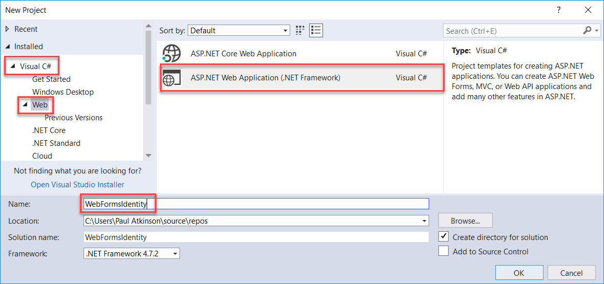
4. In the **New ASP.NET Project** dialog, select the **Empty** template.
  
    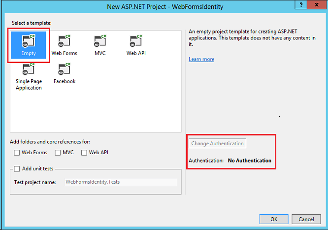  
  
   Notice the **Change Authentication** button is disabled and no authentication support is provided in this template. The Web Forms, MVC and Web API templates allow you to select the authentication approach.

## Add Identity packages to your app

In Solution Explorer, right-click your project and select **Manage NuGet Packages**. Search for and install the **Microsoft.AspNet.Identity.EntityFramework** package. 
  
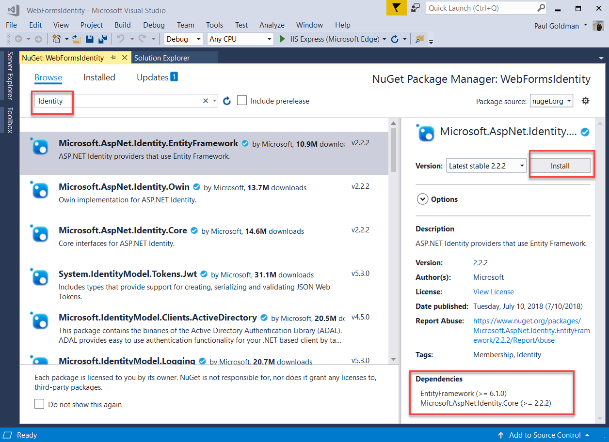
  
Note that this package will install the dependency packages: **EntityFramework** and **Microsoft ASP.NET Identity Core**.

## Add a web form to register users

1. In **Solution Explorer**, right-click your project and select **Add**, and then **Web Form**.
  
    
2. In the **Specify Name for Item** dialog box, name the new web form **Register**, and then select **OK**
3. Replace the markup in the generated *Register.aspx* file with the code below. The code changes are highlighted. 

    [!code-aspx[Main](adding-aspnet-identity-to-an-empty-or-existing-web-forms-project/samples/sample1.aspx?highlight=9,12-40)]

    > [!NOTE]
    > This is just a simplified version of the *Register.aspx* file that is created when you create a new ASP.NET Web Forms project. The markup above adds form fields and a button to register a new user.
4. Open the *Register.aspx.cs* file and replace the contents of the file with the following code:

    [!code-csharp[Main](adding-aspnet-identity-to-an-empty-or-existing-web-forms-project/samples/sample2.cs)]

    > [!NOTE] 
    > 
    > 1. The code above is a simplified version of the *Register.aspx.cs* file that is created when you create a new ASP.NET Web Forms project.
    > 2. The *IdentityUser* class is the default EntityFramework implementation of the *IUser* interface. *IUser* interface is the minimal interface for a user on ASP.NET Identity Core.
    > 3. The *UserStore* class is the default EntityFramework implementation of a user store. This class implements the ASP.NET Identity Core's minimal interfaces: *IUserStore*, *IUserLoginStore*, *IUserClaimStore* and *IUserRoleStore*.
    > 4. The *UserManager* class exposes user related APIs which will automatically save changes to the *UserStore*.
    > 5. The *IdentityResult* class represents the result of an identity operation.
5. In **Solution Explorer**, right-click your project and select **Add**, **Add ASP.NET Folder** and then **App\_Data**.
  
    
6. Open the *Web.config* file and add a connection string entry for the database we will use to store user information. The database will be created at runtime by EntityFramework for the Identity entities. The connection string is similar to one created for you when you create a new Web Forms project. The highlighted code shows the markup you should add:

    [!code-xml[Main](adding-aspnet-identity-to-an-empty-or-existing-web-forms-project/samples/sample3.xml?highlight=11-14)]
    
    > [!NOTE] 
    > For Visual Studio 2015 or higher, replace `(localdb)\v11.0` with `(localdb)\MSSQLLocalDB` in your connection string.
    
7. Right click file *Register.aspx* in your project and select **Set as Start Page**. Press Ctrl + F5 to build and run the web application. Enter a new user name and password and then select **Register**.
  
    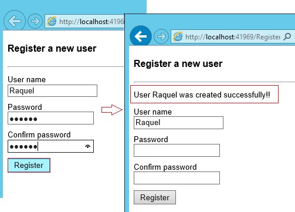  

    > [!NOTE]
    > ASP.NET Identity has support for validation and in this sample you can verify the default behavior on User and Password validators that come from the Identity Core package. The default validator for User (`UserValidator`) has a property `AllowOnlyAlphanumericUserNames` that has default value set to `true`. The default validator for Password (`MinimumLengthValidator`) ensures that password has at least 6 characters. These validators are properties on `UserManager` that can be overridden if you want to have custom validation,

## Verify the LocalDb Identity database and tables generated by Entity Framework

1. In the **View** menu, select **Server Explorer**.
  
    
2. Expand **DefaultConnection (WebFormsIdentity)**, expand **Tables**, right-click **AspNetUsers** and then select **Show Table Data**.
  
    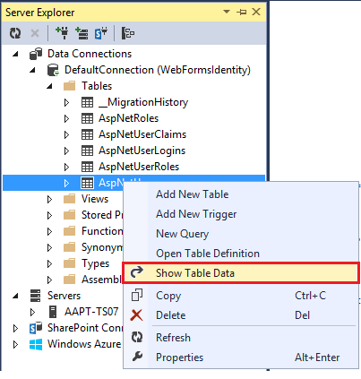  
    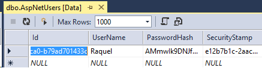

## Configure the application for OWIN authentication

At this point we have only added support for creating users. Now, we are going to demonstrate how we can add authentication to login a user. ASP.NET Identity uses Microsoft OWIN Authentication middleware for forms authentication. The OWIN Cookie Authentication is a cookie and claims based authentication mechanism that can be used by any framework hosted on [OWIN](https://msdn.microsoft.com/magazine/dn451439.aspx) or IIS. With this model, the same authentication packages can be used across multiple frameworks including ASP.NET MVC and Web Forms. For more information on project Katana and how to run middleware in a host agnostic see [Getting Started with the Katana Project](https://msdn.microsoft.com/magazine/dn451439.aspx).

## Install authentication packages to your application

1. In Solution Explorer, right-click your project and select **Manage NuGet Packages**. Search for and install the ***Microsoft.AspNet.Identity.Owin*** package. 
  
    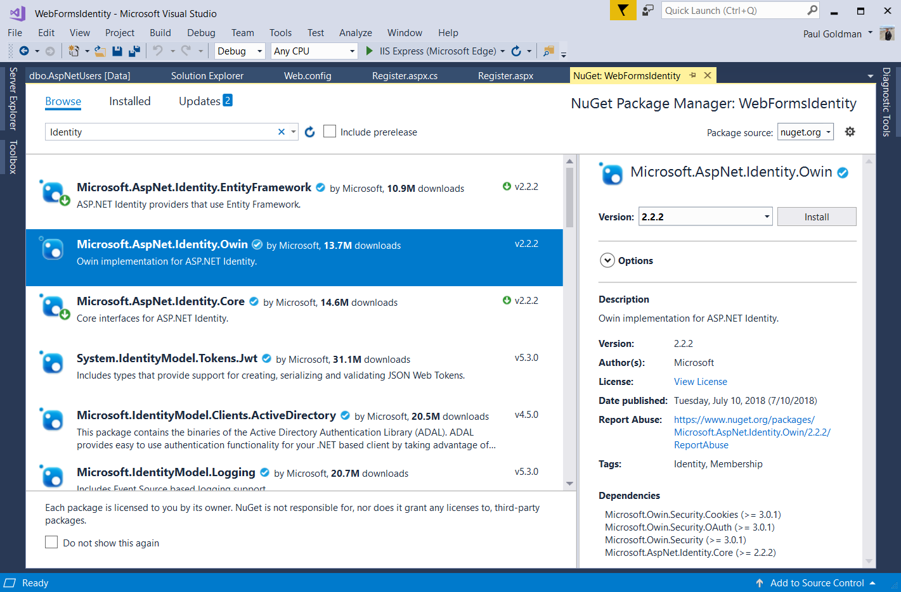

2. Search for and install the ***Microsoft.Owin.Host.SystemWeb*** package.

    > [!NOTE]
    > The **Microsoft.Aspnet.Identity.Owin** package contains a set of OWIN extension classes to manage and configure OWIN authentication middleware to be consumed by ASP.NET Identity Core packages.
    > The **Microsoft.Owin.Host.SystemWeb** package contains an OWIN server that enables OWIN-based applications to run on IIS using the ASP.NET request pipeline. For more information see [OWIN Middleware in the IIS integrated pipeline](../../../aspnet/overview/owin-and-katana/owin-middleware-in-the-iis-integrated-pipeline.md).

## Add OWIN startup and authentication configuration classes

1. In **Solution Explorer**, right-click your project, select **Add**, and then **Add New Item**. In the search text box dialog, type "*owin*". Name the class "*Startup*" and select **Add**. 
  
    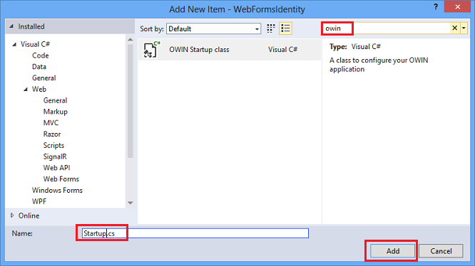
2. In the Startup.cs file, add the highlighted code shown below to configure OWIN cookie authentication.

    [!code-csharp[Main](adding-aspnet-identity-to-an-empty-or-existing-web-forms-project/samples/sample4.cs?highlight=1,3,15-19)]

    > [!NOTE]
    > This class contains the `OwinStartup` attribute for specifying the OWIN startup class. Every OWIN application has a startup class where you specify components for the application pipeline. See [OWIN Startup Class Detection](../../../aspnet/overview/owin-and-katana/owin-startup-class-detection.md) for more info on this model.

## Add web forms for registering and signing in users

1. Open the *Register.aspx.cs* file and add the following code which signs in the user when registration succeeds. The changes are highlighted below.

    [!code-csharp[Main](adding-aspnet-identity-to-an-empty-or-existing-web-forms-project/samples/sample5.cs)]

    > [!NOTE] 
    > 
    > - Since ASP.NET Identity and OWIN Cookie Authentication are claims based system, the framework requires the app developer to generate a [ClaimsIdentity](https://msdn.microsoft.com/library/microsoft.identitymodel.claims.claimsidentity.aspx) for the user. ClaimsIdentity has information about all the claims for the user such as what Roles the user belongs to. You can also add more claims for the user at this stage.
    > - You can sign in the user by using the AuthenticationManager from OWIN and calling `SignIn` and passing in the ClaimsIdentity as shown above. This code will sign in the user and generate a cookie as well. This call is analogous to [FormAuthentication.SetAuthCookie](https://msdn.microsoft.com/library/system.web.security.formsauthentication.setauthcookie.aspx) used by the [FormsAuthentication](https://msdn.microsoft.com/library/system.web.security.formsauthenticationmodule.aspx) module.
2. In **Solution Explorer**, right-click your project, select **Add**, and then **Web Form**. Name the web form **Login**.
  
    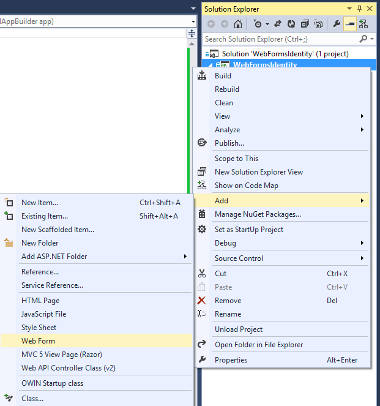
3. Replace the contents of the *Login.aspx* file with the following code:

    [!code-aspx[Main](adding-aspnet-identity-to-an-empty-or-existing-web-forms-project/samples/sample6.aspx)]
4. Replace the contents of the *Login.aspx.cs* file with the following:

    [!code-csharp[Main](adding-aspnet-identity-to-an-empty-or-existing-web-forms-project/samples/sample7.cs)]

    > [!NOTE] 
    > 
    > - The `Page_Load` now checks for the status of current user and takes action based on its `Context.User.Identity.IsAuthenticated` status.
    >     **Display Logged in User Name** : The Microsoft ASP.NET Identity Framework has added extension methods on [System.Security.Principal.IIdentity](https://msdn.microsoft.com/library/system.security.principal.iidentity.aspx) that allows you to get the `UserName` and `UserId`  for the logged in User. These extension methods are defined in the `Microsoft.AspNet.Identity.Core` assembly. These extension methods are the replacement for [HttpContext.User.Identity.Name](https://msdn.microsoft.com/library/system.web.httpcontext.user.aspx) .
    > - SignIn method: 
    >     `This` method replaces the previous `CreateUser_Click` method in this sample and now signs in the user after successfully creating the user.   
    >  The Microsoft OWIN Framework has added extension methods on `System.Web.HttpContext` that allows you to get a reference to an `IOwinContext`. These extension methods are defined in `Microsoft.Owin.Host.SystemWeb` assembly. The `OwinContext` class exposes an `IAuthenticationManager` property that represents the Authentication middleware functionality available on the current request. 
    >  You can sign in the user by using the `AuthenticationManager` from OWIN and calling `SignIn` and passing in the `ClaimsIdentity` as shown above. 
    >  Because ASP.NET Identity and OWIN Cookie Authentication are claims-based system, the framework requires the app to generate a `ClaimsIdentity` for the user. 
    >  The `ClaimsIdentity` has information about all the claims for the user, such as what roles the user belongs to. You can also add more claims for the user at this stage
    >  This code will sign in the user and generate a cookie as well. This call is analogous to [FormAuthentication.SetAuthCookie](https://msdn.microsoft.com/library/system.web.security.formsauthentication.setauthcookie.aspx) used by the [FormsAuthentication](https://msdn.microsoft.com/library/system.web.security.formsauthenticationmodule.aspx) module.
    > - `SignOut` method: 
    >  Gets a reference to the `AuthenticationManager` from OWIN and calls `SignOut`. This is analogous to [FormsAuthentication.SignOut](https://msdn.microsoft.com/library/system.web.security.formsauthentication.signout.aspx) method used by the [FormsAuthentication](https://msdn.microsoft.com/library/system.web.security.formsauthenticationmodule.aspx) module.
5. Press **Ctrl + F5** to build and run the web application. Enter a new user name and password and then select **Register**.
  
    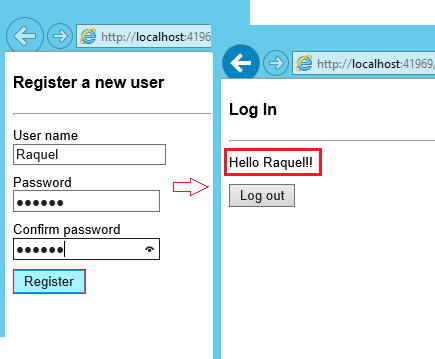  
   Note: At this point, the new user is created and logged in.
6. Select the **Log out** button. You are redirected to the Log in form.
7. Enter an invalid user name or password and select the **Log in** button. 
   The `UserManager.Find`  method will return null and the error message: " *Invalid user name or password* " will be displayed.
  
    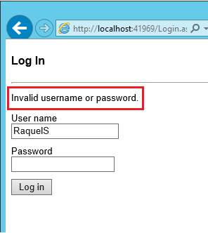
