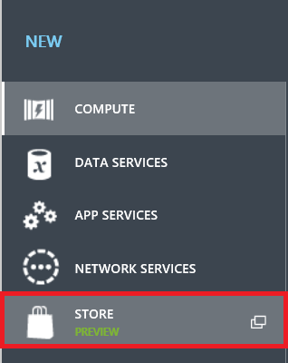
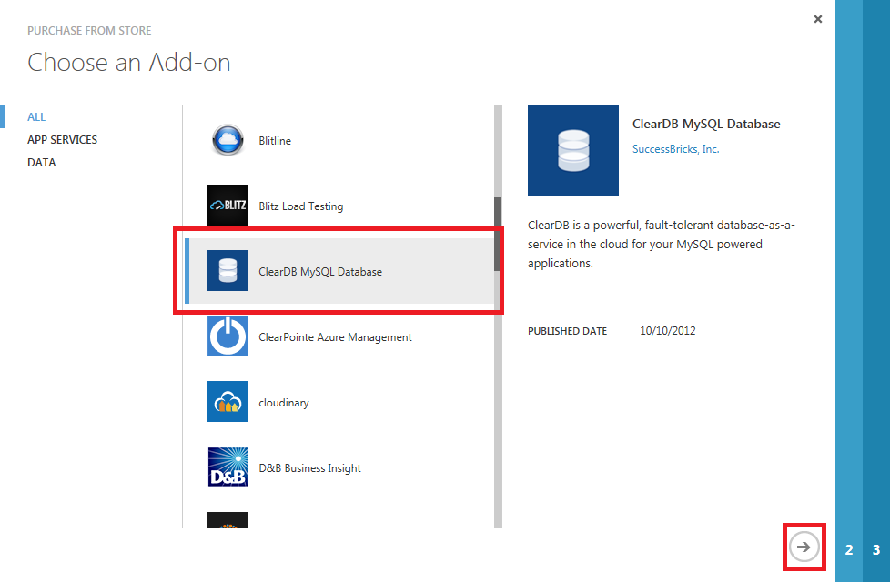
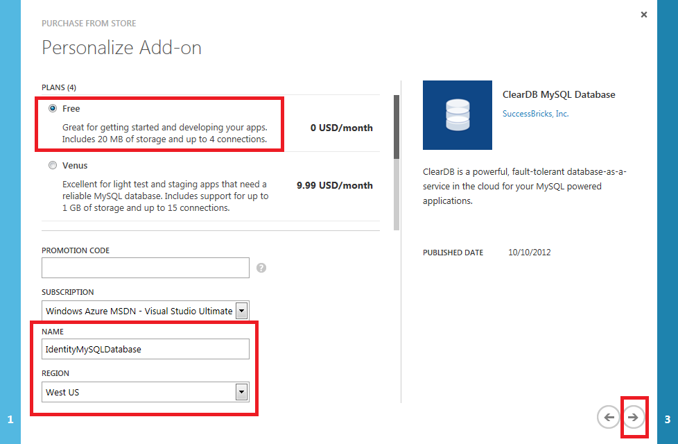
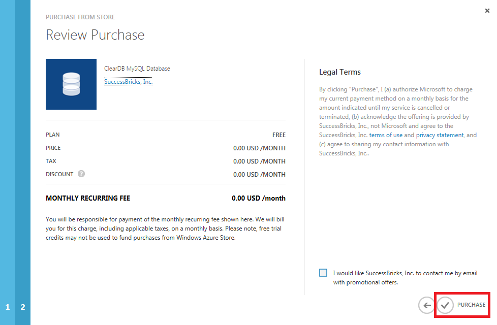
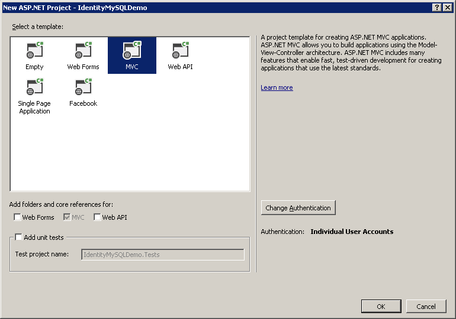
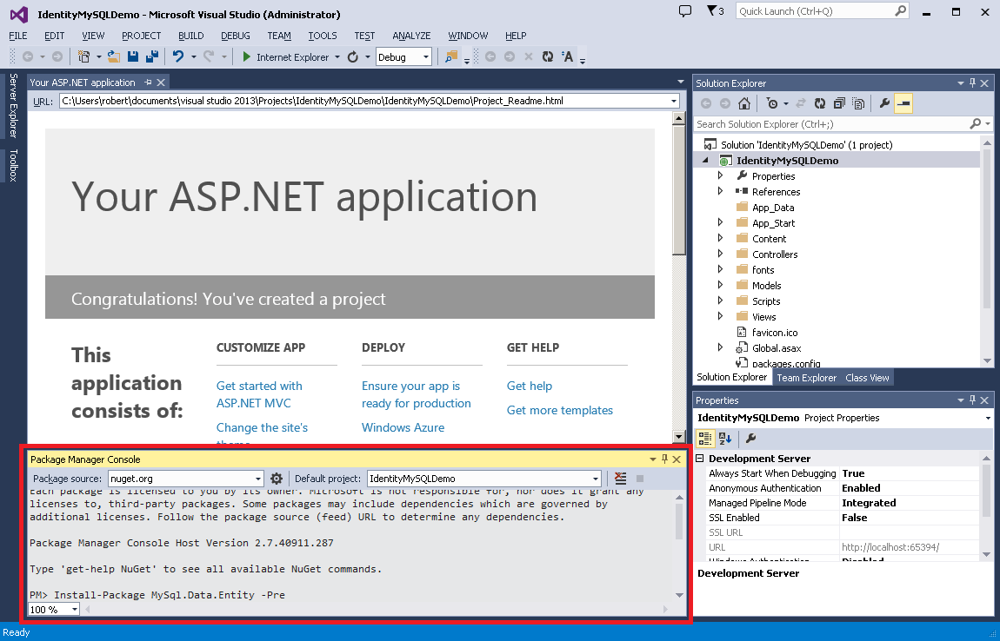
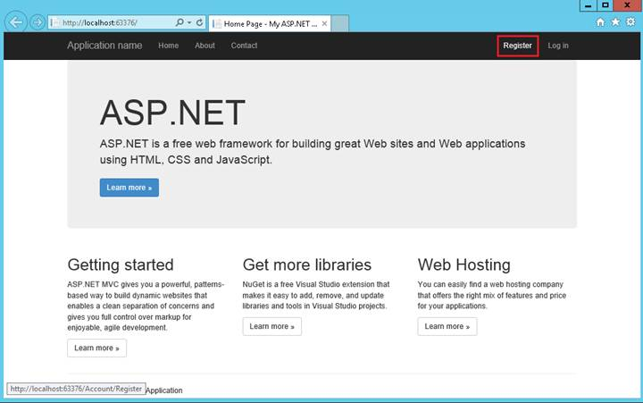
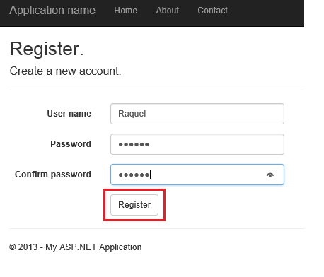
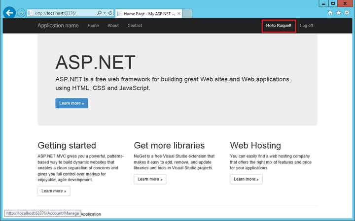
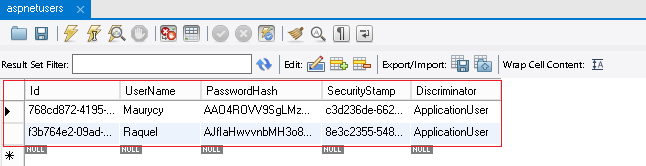

ASP.NET Identity: Using MySQL Storage with an EntityFramework MySQL Provider (C#)
====================
by [Maurycy Markowski](https://github.com/maumar), [Raquel Soares De Almeida](https://github.com/raquelsa), [Robert McMurray](https://github.com/rmcmurray)

> This tutorial shows you how to replace the default data storage mechanism for [**ASP.NET Identity**](introduction-to-aspnet-identity.md) with EntityFramework (SQL client provider) with a MySQL provider.

The following topics will be covered in this tutorial:

- Creating a MySQL database on Azure
- Creating an MVC application using Visual Studio 2013 MVC template
- Configuring EntityFramework to work with a MySQL database provider
- Running the application to verify the results

At the end of this tutorial, you will have an MVC application with the ASP.NET Identity store that is using a MySQL database that is hosted in Azure.

## Creating a MySQL database instance on Azure

1. Log in to the [Azure Portal](https://go.microsoft.com/fwlink/?linkid=529715&amp;clcid=0x409).
2. Click **NEW** at the bottom of the page, and then select **STORE**:  
  
    
3. In the **Choose and Add-on** wizard, select **ClearDB MySQL Database**, and then click the **Next** arrow at the bottom of the frame:  
  
 [Click the following image to expand it. ]  
    
4. Keep the default **Free** plan, change the **NAME** to **IdentityMySQLDatabase**, select the region that is nearest to you, and then click the **Next** arrow at the bottom of the frame:  
  
 [Click the following image to expand it. ]  
    
5. Click the **PURCHASE** checkmark to complete the database creation.  
  
 [Click the following image to expand it. ]  
    
6. After your database has been created, you can manage it from the **ADD-ONS** tab in the management portal. To retrieve the connection information for your database, click **CONNECTION INFO** at the bottom of the page:  
  
 [Click the following image to expand it. ]  
    
7. Copy the connection string by clicking on the copy button by the **CONECTIONSTRING** field and save it; you will use this information later in this tutorial for your MVC application:  
  
 [Click the following image to expand it. ]  
    

## Creating an MVC application project

To complete the steps in this section of the tutorial, you will first need to install [Visual Studio Express 2013 for Web](https://go.microsoft.com/fwlink/?LinkId=299058) or [Visual Studio 2013](https://go.microsoft.com/fwlink/?LinkId=306566). Once Visual Studio has been installed, use the following steps to create a new MVC application project:

1. Open Visual Studio 2103.
2. Click **New Project** from the **Start** page, or you can click the **File** menu and then **New Project**:  
  
 [Click the following image to expand it. ]  
    
3. When the **New Project** dialog box is displayed, expand **Visual C#** in the list of templates, then click **Web**, and select **ASP.NET Web Application**. Name your project **IdentityMySQLDemo** and then click **OK**:  
  
 [Click the following image to expand it. ]  
    
4. In the **New ASP.NET Project** dialog, select the **MVC** templatewith the default options; this will configure **Individual User Accounts** as the authentication method. Click **OK**:  
  
 [Click the following image to expand it. ]  
    

## Configure EntityFramework to work with a MySQL database

### Update the Entity Framework assembly for your project

The MVC application that was created from the Visual Studio 2013 template contains a reference to the [EntityFramework 6.0.0](http://www.nuget.org/packages/EntityFramework) package, but there have been updates to to that assembly since its release which contain significant performance improvements. In order to use these latest updates in your application, use the following steps.

1. Open your MVC project in Visual Studio 2013.
2. Click **TOOLS**, then click **Library Package Manager**, and then click **Package Manager Console**:  
  
 [Click the following image to expand it. ]  
    
3. The **Package Manager Console** will appear in the bottom section of Visual Studio. Type &quot;**Update-Package EntityFramework**&quot; and press Enter:  
  
 [Click the following image to expand it. ]  
    

### Install the MySQL provider for EntityFramework

In order for EntityFramework to connect to MySQL database, you need to install a MySQL provider. To do so, open the **Package Manager Console** and type &quot;**Install-Package MySql.Data.Entity -Pre**&quot;, and then press Enter.

> [!NOTE]
> This is a pre-release version of the assembly, and as such it may contain bugs. You should not use a pre-release version of the provider in production.

[Click the following image to expand it.]  
  

### Making project configuration changes to the Web.config file for your application

In this section you will configure the Entity Framework to use the MySQL provider that you just installed, register the MySQL provider factory, and add your connection string from Azure.

> [!NOTE]
> The following examples contain a specific assembly version for MySql.Data.dll. If the assembly version changes, you will need to modify the appropriate configuration settings with the correct version.

1. Open the Web.config file for your project in Visual Studio 2013.
2. Locate the following configuration settings, which define the default database provider and factory for the Entity Framework:

    [!code-xml[Main](aspnet-identity-using-mysql-storage-with-an-entityframework-mysql-provider/samples/sample1.xml)]
3. Replace those configuration settings with the following, which will configure the Entity Framework to use the MySQL provider: 

    [!code-xml[Main](aspnet-identity-using-mysql-storage-with-an-entityframework-mysql-provider/samples/sample2.xml)]
4. Locate the &lt;connectionStrings&gt; section and replace it with the following code, which will define the connection string for your MySQL database that is hosted on Azure (note that providerName value has also been changed from the original):

    [!code-xml[Main](aspnet-identity-using-mysql-storage-with-an-entityframework-mysql-provider/samples/sample3.xml?highlight=3-4)]

### Adding custom MigrationHistory context

Entity Framework Code First uses a **MigrationHistory** table to keep track of model changes and to ensure the consistency between the database schema and conceptual schema. However, this table does not work for MySQL by default because the primary key is too large. To remedy this situation, you will need to shrink the key size for that table. To do so, use the following steps:

1. The schema information for this table is captured in a **HistoryContext**, which can be modified as any other **DbContext**. To do so, add a new class file named **MySqlHistoryContext.cs** to the project, and replace its contents with the following code:

    [!code-csharp[Main](aspnet-identity-using-mysql-storage-with-an-entityframework-mysql-provider/samples/sample4.cs)]
2. Next you will need to configure Entity Framework to use the modified **HistoryContext**, rather than default one. This can be done by leveraging code-based configuration features. To do so, add new class file named **MySqlConfiguration.cs** to your project and replace its contents with:

    [!code-csharp[Main](aspnet-identity-using-mysql-storage-with-an-entityframework-mysql-provider/samples/sample5.cs)]

### Creating a custom EntityFramework initializer for ApplicationDbContext

The MySQL provider that is featured in this tutorial does not currently support Entity Framework migrations, so you will need to use model initializers in order to connect to the database. Because this tutorial is using a MySQL instance on Azure, you will need need to create a custom Entity Framework initializer.

> [!NOTE]
> This step is not required if you are connecting to a SQL Server instance on Azure or if you are using a database that is hosted on premises.

To create a custom Entity Framework initializer for MySQL, use the following steps:

1. Add a new class file named **MySqlInitializer.cs** to the project, and replace it's contents with the following code: 

    [!code-csharp[Main](aspnet-identity-using-mysql-storage-with-an-entityframework-mysql-provider/samples/sample6.cs?highlight=23)]
2. Open the **IdentityModels.cs** file for your project, which is located in the **Models** directory, and replace it's contents with the following: 

    [!code-csharp[Main](aspnet-identity-using-mysql-storage-with-an-entityframework-mysql-provider/samples/sample7.cs)]

## Running the application and verifying the database

Once you have completed the steps in the preceding sections, you should test your database. To do so, use the following steps:

1. Press **Ctrl + F5** to build and run the web application.
2. Click the **Register** tab on the top of the page:  
  
 [Click the following image to expand it. ]  
    
3. Enter a new user name and password, and then click **Register**:  
  
 [Click the following image to expand it. ]  
    
4. At this point the ASP.NET Identity tables are created on the MySQL Database, and the user is registered and logged into the application:  
  
 [Click the following image to expand it. ]  
    

### Installing MySQL Workbench tool to verify the data

1. Install the **MySQL Workbench** tool from the [MySQL downloads page](http://dev.mysql.com/downloads/windows/installer/)
2. In the installation wizard: **Feature Selection** tab, select **MySQL Workbench** under **applications** section.
3. Launch the app and add a new connection using the connection string data from the Azure MySQL database you created at the begging of this tutorial.
4. After establishing the connection, inspect the **ASP.NET Identity** tables created on the **IdentityMySQLDatabase.**
5. You will see that all ASP.NET Identity required tables are created as shown in the image below:  
  
 [Click the following image to expand it. ]  
    
6. Inspect the **aspnetusers** table for instance to check for the entries as you register new users.  
  
 [Click the following image to expand it. ]  
    