Developing ASP.NET Apps with Azure Active Directory
====================
by [Rick Anderson](https://github.com/Rick-Anderson)

> Microsoft ASP.NET tools for Azure Active Directory makes it simple to enable authentication for web applications hosted on [Azure](https://www.windowsazure.com/en-us/home/features/web-sites/). You can use Azure Authentication to authenticate Office 365 users from your organization, corporate accounts synced from your on-premise Active Directory or users created in your own custom Azure Active Directory domain. Enabling Windows Azure Authentication configures your application to authenticate users using a single [Azure Active Directory](https://www.windowsazure.com/en-us/home/features/identity/) tenant.
> 
>  This tutorial was written by Rick Anderson [@RickAndMSFT](https://twitter.com/#!/RickAndMSFT)

This tutorial will show you how to create an ASP.NET application that is configured for sign-on with [Azure Active Directory](https://msdn.microsoft.com/en-us/library/azure/mt168838.aspx) (Azure AD). You will also learn how to call the Graph API to get information about the currently signed-in user and how to deploy the application to Azure.

## Prerequisites

1. [Visual Studio Express 2013 for Web](https://www.microsoft.com/visualstudio/eng/2013-downloads#d-2013-express) or [Visual Studio 2013](https://www.microsoft.com/visualstudio/eng/2013-downloads).
2. [Visual Studio 2013 Update 4](https://www.microsoft.com/en-us/download/details.aspx?id=44921) - Update 3 or higher is required.
3. An Azure account. [Click here](https://azure.microsoft.com/en-us/pricing/free-trial/) for a free trial if you do not already have an account.

## Add a Global Administrator to your Active Directory

1. Sign in to the [Azure Management Portal](https://manage.windowsazure.com/).
2. All Azure accounts contain a **Default Directory** -- click on it, then click the **Users** tab at the top of the page (see image below).
3. Click Add User.  
    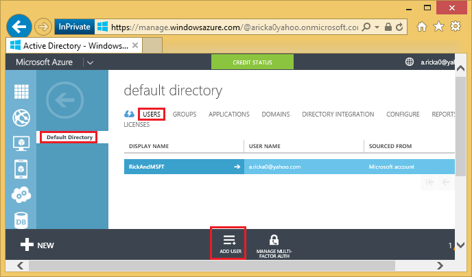
4. Create a new user with the **Global Administrator** role. Click **Users** from the top menu, and then click the **Add User** button on the command bar.
5. In the **Add User** dialog, enter a name for the new user and then click the right arrow.  
  
    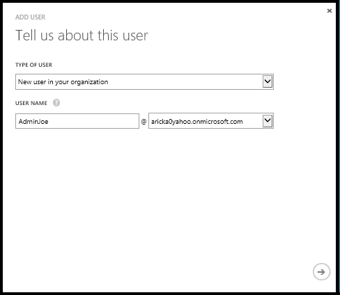
6. Enter the user name and set the role to **Global Administrator**. Global administrators require an alternate email address for password recovery purposes. After you're finished, click the right arrow.  
  
    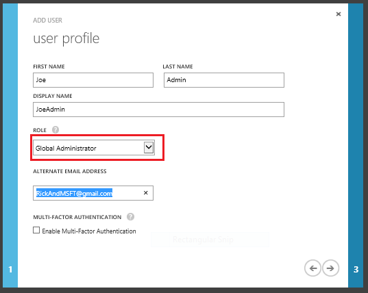
7. On the next page of the dialog, click **Create**. A temporary password will be created for the new user and displayed in the dialog.   
  
    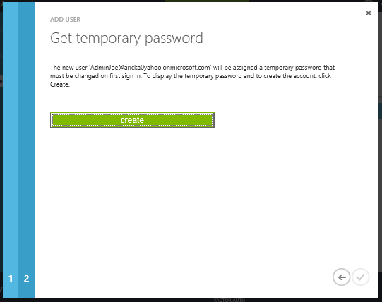  
  
 Save the password, you will be required to change the password after the first log in. The following image shows the new admin account. You must use the Azure Active Directory to log into your app, not the Microsoft account also shown on this page.  
  
    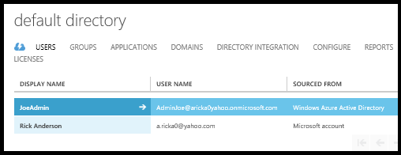

## Create an ASP.NET Application

The following steps use [Visual Studio Express 2013 for Web](https://www.microsoft.com/en-us/download/details.aspx?id=40747), and requires [Visual Studio 2013 Update 3](https://www.microsoft.com/en-us/download/details.aspx?id=43721).

1. In Visual Studio, click **File** and then **New Project**. On the **New Project** dialog, select the Visual C# Web project from the left menu and click **OK**. You may also want to uncheck the **Add Application Insights to Project** if you don't want the functionality for your application.
2. In the **New ASP.NET Project** dialog, select **MVC**, and then click **Change Authentication**.   
  
    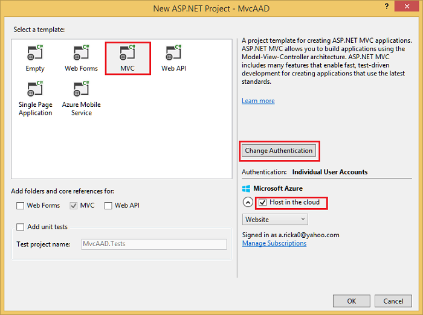
3. On the **Change Authentication** dialog, select **Organizational Accounts**. These options can be used to automatically register your application with Azure AD as well as automatically configure your application to integrate with Azure AD. You don't have to use the **Change Authentication** dialog to register and configure your application, but it makes it much easier. If you are using Visual Studio 2012 for example, you can still manually register the application in the Azure Management Portal and update its configuration to integrate with Azure AD.  
 In the drop-down menus, select **Cloud - Single Organization** and **Single Sign On, Read directory data**. Enter the domain for your Azure AD directory, for example (in the images below) *aricka0yahoo.onmicrosoft.com*, and then click **OK**. You can get the domain name from the Domains tab for the Default Directory on the azure portal (see the next image down).   
  
    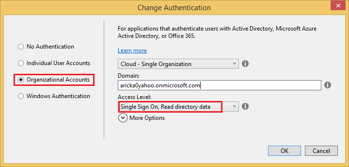  
  
 The following image shows the domain name from the Azure portal.  
  
    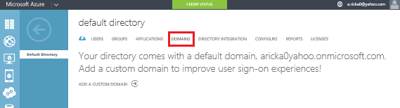  

    > [!NOTE]
    > You can optionally configure the Application ID URI that will be registered in Azure AD by clicking **More Options**. The App ID URI is the unique identifier for an application, which is registered in Azure AD and used by the application to identify itself when communicating with Azure AD. For more information about the App ID URI and other properties of registered applications, see [this topic](https://msdn.microsoft.com/en-us/library/azure/dn499820.aspx#BKMK_Registering). By clicking the checkbox below the App ID URI field, you can also choose to overwrite an existing registration in Azure AD that uses the same App ID URI.
4. After clicking **OK**, a sign-in dialog will appear, and you'll need to sign in using a Global Administrator account (not the Microsoft account associated with your subscription). If you created a new Administrator account earlier, you'll be required to change the password and then sign in again using the new password.   
  
    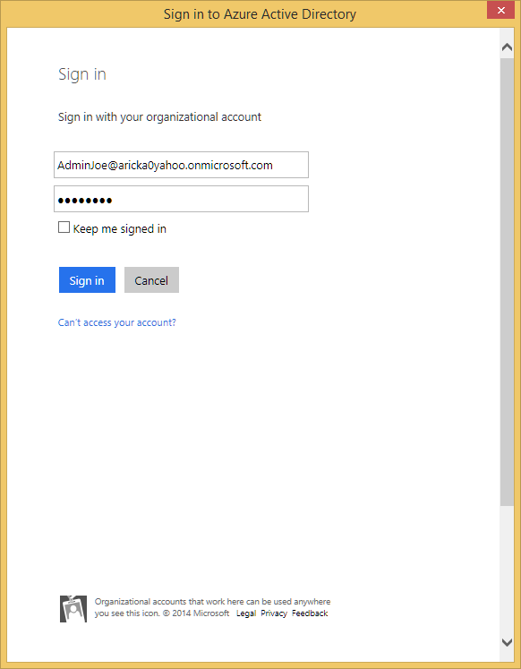
5. After you've successfully authenticated, the **New ASP.NET Project** dialog will show your authentication choice (**Organizational** ) and the directory where the new application will be registered (*aricka0yahoo.onmicrosoft.com* in the image below). Below this information, select the checkbox labeled **Host in the cloud**. If this checkbox is selected, the project will be provisioned as an Azure web app and will be enabled for easy publishing later. Click **OK**.   
  
    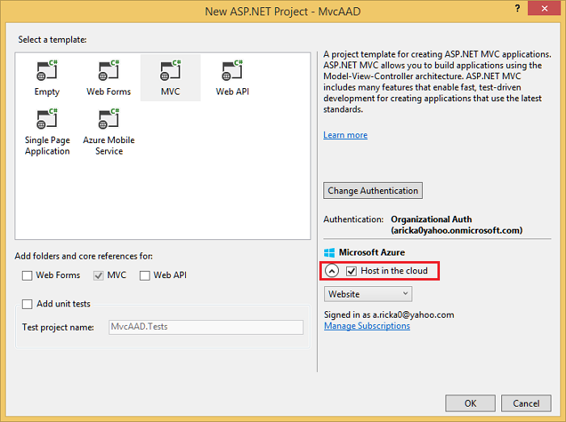
6. The **Configure Azure Website** dialog will appear, using an auto-generated site name and region. Also note the account you're currently signed into in the dialog. You want to make sure that this account is the one that your Azure subscription is attached to, typically a Microsoft account.

    > [!NOTE]
    > This project requires a database. You need to select one of your existing databases, or create a new one. A database is required because the project already uses a local database file to store a small amount of authentication configuration data. When you deploy the application to an Azure Website, this database isn't packaged with the deployment, so you need to choose one that's accessible in the cloud. Click **OK**.

    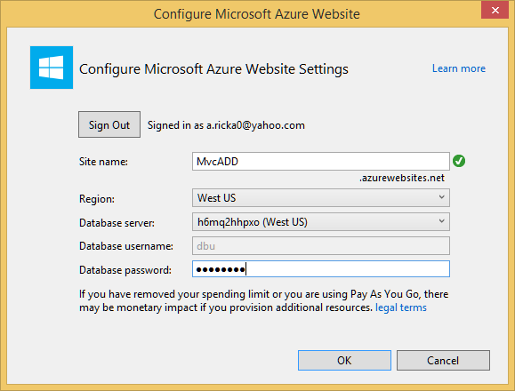
7. The project will be created, and your authentication options and web app options will be automatically configured with the project. Once this process has completed, run the project locally by pressing **^F5**. You will be required to sign in using your organizational account. Provide the username and password for the account you created earlier and click **Sign in**.   
  
    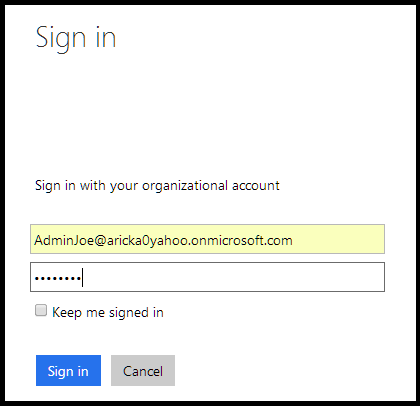
8. After successful sign in, the ASP.NET site will show that you've authenticated by displaying the username in the top right corner of the page.  
  
    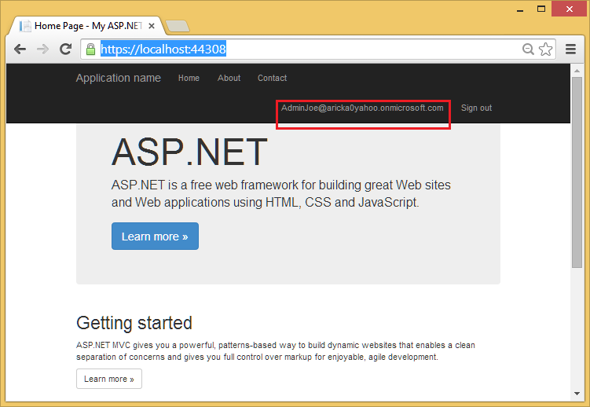  
  
 If you get the error:  
 Value cannot be null or empty. Parameter name: linkText   
    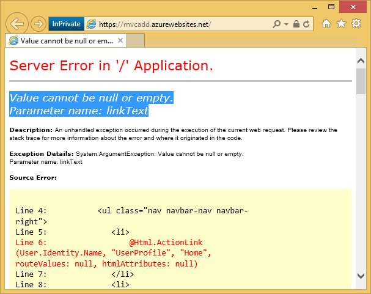  
  
 see the [debug](#dbg) section at the end of the tutorial.

## Basics of the Graph API

[The Graph API](https://msdn.microsoft.com/en-us/library/azure/hh974476.aspx) is the programmatic interface used to perform CRUD and other operations on objects in your Azure AD directory. If you select an Organizational Account option for authentication when creating a new project in Visual Studio 2013, your application will already be configured to call the Graph API. This section briefly shows you how the Graph API works.

1. In your running application, click on the name of the signed-in user at the top right of the page. This will take you to the User Profile page, which is an action on the Home Controller. You'll notice that the table contains user information about the administrator account you created earlier. This information is stored in your directory, and the Graph API is called to retrieve this information when the page loads.   
  
    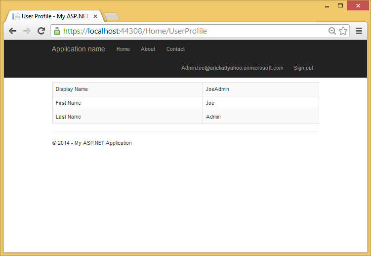
2. Go back to Visual Studio and expand the **Controllers** folder and then open the **HomeController.cs** file. You'll see a **UserProfile()** action that contains code to retrieve a token and then call the Graph API. This code is duplicated below: 

    [!code-csharp[Main](developing-aspnet-apps-with-windows-azure-active-directory/samples/sample1.cs?highlight=22)]

    To call the Graph API, you first need to retrieve a token. When the token is retrieved, its string value must be appended in the Authorization header for all subsequent requests to the Graph API. Most of the code above handles the details of authenticating to Azure AD to get a token, using the token to make a call to the Graph API, and then transforming the response so that it can be presented in the View.

    The most relevant portion for discussion is the following highlighted line: `UserProfile profile = JsonConvert.DeserializeObject<UserProfile>(responseString);`. This line represents the name of the user, which has been deserialized from the JSON response and is presented in the View.

    You can call the Graph API using HttpClient and handle the raw data yourself, but an easier way is to use the [Graph Client Library which is available via NuGet](http://www.nuget.org/packages/Microsoft.Azure.ActiveDirectory.GraphClient/). The Client Library handles the raw HTTP requests and the transformation of the returned data for you, and makes it much easier to work with the Graph API in a .NET environment. See the related Graph API code samples on [GitHub.](https://github.com/AzureADSamples)

## Deploy the Application to Azure

The following steps will show you how to deploy the application to Azure. In the earlier steps, you connected your new project with a web app on Azure, so it's ready to be published in just a few steps.

1. In Visual Studio, right-click on the project and select **Publish**. The **Publish Web** dialog will appear with each setting already configured. Click on the **Next** button to go to the **Settings** page. You may be prompted to authenticate; make sure you authenticate using your Azure subscription account (typically a Microsoft account) and not the organizational account you created earlier.  
  
    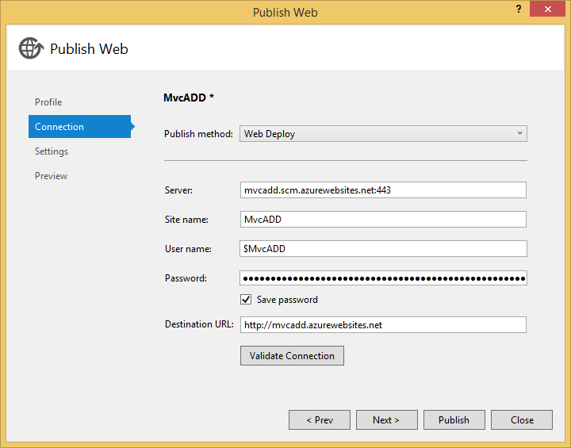
2. Check the **Enable Organizational Authentication** option. In the **Domain** field, enter the domain for your directory. From the **Access Level** drop-down, select **Single Sign On, Read directory data**. You'll notice that the previous database you used is already populated in the **Databases** section. Click **Publish**.  
  
    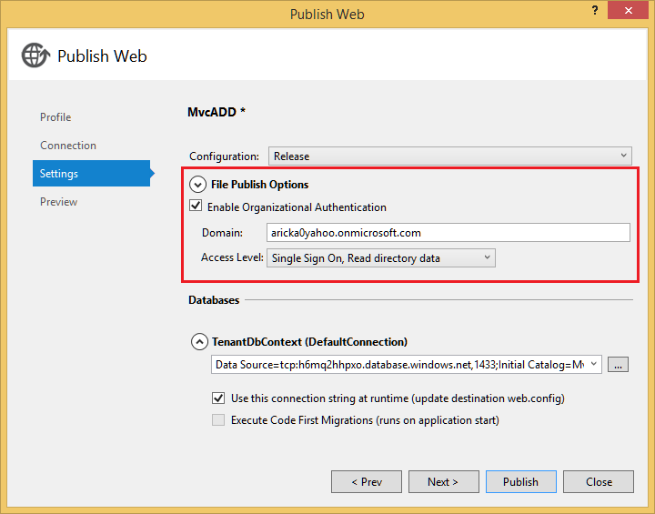
3. Visual Studio will begin deploying your website, and then a new browser window will appear. You may be prompted to authenticate to your directory once again. Once you've authenticated, you'll be redirected to your newly published website on Azure.  
  
    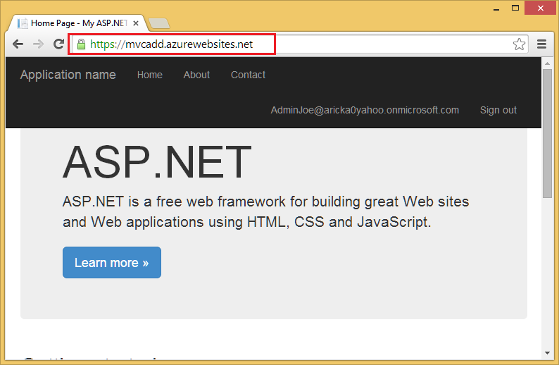

## Debugging the app

If you get the following error:   
 Value cannot be null or empty. Parameter name: linkText   
   
  
  

Replace the code in the *Views\Shared\\_LoginPartial.cshtml* file with the following:

[!code-cshtml[Main](developing-aspnet-apps-with-windows-azure-active-directory/samples/sample2.cshtml?highlight=1-8,15-16)]

After running the app, if the logged in user shows "Null User", sign out, and sign back in with the Active Directory account you created earlier.

An excellent tutorial to follow is Rick Rainey's [Deep Dive: Azure Websites and Organizational Authentication using Azure AD](http://rickrainey.com/2014/08/19/deep-dive-azure-websites-and-organizational-authentication-using-azure-ad/).

## More Information

- [Deep Dive: Azure Websites and Organizational Authentication using Azure AD](http://rickrainey.com/2014/08/19/deep-dive-azure-websites-and-organizational-authentication-using-azure-ad/)
- [Azure AD Graph API Overview](https://msdn.microsoft.com/en-us/library/azure/hh974476.aspx)
- [Authentication Scenarios in Azure AD](https://msdn.microsoft.com/en-us/library/azure/dn499820.aspx)
- [Azure AD Code Samples on GitHub](https://github.com/AzureADSamples)