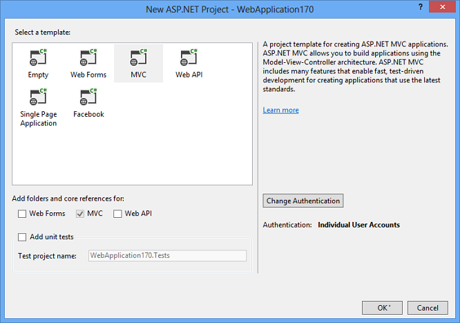
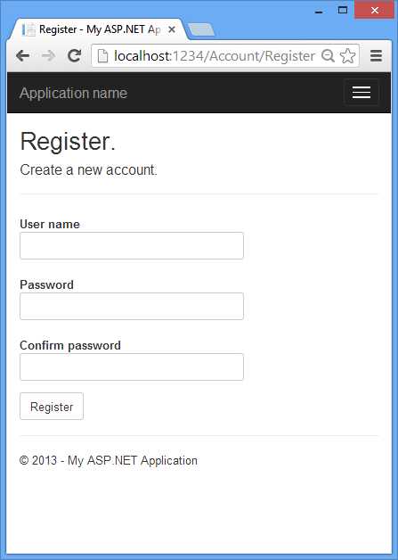

Introduction to ASP.NET Identity
====================
by [Jon Galloway](https://github.com/jongalloway), [Pranav Rastogi](https://github.com/rustd), [Rick Anderson](https://github.com/Rick-Anderson), [Tom Dykstra](https://github.com/tdykstra)

> The ASP.NET membership system was introduced with ASP.NET 2.0 back in 2005, and since then there have been many changes in the ways web applications typically handle authentication and authorization. ASP.NET Identity is a fresh look at what the membership system should be when you are building modern applications for the web, phone, or tablet.
> 
> This article was written by Pranav Rastogi ([@rustd](https://twitter.com/rustd)), Jon Galloway ([@jongalloway](https://twitter.com/jongalloway)), Tom Dykstra, and Rick Anderson ([@RickAndMSFT](https://twitter.com/#!/RickAndMSFT) ).

## Background: Membership in ASP.NET

### ASP.NET Membership

[ASP.NET Membership](https://msdn.microsoft.com/en-us/library/yh26yfzy(v=VS.100).aspx) was designed to solve site membership requirements that were common in 2005, which involved Forms Authentication, and a SQL Server database for user names, passwords, and profile data. Today there is a much broader array of data storage options for web applications, and most developers want to enable their sites to use social identity providers for authentication and authorization functionality. The limitations of ASP.NET Membership's design make this transition difficult:

- The database schema was designed for SQL Server and you can't change it. You can add profile information, but the additional data is packed into a different table, which makes it difficult to access by any means except through the Profile Provider API.
- The provider system enables you to change the backing data store, but the system is designed around assumptions appropriate for a relational database. You can write a provider to store membership information in a non-relational storage mechanism, such as Azure Storage Tables, but then you have to work around the relational design by writing a lot of code and a lot of `System.NotImplementedException` exceptions for methods that don't apply to NoSQL databases.
- Since the log-in/log-out functionality is based on Forms Authentication, the membership system can't use [OWIN](../../../aspnet/overview/owin-and-katana/an-overview-of-project-katana.md). OWIN includes middleware components for authentication, including support for log-ins using external identity providers (like Microsoft Accounts, Facebook, Google, Twitter), and log-ins using organizational accounts from on-premises Active Directory or Azure Active Directory. OWIN also includes support for OAuth 2.0, JWT and CORS.

### ASP.NET Simple Membership

[ASP.NET simple membership](../../../web-pages/overview/security/16-adding-security-and-membership.md) was developed as a membership system for ASP.NET Web Pages. It was released with WebMatrix and Visual Studio 2010 SP1. The goal of Simple Membership was to make it easy to add membership functionality to a Web Pages application.

Simple Membership did make it easier to customize user profile information, but it still shares the other problems with ASP.NET Membership, and it has some limitations:

- It was hard to persist membership system data in a non-relational store.
- You can't use it with OWIN.
- It doesn't work well with existing ASP.NET Membership providers, and it's not extensible.

### ASP.NET Universal Providers

[ASP.NET Universal Providers](http://www.hanselman.com/blog/IntroducingSystemWebProvidersASPNETUniversalProvidersForSessionMembershipRolesAndUserProfileOnSQLCompactAndSQLAzure.aspx) were developed to make it possible to persist membership information in Microsoft Azure SQL Database, and they also work with SQL Server Compact. The Universal Providers were built on Entity Framework Code First, which means that the Universal Providers can be used to persist data in any store supported by EF. With the Universal Providers, the database schema was cleaned up quite a lot as well.

The Universal Providers are built on the ASP.NET Membership infrastructure, so they still carry the same limitations as the SqlMembership Provider. That is, they were designed for relational databases and it's hard to customize profile and user information. These providers also still use Forms Authentication for log-in and log-out functionality.

## ASP.NET Identity

As the membership story in ASP.NET has evolved over the years, the ASP.NET team has learned a lot from feedback from customers.

The assumption that users will log in by entering a user name and password that they have registered in your own application is no longer valid. The web has become more social. Users are interacting with each other in real time through social channels such as Facebook, Twitter, and other social web sites. Developers want users to be able to log in with their social identities so that they can have a rich experience on their web sites. A modern membership system must enable redirection-based log-ins to authentication providers such as Facebook, Twitter, and others.

As web development evolved, so did the patterns of web development. Unit testing of application code became a core concern for application developers. In 2008 ASP.NET added a new framework based on the Model-View-Controller (MVC) pattern, in part to help developers build unit testable ASP.NET applications. Developers who wanted to unit test their application logic also wanted to be able to do that with the membership system.

Considering these changes in web application development, ASP.NET Identity was developed with the following goals:

- **One ASP.NET Identity system**

    - ASP.NET Identity can be used with all of the ASP.NET frameworks, such as ASP.NET MVC, Web Forms, Web Pages, Web API, and SignalR.
    - ASP.NET Identity can be used when you are building web, phone, store, or hybrid applications.
- **Ease of plugging in profile data about the user**

    - You have control over the schema of user and profile information. For example, you can easily enable the system to store birth dates entered by users when they register an account in your application.

    **Persistence control**

    - By default, the ASP.NET Identity system stores all the user information in a database. ASP.NET Identity uses Entity Framework Code First to implement all of its persistence mechanism.
    - Since you control the database schema, common tasks such as changing table names or changing the data type of primary keys is simple to do.
    - It's easy to plug in different storage mechanisms such as SharePoint, Azure Storage Table Service, NoSQL databases, etc., without having to throw `System.NotImplementedExceptions` exceptions.
- **Unit testability**

    - ASP.NET Identity makes the web application more unit testable. You can write unit tests for the parts of your application that use ASP.NET Identity.
- **Role provider**

    - There is a role provider which lets you restrict access to parts of your application by roles. You can easily create roles such as "Admin" and add users to roles.
- **Claims Based**

    - ASP.NET Identity supports claims-based authentication, where the user's identity is represented as a set of claims. Claims allow developers to be a lot more expressive in describing a user's identity than roles allow. Whereas role membership is just a boolean (member or non-member), a claim can include rich information about the user's identity and membership.
- **Social Login Providers**

    - You can easily add social log-ins such as Microsoft Account, Facebook, Twitter, Google, and others to your application, and store the user-specific data in your application.
- **Azure Active Directory**

    - You can also add log-in functionality using Azure Active Directory, and store the user-specific data in your application. For more information, see [Organizational Accounts](../../../visual-studio/overview/2013/creating-web-projects-in-visual-studio.md#orgauth) in Creating ASP.NET Web Projects in Visual Studio 2013
- **OWIN Integration**

    - ASP.NET authentication is now based on OWIN middleware that can be used on any OWIN-based host. ASP.NET Identity does not have any dependency on System.Web. It is a fully compliant OWIN framework and can be used in any OWIN hosted application.
    - ASP.NET Identity uses OWIN Authentication for log-in/log-out of users in the web site. This means that instead of using FormsAuthentication to generate the cookie, the application uses OWIN CookieAuthentication to do that.
- **NuGet package**

    - ASP.NET Identity is redistributed as a NuGet package which is installed in the ASP.NET MVC, Web Forms and Web API templates that ship with Visual Studio 2013. You can download this NuGet package from the NuGet gallery.
    - Releasing ASP.NET Identity as a NuGet package makes it easier for the ASP.NET team to iterate on new features and bug fixes, and deliver these to developers in an agile manner.

## Getting started with ASP.NET Identity

ASP.NET Identity is used in the Visual Studio 2013 project templates for ASP.NET MVC, Web Forms, Web API and SPA. In this walkthrough, we'll illustrate how the project templates use ASP.NET Identity to add functionality to register, log in and log out a user.

ASP.NET Identity is implemented using the following procedure. The purpose of this article is to give you a high level overview of ASP.NET Identity; you can follow it step by step or just read the details. For more detailed instructions on creating apps using ASP.NET Identity, including using the new API to add users, roles and profile information, see the Next Steps section at the end of this article.

1. Create an ASP.NET MVC application with Individual Accounts. You can use ASP.NET Identity in ASP.NET MVC, Web Forms, Web API, SignalR etc. In this article we will start with an ASP.NET MVC application.  
  
    
2. The created project contains the following three packages for ASP.NET Identity.

    - [`Microsoft.AspNet.Identity.EntityFramework`](http://www.nuget.org/packages/Microsoft.AspNet.Identity.EntityFramework/)  
 This package has the Entity Framework implementation of ASP.NET Identity which will persist the ASP.NET Identity data and schema to SQL Server.
    - [`Microsoft.AspNet.Identity.Core`](http://www.nuget.org/packages/Microsoft.AspNet.Identity.Core/)  
 This package has the core interfaces for ASP.NET Identity. This package can be used to write an implementation for ASP.NET Identity that targets different persistence stores such as Azure Table Storage, NoSQL databases etc.
    - [`Microsoft.AspNet.Identity.OWIN`](http://www.nuget.org/packages/Microsoft.AspNet.Identity.Owin/)  
 This package contains functionality that is used to plug in OWIN authentication with ASP.NET Identity in ASP.NET applications. This is used when you add log in functionality to your application and call into OWIN Cookie Authentication middleware to generate a cookie.
3. Creating a user.  
 Launch the application and then click on the **Register** link to create a user. The following image shows the Register page which collects the user name and password.  
  
      
  
 When the user clicks the **Register** button, the `Register` action of the Account controller creates the user by calling the ASP.NET Identity API, as highlighted below:

    [!code-csharp[Main](introduction-to-aspnet-identity/samples/sample1.cs?highlight=8-9)]
4. Log in.  
 If the user was successfully created, she is logged in by the `SignInAsync` method.  

    [!code-csharp[Main](introduction-to-aspnet-identity/samples/sample2.cs?highlight=12)]

    [!code-csharp[Main](introduction-to-aspnet-identity/samples/sample3.cs?highlight=5-6)]

 The highlighted code above in the `SignInAsync` method generates a [ClaimsIdentity](https://msdn.microsoft.com/en-us/library/system.security.claims.claimsidentity.aspx). Since ASP.NET Identity and OWIN Cookie Authentication are claims-based system, the framework requires the app to generate a ClaimsIdentity for the user. ClaimsIdentity has information about all the claims for the user, such as what roles the user belongs to. You can also add more claims for the user at this stage.  
  
 The highlighted code below in the `SignInAsync` method signs in the user by using the AuthenticationManager from OWIN and calling `SignIn` and passing in the ClaimsIdentity.  

    [!code-csharp[Main](introduction-to-aspnet-identity/samples/sample4.cs?highlight=8-11)]
5. Log off.  
 Clicking the **Log off** link calls the LogOff action in the account controller. 

    [!code-csharp[Main](introduction-to-aspnet-identity/samples/sample5.cs?highlight=6)]

 The highlighted code above shows the OWIN `AuthenticationManager.SignOut` method. This is analogous to [FormsAuthentication.SignOut](https://msdn.microsoft.com/en-us/library/system.web.security.formsauthentication.signout.aspx) method used by the [FormsAuthentication](https://msdn.microsoft.com/en-us/library/system.web.security.formsauthenticationmodule.aspx) module in Web Forms.

## Components of ASP.NET Identity

The diagram below shows the components of the ASP.NET Identity system (click on [this](introduction-to-aspnet-identity/_static/image3.png) or on the diagram to enlarge it). The packages in green make up the ASP.NET Identity system. All the other packages are dependencies which are needed to use the ASP.NET Identity system in ASP.NET applications.

The following is a brief description of the NuGet packages not mentioned previously:

- [Microsoft.Owin.Security.Cookies](http://www.nuget.org/packages/Microsoft.Owin.Security.Cookies/)  
 Middleware that enables an application to use cookie based authentication, similar to ASP.NET's Forms Authentication.
- [EntityFramework](http://www.nuget.org/packages/EntityFramework/)  
 Entity Framework is Microsoft's recommended data access technology for relational databases.

## Migrating from Membership to ASP.NET Identity

We hope to soon provide guidance on migrating your existing apps that use ASP.NET Membership or Simple Membership to the new ASP.NET Identity system.

## Next Steps

- [Create an ASP.NET MVC 5 App with Facebook and Google OAuth2 and OpenID Sign-on](../../../mvc/overview/security/create-an-aspnet-mvc-5-app-with-facebook-and-google-oauth2-and-openid-sign-on.md)  
 The tutorial uses the ASP.NET Identity API to add profile information to the user database, and how to authenticate with Google and Facebook.
- [Create an ASP.NET MVC app with auth and SQL DB and deploy to Azure App Service](https://www.windowsazure.com/en-us/develop/net/tutorials/web-site-with-sql-database/)  
 This tutorial shows how to use the Identity API to add users and roles.
- [Individual User Accounts](../../../visual-studio/overview/2013/creating-web-projects-in-visual-studio.md#indauth) in Creating ASP.NET Web Projects in Visual Studio 2013
- [Organizational Accounts](../../../visual-studio/overview/2013/creating-web-projects-in-visual-studio.md#orgauth) in Creating ASP.NET Web Projects in Visual Studio 2013
- [Customizing profile information in ASP.NET Identity in VS 2013 templates](https://blogs.msdn.com/b/webdev/archive/2013/10/16/customizing-profile-information-in-asp-net-identity-in-vs-2013-templates.aspx)
- [Get more information from Social providers used in the VS 2013 project templates](https://blogs.msdn.com/b/webdev/archive/2013/10/16/get-more-information-from-social-providers-used-in-the-vs-2013-project-templates.aspx)
- [https://github.com/rustd/AspnetIdentitySample](https://github.com/rustd/AspnetIdentitySample)  
 Sample application that shows how to add basic roles and user support and how to do roles and user management.
