Migrating an Existing Website from SQL Membership to ASP.NET Identity
====================
by [Rick Anderson](https://github.com/Rick-Anderson), [Suhas Joshi](https://github.com/suhasj)

> This tutorial illustrates the steps to migrate an existing web application with user and role data created using SQL Membership to the new ASP.NET Identity system. This approach involves changing the existing database schema to the one needed by the ASP.NET Identity and hook in the old/new classes to it. After you adopt this approach, once your database is migrated, future updates to Identity will be handled effortlessly.

For this tutorial, we will take a web application template (Web Forms) created using Visual Studio 2010 to create user and role data. We will then use SQL scripts to migrate the existing database to tables needed by the Identity system. Next we'll install the necessary NuGet packages and add new account management pages which use the Identity system for membership management. As a test of migration, users created using SQL membership should be able to log in and new users should be able to register. You can find the complete sample [here](https://aspnet.codeplex.com/SourceControl/latest#Samples/Identity/SQLMembership-Identity-OWIN/). See also [Migrating from ASP.NET Membership to ASP.NET Identity](http://travis.io/blog/2015/03/24/migrate-from-aspnet-membership-to-aspnet-identity.html).

## Getting started

### Creating an application with SQL Membership

1. We need to start with an existing application that uses SQL membership and has user and role data. For the purpose of this article, let's create a web application in Visual Studio 2010.

    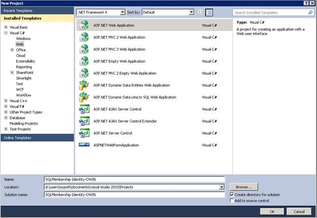
2. Using the ASP.NET Configuration tool, create 2 users: **oldAdminUser** and **oldUser.**

    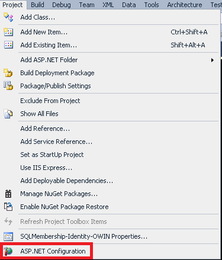

    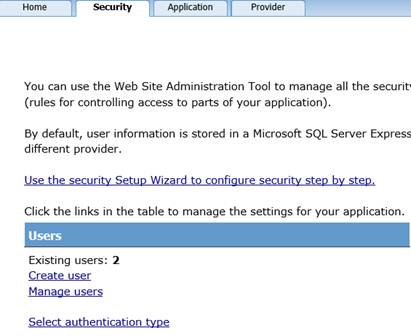
3. Create a role named Admin and add 'oldAdminUser' as a user in that role.

    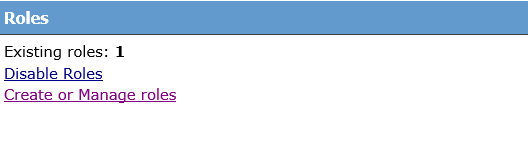
4. Create an Admin section of the site with a Default.aspx. Set the authorization tag in the web.config file to enable access only to users in Admin roles. More information can be found here [https://www.asp.net/web-forms/tutorials/security/roles/role-based-authorization-cs](../../../web-forms/overview/older-versions-security/roles/role-based-authorization-cs.md)

    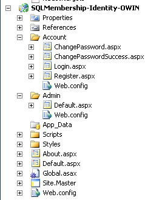
5. View the database in Server Explorer to understand the tables created by the SQL membership system. The user login data is stored in the aspnet\_Users and aspnet\_Membership tables, while role data is stored in the aspnet\_Roles table. Information about which users are in which roles is stored in the aspnet\_UsersInRoles table. For basic membership management it is sufficient to port the information in the above tables to the ASP.NET Identity system.

    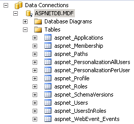

### Migrating to Visual Studio 2013

1. Install Visual Studio Express 2013 for Web or Visual Studio 2013 along with the [latest updates](https://www.microsoft.com/en-us/download/details.aspx?id=44921).
2. Open the above project in your installed version of Visual Studio. If SQL Server Express is not installed on the machine, a prompt is displayed when you open the project, since the connection string uses SQL Express. You can either choose to install SQL Express or as work around change the connection string to LocalDb. For this article we'll change it to LocalDb.
3. Open web.config and change the connection string from .SQLExpess to (LocalDb)v11.0. Remove 'User Instance=true' from the connection string.

    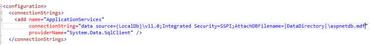
4. Open Server Explorer and verify that the table schema and data can be observed.
5. The ASP.NET Identity system works with version 4.5 or higher of the framework. Retarget the application to 4.5 or higher.

    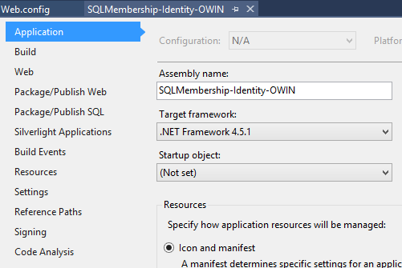

    Build the project to verify that there are no errors.

### Installing the Nuget packages

1. In Solution Explorer, right-click the project &gt; **Manage NuGet Packages**. In the search box, enter "Asp.net Identity". Select the package in the list of results and click install. Accept the license agreement by clicking on "I Accept" button. Note that this package will install the dependency packages: EntityFramework and Microsoft ASP.NET Identity Core. Similarly install the following packages (skip the last 4 OWIN packages if you don't want to enable OAuth log-in):

    - Microsoft.AspNet.Identity.Owin
    - Microsoft.Owin.Host.SystemWeb
    - Microsoft.Owin.Security.Facebook
    - Microsoft.Owin.Security.Google
    - Microsoft.Owin.Security.MicrosoftAccount
    - Microsoft.Owin.Security.Twitter

    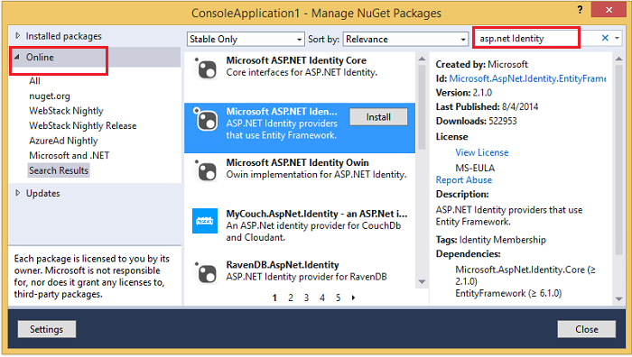

### Migrate database to the new Identity system

The next step is to migrate the existing database to a schema required by the ASP.NET Identity system. To achieve this we run a SQL script which has a set of commands to create new tables and migrate existing user information to the new tables. The script file can be found [here](https://aspnet.codeplex.com/SourceControl/latest#Samples/Identity/SQLMembership-Identity-OWIN/Migrations.sql).

This script file is specific to this sample. If the schema for the tables created using SQL membership is customized or modified the scripts need to be changed accordingly.

### How to generate the SQL script for schema migration

For ASP.NET Identity classes to work out of the box with the data of existing users, we need to migrate the database schema to the one needed by ASP.NET Identity. We can do this by adding new tables and copying the existing information to those tables. By default ASP.NET Identity uses EntityFramework to map the Identity model classes back to the database to store/retrieve information. These model classes implement the core Identity interfaces defining user and role objects. The tables and the columns in the database are based on these model classes. The EntityFramework model classes in Identity v2.1.0 and their properties are as defined below

| **IdentityUser** | **Type** | **IdentityRole** | **IdentityUserRole** | **IdentityUserLogin** | **IdentityUserClaim** |
| --- | --- | --- | --- | --- | --- |
| Id | string | Id | RoleId | ProviderKey | Id |
| Username | string | Name | UserId | UserId | ClaimType |
| PasswordHash | string |  |  | LoginProvider | ClaimValue |
| SecurityStamp | string |  |  |  | User\_Id |
| Email | string |  |  |  |  |
| EmailConfirmed | bool |  |  |  |  |
| PhoneNumber | string |  |  |  |  |
| PhoneNumberConfirmed | bool |  |  |  |  |
| LockoutEnabled | bool |  |  |  |  |
| LockoutEndDate | DateTime |  |  |  |  |
| AccessFailedCount | int |  |  |  |  |

We need to have tables for each of these models with columns corresponding to the properties. The mapping between classes and tables is defined in the `OnModelCreating` method of the `IdentityDBContext`. This is known as the fluent API method of configuration and more information can be found [here](https://msdn.microsoft.com/en-us/data/jj591617.aspx). The configuration for the classes is as mentioned below

| **Class** | **Table** | **Primary key** | **Foreign key** |
| --- | --- | --- | --- |
| IdentityUser | AspnetUsers | Id |  |
| IdentityRole | AspnetRoles | Id |  |
| IdentityUserRole | AspnetUserRole | UserId + RoleId | User\_Id-&gt;AspnetUsers RoleId-&gt;AspnetRoles |
| IdentityUserLogin | AspnetUserLogins | ProviderKey+UserId + LoginProvider | UserId-&gt;AspnetUsers |
| IdentityUserClaim | AspnetUserClaims | Id | User\_Id-&gt;AspnetUsers |

With this information we can create SQL statements to create new tables. We can either write each statement individually or generate the entire script using EntityFramework PowerShell commands which we can then edit as required. To do this, in VS open the **Package Manager Console** from the **View** or **Tools** menu

- Run command "Enable-Migrations" to enable EntityFramework migrations.
- Run command "Add-migration initial" which creates the initial setup code to create the database in C#/VB.
- The final step is to run "Update-Database –Script" command that generates the SQL script based on the model classes.

This database generation script can be used as a start where we'll be making additional changes to add new columns and copy data. The advantage of this is that we generate the `_MigrationHistory` table which is used by EntityFramework to modify the database schema when the model classes change for future versions of Identity releases. 

The SQL membership user information had other properties in addition to the ones in the Identity user model class namely email, password attempts, last login date, last lock-out date etc. This is useful information and we would like it to be carried over to the Identity system. This can be done by adding additional properties to the user model and mapping them back to the table columns in the database. We can do this by adding a class that subclasses the `IdentityUser` model. We can add the properties to this custom class and edit the SQL script to add the corresponding columns when creating the table. The code for this class is described further in the article. The SQL script for creating the `AspnetUsers` table after adding the new properties would be

[!code-sql[Main](migrating-an-existing-website-from-sql-membership-to-aspnet-identity/samples/sample1.sql)]

Next we need to copy the existing information from the SQL membership database to the newly added tables for Identity. This can be done through SQL by copying data directly from one table to another. To add data into the rows of table, we use the `INSERT INTO [Table]` construct. To copy from another table we can use the `INSERT INTO` statement along with the `SELECT` statement. To get all the user information we need to query the *aspnet\_Users* and *aspnet\_Membership* tables and copy the data to the *AspNetUsers* table. We use the `INSERT INTO` and `SELECT` along with `JOIN` and `LEFT OUTER JOIN` statements. For more information about querying and copying data between tables, refer to [this](https://technet.microsoft.com/en-us/library/ms190750%28v=sql.105%29.aspx) link. Additionally the AspnetUserLogins and AspnetUserClaims tables are empty to begin with since there is no information in SQL membership that maps to this by default. The only information copied is for users and roles. For the project created in the previous steps, the SQL query to copy information to the users table would be

[!code-sql[Main](migrating-an-existing-website-from-sql-membership-to-aspnet-identity/samples/sample2.sql)]

In the above SQL statement, information about each user from the *aspnet\_Users* and *aspnet\_Membership* tables is copied into the columns of the *AspnetUsers* table. The only modification done here is when we copy the password. Since the encryption algorithm for passwords in SQL membership used 'PasswordSalt' and 'PasswordFormat', we copy that too along with the hashed password so that it can be used to decrypt the password by Identity. This is explained further in the article when hooking up a custom password hasher. 

This script file is specific to this sample. For applications which have additional tables, developers can follow a similar approach to add additional properties on the user model class and map them to columns in the AspnetUsers table. To run the script,

1. Open Server Explorer. Expand the 'ApplicationServices' connection to display the tables. Right click on the Tables node and select the 'New Query' option

    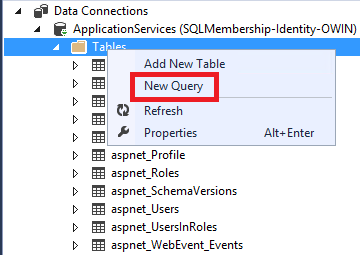
2. In the query window, copy and paste the entire SQL script from the Migrations.sql file. Run the script file by hitting the 'Execute' arrow button.

    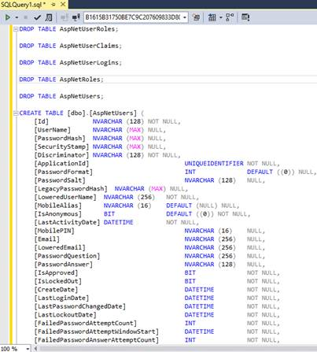

    Refresh the Server Explorer window. Five new tables are created in the database.

    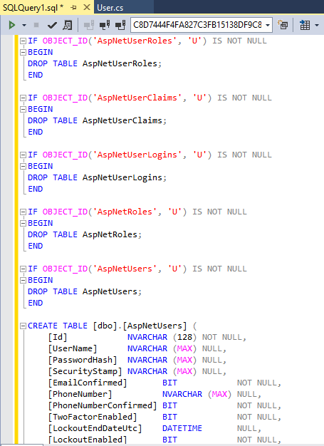

    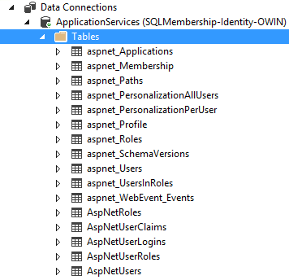

    Below is how the information in the SQL membership tables are mapped to the new Identity system.

    aspnet\_Roles --&gt; AspNetRoles

    asp\_netUsers and asp\_netMembership --&gt; AspNetUsers

    aspnet\_UserInRoles --&gt; AspNetUserRoles

    As explained in the above section, the AspNetUserClaims and AspNetUserLogins tables are empty. The 'Discriminator' field in the AspNetUser table should match the model class name which is defined as a next step. Also the PasswordHash column is in the form 'encrypted password |password salt|password format'. This enables you to use special SQL membership crypto logic so that you can reuse old passwords. That is explained in later in the article.

### Creating models and membership pages

As mentioned earlier, the Identity feature uses Entity Framework to talk to the database for storing account information by default. To work with existing data in the table, we need to create model classes which map back to the tables and hook them up in the Identity system. As part of the Identity contract, the model classes should either implement the interfaces defined in the Identity.Core dll or can extend the existing implementation of these interfaces available in Microsoft.AspNet.Identity.EntityFramework.

In our sample, the AspNetRoles, AspNetUserClaims, AspNetLogins and AspNetUserRole tables have columns that are similar to the existing implementation of the Identity system. Hence we can reuse the existing classes to map to these tables. The AspNetUser table has some additional columns which are used to store additional information from the SQL membership tables. This can be mapped by creating a model class that extend the existing implementation of 'IdentityUser' and add the additional properties.

1. Createa Models folder in the project and add a class User. The name of the class should match the data added in the 'Discriminator' column of 'AspnetUsers' table.

    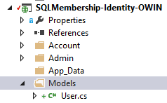

    The User class should extend the IdentityUser class found in the *Microsoft.AspNet.Identity.EntityFramework* dll. Declare the properties in class that map back to the AspNetUser columns. The properties ID, Username, PasswordHash and SecurityStamp are defined in the IdentityUser and so are omitted. Below is the code for the User class that has all the properties

    [!code-csharp[Main](migrating-an-existing-website-from-sql-membership-to-aspnet-identity/samples/sample3.cs)]
2. An Entity Framework DbContext class is required in order to persist data in models back to tables and retrieve data from tables to populate the models. *Microsoft.AspNet.Identity.EntityFramework* dll defines the IdentityDbContext class which interacts with the Identity tables to retrieve and store information. The IdentityDbContext&lt;tuser&gt; takes a 'TUser' class which can be any class that extends the IdentityUser class.

    Create a new class ApplicationDBContext that extends IdentityDbContext under the 'Models' folder, passing in the 'User' class created in step 1

    [!code-csharp[Main](migrating-an-existing-website-from-sql-membership-to-aspnet-identity/samples/sample4.cs)]
3. User management in the new Identity system is done using the UserManager&lt;tuser&gt; class defined in the *Microsoft.AspNet.Identity.EntityFramework* dll. We need to create a custom class that extends UserManager, passing in the 'User' class created in step 1.

    In the Models folder create a new class UserManager that extends UserManager&lt;user&gt;

    [!code-csharp[Main](migrating-an-existing-website-from-sql-membership-to-aspnet-identity/samples/sample5.cs)]
4. The passwords of the users of the application are encrypted and stored in the database. The crypto algorithm used in SQL membership is different from the one in the new Identity system. To reuse old passwords we need to selectively decrypt passwords when old users log in using the SQL memberships algorithm while using the crypto algorithm in Identity for the new users.

    The UserManager class has a property 'PasswordHasher' which stores an instance of a class that implements the 'IPasswordHasher' interface. This is used to encrypt/decrypt passwords during user authentication transactions. In the UserManager class defined in step 3, create a new class SQLPasswordHasher and copy the below code.

    [!code-csharp[Main](migrating-an-existing-website-from-sql-membership-to-aspnet-identity/samples/sample6.cs)]

    Resolve the compilation errors by importing the System.Text and System.Security.Cryptography namespaces.

    The EncodePassword method encrypts the password according to the default SQL membership crypto implementation. This is taken from the System.Web dll. If the old app used a custom implementation then it should be reflected here. We need to define two other methods *HashPassword* and *VerifyHashedPassword* that use the *EncodePassword* method to hash a given password or verify a plain text password with the one existing in the database.

    The SQL membership system used PasswordHash, PasswordSalt and PasswordFormat to hash the password entered by users when they register or change their password. During the migration all the three fields are stored in the PasswordHash column in the AspNetUser table separated by the '|' character. When a user logs in and the password has these fields, we use the SQL membership crypto to check the password; otherwise we use the Identity system's default crypto to verify the password. This way old users would not have to change their passwords once the app is migrated.
5. Declare the constructor for the UserManager class and pass this as the SQLPasswordHasher to the property in the constructor.

    [!code-csharp[Main](migrating-an-existing-website-from-sql-membership-to-aspnet-identity/samples/sample7.cs)]

### Create new account management pages

The next step in the migration is to add account management pages that will let a user register and log in. The old account pages from SQL membership use controls that don't work with the new Identity system. To add the new user management pages follow the tutorial at this link [https://www.asp.net/identity/overview/getting-started/adding-aspnet-identity-to-an-empty-or-existing-web-forms-project](../getting-started/adding-aspnet-identity-to-an-empty-or-existing-web-forms-project.md) starting from the step 'Adding Web Forms for registering users to your application' since we have already created the project and added the NuGet packages.

We need to make some changes for the sample to work with the project we have here.

- The Register.aspx.cs and Login.aspx.cs code behind classes use the `UserManager` from the Identity packages to create a User. For this example use the UserManager added in the Models folder by following the steps mentioned earlier.
- Use the User class created instead of the IdentityUser in Register.aspx.cs and Login.aspx.cs code behind classes. This hooks in our custom user class into the Identity system.
- The part to create the database can be skipped.
- The developer needs to set the ApplicationId for the new user to match the current application ID. This can be done by querying the ApplicationId for this application before a user object is created in the Register.aspx.cs class and setting it before creating user. 

    Example:

    Define a method in Register.aspx.cs page to query the aspnet\_Applications table and get the application Id according to application name

    [!code-csharp[Main](migrating-an-existing-website-from-sql-membership-to-aspnet-identity/samples/sample8.cs)]

    Now get set this on the user object

    [!code-csharp[Main](migrating-an-existing-website-from-sql-membership-to-aspnet-identity/samples/sample9.cs)]

Use the old username and password to login an existing user. Use the Register page to create a new user. Also verify that the users are in roles as expected.

Porting to the Identity system helps the user add Open Authentication (OAuth) to the application. Please refer to the sample [here](https://aspnet.codeplex.com/SourceControl/latest#Samples/Identity/SQLMembership-Identity-OWIN/) which has OAuth enabled.

## Next Steps

In this tutorial we showed how to port users from SQL membership to ASP.NET Identity, but we didn't port Profile data. In the next tutorial we'll look into porting Profile data from SQL membership to the new Identity system.

You can leave feedback at the bottom of this article.

*Thanks to Tom Dykstra and Rick Anderson for reviewing the article.*