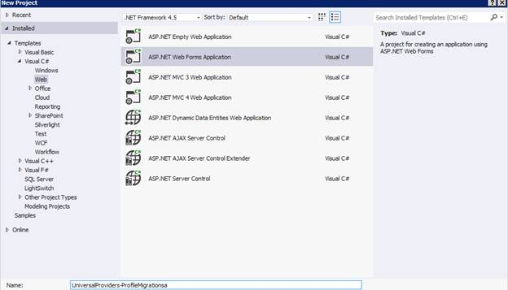
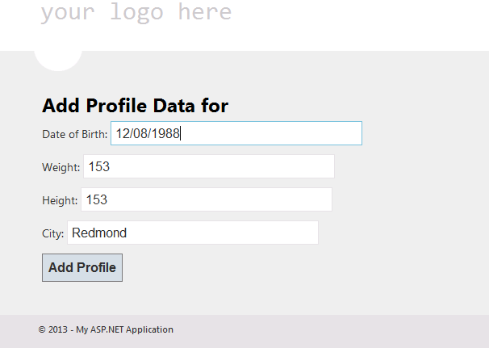
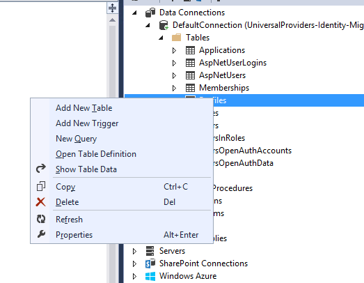
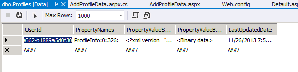
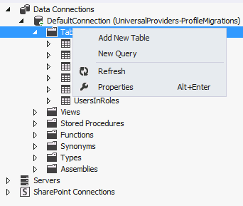
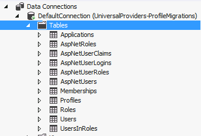
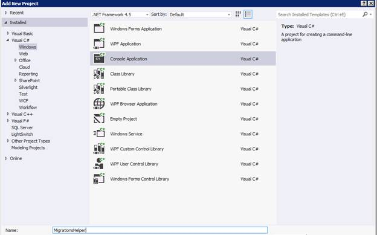
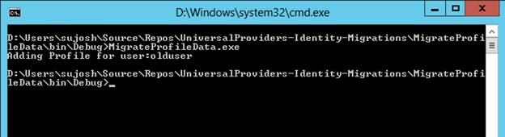

[Edit .md file](C:\Projects\msc\dev\Msc.Www\Web.ASP\App_Data\github\identity\overview\migrations\migrating-universal-provider-data-for-membership-and-user-profiles-to-aspnet-identity.md) | [Edit dev content](http://www.aspdev.net/umbraco#/content/content/edit/52995) | [View dev content](http://docs.aspdev.net/tutorials/identity/overview/migrations/migrating-universal-provider-data-for-membership-and-user-profiles-to-aspnet-identity.html) | [View prod content](http://www.asp.net/identity/overview/migrations/migrating-universal-provider-data-for-membership-and-user-profiles-to-aspnet-identity) | Picker: 53005

Migrating Universal Provider Data for Membership and User Profiles to ASP.NET Identity (C#)
====================
by [Pranav Rastogi](https://github.com/rustd), [Rick Anderson](https://github.com/Rick-Anderson), [Robert McMurray](https://github.com/rmcmurray), [Suhas Joshi](https://github.com/suhasj)

> This tutorial describes the steps that are necessary to migrate user and role data and user profile data created using Universal Providers of an existing application to the ASP.NET Identity model. The approach mentioned here to migrate user profile data can be used in an application with SQL membership as well.

With the release of Visual Studio 2013, the ASP.NET team introduced a new ASP.NET Identity system, and you can read more about that release [here](../../index.md). Following up on the article to migrate web applications from [SQL Membership to the new Identity system](migrating-an-existing-website-from-sql-membership-to-aspnet-identity.md), this article illustrates the steps to migrate existing applications that follow the Providers model for user and role management to the new Identity model. The focus of this tutorial will be primarily on migrating the user profile data to seamlessly hook it into the new system. Migrating user and role information is similar for SQL membership. The approach followed to migrate profile data can be used in an application with SQL membership as well.

As an example, we will start with a web app created using Visual Studio 2012 which uses the Providers model. We'll then add code for profile management, register a user, add profile data for the users, migrate the database schema, and then change the application to use the Identity system for user and role management. As a test of migration, users created using Universal Providers should be able to log in and new users should be able to register.

> [!NOTE] You can find the complete sample at [https://github.com/suhasj/UniversalProviders-Identity-Migrations](https://github.com/suhasj/UniversalProviders-Identity-Migrations).

## Profile data migration summary

Before starting with the migrations, let us look at the experience of storing profile data in the Providers model. Profile data for application users can be stored in multiple ways, the most common among them being using the inbuilt profile providers shipped along with the Universal Providers. The steps would include

1. Add a class that has properties used to store Profile data.
2. Add a class that extends 'ProfileBase' and implements methods to get the above profile data for the user.
3. Enable using default profile providers in the *web.config* file and define the class declared in step #2 to be used in accessing profile information.

The profile information is stored as serialized xml and binary data in the 'Profiles' table in the database.

After migrating the application to use the new ASP.NET Identity system, the profile information is deserialized and stored as properties on the user class. Each property can then be mapped onto columns in the user table. The advantage here is that the properties can be worked on directly using the user class in addition to not having to serialize/deserialize data information each time when accessing it.

## Getting Started

1. Create a new ASP.NET 4.5 Web Forms application in Visual Studio 2012. The current sample uses the Web Forms template, but you could use MVC Application as well.  
    
2. Create a new folder 'Models' to store profile information  
    
3. As an example, let us store the date of birth, city, height and weight of the user in profile. The height and weight are stored as a custom class called 'PersonalStats'. To store and retrieve the profile, we need a class that extends 'ProfileBase'. Let's create a new class 'AppProfile' to get and store profile information.

        public class ProfileInfo
        {
            public ProfileInfo()
            {
                UserStats = new PersonalStats();
            }
            public DateTime? DateOfBirth { get; set; }
            public PersonalStats UserStats { get; set; }
            public string City { get; set; }
        }
        
        public class PersonalStats
        {
            public int? Weight { get; set; }
            public int? Height { get; set; }
        }
        
        public class AppProfile : ProfileBase
        {
            public ProfileInfo ProfileInfo
            {
                get { return (ProfileInfo)GetPropertyValue("ProfileInfo"); }
            }
            public static AppProfile GetProfile()
            {
                return (AppProfile)HttpContext.Current.Profile;
            }
            public static AppProfile GetProfile(string userName)
            {
                return (AppProfile)Create(userName);
            }
        }
4. Enable profile in the *web.config* file. Enter the class name to be used to store/retrieve user information created in step #3.

        <profile defaultProvider="DefaultProfileProvider" enabled="true"
            inherits="UniversalProviders_ProfileMigrations.Models.AppProfile">
          <providers>
            .....
          </providers>
        </profile>
5. Add a web forms page in 'Account' folder to get the profile data from the user and store it. Right click on project and select 'Add new Item'. Add a new webforms page with master page 'AddProfileData.aspx'. Copy the following in the 'MainContent' section:

        <h2> Add Profile Data for <%# User.Identity.Name %></h2>
        <asp:Label Text="" ID="Result" runat="server" />
        

            Date of Birth:
            <asp:TextBox runat="server" ID="DateOfBirth"/>
        

        

            Weight:
            <asp:TextBox runat="server" ID="Weight"/>
        

        

            Height:
            <asp:TextBox runat="server" ID="Height"/>
        

        

            City:
            <asp:TextBox runat="server" ID="City"/>
        

        

            <asp:Button Text="Add Profile" ID="Add" OnClick="Add_Click" runat="server" />
        

 Add the following code in the code behind:

        protected void Add_Click(object sender, EventArgs e)
        {
            AppProfile profile = AppProfile.GetProfile(User.Identity.Name);
            profile.ProfileInfo.DateOfBirth = DateTime.Parse(DateOfBirth.Text);
            profile.ProfileInfo.UserStats.Weight = Int32.Parse(Weight.Text);
            profile.ProfileInfo.UserStats.Height = Int32.Parse(Height.Text);
            profile.ProfileInfo.City = City.Text;
            profile.Save();
        }

 Add the namespace under which AppProfile class is defined to remove the compilation errors.
6. Run the app and create a new user with username '**olduser'.** Navigate to the 'AddProfileData' page and add profile information for the user.  
    

You can verify that the data is stored as serialized xml in the 'Profiles' table using the Server Explorer window. In Visual Studio, from 'View' menu, choose 'Server Explorer'. There should be a data connection for the database defined in the *web.config* file. Clicking on the data connection shows different sub categories. Expand 'Tables' to show the different tables in your database, then right click on 'Profiles' and choose 'Show Table Data' to view the profile data stored in the Profiles table.

## Migrating database schema

To make the existing database work with the Identity system, we need to update the schema in the Identity database to support the fields we added to the original database. This can be done using SQL scripts to create new tables and copy the existing information. In the 'Server Explorer' window, expand the 'DefaultConnection' to display the tables. Right click Tables and select 'New Query'

Paste the SQL script from [https://raw.github.com/suhasj/UniversalProviders-Identity-Migrations/master/Migration.txt](https://raw.github.com/suhasj/UniversalProviders-Identity-Migrations/master/Migration.txt) and run it. If the 'DefaultConnection' is refreshed, we can see that the new tables are added. You can check the data inside the tables to see that the information has been migrated.

## Migrating the application to use ASP.NET Identity

1. Install the Nuget packages needed for ASP.NET Identity:

    - <tt>Microsoft.AspNet.Identity.EntityFramework</tt>
    - <tt>Microsoft.AspNet.Identity.Owin</tt>
    - <tt>Microsoft.Owin.Host.SystemWeb</tt>
    - <tt>Microsoft.Owin.Security.Facebook</tt>
    - <tt>Microsoft.Owin.Security.Google</tt>
    - <tt>Microsoft.Owin.Security.MicrosoftAccount</tt>
    - <tt>Microsoft.Owin.Security.Twitter</tt>

 More information on managing Nuget packages can be found     [here](http://docs.nuget.org/docs/start-here/Managing-NuGet-Packages-Using-The-Dialog)
2. To work with existing data in the table, we need to create model classes which map back to the tables and hook them up in the Identity system. As part of the Identity contract, the model classes should either implement the interfaces defined in the Identity.Core dll or can extend the existing implementation of these interfaces available in Microsoft.AspNet.Identity.EntityFramework. We will be using the existing classes for role, user logins and user claims. We need to use a custom user for our sample. Right click on the project and create new folder 'IdentityModels'. Add a new 'User' class as shown below:

        using Microsoft.AspNet.Identity.EntityFramework;
        using System;
        using System.Collections.Generic;
        using System.Linq;
        using System.Web;
        using UniversalProviders_ProfileMigrations.Models;
        
        namespace UniversalProviders_Identity_Migrations
        {
            public class User : IdentityUser
            {
                public User()
                {
                    CreateDate = DateTime.UtcNow;
                    IsApproved = false;
                    LastLoginDate = DateTime.UtcNow;
                    LastActivityDate = DateTime.UtcNow;
                    LastPasswordChangedDate = DateTime.UtcNow;
                    Profile = new ProfileInfo();
                }
        
                public System.Guid ApplicationId { get; set; }
                public bool IsAnonymous { get; set; }
                public System.DateTime? LastActivityDate { get; set; }
                public string Email { get; set; }
                public string PasswordQuestion { get; set; }
                public string PasswordAnswer { get; set; }
                public bool IsApproved { get; set; }
                public bool IsLockedOut { get; set; }
                public System.DateTime? CreateDate { get; set; }
                public System.DateTime? LastLoginDate { get; set; }
                public System.DateTime? LastPasswordChangedDate { get; set; }
                public System.DateTime? LastLockoutDate { get; set; }
                public int FailedPasswordAttemptCount { get; set; }
                public System.DateTime? FailedPasswordAttemptWindowStart { get; set; }
                public int FailedPasswordAnswerAttemptCount { get; set; }
                public System.DateTime? FailedPasswordAnswerAttemptWindowStart { get; set; }
                public string Comment { get; set; }
                public ProfileInfo Profile { get; set; }
            }
        }

 Notice that the 'ProfileInfo' is now a property on the user class. Hence we can use the user class to directly work with profile data.

Copy the files in the **IdentityModels** and **IdentityAccount** folders from the download source ( [https://github.com/suhasj/UniversalProviders-Identity-Migrations/tree/master/UniversalProviders-Identity-Migrations](https://github.com/suhasj/UniversalProviders-Identity-Migrations/tree/master/UniversalProviders-Identity-Migrations) ). These have the remaining model classes and the new pages needed for user and role management using the ASP.NET Identity APIs. The approach used is similar to the SQL Membership and the detailed explanation can be found [here](migrating-an-existing-website-from-sql-membership-to-aspnet-identity.md).

## Copying Profile data to the new tables

As mentioned earlier, we need to deserialize the xml data in the Profiles tables and store it in the columns of the AspNetUsers table. The new columns were created in the users table in the previous step so all that is left is to populate those columns with the necessary data. To do this, we will use a console application which is run once to populate the newly created columns in the users table.

1. Create a new console application in the exiting solution.  
    
2. Install the latest version of the Entity Framework package.
3. Add the web application created above as a reference to the console application. To do this right click on Project, then 'Add References', then Solution, then click on the project and click OK.
4. Copy the below code in the Program.cs class. This logic reads profile data for each user, serializes it as 'ProfileInfo' object and stores it back to the database.

        public class Program
        {
            var dbContext = new ApplicationDbContext();
            foreach (var profile in dbContext.Profiles)
            {
                var stringId = profile.UserId.ToString();
                var user = dbContext.Users.Where(x => x.Id == stringId).FirstOrDefault();
                Console.WriteLine("Adding Profile for user:" + user.UserName);
                var serializer = new XmlSerializer(typeof(ProfileInfo));
                var stringReader = new StringReader(profile.PropertyValueStrings);
                var profileData = serializer.Deserialize(stringReader) as ProfileInfo;
                if (profileData == null)
                {
                    Console.WriteLine("Profile data deserialization error for user:" + user.UserName);
                }
                else
                {
                    user.Profile = profileData;
                }
            }
            dbContext.SaveChanges();
        }

 Some of the models used are defined in the 'IdentityModels' folder of the web application project, so you must include the corresponding namespaces.
5. The above code works on the database file in the App\_Data folder of the web application project created in the previous steps. To reference that, update the connection string in the app.config file of the console application with the connection string in the web.config of the web application. Also provide the complete physical path in the 'AttachDbFilename' property.
6. Open a command prompt and navigate to the bin folder of the above console application. Run the executable and review the log output as shown in the following image.  
    
7. Open the 'AspNetUsers' table in the Server Explorer and verify the data in the new columns that hold the properties. They should be updated with the corresponding property values.

## Verify functionality

Use the newly added membership pages that are implemented using ASP.NET Identity to login a user from the old database. The user should be able to log in using the same credentials. Try the other functionalities like adding OAuth, creating a new user, changing a password, adding roles, add users to roles, etc.

The Profile data for the old user and the new users should be retrieved and stored in the users table. The old table should no longer be referenced.

## Conclusion

The article described the process of migrating web applications that used the provider model for membership to ASP.NET Identity. The article additionally outlined migrating profile data for users to be hooked into the Identity system. Please leave comments below for questions and issues encountered when you migrate your app.

*Thanks to Rick Anderson and Robert McMurray for reviewing the article.*