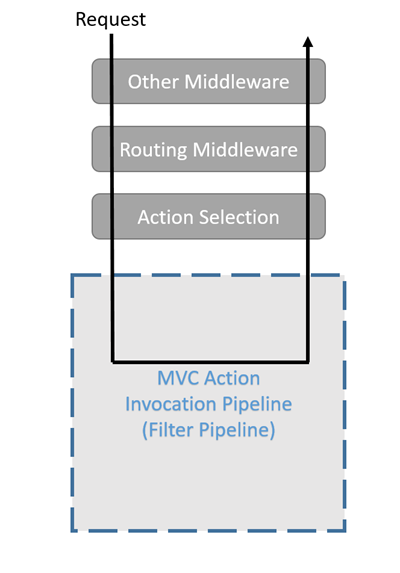
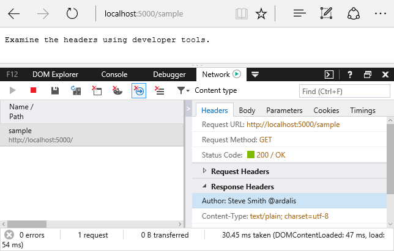

Filters
=======

By `Steve Smith`_

*Filters* in ASP.NET MVC allow you to run code before or after a particular stage in the execution pipeline. Filters can be configured globally, per-controller, or per-action.

.. contents:: Sections
    :local:
    :depth: 1

`View or download sample from GitHub <https://github.com/aspnet/Docs/tree/master/aspnet/mvc/controllers/filters/sample>`_.

How do filters work?
--------------------

Each filter type is executed at a different stage in the pipeline, and thus has its own set of intended scenarios. Choose what type of filter to create based on the task you need it to perform, and where in the request pipeline it executes. Filters run within the MVC Action Invocation Pipeline, sometimes referred to as the *Filter Pipeline*, which runs after MVC selects the action to execute.

Different filter types run at different points within the pipeline. Some filters, like authorization filters, only run before the next stage in the pipeline, and take no action afterward. Other filters, like action filters, can execute both before and after other parts of the pipeline execute, as shown below.

.. image:: filters/_static/filter-pipeline-2.png

Selecting a Filter
^^^^^^^^^^^^^^^^^^

:ref:`Authorization filters <authorization-filters>` are used to determine whether the current user is authorized for the request being made.

:ref:`Resource filters <resource-filters>` are the first filter to handle a request after authorization, and the last one to touch the request as it is leaving the filter pipeline. They're especially useful to implement caching or otherwise short-circuit the filter pipeline for performance reasons.

:ref:`Action filters <action-filters>` wrap calls to individual action method calls, and can manipulate the arguments passed into an action as well as the action result returned from it.

:ref:`Exception filters <exception-filters>` are used to apply global policies to unhandled exceptions in the MVC app.

:ref:`Result filters <result-filters>` wrap the execution of individual action results, and only run when the action method has executed successfully. They are ideal for logic that must surround view execution or formatter execution.

Implementation
^^^^^^^^^^^^^^

All filters support both synchronous and asynchronous implementations through different interface definitions. Choose the sync or async variant depending on the kind of task you need to perform. They are interchangeable from the framework's perspective.

Synchronous filters define both an On\ *Stage*\ Executing and On\ *Stage*\ Executed method (with noted exceptions). The On\ *Stage*\ Executing method will be called before the event pipeline stage by the Stage name, and the On\ *Stage*\ Executed method will be called after the pipeline stage named by the Stage name.

.. literalinclude:: filters/sample/src/FiltersSample/Filters/SampleActionFilter.cs
  :language: c#
  :emphasize-lines: 6,8,13

Asynchronous filters define a single On\ *Stage*\ ExecutionAsync method that will surround execution of the pipeline stage named by Stage. The On\ *Stage*\ ExecutionAsync method is provided a *Stage*\ ExecutionDelegate delegate which will execute the pipeline stage named by Stage when invoked and awaited.

.. literalinclude:: filters/sample/src/FiltersSample/Filters/SampleAsyncActionFilter.cs
  :language: c#
  :emphasize-lines: 6,8-10

.. note:: You should only implement *either* the synchronous or the async version of a filter interface, not both. If you need to perform async work in the filter, implement the async interface. Otherwise, implement the synchronous interface. The framework will check to see if the filter implements the async interface first, and if so, it will call it. If not, it will call the synchronous interface's method(s). If you were to implement both interfaces on one class, only the async method would be called by the framework. Also, it doesn't matter whether your action is async or not, your filters can be synchronous or async independent of the action.

Filter Scopes
^^^^^^^^^^^^^

Filters can be *scoped* at three different levels. You can add a particular filter to a particular action as an attribute. You can add a filter to all actions within a controller by applying an attribute at the controller level. Or you can register a filter globally, to be run with every MVC action.

Global filters are added in the ``ConfigureServices`` method in ``Startup``, when configuring MVC:

.. literalinclude:: filters/sample/src/FiltersSample/Startup.cs
  :language: c#
  :emphasize-lines: 5-6
  :lines: 11-20
  :dedent: 8

Filters can be added by type, or an instance can be added. If you add an instance, that instance will be used for every request. If you add a type, it will be type-activated, meaning an instance will be created for each request and any constructor dependencies will be populated by DI. Adding a filter by type is equivalent to ``filters.Add(new TypeFilterAttribute(typeof(MyFilter)))``.

It's often convenient to implement filter interfaces as *Attributes*. Filter attributes are applied to controllers and action methods. The framework includes built-in attribute-based filters that you can subclass and customize. For example, the following filter inherits from `ResultFilterAttribute <https://docs.asp.net/projects/api/en/latest/autoapi/Microsoft/AspNetCore/Mvc/Filters/ResultFilterAttribute/index.html>`_, and overrides its ``OnResultExecuting`` method to add a header to the response.

.. _add-header-attribute:

.. literalinclude:: filters/sample/src/FiltersSample/Filters/AddHeaderAttribute.cs
  :language: c#
  :emphasize-lines: 5,16

Attributes allow filters to accept arguments, as shown in the example above. You would add this attribute to a controller or action method and specify the name and value of the HTTP header you wished to add to the response:

.. literalinclude:: filters/sample/src/FiltersSample/Controllers/SampleController.cs
  :language: c#
  :emphasize-lines: 1
  :lines: 6-12,25
  :dedent: 4

The result of the ``Index`` action is shown below - the response headers are displayed on the bottom right.

Several of the filter interfaces have corresponding attributes that can be used as base classes for custom implementations.

Filter attributes:

- :dn:cls:`~Microsoft.AspNetCore.Mvc.Filters.ActionFilterAttribute` 
- :dn:cls:`~Microsoft.AspNetCore.Mvc.Filters.ExceptionFilterAttribute` 
- :dn:cls:`~Microsoft.AspNetCore.Mvc.Filters.ResultFilterAttribute` 
- :dn:cls:`~Microsoft.AspNetCore.Mvc.FormatFilterAttribute` 
- :dn:cls:`~Microsoft.AspNetCore.Mvc.ServiceFilterAttribute` 
- :dn:cls:`~Microsoft.AspNetCore.Mvc.TypeFilterAttribute`

Cancellation and Short Circuiting
^^^^^^^^^^^^^^^^^^^^^^^^^^^^^^^^^

You can short-circuit the filter pipeline at any point by setting the ``Result`` property on the context parameter provided to the filter method. For instance, the following ``ShortCircuitingResourceFilter`` will prevent any other filters from running later in the pipeline, including any action filters.

.. _short-circuiting-resource-filter:

.. literalinclude:: filters/sample/src/FiltersSample/Filters/ShortCircuitingResourceFilterAttribute.cs
  :language: c#
  :emphasize-lines: 12-15

In the following code, both the ``ShortCircuitingResourceFilter`` and the ``AddHeader`` filter target the ``SomeResource`` action method. However, because the ``ShortCircuitingResourceFilter`` runs first and short-circuits the rest of the pipeline, the ``AddHeader`` filter never runs for the ``SomeResource`` action. This behavior would be the same if both filters were applied at the action method level, provided the ``ShortCircuitingResourceFilter`` ran first (see :ref:`Ordering <ordering>`).

.. literalinclude:: filters/sample/src/FiltersSample/Controllers/SampleController.cs
  :language: c#
  :emphasize-lines: 1,4
  :lines: 6-8, 14-19
  :dedent: 4 

Configuring Filters
-------------------

Global filters are configured within ``Startup.cs``. Attribute-based filters that do not require any dependencies can simply inherit from an existing attribute of the appropriate type for the filter in question. To create a filter *without* global scope that requires dependencies from DI, apply the ``ServiceFilterAttribute`` or ``TypeFilterAttribute`` attribute to the controller or action.

Dependency Injection
^^^^^^^^^^^^^^^^^^^^

Filters that are implemented as attributes and added directly to controller classes or action methods cannot have constructor dependencies provided by :doc:`dependency injection </fundamentals/dependency-injection>` (DI). This is because attributes must have their constructor parameters supplied where they are applied. This is a limitation of how attributes work.

However, if your filters have dependencies you need to access from DI, there are several supported approaches. You can apply your filter to a class or action method using

- :dn:cls:`~Microsoft.AspNetCore.Mvc.ServiceFilterAttribute` 
- :dn:cls:`~Microsoft.AspNetCore.Mvc.TypeFilterAttribute` 
- :dn:iface:`~Microsoft.AspNetCore.Mvc.Filters.IFilterFactory` implemented on your attribute

A ``TypeFilter`` will instantiate an instance, using services from DI for its dependencies. A ``ServiceFilter`` retrieves an instance of the filter from DI. The following example demonstrates using a ``ServiceFilter``:

.. literalinclude:: filters/sample/src/FiltersSample/Controllers/HomeController.cs
  :language: c#
  :emphasize-lines: 1
  :lines: 8-12
  :dedent: 8

Using ``ServiceFilter`` without registering the filter type in ``ConfigureServices``, throws the following exception:

.. code-block:: none

  System.InvalidOperationException: No service for type 
  'FiltersSample.Filters.AddHeaderFilterWithDI' has been registered.

To avoid this exception, you must register the ``AddHeaderFilterWithDI`` type in ``ConfigureServices``:

.. literalinclude:: filters/sample/src/FiltersSample/Startup.cs
  :language: c#
  :emphasize-lines: 1
  :lines: 19
  :dedent: 12

``ServiceFilterAttribute`` implements ``IFilterFactory``, which exposes a single method for creating an ``IFilter`` instance. In the case of ``ServiceFilterAttribute``, the ``IFilterFactory`` interface's ``CreateInstance`` method is implemented to load the specified type from the services container (DI).

``TypeFilterAttribute`` is very similar to ``ServiceFilterAttribute`` (and also implements ``IFilterFactory``), but its type is not resolved directly from the DI container. Instead, it instantiates the type using a ``Microsoft.Extensions.DependencyInjection.ObjectFactory``.

 Because of this difference, types that are referenced using the ``TypeFilterAttribute`` do not need to be registered with the container first (but they will still have their dependencies fulfilled by the container). Also, ``TypeFilterAttribute`` can optionally accept constructor arguments for the type in question. The following example demonstrates how to pass arguments to a type using ``TypeFilterAttribute``:

.. literalinclude:: filters/sample/src/FiltersSample/Controllers/HomeController.cs
  :language: none
  :emphasize-lines: 1-2
  :lines: 20-25
  :dedent: 8

If you have a simple filter that doesn't require any arguments, but which has constructor dependencies that need to be filled by DI, you can inherit from ``TypeFilterAttribute``, allowing you to use your own named attribute on classes and methods (instead of ``[TypeFilter(typeof(FilterType))]``). The following filter shows how this can be implemented:

.. literalinclude:: filters/sample/src/FiltersSample/Filters/SampleActionFilterAttribute.cs
  :language: c#
  :emphasize-lines: 1, 3, 7
  :lines: 7-38
  :dedent: 4

This filter can be applied to classes or methods using the ``[SampleActionFilter]`` syntax, instead of having to use ``[TypeFilter]`` or ``[ServiceFilter]``.

.. note:: Avoid creating and using filters purely for logging purposes, since the :doc:`built-in framework logging features </fundamentals/logging>` should already provide what you need for logging. If you're going to add logging to your filters, it should focus on business domain concerns or behavior specific to your filter, rather than MVC actions or other framework events.  

``IFilterFactory`` implements ``IFilter``. Therefore, an ``IFilterFactory`` instance can be used as an ``IFilter`` instance anywhere in the filter pipeline. When the framework prepares to invoke the filter, attempts to cast it to an ``IFilterFactory``. If that cast succeeds, the ``CreateInstance`` method is called to create the ``IFilter`` instance that will be invoked. This provides a very flexible design, since the precise filter pipeline does not need to be set explicitly when the application starts.

You can implement ``IFilterFactory`` on your own attribute implementations as another approach to creating filters:

.. literalinclude:: filters/sample/src/FiltersSample/Filters/AddHeaderWithFactoryAttribute.cs
  :language: c#
  :emphasize-lines: 1,4-7
  :lines: 6-26
  :dedent: 4

.. _ordering:

Ordering
^^^^^^^^

Filters can be applied to action methods or controllers (via attribute) or added to the global filters collection. Scope also generally determines ordering. The filter closest to the action runs first; generally you get overriding behavior without having to explicitly set ordering. This is sometimes referred to as "Russian doll" nesting, as each increase in scope is wrapped around the previous scope, like a `nesting doll <https://en.wikipedia.org/wiki/Matryoshka_doll>`_.

In addition to scope, filters can override their sequence of execution by implementing :dn:iface:`~Microsoft.AspNetCore.Mvc.Filters.IOrderedFilter`. This interface simply exposes an ``int`` ``Order`` property, and filters execute in ascending numeric order based on this property. All of the built-in filters, including ``TypeFilterAttribute`` and ``ServiceFilterAttribute``, implement ``IOrderedFilter``, so you can specify the order of filters when you apply the attribute to a class or method. By default, the ``Order`` property is 0 for all of the built-in filters, so scope is used as a tie-breaker and (unless ``Order`` is set to a non-zero value) is the determining factor.

Every controller that inherits from the ``Controller`` base class includes ``OnActionExecuting`` and ``OnActionExecuted`` methods. These methods wrap the filters that run for a given action, running first and last. The scope-based order, assuming no ``Order`` has been set for any filter, is:

#. The Controller ``OnActionExecuting``
#. The Global filter ``OnActionExecuting``
#. The Class filter ``OnActionExecuting``
#. The Method filter ``OnActionExecuting``
#. The Method filter ``OnActionExecuted``
#. The Class filter ``OnActionExecuted``
#. The Global filter ``OnActionExecuted``
#. The Controller ``OnActionExecuted``

.. note:: ``IOrderedFilter`` trumps scope when determining the order in which filters will run. Filters are sorted first by order, then scope is used to break ties. Order defaults to 0 if not set.

To modify the default, scope-based order, you could explicitly set the ``Order`` property of a class-level or method-level filter. For example, adding ``Order=-1`` to a method level attribute:

.. code-block:: c#

	[MyFilter(Name = "Method Level Attribute", Order=-1)]

In this case, a value of less than zero would ensure this filter ran before both the Global and Class level filters (assuming their ``Order`` property was not set).

The new order would be:

#. The Controller ``OnActionExecuting``
#. The Method filter ``OnActionExecuting``
#. The Global filter ``OnActionExecuting``
#. The Class filter ``OnActionExecuting``
#. The Class filter ``OnActionExecuted``
#. The Global filter ``OnActionExecuted``
#. The Method filter ``OnActionExecuted``
#. The Controller ``OnActionExecuted``

.. note:: The ``Controller`` class's methods always run before and after all filters. These methods are not implemented as ``IFilter`` instances and do not participate in the ``IFilter`` ordering algorithm.

.. _authorization-filters:

Authorization Filters
---------------------

*Authorization Filters* control access to action methods, and are the first filters to be executed within the filter pipeline. They have only a before stage, unlike most filters that support before and after methods. You should only write a custom authorization filter if you are writing your own authorization framework. Note that you should not throw exceptions within authorization filters, since nothing will handle the exception (exception filters won't handle them). Instead, issue a challenge or find another way.

Learn more about :doc:`/security/authorization/index`.

.. _resource-filters:

Resource Filters
----------------

*Resource Filters* implement either the ``IResourceFilter`` or ``IAsyncResourceFilter`` interface, and their execution wraps most of the filter pipeline (only :ref:`authorization-filters` run before them - all other filters and action processing happens between their ``OnResourceExecuting`` and ``OnResourceExecuted`` methods). Resource filters are especially useful if you need to short-circuit most of the work a request is doing. Caching would be one example use case for a resource filter, since if the response is already in the cache, the filter can immediately set a result and avoid the rest of the processing for the action.

The :ref:`short circuiting resource filter <short-circuiting-resource-filter>` shown above is one example of a resource filter. A very naive cache implementation (do not use this in production) that only works with ``ContentResult`` action results is shown below:

.. literalinclude:: filters/sample/src/FiltersSample/Filters/NaiveCacheResourceFilterAttribute.cs
  :language: c#
  :emphasize-lines: 1-2,11,16-17,27,30
  :lines: 8-41
  :dedent: 4

In ``OnResourceExecuting``, if the result is already in the static dictionary cache, the ``Result`` property is set on ``context``, and the action short-circuits and returns with the cached result. In the ``OnResourceExecuted`` method, if the current request's key isn't already in use, the current ``Result`` is stored in the cache, to be used by future requests.

Adding this filter to a class or method is shown here:

.. literalinclude:: filters/sample/src/FiltersSample/Controllers/CachedController.cs
  :language: c#
  :emphasize-lines: 1-2,6
  :lines: 7-14
  :dedent: 4
  
.. _action-filters:

Action Filters
--------------

*Action Filters* implement either the ``IActionFilter`` or ``IAsyncActionFilter`` interface and their execution surrounds the execution of action methods. Action filters are ideal for any logic that needs to see the results of model binding, or modify the controller or inputs to an action method. Additionally, action filters can view and directly modify the result of an action method.

The ``OnActionExecuting`` method runs before the action method, so it can manipulate the inputs to the action by changing ``ActionExecutingContext.ActionArguments`` or manipulate the controller through ``ActionExecutingContext.Controller``. An ``OnActionExecuting`` method can short-circuit execution of the action method and subsequent action filters by setting ``ActionExecutingContext.Result``. Throwing an exception in an ``OnActionExecuting`` method will also prevent execution of the action method and subsequent filters, but will be treated as a failure instead of successful result.

The ``OnActionExecuted`` method runs after the action method and can see and manipulate the results of the action through the ``ActionExecutedContext.Result`` property. ``ActionExecutedContext.Canceled`` will be set to true if the action execution was short-circuited by another filter. ``ActionExecutedContext.Exception`` will be set to a non-null value if the action or a subsequent action filter threw an exception. Setting ``ActionExecutedContext.Exception`` to null effectively 'handles' an exception, and ``ActionExectedContext.Result`` will then be executed as if it were returned from the action method normally.

For an ``IAsyncActionFilter`` the ``OnActionExecutionAsync`` combines all the possibilities of ``OnActionExecuting`` and ``OnActionExecuted``. A call to ``await next()`` on the ``ActionExecutionDelegate`` will execute any subsequent action filters and the action method, returning an ``ActionExecutedContext``. To short-circuit inside of an ``OnActionExecutionAsync``, assign ``ActionExecutingContext.Result`` to some result instance and do not call the ``ActionExectionDelegate``.

.. _exception-filters:

Exception Filters
-----------------

*Exception Filters* implement either the ``IExceptionFilter`` or ``IAsyncExceptionFilter`` interface.

Exception filters handle unhandled exceptions, including those that occur during controller creation and :doc:`model binding </mvc/models/model-binding>`. They are only called when an exception occurs in the pipeline. They can provide a single location to implement common error handling policies within an app. The framework provides an abstract :dn:cls:`~Microsoft.AspNetCore.Mvc.Filters.ExceptionFilterAttribute` that you should be able to subclass for your needs. Exception filters are good for trapping exceptions that occur within MVC actions, but they're not as flexible as error handling middleware. Prefer middleware for the general case, and use filters only where you need to do error handling *differently* based on which MVC action was chosen.

.. tip:: One example where you might need a different form of error handling for different actions would be in an app that exposes both API endpoints and actions that return views/HTML. The API endpoints could return error information as JSON, while the view-based actions could return an error page as HTML.

Exception filters do not have two events (for before and after) - they only implement ``OnException`` (or ``OnExceptionAsync``). The ``ExceptionContext`` provided in the ``OnException`` parameter includes the ``Exception`` that occurred. If you set ``context.ExceptionHandled`` to ``true``, the effect is that you've handled the exception, so the request will proceed as if it hadn't occurred (generally returning a 200 OK status). The following filter uses a custom developer error view to display details about exceptions that occur when the application is in development:

.. literalinclude:: filters/sample/src/FiltersSample/Filters/CustomExceptionFilterAttribute.cs
  :language: c#
  :emphasize-lines: 33-34

.. _result-filters:

Result Filters
--------------

*Result Filters* implement either the ``IResultFilter`` or ``IAsyncResultFilter`` interface and their execution surrounds the execution of action results. Result filters are only executed for successful results - when the action or action filters produce an action result. Result filters are not executed when exception filters handle an exception, unless the exception filter sets ``Exception = null``.

.. note:: The kind of result being executed depends on the action in question. An MVC action returning a view would include all razor processing as part of the ``ViewResult`` being executed. An API method might perform some serialization as part of the execution of the result. Learn more about :doc:`action results </mvc/controllers/actions>`

Result filters are ideal for any logic that needs to directly surround view execution or formatter execution. Result filters can replace or modify the action result that's responsible for producing the response.

The ``OnResultExecuting`` method runs before the action result is executed, so it can manipulate the action result through ``ResultExecutingContext.Result``. An ``OnResultExecuting`` method can short-circuit execution of the action result and subsequent result filters by setting ``ResultExecutingContext.Cancel`` to true. If short-circuited, MVC will not modify the response; you should generally write to the response object directly when short-circuiting to avoid generating an empty response. Throwing an exception in an ``OnResultExecuting`` method will also prevent execution of the action result and subsequent filters, but will be treated as a failure instead of a successful result.

The ``OnResultExecuted`` method runs after the action result has executed. At this point if no exception was thrown, the response has likely been sent to the client and cannot be changed further. ``ResultExecutedContext.Canceled`` will be set to true if the action result execution was short-circuited by another filter. ``ResultExecutedContext.Exception`` will be set to a non-null value if the action result or a subsequent result filter threw an exception. Setting ``ResultExecutedContext.Exception`` to null effectively 'handles' an exception and will prevent the exeception from being rethrown by MVC later in the pipeline. If handling an exception in a result filter, consider whether or not it's appropriate to write any data to the response. If the action result throws partway through its execution, and the headers have already been flushed to the client, there's no reliable mechanism to send a failure code.

For an ``IAsyncResultFilter`` the ``OnResultExecutionAsync`` combines all the possibilities of ``OnResultExecuting`` and ``OnResultExecuted``. A call to ``await next()`` on the ``ResultExecutionDelegate`` will execute any subsequent result filters and the action result, returning a ``ResultExecutedContext``. To short-circuit inside of an ``OnResultExecutionAsync``, set ``ResultExecutingContext.Cancel`` to true and do not call the ``ResultExectionDelegate``.

You can override the built-in ``ResultFilterAttribute`` to create result filters. The :ref:`AddHeaderAttribute <add-header-attribute>` class shown above is an example of a result filter.

.. tip:: If you need to add headers to the response, do so before the action result executes. Otherwise, the response may have been sent to the client, and it will be too late to modify it. For a result filter, this means adding the header in ``OnResultExecuting`` rather than ``OnResultExecuted``.

Filters vs. Middleware
----------------------

In general, filters are meant to handle cross-cutting business and application concerns. This is often the same use case for :doc:`middleware </fundamentals/middleware>`. Filters are very similar to middleware in capability, but let you scope that behavior and insert it into a location in your app where it makes sense, such as before a view, or after model binding. Filters are a part of MVC, and have access to its context and constructs. For instance, middleware can't easily detect whether model validation on a request has generated errors, and respond accordingly, but a filter can easily do so.

To experiment with filters, `download, test and modify the sample <https://github.com/aspnet/Docs/tree/master/aspnet/mvc/controllers/filters/sample>`_.
