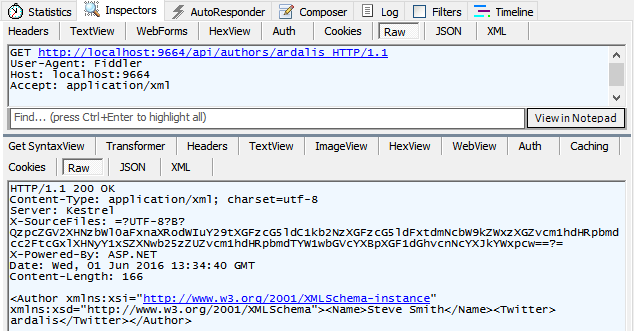
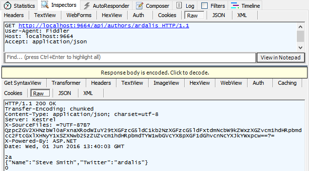

Formatting Response Data
========================

By `Steve Smith`_

ASP.NET Core MVC has built-in support for formatting response data, using fixed formats or in response to client specifications.

.. contents:: Sections
    :local:
    :depth: 1

`View or download sample from GitHub <https://github.com/aspnet/Docs/tree/master/mvc/models/formatting/sample>`_.

Format-Specific Action Results
------------------------------

Some ``ActionResult`` options are specific to a particular format, such as ``JsonResult`` and ``ContentResult`` (note string return types are simply formatted as text). Actions can return specific results that are always formatted in a particular manner. For example, returning a ``JsonResult`` will return JSON-formatted data, regardless of client preferences. Likewise, returning a ``ContentResult`` will return plain text formatted string data.

To return data using a specific result type, assuming you're inheriting from the base ``Controller`` class, it's recommended that you use the built-in helper method ``Json`` to return JSON and ``Content`` plain text. These methods check to see if the data being formatted implements ``IDisposable`` and register the object for disposal if required. Your action method should return either the specific result type (for instance, ``JsonResult``) or ``IActionResult``.

Returning JSON-formatted data:

.. literalinclude:: formatting/sample/src/ResponseFormattingSample/Controllers/Api/AuthorsController.cs
  :language: c#
  :lines: 21-26
  :emphasize-lines: 3,5
  :dedent: 8

Sample response from this action:

.. image:: formatting/_static/json-response.png

Note that the content type of the response is ``application/json``, shown both in the list of network requests and in the Response Headers section. Also note the list of options presented by the browser (in this case, Microsoft Edge) in the Accept header, in the Request Headers section. The current technique is ignoring this header; obeying it is discussed below.

To return plain text formatted data, use ``ContentResult`` and the ``Content`` helper:

.. literalinclude:: formatting/sample/src/ResponseFormattingSample/Controllers/Api/AuthorsController.cs
  :language: c#
  :lines: 47-52
  :emphasize-lines: 3,5
  :dedent: 8

A response from this action:

.. image:: formatting/_static/text-response.png

Note in this case the ``Content-Type`` returned is ``text/plain``. You can also achieve this same behavior using just a string response type:

.. literalinclude:: formatting/sample/src/ResponseFormattingSample/Controllers/Api/AuthorsController.cs
  :language: c#
  :lines: 54-59
  :emphasize-lines: 3,5
  :dedent: 8

.. tip:: For non-trivial actions with multiple return types or options (for example, different HTTP status codes based on the result of operations performed), prefer ``IActionResult`` as the return type.

Content Negotiation
-------------------

Content negotiation (*conneg* for short) occurs when the client specifies an `Accept header <https://www.w3.org/Protocols/rfc2616/rfc2616-sec14.html>`_. The default format used by ASP.NET Core MVC is JSON. Negotiation occurs automatically for ``IActionResult`` return types, including results returned using the helper methods ``Ok``, ``BadRequest``, ``Created``, etc. You can also return a model type (a class you've defined as your data transfer type) and the framework will automatically wrap it in an ``ObjectResult`` for you.

The following action method uses the ``Ok`` and ``NotFound`` helper methods:

.. literalinclude:: formatting/sample/src/ResponseFormattingSample/Controllers/Api/AuthorsController.cs
  :language: c#
  :lines: 28-38
  :emphasize-lines: 8,10
  :dedent: 8

A JSON-formatted response will be returned unless another format was requested and the server can return the requested format. You can use a tool like `Fiddler <http://www.telerik.com/fiddler>`_ to create a request that includes an Accept header, and specify another format. In that case, if the server has a *formatter* that matches the requested format, the results will be returned in that format.

.. image:: formatting/_static/fiddler-composer.png

In the above screenshot, the Fiddler Composer has been used to generate a request, specifying ``Accept: application/xml``. By default, ASP.NET Core MVC only supports JSON, so even when another format is specified, the result returned is still JSON-formatted. You'll see how to add additional formatters in the next section.

Your controller actions can return model objects, in which case ASP.NET MVC will automatically create an ``ObjectResult`` for you that wraps the object. The client will get the appropriately formatted serialized object. If the object being returned is ``null``, then the framework will return a ``204 No Content`` response.

Returning an object type:

.. literalinclude:: formatting/sample/src/ResponseFormattingSample/Controllers/Api/AuthorsController.cs
  :language: c#
  :lines: 40-45
  :emphasize-lines: 3
  :dedent: 8

In the sample, a request for a valid author alias will receive a 200 OK response with the author's data. A request for an invalid alias will receive a 204 No Content response. Screenshots showing the response in XML and JSON formats are shown below.

Content Negotiation Process
^^^^^^^^^^^^^^^^^^^^^^^^^^^

Content *negotiation* only takes place if an ``Accept`` header appears in the request. If the request contains an Accept header the framework will enumerate through the list of formatters until it finds one that can serialize the object being returned into the requested format. If no formatter is found that can support the type to be returned, then the framework will send a 406 Not Acceptable response code. If the request specifies XML, but the XML formatter has not been configured, then the JSON formatter will be used. If no header is given, the first formatter that can handle the object to be returned will be used to serialize the response. In this case, there isn't any negotiation taking place - the server is determining what format it will use.

Browsers and Content Negotiation
^^^^^^^^^^^^^^^^^^^^^^^^^^^^^^^^

Unlike typical API clients, web browsers tend to supply ``Accept`` headers that include a wide array of formats, including wildcards. By default, when the framework detects that the request is coming from a browser, it will ignore the ``Accept`` header and instead return the content in the application's configured default format (JSON unless otherwise configured). This provides a more consistent experience when using different browsers to consume APIs.

If you would prefer your application honor browser accept headers, you can configure this as part of MVC's configuration by setting ``RespectBrowserAcceptHeader`` to ``true`` in the ``ConfigureServices`` method in *Startup.cs*.

.. code-block:: c#

  services.AddMvc(options =>
  {
    options.RespectBrowserAcceptHeader = true; // false by default
  }

Configuring Formatters
----------------------

If your application needs to support additional formats beyond the default of JSON, you can add these as additional dependencies in *project.json* and configure MVC to support them. There are separate formatters for input and output. Input formatters are used by :doc:`model-binding`; output formatters are used to format API responses. You can also configure :doc:`custom-formatters`.

Configuring the JSON Formatter
^^^^^^^^^^^^^^^^^^^^^^^^^^^^^^

A common request when formatting responses using JSON is to use JavaScript-style "camel" casing (the first character of each property is lowercase, then uppercase is used to begin each additional word making up the name). Support for camel casing can be added by using the ``AddJsonOptions`` extension method when configuring MVC:

.. code-block:: c#

  services.AddMvc()
    .AddJsonOptions(o =>
      o.SerializerSettings.ContractResolver = 
        new CamelCasePropertyNamesContractResolver());

Replace the default ``SerializerSettings.ContractResolver`` with a new instance of ``CamelCasePropertyNamesContractResolver``. Before this change, an object with a property of "FirstName" and a value of "Steve" would be serialized to JSON as ``{"FirstName":"Steve"}``; after the change to use camel case, it would serialize as ``{"firstName":"Steve"}``.

Adding XML Format Support
^^^^^^^^^^^^^^^^^^^^^^^^^

To add support for XML formatting, add the "Microsoft.AspNetCore.Mvc.Formatters.Xml" package to your *project.json*'s list of dependencies.

Add the XmlSerializerFormatters to MVC's configuration in *Startup.cs*:

.. literalinclude:: formatting/sample/src/ResponseFormattingSample/Startup.cs
  :language: c#
  :lines: 30-36
  :emphasize-lines: 4
  :dedent: 8

Alternately, you can add just the output formatter:

.. code-block:: c#

  services.AddMvc(options =>
  {
    options.OutputFormatters.Add(new XmlSerializerOutputFormatter());
  });

Once you've added support for XML formatting, your API methods should return the appropriate format based on the request's ``Accept`` header, as this Fiddler example demonstrates:

You can see in the Inspectors tab that the Raw GET request was made with an ``Accept: application/xml`` header set. The response pane shows the ``Content-Type: application/xml`` header, and the ``Author`` object has been serialized to XML.

Use the Composer tab to modify the request to specify ``application/json`` in the ``Accept`` header. Execute the request, and the response will be formatted as JSON:

In this screenshot, you can see the request sets a header of ``Accept: application/json`` and the response specifies the same as its ``Content-Type``. The ``Author`` object is shown in the body of the response, in JSON format.

Forcing a Particular Format
^^^^^^^^^^^^^^^^^^^^^^^^^^^

If you would like to require the use of a particular response format, without resorting to using a return type like ``JsonResult``, you can apply the ``[Produces]`` filter. The ``[Produces]`` filter specifies a response format. Like most :doc:`/mvc/controllers/filters`, this can be applied at the action, controller, or global scope.

.. code-block:: c#

  [Produces("application/json")]
  public class AuthorsController

The ``[Produces]`` filter will force all actions within the ``AuthorsController`` to return JSON-formatted responses, even if other formatters were configured for the application and the client provided an ``Accept`` header requesting a different, available format. See :doc:`/mvc/controllers/filters` to learn more, including how to apply filters globally.

Special Case Formatters
^^^^^^^^^^^^^^^^^^^^^^^

Some special cases are implemented using built-in formatters. By default, ``string`` return types will be formatted as `text/plain` (`text/html` if requested via ``Accept`` header). This behavior can be removed by removing the ``TextOutputFormatter``. You remove formatters in the ``Configure`` method in *Startup.cs* (shown below). Actions that have a model object return type will return a 204 No Content response when returning ``null``. This behavior can be removed by removing the ``HttpNoContentOutputFormatter``. The following code removes the ``TextOutputFormatter`` and `HttpNoContentOutputFormatter``.

.. code-block:: c#

  services.AddMvc(options =>
  {
    options.OutputFormatters.RemoveType<TextOutputFormatter>();
    options.OutputFormatters.RemoveType<HttpNoContentOutputFormatter>();
  });
  
Without the ``TextOutputFormatter``, ``string`` return types return 406 Not Acceptable.

Without the ``HttpNoContentOutputFormatter``, null objects are formatted using the configured formatter. For example, the JSON formatter will simply return a response with a body of ``null``, while the XML formatter will return an empty XML element with the attribute ``xsi:nil="true"`` set.

Response Format URL Mappings
----------------------------

Clients can request a particular format as part of the URL, such as in the query string or part of the path, or by using a format-specific file extension such as .xml or .json. The mapping from request path should be specified in the route the API is using. For example:

.. code-block:: c#

  [FormatFilter]
  public class ProductsController
  {
    [Route("[controller]/[action]/[id].{format?}")]
    public Product GetById(int id)
  
This route would allow the requested format to be specified as an optional file extension. The ``[FormatFilter]`` attribute checks for the existence of the format value in the ``RouteData`` and will map the response format to the appropriate formatter when the response is created.

.. list-table:: Examples
  :header-rows: 1
  
  * - Route
    - Formatter
  * - ``/products/GetById/5`` 
    - The default output formatter
  * - ``/products/GetById/5.json``
    - The JSON formatter (if configured)
  * - ``/products/GetById/5.xml``
    - The XML formatter (if configured)

Recommendations
---------------

There are many options when it comes to returning data from API actions. Simple return types may be appropriate for prototype code. We recommend APIs that will be used in production use ``IActionResult`` as your return type for data. Returning ``IActionResult`` allows you to handle error states and different HTTP status codes explicitly.

Keep your action methods as small and focused as possible. This helps follow the `Don't Repeat Yourself principle <http://deviq.com/don-t-repeat-yourself/>`_, and results in code that has fewer bugs and is easier to maintain. Consider :doc:`/mvc/controllers/filters` as an effective means of pulling cross-cutting concerns and policies out of your APIs.

