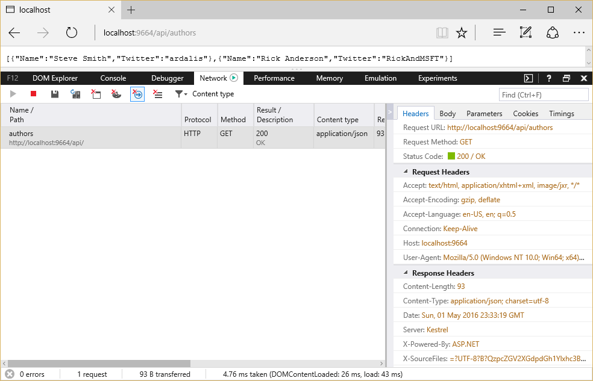

Formatting Response Data
========================

By `Steve Smith`_

ASP.NET Core MVC has built-in support for formatting response data, using fixed formats or in response to client specifications.

.. contents:: Sections
    :local:
    :depth: 1

`View or download sample from GitHub <https://github.com/aspnet/Docs/tree/master/mvc/models/formatting/sample>`_.

Format-Specific Action Results
------------------------------

Actions can return specific results that are always formatted in a particular manner. For example, returning a ``JsonResult`` will return JSON-formatted data, regardless of client preferences. Likewise, returning a ``ContentResult`` will return plain text formatted string data.

To return data using a specific result type, assuming you're inheriting from the base ``Controller`` class, it's recommended that you use the built-in helper methods ``Json`` and ``Content``. These methods check to see if the data being formatted implements ``IDisposable`` and register the object for disposal if required. Your action method should return either the specific result type (for instance, ``JsonResult``) or ``IActionResult``.

Returning JSON-formatted data:

.. literalinclude:: formatting/sample/src/ResponseFormattingSample/Controllers/Api/AuthorsController.cs
  :language: c#
  :lines: 17-22
  :emphasize-lines: 3,5
  :dedent: 8

Sample response from this action:

Note that the content type of the response is ``application/json``, shown both in the list of network requests and in the Response Headers section. Also note the list of options presented by the browser (in this case, Microsoft Edge) in the Accept header, in the Request Headers section. The current technique is ignoring this header; obeying it is discussed below.

To return plain text formatted data, use ``ContentResult`` and the ``Content`` helper:

.. literalinclude:: formatting/sample/src/ResponseFormattingSample/Controllers/Api/AuthorsController.cs
  :language: c#
  :lines: 31-36
  :emphasize-lines: 3,5
  :dedent: 8

A response from this action:

.. image:: formatting/_static/text-response.png

Note in this case the ``Content-Type`` returned is ``text/plain``. You can also achieve this same behavior using just a string response type:

.. literalinclude:: formatting/sample/src/ResponseFormattingSample/Controllers/Api/AuthorsController.cs
  :language: c#
  :lines: 38-43
  :emphasize-lines: 3,5
  :dedent: 8

.. tip:: For non-trivial actions with multiple return types or options (for example, different HTTP status codes based on the result of operations performed), prefer ``IActionResult`` as the return type.

Content Negotiation
-------------------

Content negotiation (*conneg* for short) occurs when client specifies an Accept header. The default format used by ASP.NET Core MVC is JSON. Negotiation occurs automatically for IActionResult types, including Ok, BadRequest, Created, etc. You can also return a model type and the framework will automatically wrap it in an ObjectResult for you.

Configuring Formatters
----------------------

You can add the XmlFormatters package to add XML support. Configure formatters using config.OutputFormatters (InputFormatters also exist, for Model Binding).

Response Format URL Mappings
----------------------------

You can specify format details within the URL itself, such as via a querystring or part of the path.

Recommendations
---------------

Prefer IActionResult as your return type for data since it allows you to handle error states and different HTTP status codes.

imaginethatemb@aol.com
