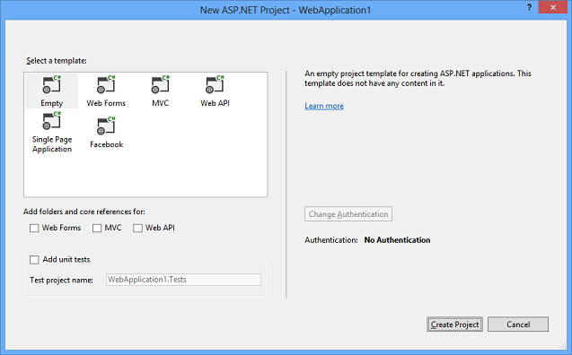
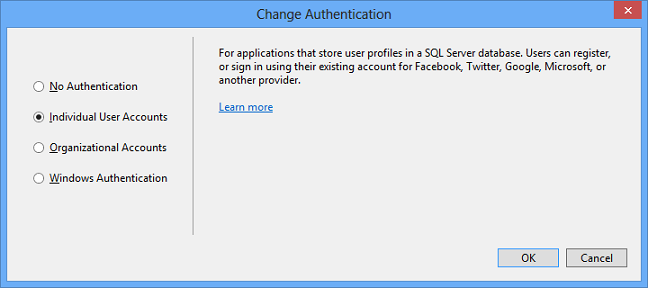

ASP.NET MVC 5
====================
## What's New in ASP.NET MVC 5

### One ASP.NET

The Web MVC project templates integrate seamlessly with the new One ASP.NET experience. You can customize your MVC project and configure authentication using the One ASP.NET project creation wizard. An introductory tutorial to ASP.NET MVC 5 can be found at [Getting Started with ASP.NET MVC 5](overview/getting-started/introduction/getting-started.md).

For information on upgrading MVC 4 projects to MVC 5, see [How to Upgrade an ASP.NET MVC 4 and Web API Project to ASP.NET MVC 5 and Web API 2](overview/releases/how-to-upgrade-an-aspnet-mvc-4-and-web-api-project-to-aspnet-mvc-5-and-web-api-2.md).

### ASP.NET Identity

The MVC project templates have been updated to use ASP.NET Identity for authentication and identity management. A tutorial featuring Facebook and Google authentication and the new membership API can be found at [Create an ASP.NET MVC 5 App with Facebook and Google OAuth2 and OpenID Sign-on](overview/security/create-an-aspnet-mvc-5-app-with-facebook-and-google-oauth2-and-openid-sign-on.md) and [Deploy a Secure ASP.NET MVC app with Membership, OAuth, and SQL Database to a Windows Azure Web Site](https://www.windowsazure.com/en-us/develop/net/tutorials/web-site-with-sql-database/).

### Bootstrap

The MVC project template has been updated to use [Bootstrap](http://getbootstrap.com/) to provide a sleek and responsive look and feel that you can easily customize. For more information, see [Bootstrap in the Visual Studio 2013 web project templates](../visual-studio/overview/2013/creating-web-projects-in-visual-studio.md#bootstrap).

### Authentication filters

[Authentication filters](http://www.dotnetcurry.com/showarticle.aspx?ID=957) are a new kind of filter in ASP.NET MVC that run prior to authorization filters in the ASP.NET MVC pipeline and allow you to specify authentication logic per-action, per-controller, or globally for all controllers. Authentication filters process credentials in the request and provide a corresponding principal. Authentication filters can also add authentication challenges in response to unauthorized requests. See [ASP.NET MVC 5 Authentication Filters](http://www.dotnetcurry.com/showarticle.aspx?ID=957), [Authentication Filters in ASP.NET MVC 5](http://theshravan.net/blog/authentication-filters-in-asp-net-mvc-5/) and [Finally the new ASP.NET MVC 5 Authentication Filters!](http://hackwebwith.net/finally-the-new-asp-net-mvc-5-authentication-filters/).

### Filter overrides

You can now override which filters apply to a given action method or controller by specifying an [override filter](http://www.davidhayden.me/blog/filter-overrides-in-asp-net-mvc-5). Override filters specify a set of filter types that should not be run for a given scope (action or controller). This allows you to configure filters that apply globally but then exclude certain global filters from applying to specific actions or controllers. See [New Filter Overrides feature in ASP.NET MVC 5 and ASP.NET Web API 2](https://weblogs.asp.net/imranbaloch/archive/2013/09/25/new-filter-overrides-in-asp-net-mvc-5-and-asp-net-web-api-2.aspx), [How to use the ASP.NET MVC 5 Filter Overrides Feature](http://hackwebwith.net/how-to-use-the-asp-net-mvc-5-filter-overrides-feature/), and [Filter Overrides in ASP.NET MVC 5](http://www.davidhayden.me/blog/filter-overrides-in-asp-net-mvc-5)

### Attribute routing

ASP.NET MVC now supports [attribute routing](https://blogs.msdn.com/b/webdev/archive/2013/10/17/attribute-routing-in-asp-net-mvc-5.aspx), thanks to a contribution by Tim McCall, the author of [http://attributerouting.net](http://attributerouting.net). With attribute routing you can specify your routes by annotating your actions and controllers.

## New Web Project Experience

We have enhanced the experience of creating new web projects in Visual Studio 2013. In the **New ASP.NET Web Project** dialog you can select the project type you want, configure any combination of technologies (Web Forms, MVC, Web API), configure authentication options, and add a unit test project.

The new dialog enables you to change the default authentication options for many of the templates. For example, when you create an ASP.NET Web Forms project you can select any of the following options:

- No Authentication
- Individual User Accounts (ASP.NET membership or social provider log in)
- Organizational Accounts (Active Directory in an internet application)
- Windows Authentication (Active Directory in an intranet application)

For more information about the new process for creating web projects, see [Creating ASP.NET Web Projects in Visual Studio 2013](../visual-studio/overview/2013/creating-web-projects-in-visual-studio.md). For more information about the new authentication options, see [ASP.NET Identity](../identity/overview/index.md).

### ASP.NET Scaffolding

ASP.NET Scaffolding is a code generation framework for ASP.NET Web applications. It makes it easy to add boilerplate code to your project that interacts with a data model.

In previous versions of Visual Studio, scaffolding was limited to ASP.NET MVC projects. With Visual Studio 2013, you can now use scaffolding for any ASP.NET project, including Web Forms. Visual Studio 2013 does not currently support generating pages for a Web Forms project, but you can still use scaffolding with Web Forms by adding MVC dependencies to the project. Support for generating pages for Web Forms will be added in a future update.

When using scaffolding, we ensure that all required dependencies are installed in the project. For example, if you start with an ASP.NET Web Forms project and then use scaffolding to add a Web API Controller, the required NuGet packages and references are added to your project automatically.

To add MVC scaffolding to a Web Forms project, add a **New Scaffolded Item** and select **MVC 5 Dependencies** in the dialog window. There are two options for scaffolding MVC; Minimal and Full. If you select Minimal, only the NuGet packages and references for ASP.NET MVC are added to your project. If you select the Full option, the Minimal dependencies are added, as well as the required content files for an MVC project.

Support for scaffolding async controllers uses the new async features from Entity Framework 6.

For more information and tutorials, see [ASP.NET Scaffolding Overview](../visual-studio/overview/2013/aspnet-scaffolding-overview.md).

### Getting Help and Reporting Issues

- [Known issues and breaking changes list](../visual-studio/overview/2013/release-notes.md#knownissues)
- Get help and discuss ASP.NET MVC 5 in the [forums](https://forums.asp.net/1146.aspx)
- [Report a bug in ASP.NET MVC 5](http://aspnetwebstack.codeplex.com/workitem/list/basic)
- [Make a feature request](http://aspnet.uservoice.com/forums/41201-asp-net-mvc)

### Upgrading from ASP.NET MVC 4

See [How to Upgrade an ASP.NET MVC 4 and Web API Project to ASP.NET MVC 5 and Web API 2](overview/releases/how-to-upgrade-an-aspnet-mvc-4-and-web-api-project-to-aspnet-mvc-5-and-web-api-2.md)