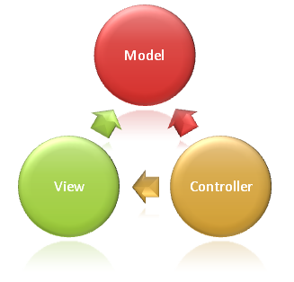

:version: 1.0.0

Overview of ASP.NET Core MVC
============================

By `Steve Smith`_

ASP.NET Core MVC is a rich framework for building web apps and APIs using the Model-View-Controller design pattern.

.. contents:: Sections:
  :local:
  :depth: 1

What is the MVC pattern?
------------------------

The Model-View-Controller (MVC) architectural pattern separates an application into three main groups of components: Models, Views, and Controllers. This pattern helps to achieve `separation of concerns <http://deviq.com/separation-of-concerns/>`_. Using this pattern, user requests are routed to a Controller which is responsible for working with the Model to perform user actions and/or retrieve results of queries. The Controller chooses the View to display to the user, and provides it with any Model data it requires.

The following diagram shows the three main components and which ones reference the others:

Kinds of Models
^^^^^^^^^^^^^^^

In simple applications, there may be just one kind of model class that is used by persistence, presentation, and any business logic. However, frequently this kind of one-size-fits-all approach doesn't scale to complex applications. In that case, it may make sense to have different model types (classes) with different responsibilities.

Domain Model
############

Many developers choose to encapsulate complex business logic within a *domain model*, which doesn't depend on infrastructure concerns and is easily validated with :doc:`unit tests </testing/index>`. The domain model will often include abstractions and services that allow the Controller to operate at a higher level of abstraction, and keep low-level plumbing code from cluttering the Controller and making it harder to test.

Persistence Model
#################

Some applications have separate classes that map closely to how data is stored and retrieved from persistence. If you're using Entity Framework, it can usually map your domain model directly to persistence without the need for a separate persistence model.

View Model
##########

Many developers are familiar with the concept of a ViewModel, especially those who have used application frameworks that use the Model-View-ViewModel pattern. In an MVC web application, a ViewModel is a type that includes just the data a View requires for display (and perhaps sending back to the server). ViewModel types can also simplify :doc:`model binding </mvc/models/model-binding>`. ViewModel types are generally just data containers; any logic they may have should be specific to helping the View render data.

Binding Model
############

Sometimes it may be worthwhile to create a type specifically for use with :doc:`model binding </mvc/models/model-binding>`. These types are typically just data containers with no behavior.

.. note:: Using a binding model (or viewmodel) is recommended to avoid allowing a malicious user to set properties on the model that are not included in the UI, but are exposed via model binding.

API Model
#########

If your application exposes an API, the format of the data you expose to clients may be separated from your app's internal domain model by defining custom API model types. This allows you to change your internal model types without impacting clients that may be using your exposed APIs.

Controller Responsibilities
^^^^^^^^^^^^^^^^^^^^^^^^^^^

Controllers are the initial entry point for each request to an MVC app. Their primary responsibility is to work with the model to perform user commands and retrieve data in response to queries. The Controller then performs any necessary mapping from one model type to another (for instance creating a ViewModel needed for a particular View and populating it with results from the Domain Model), and then returns a particular View.

.. note:: It's not uncommon for controllers to become bloated with too many responsibilities. Try to follow the `Single Responsibility Principle <http://deviq.com/single-responsibility-principle/>`_ and push business logic out of the controller and into the domain model whenever possible.

.. tip:: If you find that your controller actions frequently perform the same kinds of actions, you can follow the `Don't Repeat Yourself principle <http://deviq.com/don-t-repeat-yourself/>`_ by moving these common actions into :doc:`filters <mvc/controllers/filters>`.

View Responsibilities
^^^^^^^^^^^^^^^^^^^^^

Views are responsible for presenting content through the user interface. There should be minimal logic within views, and any logic in them should relate to presenting content. If you find the need to perform a great deal of logic in view files in order to display data from a complex model, consider using a ViewModel instead that is designed to suit the needs of the View.

What is ASP.NET Core MVC
------------------------

The ASP.NET Core MVC frameowrk is a lightweight, open source, highly testable presentation framework optimized for use with ASP.NET Core. It is available in the "Microsoft.AspNetCore.Mvc" package, and is used by Visual Studio's "Web API" and "Web Application" ASP.NET Core Templates.

ASP.NET Core MVC gives you a powerful, patterns-based way to build dynamic websites that enables a clean separation of concerns and gives you full control over markup for enjoyable, agile development. ASP.NET Core MVC includes many features that enable fast, TDD-friendly development for creating sophisticated applications that use the latest web standards.

ASP.NET Core MVC in ASP.NET Core includes support for building web pages and HTTP services in a single aligned framework that can be hosted in IIS or self-hosted in your own process.

ASP.NET Core MVC Features
^^^^^^^^^^^^^^^^^^^^^^^^^

* :doc:`Filters </mvc/controllers/filters>`, for cross-cutting concerns
* :doc:`Dependency injection </fundamentals/dependency-injection>` for :doc:`Controllers </mvc/controllers/dependency-injection>` and :doc:`Views </mvc/views/dependency-injection>`
* Support for :doc:`separate Areas within web apps </mvc/controllers/areas>`
* Support for :doc:`testing Controller logic </mvc/controllers/testing>`
* :doc:`View files use razor </mvc/views/overview>`, requiring minimal ceremony to render HTML combined with app data
* View files can use :doc:`Tag Helpers </mvc/views/tag-helpers/intro>`, :doc:`View Components </mvc/views/view-components>`, and :doc:`HTML Helpers </mvc/views/html-helpers>`
* Views can be shared using :doc:`partial views </mvc/views/partial>` and :doc:`layout support </mvc/views/layout>`
* Automatically :doc:`bind client data to the app's model </mvc/models/model-binding>`
* Automatically :doc:`validate client data sent to the app </mvc/models/validation>`
* Support for :doc:`multiple data formats </mvc/models/formatting>` for APIs

Using MVC for Web Apps and Web APIs
-----------------------------------

More to come.
