Custom MVC Template
====================
by [Jacques Eloff](https://github.com/joeloff)

The release of MVC 3 Tools Update for Visual Studio 2010 introduced a separate project wizard for MVC projects. The change was driven by two factors. First, the introduction of new templates in MVC 3 and support for additional view engines such as Razor lead to overcrowding the New Project dialog in Visual Studio. Second, customers had been asking for extensibility points and the new MVC project wizard would afford us the opportunity to respond to these requests.

Adding custom templates was an arduous process that relied on using the registry to make new templates visible to the MVC project wizard. The author of a new template had to wrap it inside an MSI to ensure that the necessary registry entries would be created at install time. The alternative was to make a ZIP file containing the template available and have the end-user create the required registry entries by hand.

Neither of the aforementioned approaches is ideal so we decided to leverage some of the existing infrastructure provided by [VSIX](https://msdn.microsoft.com/en-us/library/ff363239.aspx) extensions to make it easier to author, distribute and install custom MVC templates starting with MVC 4 for Visual Studio 2012. Some of the benefits provided by this approach are:

- A VSIX extension can contain multiple templates that support different languages (C# and Visual Basic) and multiple view engines (ASPX and Razor).
- A VSIX extension can target multiple SKUs of Visual Studio including Express SKUs.
- The [Visual Studio Gallery](https://visualstudiogallery.msdn.microsoft.com/) facilitates distributing the extension to a wide audience.
- VSIX extensions can be upgraded making it easier to author corrections and updates to your custom templates.

## Prerequisites

- Users need to be familiar with authoring project templates, including the required markup for vstemplate files, etc.
- Users will need to have Visual Studio Professional and higher installed. Express SKUs do not support creating VSIX projects.
- [Visual Studio 2012 SDK](https://www.microsoft.com/download/details.aspx?id=30668) installed.

## Example

The first step is to create a new VSIX project using either C# or Visual Basic. Select **File > New Project**, then click **Extensibility** in the left pane and select the **VSIX Project**.

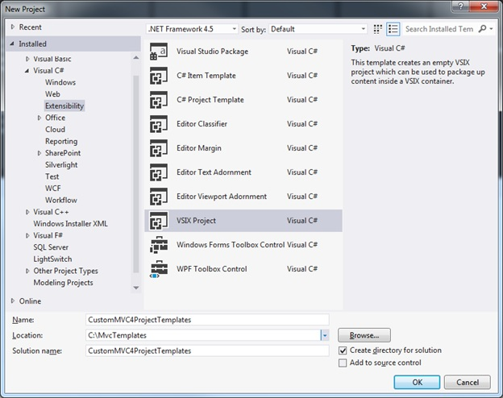

After the project is created, the VSIX designer will be opened.

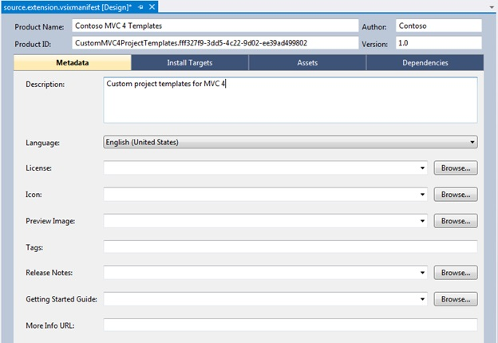

The designer can be used to edit some of the general properties of the extension that will be shown to users when they install the extension or browse the installed extensions in Visual Studio (**Tools > Extensions and Updates**). Once you have completed the general information click on the **Install Targets tab**.

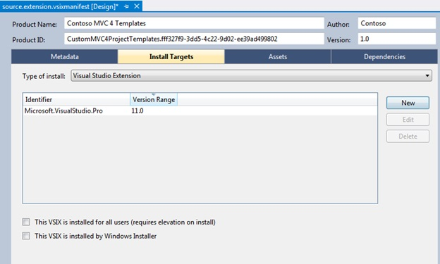

This tab is used to specify the SKUs and versions of Visual Studio that are supported by your extension. Select the checkbox for **This VSIX is installed for all users** to enable per-machine installs of the VSIX. Click on the **New** button on the right to add additional SKUs such as Web Developer Express (VWD).

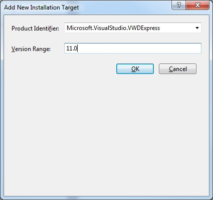

If you intend to support all the Professional and higher SKUs (Professional, Premium and Ultimate) you only need to select the minimum SKU in the family, **Microsoft.VisualStudio.Pro**. Remember to save all your changes once you have completed the Install Targets.

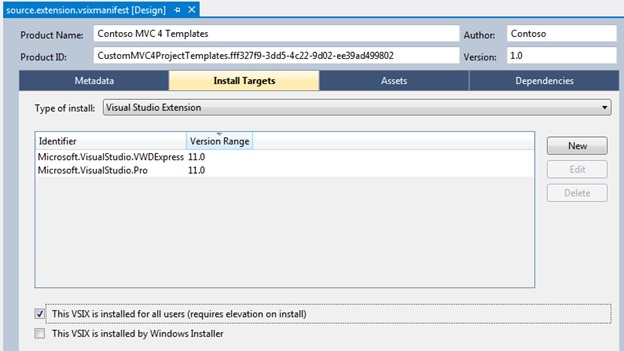

The **Assets** tab is used to add all your content files to the VSIX. Since MVC requires custom metadata you will be editing the raw XML of the VSIX manifest file instead of using the **Assets** tab to add content. Start by adding the template contents to the VSIX project. It is important that the structure of the folder and the contents mirror the layout of the project. The example below contains four project templates that were derived from the Basic MVC project template. Make sure that all the files that comprise your project template (everything underneath the ProjectTemplates folder) are added to the **Content** itemgroup in the VSIX project file and that each item contains the **CopyToOutputDirectory** and **IncludeInVsix** metadata set as shown in the example below.

&lt;Content Include=&quot;ProjectTemplates\MyMvcWebApplicationProjectTemplate.csaspx\BasicWeb.config&quot;&gt;

&lt;CopyToOutputDirectory&gt;Always&lt;/CopyToOutputDirectory&gt;

&lt;IncludeInVSIX&gt;true&lt;/IncludeInVSIX&gt;

&lt;/Content&gt;

If not, the IDE will try to compile the contents of the template when you build the VSIX and you will likely see an error. Code files in templates often contain special [template parameters](https://msdn.microsoft.com/en-us/library/eehb4faa(v=vs.110).aspx) used by Visual Studio when the project template is instantiated and therefore cannot be compiled in the IDE.

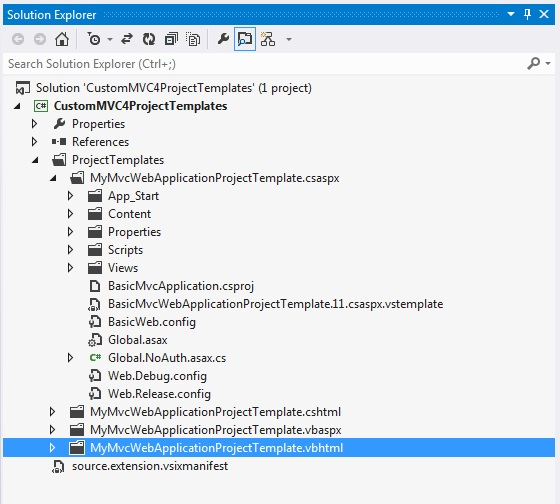

Close the VSIX designer, then right click on the **source.extension.manifest** file in **Solution Explorer** and select **Open With** and choose the **XML (Text) Editor** option.

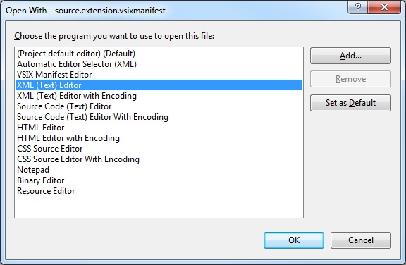

Create an **&lt;Assets&gt;** element and add an **&lt;Asset&gt;** element for each file that must be included in the VSIX. The **Type** attribute of each **&lt;Asset&gt;** element must be set to **Microsoft.VisualStudio.Mvc.Template**. This is a custom namespace that only the MVC project wizard understands. Refer to the VSIX 2.0 Schema documentation for additional information on the structure and layout of the manifest file.

Just adding the files to the VSIX is not sufficient to register the templates with the MVC wizard. You need to provide information such as the template name, description, supported view engines and programming language to the MVC wizard. This information is carried in custom attributes associated with the **&lt;Asset&gt;** element for each **vstemplate** file.

&lt;Asset d:VsixSubPath=&quot;ProjectTemplates\MyMvcWebApplicationProjectTemplate.csaspx&quot;

Type=&quot;Microsoft.VisualStudio.Mvc.Template&quot;

d:Source=&quot;File&quot;

Path=&quot;ProjectTemplates\MyMvcWebApplicationProjectTemplate.csaspx\BasicMvcWebApplicationProjectTemplate.11.csaspx.vstemplate&quot;

ProjectType=&quot;MVC&quot;

Language=&quot;C#&quot;

ViewEngine=&quot;Aspx&quot;

TemplateId=&quot;MyMvcApplication&quot;

Title=&quot;Custom Basic Web Application&quot;

Description=&quot;A custom template derived from a Basic MVC web application (Razor)&quot;

Version=&quot;4.0&quot;/&gt;

Below is an explanation of the custom attributes that must be present:

- **ProjectType** must be set to MVC.
- **Language** designates the development language supported by the template. Valid values are either C# or VB.
- **ViewEngine** designates the view engine supported by the template such as Aspx or Razor. You can specify a custom value for this field.
- **TemplateId** is used for grouping the templates. If the value matches an existing template ID it will be override templates previously registered with the MVC wizard.
- **Title** designates the short description displayed in the MVC wizard beneath each project template.
- **Description** designates a more verbose description of the template.

After you have added all the files to the manifest and saved it, you will notice that the **Assets** tab in the designer will display all the files, but not the custom attributes you added to the **&lt;Asset&gt;** elements for the **vstemplate** files.

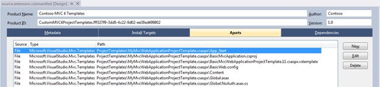

All that remains now is to compile the VSIX project and install it.

Make sure that all instances of Visual Studio are closed on the machine where you intend to test the VSIX extension. Visual Studio scans for new extensions during startup, so if the IDE is open while installing a VSIX you will need to restart Visual Studio. In Explorer, double click on the VSIX file to launch the **VSIX Installer**, click **Install** and then launch Visual Studio.

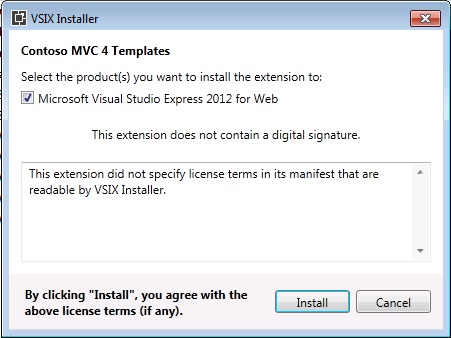

From the menu, select **Tools > Extensions and Updates** to confirm that your extension was installed. If the VSIX Installer reported any errors during the installation of the extension you can view the VSIX Installer log for more information. The log is usually created in the **%temp%** folder of the user that installed the extension, for example **C:\Users\Bob\AppData\Local\Temp**.

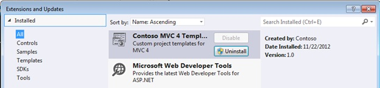

After closing the window you can create an MVC 4 project to see whether your new templates are shown in the MVC wizard.

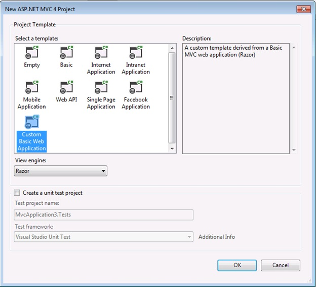

## Limitations

1. The MVC wizard does not support localized custom templates.
2. The wizard will not report any errors if it fails to locate custom templates. If any of the required custom attributes are absent, the template would simply be excluded from the Wizard.