ASP.NET MVC Facebook Birthday App
====================
by [Kirthi Krishnamraju](https://github.com/kirthik), [Rick Anderson](https://github.com/Rick-Anderson), [Tom Dykstra](https://github.com/tdykstra), [Troy Dai](https://github.com/troydai), [Yao Huang Lin](https://github.com/yaohuang)

> The Facebook App template includes a new library to take care of all the plumbing involved in building a Facebook app, so you can focus on building the business logic in your application. The Facebook app -- called a [Canvas app](https://developers.facebook.com/docs/guides/canvas/) -- that you can build with this new template is hosted on the web and is displayed inside the Facebook chrome via an iframe. The functionality included in the template will help you with authentication, permissions, and accessing Facebook data. The Facebook functionality also has an extensibility model so that you can build your own storage providers and more.
> 
> A Visual Studio project with C# source code is available to accompany this tutorial. [Download the project](https://code.msdn.microsoft.com/ASPNET-MVC-Facebook-4b4f06d2/file/117837/1/WebApplication3.zip).

## What you'll build

You'll implement a simple but fun and useful Facebook application that lists a person's Facebook friends who have upcoming birthdays and makes suggestions for birthday presents. Here are screenshots, one that shows the list of friends with upcoming birthdays and one with recommended birthday presents which appears when you click a friend:

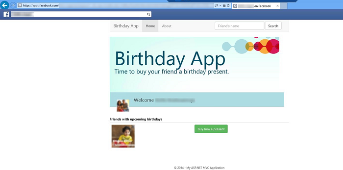

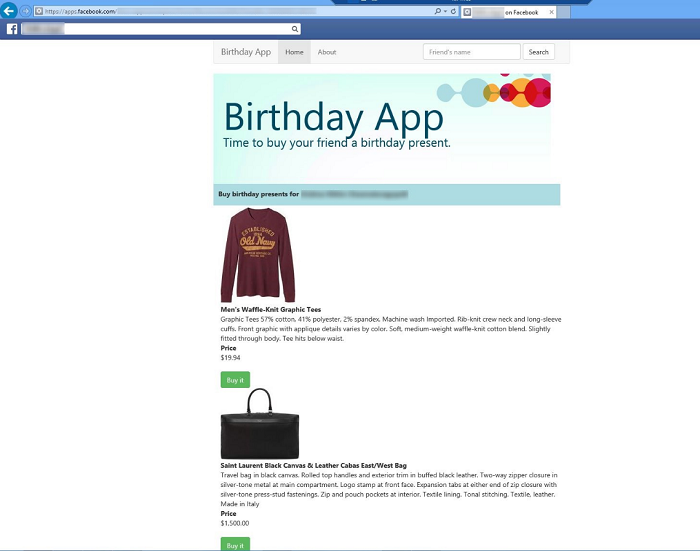

## Creating the project and Installing ASP.NET Facebook Application template

1. Start by installing and running [Visual Studio Express 2013 for Web](https://go.microsoft.com/fwlink/?LinkId=299058) or [Visual Studio 2013](https://go.microsoft.com/fwlink/?LinkId=306566). Install Visual Studio [2013 Update 3](https://go.microsoft.com/fwlink/?LinkId=390521) or higher.
2. The Facebook template included with previous versions of Visual Studio 2013 has been removed. The Facebook template is now available as a VSIX extension [here](https://go.microsoft.com/fwlink/?LinkID=509965&amp;clcid=0x409). Download and install the *NNN.ASP.NET Facebook Application.vsix* file.
3. From the **File** menu, click **New** and then click **Project**.
4. In the **New Project** dialog box, expand **Visual C#** and then click **Web** under **Templates**.
5. Click **ASP.NET Facebook Application**.
6. Enter *SampleFacebookBirthdayApp* for the project name, and then click **OK**. 

    > [!NOTE]
    > You must use `SampleFacebookBirthdayApp` for the project name so you can copy files from the [download project](https://code.msdn.microsoft.com/ASPNET-MVC-Facebook-4b4f06d2) without having to change the namespace   
    > 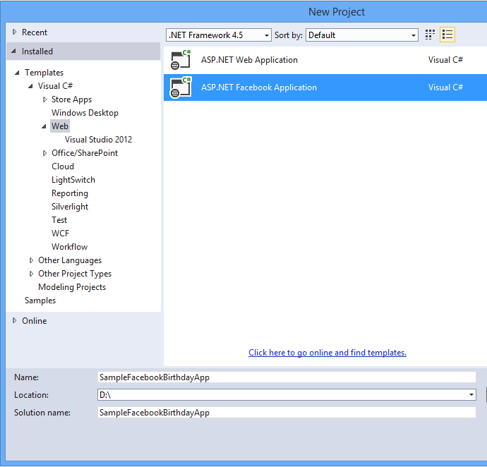
7. Install the latest Microsoft.AspNet.Facebook Nuget package.

## Setting up SSL in the Project

To connect to Facebook, you will need to set up IIS-Express to use SSL.

1. In **Solution Explorer**, click the **SampleFacebookApp** project.
2. Enter the F4 key to show the project properties. Alternatively, from the **View** menu you can select **Properties Window**.
3. Change **SSL Enabled** to True.  
    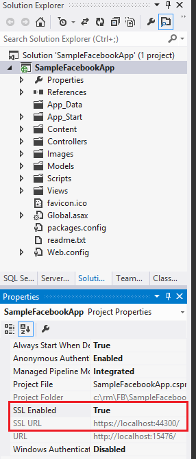
4. Copy the SSL URL.
5. In **Solution Explorer**, right click the **SampleFacebookApp** and select **Properties**.
6. Select the **Web** tab.  
    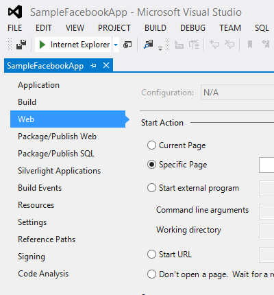
7. Paste the SSL URL into the **Project Url** box, then click **Create Virtual Directory**. You will need this URL to configure Facebook.  
    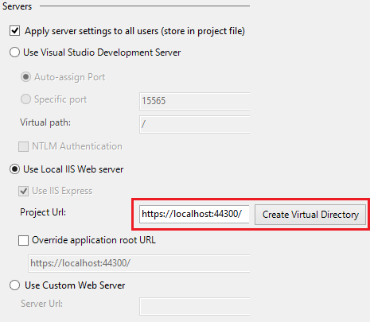

## Creating the app in Facebook and connecting the app to the project

Right out of the box, the Facebook template provides boilerplate code to help you connect your application to Facebook and retrieve Facebook properties such as Likes, photos, and email. All you have to do to get a simple application up and running is copy to your project some settings from an application that you create in Facebook.

1. In your browser, navigate to[https://developers.facebook.com/apps](https://developers.facebook.com/apps) and log in by entering your Facebook credentials.
2. Click on **Add a New App**  
    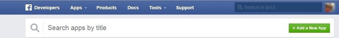
3. Select **Facebook Canvas**  
    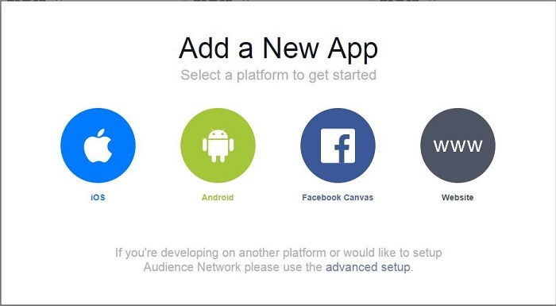
4. Enter a name for the app and click on **Create New Facebook App ID**  
    
5. Choose a category for the app and click **Confirm**  
    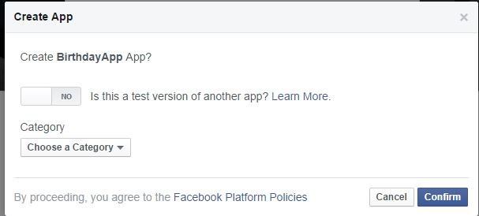
6. In Visual Studio, open the application. Go to **Solution Explorer**, right-click the project and click **Properties**, and then click the **Web** tab.- Copy the **Project URL** from the **Web** tab and paste it into the Secure **Host URL field** and click **Next**.  
    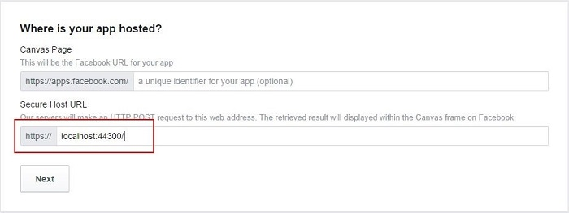
- Click **Next**.  
    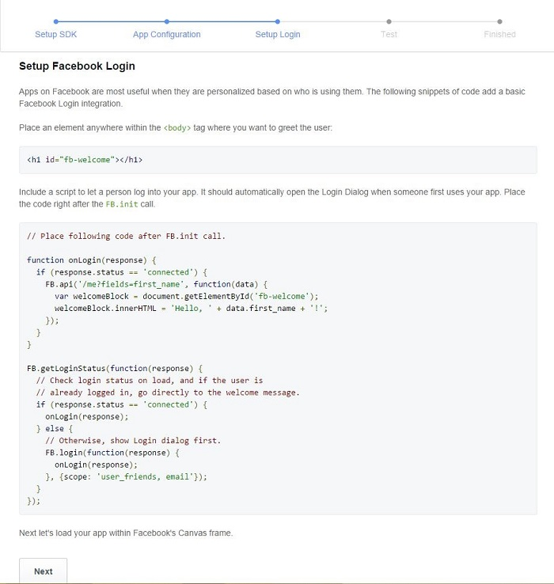
- Click on **Skip to Developer Dashboard**  
    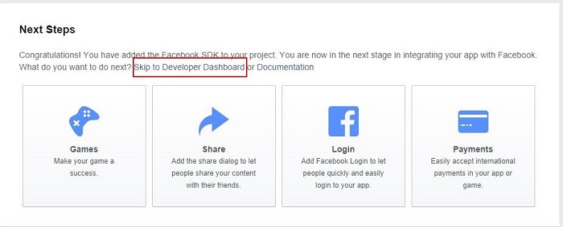
- Click on **Settings** and enter a value in **Namespace**. Copy **Secure Canvas URL** value to **Canvas URL** and click on **Save Changes**.  
    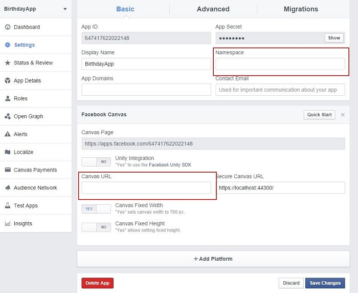
- In Visual Studio, open the app *Web.config* file that is located in the root folder of your project.
- Copy and paste the **AppId, App Secret**, and **Namespace** values into the corresponding key elements in the `appSettings` collection in the *Web.config* file: 

    [!code-xml[Main](aspnet-mvc-facebook-birthday-app/samples/sample1.xml?highlight=7-9)]

    > [!WARNING]
    > Security - Never store sensitive data in your source code. The account and credentials are added to the code above to keep the sample simple. See Jon Atten's [ASP.NET MVC: Keep Private Settings Out of Source Control](http://typecastexception.com/post/2014/04/06/ASPNET-MVC-Keep-Private-Settings-Out-of-Source-Control.aspx).
- Press CTRL+F5 to run the application. If you haven't installed the self-signed certificate for IIS Express, follow the instructions to install it. For more information see the Enable SSL for the Project section of my [Deploy a Secure ASP.NET MVC 5 app with Membership, OAuth, and SQL Database to an Azure Website](https://azure.microsoft.com/en-us/documentation/articles/web-sites-dotnet-deploy-aspnet-mvc-app-membership-oauth-sql-database/) tutorial.
- After you log in, Facebook will display the following dialog boxes which asks you for permission to receive your public profile, email address and photos. Click **Okay** on both dialogs.  
    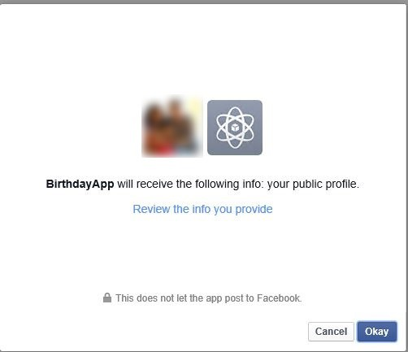  
    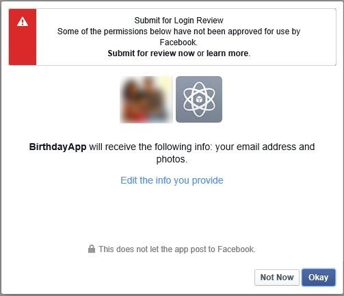
- You now have a simple working facebook app.  
    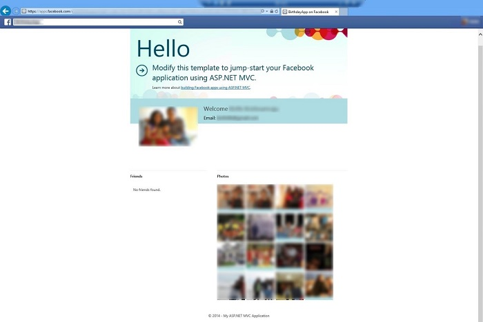

## Examining the template code

This section of the tutorial walks you through the code that was created by the Facebook template. If you prefer to just get started building the birthday application, you can skip to the next section.  
You saw the main page that was displayed by the template application. It was displayed by the `Home` controller's `Index` action method.

[!code-csharp[Main](aspnet-mvc-facebook-birthday-app/samples/sample2.cs)]

Notice that the `Index` action method is an asynchronous method. Because this method calls a web service to get Facebook data, there will be some latency. Making the method asynchronous enables the server to process high traffic loads more efficiently. For more information about asynchronous methods in ASP.NET MVC, see my [Using Asynchronous Methods in ASP.NET MVC](../performance/using-asynchronous-methods-in-aspnet-mvc-4.md) tutorial.

The `FacebookAuthorize` attribute on the `Index` method is what causes the **Permissions** page to be displayed first when your application runs and the user hasn't given it permission yet. See [Facebook best practices for requesting permissions](https://developers.facebook.com/docs/sharing/best-practices). You use this attribute to specify the Facebook data that your application needs permission to retrieve. The *Web.config* file has a setting that specifies the URL to use when the application doesn't have the required permissions:

[!code-xml[Main](aspnet-mvc-facebook-birthday-app/samples/sample3.xml?highlight=5)]

The MVC model binder provides the `Permissions` method with a `FacebookRedirectContext` object that encapsulates information about the request, including the requested permissions:

[!code-csharp[Main](aspnet-mvc-facebook-birthday-app/samples/sample4.cs)]

The *Views\Home\Permissions.cshtml* view displays the requested permissions:

[!code-cshtml[Main](aspnet-mvc-facebook-birthday-app/samples/sample5.cshtml?highlight=11-14)]

For the `Index` method that displays the main application page, the MVC model binder provides a `FacebookContextobject` that encapsulates information about the request:

[!code-csharp[Main](aspnet-mvc-facebook-birthday-app/samples/sample6.cs)]

The `FacebookClient` object that is included in the context object provides methods you can use to get Facebook data about the user. The template code in the `Index` method specifies that it wants a `MyAppUser` object when it calls `FacebookClient.GetCurrentUserAsync`.

[!code-csharp[Main](aspnet-mvc-facebook-birthday-app/samples/sample7.cs?highlight=8)]

The `MyAppUser` class specifies the data to retrieve for the user of the application:

[!code-csharp[Main](aspnet-mvc-facebook-birthday-app/samples/sample8.cs)]

The `Index` view displays the following:

[!code-cshtml[Main](aspnet-mvc-facebook-birthday-app/samples/sample9.cshtml)]

The model passed to this view is a `MyAppUser` object. The `<article class="intro">` element displays the user's name, email address, and picture. The `<article id="content">` element displays the user's friends in the left `div` and the user's photos in the right `div`.

## Creating the Facebook birthday app

This tutorial will show the steps for creating the birthday application by using files from the completed project that you can download by using the link at the top of the page. If you haven't already downloaded the project, download it now before continuing with the tutorial.

> [!NOTE]
> If you just want to run the downloaded application without going through the following steps to build it in your own project, you have to configure the Facebook application settings as shown in the previous section, and configure the Shop Style API key as shown later in this tutorial. You may also need to enable NuGet package restore. To do this, click **Library Package Manager** from the **Tools** menu, and then click **Manage NuGet Packages for Solution**. In the **Manage NuGet Package** s dialog, click **Restore**. (If you have already enabled NuGet package restore, you won't see the yellow bar with the Restore button.)

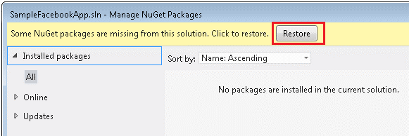

## Install Bootstrap

You'll begin by installing the Bootstrap NuGet package. [Bootstrap](http://getbootstrap.com/) is a popular and powerful front-end framework than enables faster and easier web development. We used it in this application because it allows you to easily create cool layouts that work great on desktops, tablets, and smartphones without having to learn or fight CSS. See the [Bootstrap Getting Started guide](http://twitter.github.com/bootstrap/getting-started.html) for more information.

1. From the **Tools** menu, click **Library Package Manager**, and then click **Manage NuGet Packages for Solution**.  
    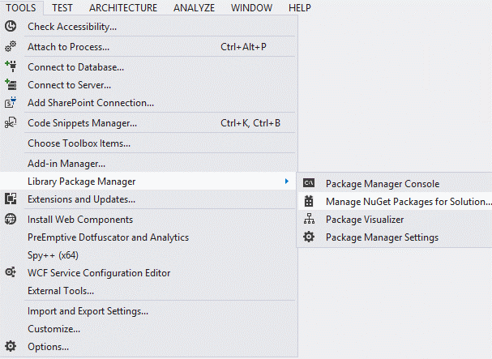
2. In the left tab of the **Manage NuGet Packages** dialog box, click **Online**.
3. In the search box at the top right, enter **bootstrap**, and then press **Enter**.
4. Install the Bootstrap package. The Bootstrap NuGet package installs the following files:  
 • *bootstrap-responsive.css* and *bootstrap.css* (and the minified versions).  
 • *bootstrap.js* (and the minified version).
5. Add the Bootstrap CSS and JavaScript files to the *App\_Start\BundleConfig.cs* file. The completed *BundleConfig.cs* file looks like this: 

    [!code-csharp[Main](aspnet-mvc-facebook-birthday-app/samples/sample10.cs?highlight=13,15)]
6. Delete the *Views\Shared\\_Layout.cshtml* file and add in its place the same file from the downloaded project. To add the file, right-click the *Views\Shared* folder and click **Add Existing Item**, and then navigate to the downloaded version of the *Views\Shared\\_Layout.cshtml* file. The updated layout file is shown below, with the changes highlighted: 

    [!code-cshtml[Main](aspnet-mvc-facebook-birthday-app/samples/sample11.cshtml?highlight=9-11,35-65)]

    The markup inside the `wrapper div` uses Bootstrap to create a navigation bar at the top of the page that enables users to go to different application pages or search for specific friends. For more information about this use of Bootstrap, see [Twitter Bootstrap 101: The Navbar](http://webdesign.tutsplus.com/tutorials/htmlcss-tutorials/twitter-bootstrap-101-the-navbar/) and the [Bootstrap navbar help](http://getbootstrap.com/components/#navbar) pages.
7. Open *Content\Site.css* and remove the margin line from the `h1` definition. 

    [!code-css[Main](aspnet-mvc-facebook-birthday-app/samples/sample12.css?highlight=4)]

 This change prevents the `h1` and `h2`  headings from overlapping.
8. Run the app and you'll see the new navigation bar and the new title text.   
    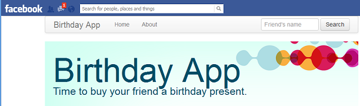

## Change the way the app user and friends are displayed

The `MyAppUser` class determines what information is gathered from Facebook about the application user, and the `MyAppUserFriend` class determines what information is gathered about the user's friends. In this section of the tutorial you change those classes and then change the `Index` view that displays the user and friend info.

1. Open the *Models\MyAppUser.cs* file.
2. Comment out the `FacebookFieldModifier` attribute on the `ProfilePicture` field. The template uses this attribute to set the profile picture to large size, but the user of your app doesn't need to see a large picture of herself.
3. Comment out the `FacebookFieldModifier` attribute on the `Friends` field. The template uses this attribute to limit the number of friends displayed to 8, but you'll retrieve all of the friends. (After you sort them by birthday, you'll limit the display to the first 100 friends to prevent the list from getting too long to display).
4. Comment out the `Photos` property and its `FacebookFieldModifier` attribute. The birthday app doesn't need to display the user's photos.  
  
 When you're done, the code will look like the following example : 

    [!code-csharp[Main](aspnet-mvc-facebook-birthday-app/samples/sample13.cs)]
5. Delete the *Models\MyAppUserFriend.cs* file, and add the same file from the downloaded project. The `MyAppUserFriend` class encapsulates information about one of the application user's Facebook friends. It is used for the initial list of all of the user's friends. 

    [!code-csharp[Main](aspnet-mvc-facebook-birthday-app/samples/sample14.cs)]
6. Delete the *Views\Home\Index.cshtml* file and replace it with the same file from the downloaded project. The new `Index` view is shown here:

    [!code-cshtml[Main](aspnet-mvc-facebook-birthday-app/samples/sample15.cshtml)]

 The view displays the user's picture (if available), then displays each of the user's friends by using a *Friends.cshtml* display template, which you will create next.
7. Add a *DisplayTemplates* folder to the *Views\Home* folder.
8. Copy the *Views\Home\DisplayTemplates\Friends.cshtml* file from the downloaded project to your project.   
  
 The Friends template displays the `MyAppUserFriend` model and is used in the `Index`  view and the `Search`  view. The *Friends.cshtml* display template is shown here: 

    [!code-cshtml[Main](aspnet-mvc-facebook-birthday-app/samples/sample16.cshtml)]

 For each of the application user's friends, this template displays a picture of the friend (if one is available) and provides a link to suggested gifts that you can purchase.
9. > [!NOTE]
 > Facebook changed the way their "user\_friends" permission works. It used to return all of users friends and now only returns friends that also have your application. Unless you have a Facebook friend who has also installed this app, you will have an empty panel of friends to buy presents for. You can create test Facebook accounts to test this feature.

    

## Modify the app to support birthday gift suggestions

1. Replace the *Controllers\HomeController.cs* file in your project with the same file from the downloaded project. 

    [!code-csharp[Main](aspnet-mvc-facebook-birthday-app/samples/sample17.cs)]

    The asynchronous `Index` action method gets the current Facebook logged on user and populates the `MyAppUser` model, which contains the user's ID, name, email, profile picture and list of friends. Then it sorts the list of friends by calling the [OrderBy](https://msdn.microsoft.com/en-us/library/bb534966(v=vs.110).aspx) extension method. For each friend, it passes to the sort method the number of days until the person's birthday. To calculate the number of days it converts the birthdate to a string that has only the month and the day and then passes that value to a `GetDaysBeforeBirthday` helper method that you'll create later in the tutorial. If the birthday field doesn't have a valid date (typically because the birthday isn't public), it passes `int.MaxValue` to the sort method. The result is that all friends with known birthdays appear in birthday order starting with the birthday closest to the current date. Those that haven't made their birthdays public appear at the end of the list.  
  
The `Search` action method is called when the user clicks the **Search** button to find a specific person without having to page through all friends. It gets the value of the string entered in the Search text box, calls the Facebook API to get all of the application user's friends, and then excludes from the list any friends whose names do not contain the search string. If no search string is entered, the entire list of all friends is returned. You'll create the view that displays this list of friends in the next step.  
  
The `RecommendGifts` method is called when the user clicks **Buy him a present** or **Buy her a present**. It gets the ID of the selected friend, calls the Facebook API to get that friend's information, and calls a `RecommendProductAsync` helper method to get a list of products based on friend's gender. You'll create the helper method later in the tutorial, and you'll create the view that displays the products in the next step.   
  
Most of the action methods in the home controller are asynchronous. Asynchronous methods can make your web server more efficient when apps make web service calls (like the Facebook API calls in this application). For more information about using asynchronous methods in ASP.NET MVC, see my [Using Asynchronous Methods in ASP.NET MVC](../performance/using-asynchronous-methods-in-aspnet-mvc-4.md) tutorial.
  
- Add the *SearchResultModel.cs* files from the *Models* folder of the downloaded project to your *Models* folder.   
 The classes in the *SearchResultModel.cs* file contain the information that is returned by the Shop style API:  

    [!code-csharp[Main](aspnet-mvc-facebook-birthday-app/samples/sample18.cs)]

    This hierarchy of classes corresponds to the [response format of the Shop style API for Shopping](https://shopsense.shopstyle.com/api/overview). The API returns much more data than is specified here; only the properties that you are actually going to use are defined. The Product object from this data graph is provided to the RecommendGifts view.
- In Solution Explorer, right click the SampleFacebookApp project, click **Add**, and then click **New Folder**.Name the folder *Helpers*.
- Right click the *Helpers* folder and choose **Add**, and then click **Existing Item**.
- Navigate to the downloaded project and add the three files from the Helpers folder.

    - The BirthdayCalculator helper calculates the number of days before each friend's birthday: 

        [!code-csharp[Main](aspnet-mvc-facebook-birthday-app/samples/sample19.cs)]

 The code subtracts the current date from the current year birthday to get the number of days until the birthday. If that number is negative, the birthday in the current year is before the current date, and the number of days is recalculated using the birthday in the next year.
    - The `ShoppingSearchClient` helper uses the Shop style API for Shopping to search for products that match a user's gender:

        [!code-csharp[Main](aspnet-mvc-facebook-birthday-app/samples/sample20.cs)]

 The `ReadAsAsync<SearchResult>` method gets the JSON response from the Shop style API and uses it to populate a `SearchResult` object. You'll set up the key you need in order to call this API in the next section of the tutorial.
    - The `RecommendationEngine` helper uses the `ShoppingSearchClient` helper to get a list of suggested birthday gifts for a selected friend: 

        [!code-csharp[Main](aspnet-mvc-facebook-birthday-app/samples/sample21.cs)]

 The `MenCategoies` and `WomenCategoies` list specifies a list of popular product categories to filter based on selected friend's gender.  
  
 The `RecommendProductAsync` method takes a `MyAppUserFriend`  parameter. Based on gender, it picks `MenCategoies` or `WomenCategoies`. It searches for products in all the categories and randomly picks one each in each category. Then it returns the list.  
  
 The `RecommendationEngine` class uses a simple selection and search algorithm in order to keep the code easy to follow and understand; you can plug in a more sophisticated selection engine if you prefer.
- Add the *Search.cshtml, RecommendGifts.cshtml*, and *About.cshtml* files from the *Views\Home* folder in the downloaded project to your project's *Views\Home* folder. The `Search` view displays the list of friends that is returned by the `Search` action method:

    [!code-cshtml[Main](aspnet-mvc-facebook-birthday-app/samples/sample22.cshtml)]

 The `RecommendGifts`  view displays the list of products that is returned by the `RecommendGifts` action method: 

    [!code-cshtml[Main](aspnet-mvc-facebook-birthday-app/samples/sample23.cshtml)]
  
 The CSS classes in this code are defined in the Bootstrap CSS files.   
 The `About` view credits the author of the application: 

    [!code-cshtml[Main](aspnet-mvc-facebook-birthday-app/samples/sample24.cshtml)]

## Create Shop style API Key

The application is now complete except for one thing: a key for the Shopstyle API. In order to search for birthday presents the application uses the Shopstype API, and you need a key provided by Shop style to call that API.

1. Browser to [https://shopsense.shopstyle.com/api/overview](https://shopsense.shopstyle.com/api/overview) and click on sign up here link:  
    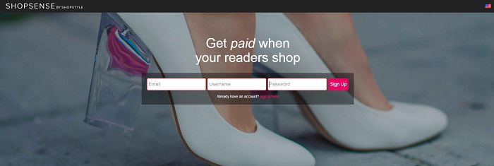
2. Sign up for an account here:  
    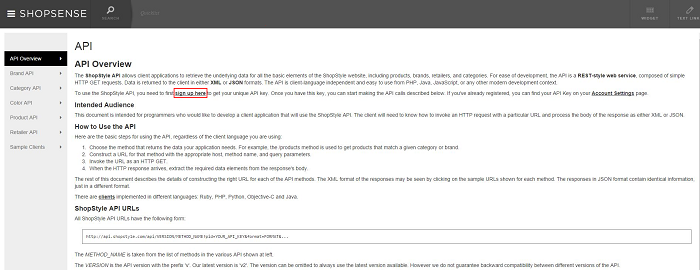
3. Once you are signed in, you can go to [https://shopsense.shopstyle.com/account](https://shopsense.shopstyle.com/account) to get your UID/API key.
4. In Visual studio, open web.config and add a new key element to the appSettings collection: 

    [!code-xml[Main](aspnet-mvc-facebook-birthday-app/samples/sample25.xml?highlight=6)]

    Run the application and you see that friends are now in birthday order. You can try the **Search** page by entering a search string and clicking **Search**, and you can see a list of recommended gifts by clicking a **Buy him a present** or **Buy her a present** link.

## Deploying the app to Windows Azure

So far your application has been running locally in IIS Express on your development computer. To make it available for other people to use, you have to deploy it to a web hosting provider. In this section of the tutorial you'll deploy it to a Windows Azure Web Site.

### Create a Windows Azure Web Site

To create a Windows Azure Web Site, follow the directions in the [Create a web site](https://www.windowsazure.com/en-us/develop/net/tutorials/get-started/#header-1) section of the [Deploying an ASP.NET Web Application to a Windows Azure Web Site](https://www.windowsazure.com/en-us/develop/net/tutorials/get-started/) tutorial.

### Tell Facebook about your Windows Azure Web Site

Next, you have to tell Facebook to use your Windows Azure URL instead of the localhost URL when it runs your application.

1. In your browser, go to the [Windows Azure Management Portal](https://manage.windowsazure.com/), click the **Web Sites** tab, and then click the web site that you created for your Facebook app.
2. Click the **Dashboard** tab, and then copy the URL from **Site URL**. It's on the right under the **Quick Glance** section. The URL will look like this: [http://yoursitename.azurewebsites.net](http://yoursitename.azurewebsites.net)  
    
3. Go to [https://developers.facebook.com/apps](https://developers.facebook.com/apps), click your app, and go to the **Settings** page.
4. On the Facebook Settings page for your app, paste the Windows Azure Web Site URL in the Canvas URL field. Add a slash (/) to the end of the URL.
5. Do the same for the **Secure Canvas UR** L field but change http to https.
6. Click **Save Changes** at the bottom of the page.  
    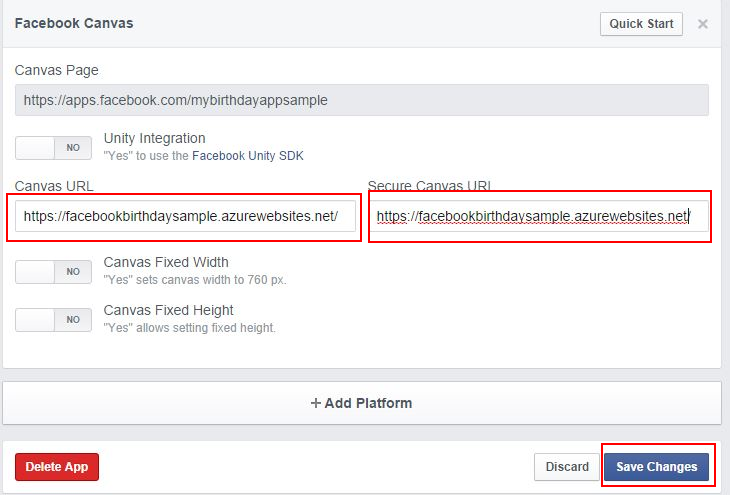

    > [!NOTE]
    > These instructions explain how to set up the application to use the default azurewebsites.net domain. When you use SSL with a URL in this domain, you are using an SSL certificate that is shared by all URLs in the same domain. If you want to use your own SSL certificate and your own domain, see [Configuring a custom domain name for a Windows Azure web site](https://www.windowsazure.com/en-us/develop/net/common-tasks/custom-dns-web-site/) and [Configuring an SSL certificate for a Windows Azure web site](https://www.windowsazure.com/en-us/develop/net/common-tasks/enable-ssl-web-site/).

## Deploy the Facebook Application project to the Windows Azure Web Site

Next, deploy your Facebook application to the Windows Azure Web Site by following the directions in the [Deploy the application to Windows Azure](https://www.windowsazure.com/en-us/develop/net/tutorials/get-started/#header-3) section of the same tutorial.

When you finish publishing the project, Visual Studio automatically opens a browser to the URL of your Windows Azure Web Site, and your application automatically redirects to the Facebook site. Your application is now running in the Facebook page as before, but now it is being served from your Windows Azure Web Site instead of from the local computer.

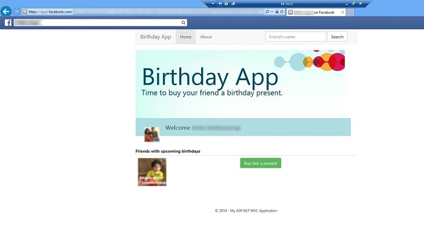

## Next steps

Yao Huang Lin wrote this Facebook Birthday application, and his blog post, [The new Facebook application template and library for ASP.NET MVC](https://blogs.msdn.com/b/webdev/archive/2012/12/13/the-new-facebook-application-template-and-library-for-asp.net-mvc.aspx), contains an excellent overview of the ASP.NET MVC Facebook library.

Kirthi Krishnamraju updated this tutorial based on the new Facebook API. [This](https://blogs.msdn.com/b/webdev/archive/2014/06/10/updating-the-mvc-facebook-api.aspx) blog post written by Taylor Mullen contains an excellent overview of the ASP.NET Facebook library.

You can enable your Facebook application to get real-time updates from Facebook by using the `UserRealtimeUpdateController` controller. For more information, see [Realtime Update in the ASP.NET MVC Facebook Template](http://trocolate.wordpress.com/2012/12/13/realtime-update-in-asp-net-mvc-facebook-template/) on Troy Dai's blog.

### Acknowledgements

- [Yao Huang Lin](https://blogs.msdn.com/b/yaohuang1/): [Yao](https://www.facebook.com/yaohl) is the principal developer for the ASP.NET MVC Facebook library and templates. Yao wrote the sample used in this tutorial.
- Kirthi Krishnamraju: Kirthi updated the sample. She is a Software Design Engineer in Test at Microsoft.
- [Rick Anderson](https://blogs.msdn.com/b/rickandy/): (twitter [@RickAndMSFT](http://twitter.com/RickAndMSFT) ) Rick co-authored this tutorial and is a senior programming writer for Microsoft focusing on Azure and MVC.
- Tom Dykstra: Tom co-authored this tutorial and is a senior programming writer on the Microsoft Web Platform &amp; Tools Content Team.
- [Troy Dai](http://trocolate.wordpress.com/): (twitter: [@troy\_dai](https://twitter.com/troy_dai) ) Troy is a Software Design Engineer in Test at Microsoft.