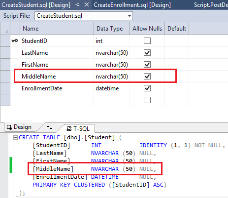
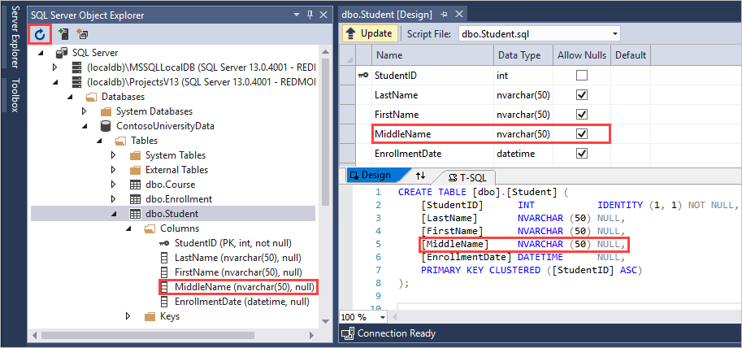
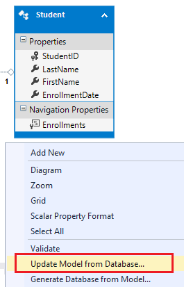
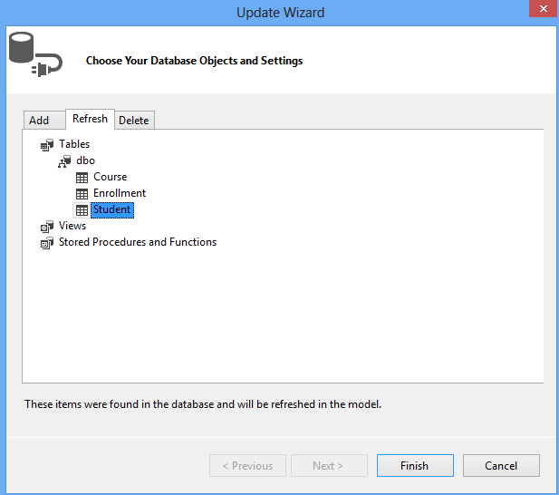
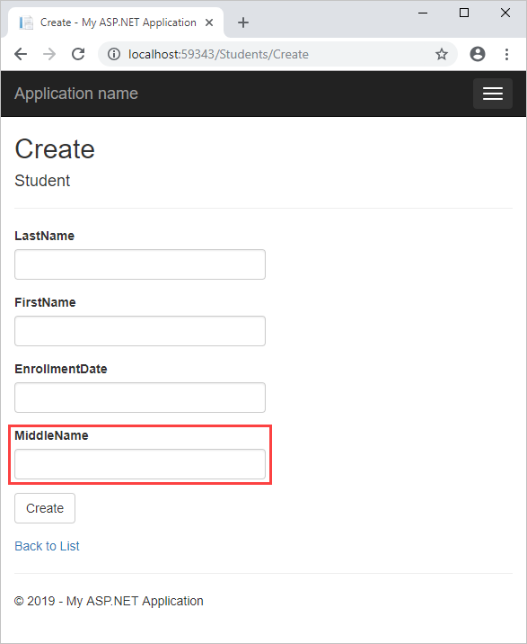

EF Database First with ASP.NET MVC: Changing the Database
====================
by [Tom FitzMacken](https://github.com/tfitzmac)

> Using MVC, Entity Framework, and ASP.NET Scaffolding, you can create a web application that provides an interface to an existing database. This tutorial series shows you how to automatically generate code that enables users to display, edit, create, and delete data that resides in a database table. The generated code corresponds to the columns in the database table.
> 
> This part of the series focuses on making an update to the database structure and propagating that change throughout the web application.

## Add a column

If you update the structure of a table in your database, you need to ensure that your change is propagated to the data model, views, and controller.

For this tutorial, you will add a new column to the Student table to record the middle name of the student. To add this column, open the database project, and open the Student.sql file. Through either the designer or the T-SQL code, add a column named **MiddleName** that is an NVARCHAR(50) and allows NULL values.

Deploy this change to your local database by starting your database project (or F5). The new field is added to the table. If you do not see it in the SQL Server Object Explorer, click the Refresh button in the pane.

The new column exists in the database table, but it does not currently exist in the data model class. You must update the model to include your new column. In the **Models** folder, open the **ContosoModel.edmx** file to display the model diagram. Notice that the Student model does not contain the MiddleName property. Right-click anywhere on the design surface, and select **Update Model from Database**.

In the Update Wizard, select the **Refresh** tab and the **Student** table.

Click **Finish**.

After the update process is finished, the database diagram includes the new **MiddleName** property. Save the **ContosoModel.edmx** file. You must save this file for the new property to be propagated to the **Student.cs** class. You have now updated the database and the model.

Build the solution.

Unfortunately, the views still do not contain the new property. To update the views you have two options - you can either re-generate the views by once again adding scaffolding for the Student class, or you can manually add the new property to your existing views. In this tutorial, you will add the scaffolding again because you have not made any customized changes to the automatically-generated views. You might consider manually adding the property when you have made changes to the views and do not want to lose those changes.

To ensure the views are re-created, delete the **Students** folder under **Views**, and delete the **StudentsController**. Then, right-click the **Controllers** folder and add scaffolding for the **Student** model. Again, name the controller **StudentsController**. Select **OK**.

The views now contain the MiddleName property.

In the next section, you will add code to customize the view for showing details about a student record.

>[!div class="step-by-step"]
[Previous](generating-views.md)
[Next](customizing-a-view.md)