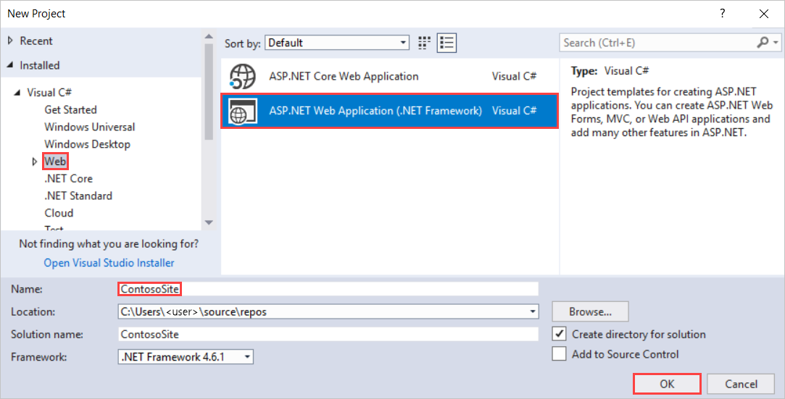
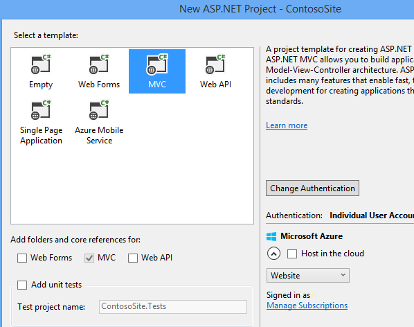
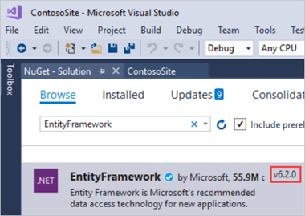
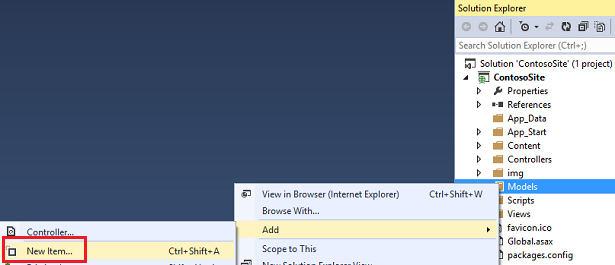
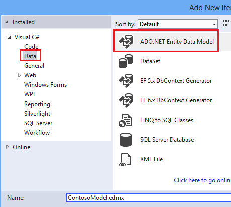
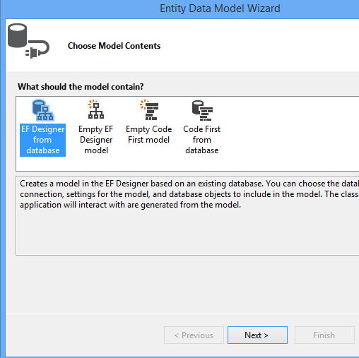
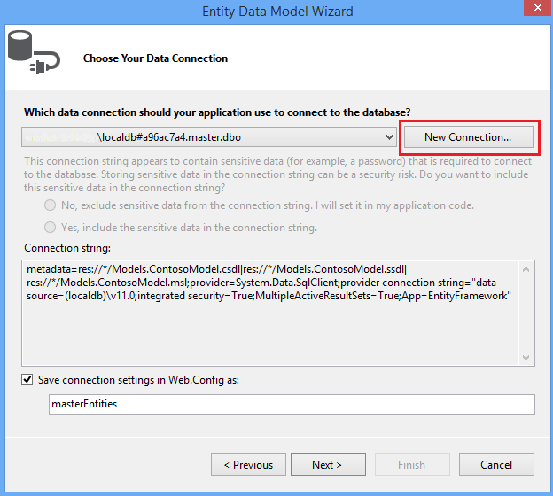
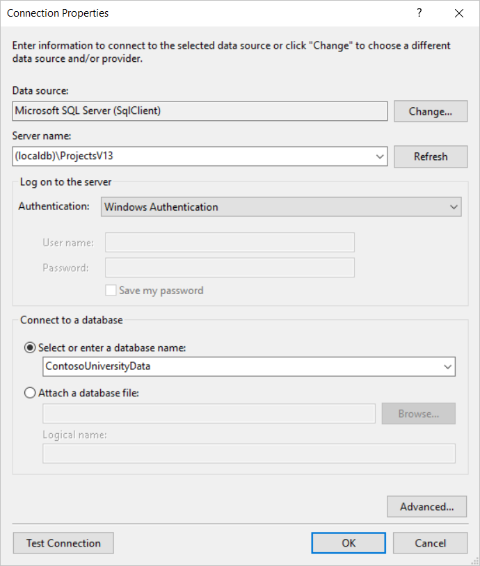
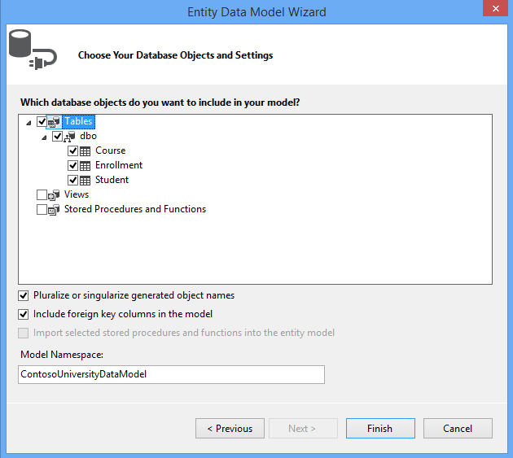
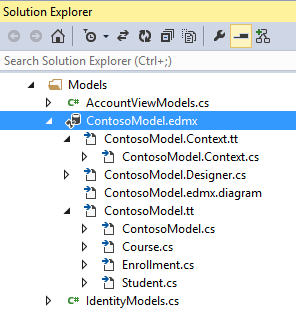

EF Database First with ASP.NET MVC: Creating the Web Application and Data Models
====================
by [Tom FitzMacken](https://github.com/tfitzmac)

> Using MVC, Entity Framework, and ASP.NET Scaffolding, you can create a web application that provides an interface to an existing database. This tutorial series shows you how to automatically generate code that enables users to display, edit, create, and delete data that resides in a database table. The generated code corresponds to the columns in the database table.
> 
> This part of the series focuses on creating the web application, and generating the data models based on your database tables.

## Create a new ASP.NET Web Application

In either a new solution or the same solution as the database project, create a new project in Visual Studio and select the **ASP.NET Web Application** template. Name the project **ContosoSite**.

Click **OK**.

In the New ASP.NET Project window, select the **MVC** template. You can clear the **Host in the cloud** option for now because you will deploy the application to the cloud later. Click **OK** to create the application.

The project is created with the default files and folders.

In this tutorial, you will use Entity Framework 6. You can double-check the version of Entity Framework in your project through the Manage NuGet Packages window. If necessary, update your version of Entity Framework.

## Generate the models

You will now create Entity Framework models from the database tables. These models are classes that you will use to work with the data. Each model mirrors a table in the database and contains properties that correspond to the columns in the table.

Right-click the **Models** folder, and select **Add** and **New Item**.

In the Add New Item window, select **Data** in the left pane and **ADO.NET Entity Data Model** from the options in the center pane. Name the new model file **ContosoModel**.

Click **Add**.

In the Entity Data Model Wizard, select **EF Designer from database**.

Click **Next**.

If you have database connections defined within your development environment, you may see one of these connections pre-selected. However, you want to create a new connection to the database you created in the first part of this tutorial. Click the **New Connection** button.

In the Connection Properties window, provide the name of the local server where your database was created (in this case **(localdb)\ProjectsV12**). After providing the server name, select the ContosoUniversityData from the available databases.

Click **OK**.

The correct connection properties are now displayed. You can use the default name for connection in the Web.Config file

Click **Next**.

Select **Tables** to generate models for all three tables.

Click **Finish**.

If you receive a security warning, select **OK** to continue running the template.

The models are generated from the database tables, and a diagram is displayed that shows the properties and relationships between the tables.

The Models folder now includes many new files related to the models that were generated from the database.

The **ContosoModel.Context.cs** file contains a class that derives from the **DbContext** class, and provides a property for each model class that corresponds to a database table. The **Course.cs**, **Enrollment.cs**, and **Student.cs** files contain the model classes that represent the databases tables. You will use both the context class and the model classes when working with scaffolding.

Before proceeding with this tutorial, build the project. In the next section, you will generate code based on the data models, but that section will not work if the project has not been built.

>[!div class="step-by-step"]
[Previous](setting-up-database.md)
[Next](generating-views.md)