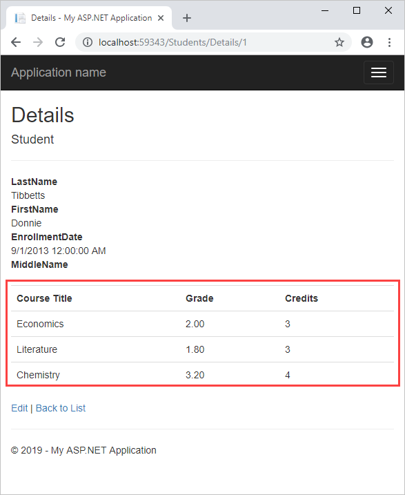

EF Database First with ASP.NET MVC: Customizing a View
====================
by [Tom FitzMacken](https://github.com/tfitzmac)

> Using MVC, Entity Framework, and ASP.NET Scaffolding, you can create a web application that provides an interface to an existing database. This tutorial series shows you how to automatically generate code that enables users to display, edit, create, and delete data that resides in a database table. The generated code corresponds to the columns in the database table.
> 
> This part of the series focuses on changing the automatically-generated views to enhance the presentation.

## Add enrolled courses to student details

The generated code provides a good starting point for your application but it does not necessarily provide all of the functionality that you need in your application. You can customize the code to meet the particular requirements of your application. Currently, your application does not display the enrolled courses for the selected student. In this section, you will add the enrolled courses for each student to the **Details** view for the student.

Open **Students/Details.cshtml**, and below the last &lt;/dl&gt; tab, but before the closing &lt;/div&gt; tag, add the following code.

[!code-cshtml[Main](customizing-a-view/samples/sample1.cshtml)]

This code creates a table that displays a row for each record in the Enrollment table for the selected student. The **Display** method renders HTML for the object (modelItem) that represents the expression. You use the Display method (rather than simply embedding the property value in the code) to make sure the value is formatted correctly based on its type and the template for that type. In this example, each expression returns a single property from the current record in the loop, and the values are primitive types which are rendered as text.

Browse to the Students/Index view again and select **Details** for one of the students. You will see the enrolled courses have been included in the view.

>[!div class="step-by-step"]
[Previous](changing-the-database.md)
[Next](enhancing-data-validation.md)