EF Database First with ASP.NET MVC: Generating Views
====================
by [Tom FitzMacken](https://github.com/tfitzmac)

> Using MVC, Entity Framework, and ASP.NET Scaffolding, you can create a web application that provides an interface to an existing database. This tutorial series shows you how to automatically generate code that enables users to display, edit, create, and delete data that resides in a database table. The generated code corresponds to the columns in the database table.
> 
> This part of the series focuses on using ASP.NET Scaffolding to generate the controllers and views.

## Add scaffold

You are ready to generate code that will provide standard data operations for the model classes. You add the code by adding a scaffold item. There are many options for the type of scaffolding you can add; in this tutorial, the scaffold will include a controller and views that correspond to the Student and Enrollment models you created in the previous section.

To maintain consistency in your project, you will add the new controller to the existing **Controllers** folder. Right-click the **Controllers** folder, and select **Add** – **New Scaffolded Item**.

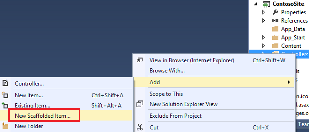

Select the **MVC 5 Controller with views, using Entity Framework** option. This option will generate the controller and views for updating, deleting, creating and displaying the data in your model.

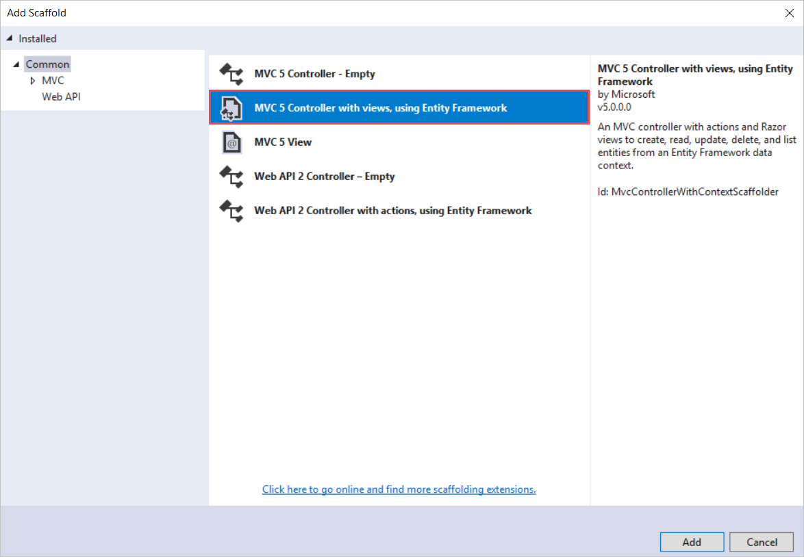

Select **Student** for the model class, and select the **ContosoUniversityEntities** for the context class. Keep the controller name as **StudentsController**,

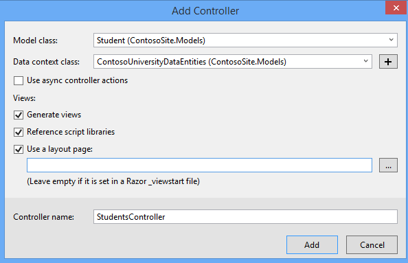

Click **Add**.

If you receive an error, it may be because you did not build the project in the previous section. If so, try building the project, and then add the scaffolded item again.

After the code generation process is complete, you will see a new controller and views in your project.

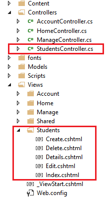

Perform the same steps again, but add a scaffold for the Enrollment class. When finished, you should have an **EnrollmentsController.cs** file, and a folder under **Views** named **Enrollments** with the Create, Delete, Details, Edit and Index views.

## Add links to new views

To make it easier for you to navigate to your new views, you can add a couple of hyperlinks to the Index views for students and enrollments. Open the file at **Views/Home/Index.cshtml**, which is the home page for your site. Add the following code below the jumbotron.

[!code-cshtml[Main](generating-views/samples/sample1.cshtml)]

For the ActionLink method, the first parameter is the text to display in the link. The second parameter is the action and the third parameter is the name of the controller. For example, the first link points to the Index action in StudentsController. The actual hyperlink is constructed from these values. The first link ultimately takes users to the **Index.cshtml** file within the **Views/Students** folder.

## Display student views

You will verify that the code added to your project correctly displays a list of the students, and enables users to edit, create, or delete the student records in the database.

Right-click the **Views/Home/Index.cshtml** file, and select **View in Browser**. On this page, click the link for the list of students.

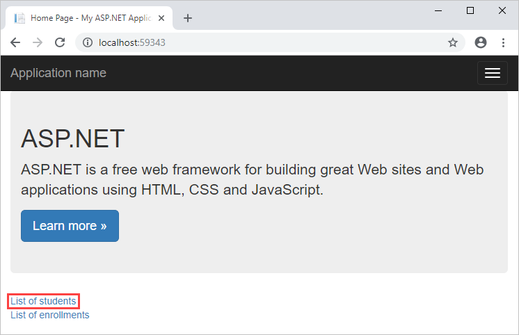

On this page, notice the list of the students and links to modify this data.

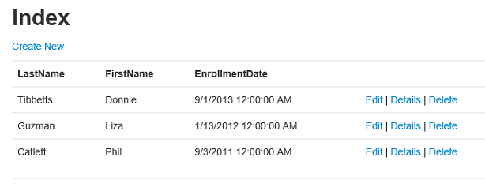

Click the **Create New** link and provide some values for a new student.

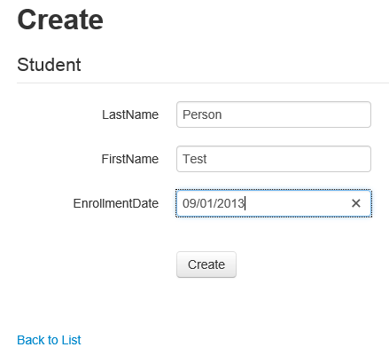

Click **Create**, and notice the new student is added to your list.

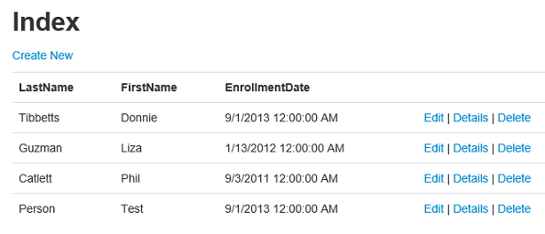

Select the **Edit** link, and change some of the values for a student.

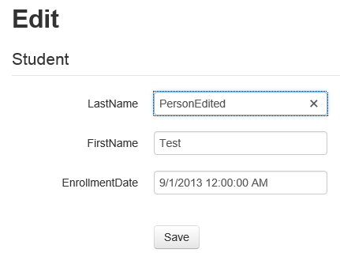

Click **Save**, and notice the student record has been changed.

Finally, select the **Delete** link and confirm that you want to delete the record by clicking the **Delete** button.

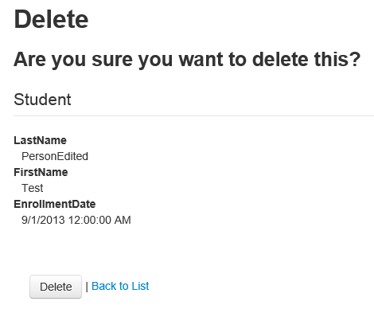

Without writing any code, you have added views that perform common operations on the data in the Student table.

You may have noticed that the text label for a field is based on the database property (such as **LastName**) which is not necessarily what you want to display on the web page. For example, you may prefer the label to be **Last Name**. You will fix this display issue later in the tutorial.

## Display enrollment views

Your database includes a one-to-many relationship between the Student and Enrollment tables, and a one-to-many relationship between the Course and Enrollment tables. The views for Enrollment correctly handle these relationships. Navigate to the home page for your site and select the **List of enrollments** link and then the **Create New** link. The view displays a form for creating a new enrollment record. In particular, notice that the form contains two drop-down lists that are populated with values from the related tables.

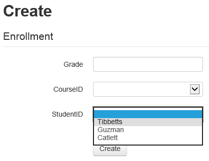

Furthermore, validation of the provided values is automatically applied based on the data type of the field. Grade requires a number, so an error message is displayed if you try to provide an incompatible value.

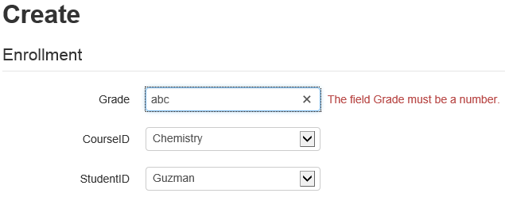

You have verified that the automatically-generated views enable users to work with the data in the database. In the next tutorial in this series, you will update the database and make the corresponding changes in the web application.

>[!div class="step-by-step"]
[Previous](creating-the-web-application.md)
[Next](changing-the-database.md)