Publish MVC Database First site to Azure
====================
by [Tom FitzMacken](https://github.com/tfitzmac)

> Using MVC, Entity Framework, and ASP.NET Scaffolding, you can create a web application that provides an interface to an existing database. This tutorial series shows you how to automatically generate code that enables users to display, edit, create, and delete data that resides in a database table. The generated code corresponds to the columns in the database table.
> 
> This part of the series focuses on publishing the web app and database to Azure. You can read this topic to learn about publishing a web app and database, but to actually perform the steps you must start at the beginning of the tutorial. See [Getting Started](setting-up-database.md).

## Deploy your web app on Azure

You need an Azure account to complete this tutorial:

- You can [open an Azure account for free](https://azure.microsoft.com/en-us/pricing/free-trial/?WT.mc_id=A261C142F) - You get credits you can use to try out paid Azure services, and even after they're used up you can keep the account and use free Azure services.
- You can [activate MSDN subscriber benefits](https://azure.microsoft.com/en-us/pricing/member-offers/msdn-benefits-details/?WT.mc_id=A261C142F) - Your MSDN subscription gives you credits every month that you can use for paid Azure services.

To publish your web app, right-click the project and select **Publish**.

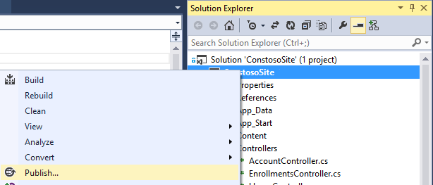

Select Microsoft Azure Websites.

If you are not signed in to Azure, provide your Azure account credentials. Then, select New to create a new web app.

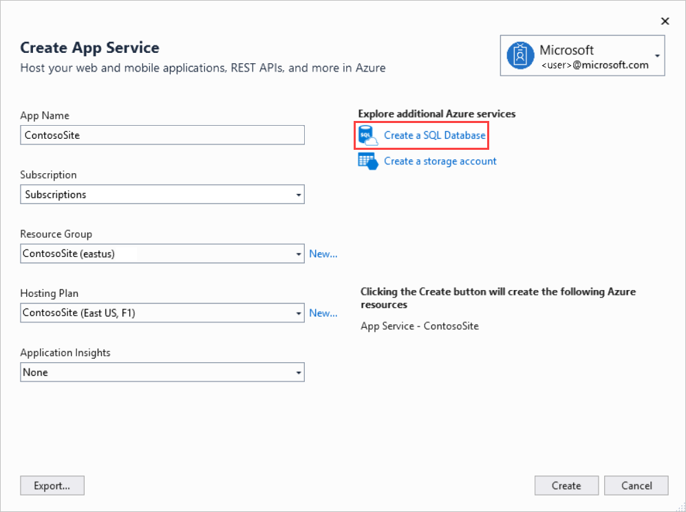

Create a unique name for your web app. You will know the name is unique if you see a green check mark to the right of the name field. Select a region for your web app. Select **Create new server** for the database, and provide a user name and password for this new database server. When finished, click **Create**.

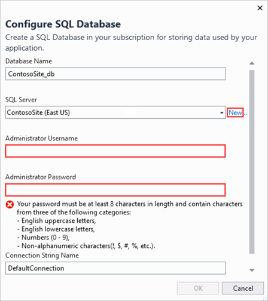

Your connection values are now all set. You can leave these values unchanged.

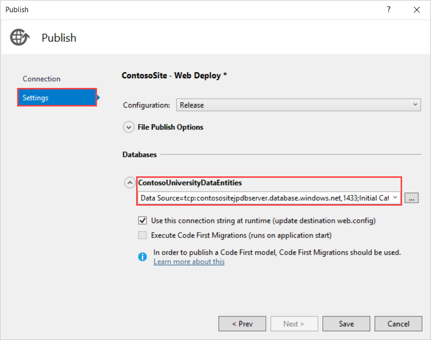

Click **Next**.

For Settings, notice that two database connections are specified - ApplicationDBContext and ContosoUniversityDataEntities. ApplicationDBContext is the connection for user account tables. These values only show the connection strings for the databases. It does not mean that these databases will be published when you publish your site. You will publish your database project after you have finished publishing the web app.

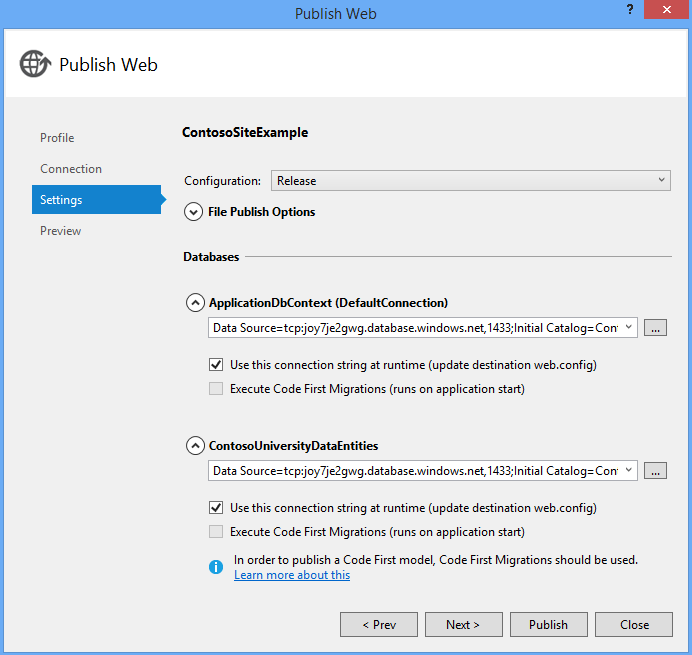

The ellipsis (...) next to the database connection shows you the details of the connection string. Click the ellipsis next to ContosoUniversityDataEntities.

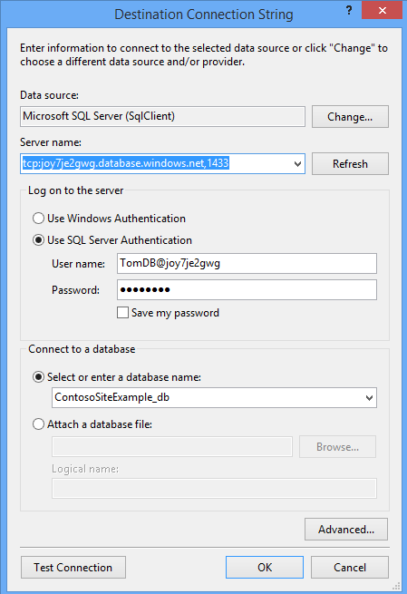

Note the name of the database server and the database. The server name is randomly generated. The database name is simple the name of your site with **\_db** appended. You will need both names later when you publish your database.

Click **OK** to close the database connection string window.

In the Publish Web window, click **Next** to see the preview.

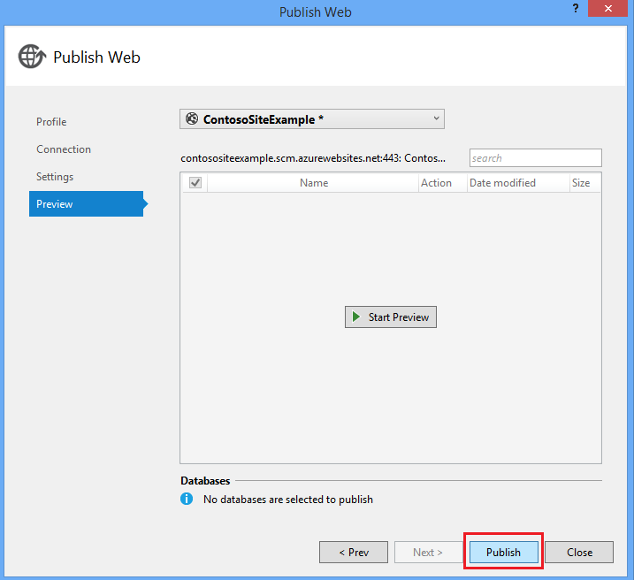

You can click Start Preview to see a list of the files to publish. Since this is the first time you have published this site, the list is every relevant file in the project.

Click **Publish**.

The Output pane will display the result of your publication.

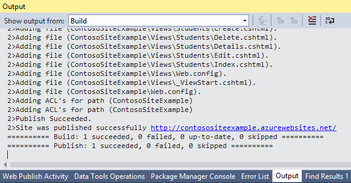

After publication, the site is immedialely launched in a web browser. Your site has been deployed and you can register a new user to the site; however, your tables in the ContosoUniversityData project have not yet been published. If you click on the List of students link you will receive an error.

## Publish database to SQL Azure

Before publishing your database, you must make sure your local computer can connect to the database server. The firewall for your database server restricts which machines can connect to the database. You need to add the IP address of your computer to the allowed IP addresses for the firewall.

Login to your Azure account through the Azure portal.

Select your new database and select **Manage**.

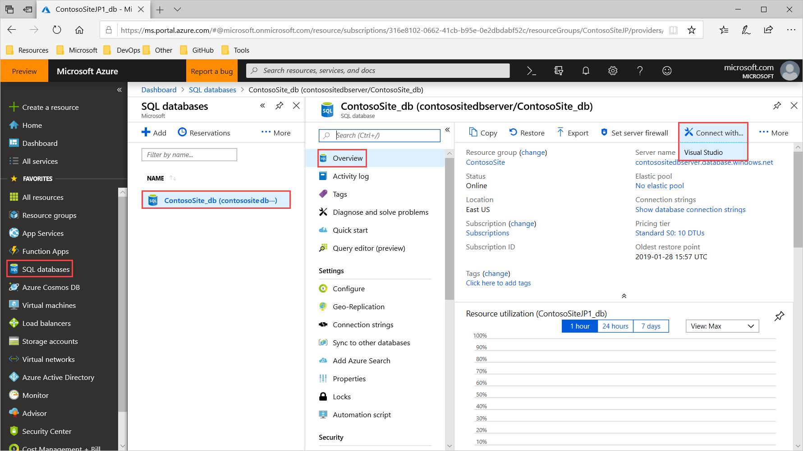

You must configure your database server to allow connections from your computer. When you select Manage, you are asked to add the current IP address as permitted to the database server. Select Yes.

There is a chance that the IP address you added in the previous step is not the only IP address you need to configure for connections. You can attempt to login to the database to see if the connections have been properly set up. Provide the user and password you created earlier.

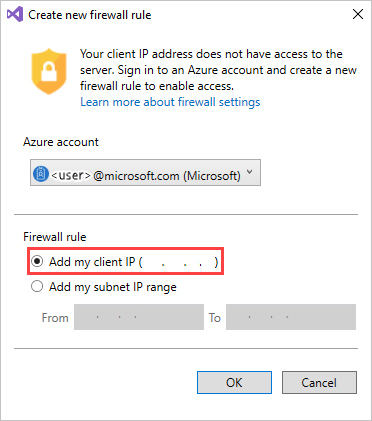

If you receive an error message, you need to add another IP address. Click the error message to see more details about error. In the details you will see the IP address that you need to add. Note this IP address.

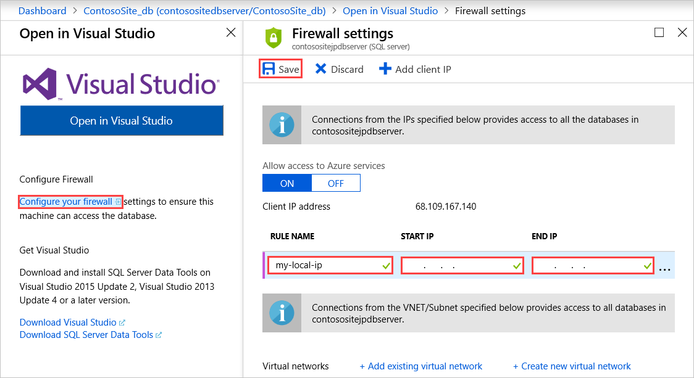

Close this login window, and return to the Azure portal.

Navigate to the Dashboard for your database. Click **Manage allowed IP addresses**.

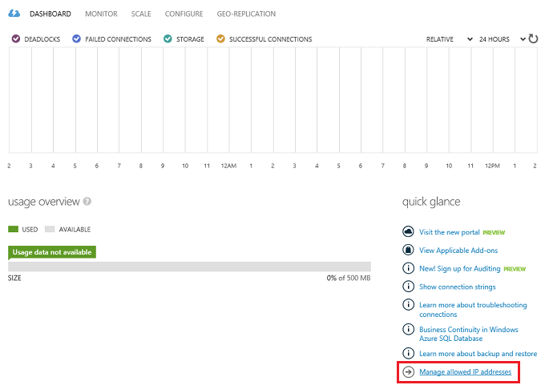

You must now add the IP address from the error message. Either change the range of allowed IP addresses to include the one from the error message, or add that IP address as a separate entry.

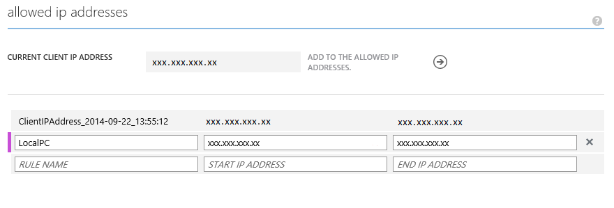

Save the change to allowed IP addresses.

Click Manage, and try logging in again to the database. You may need to wait a few minutes before the allowed IP addresses are correctly configured for the firewall. When you can successfully log in the database, you have finished setting up your connection to the database.

You can leave this management window open because you will check the result of your database deployment shortly.

Return to your database project. Right-click the project and select **Publish**.

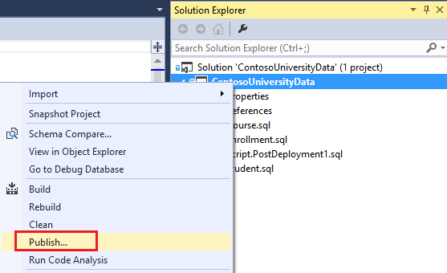

In the Publish Database window, select **Edit**.

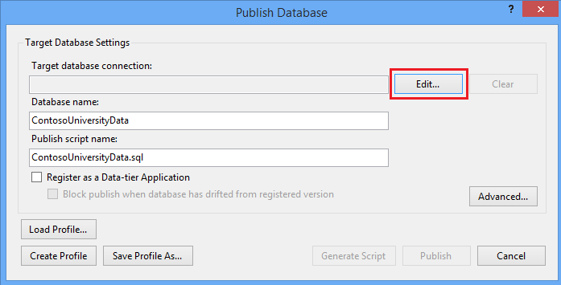

Provide the name of the database server and your authentication credentials for the server. After providing the credentials, select the database you created from the list of available databases. By default, Visual Studio sets the name of the database field to the name of your project which might not be the same as the database you created.

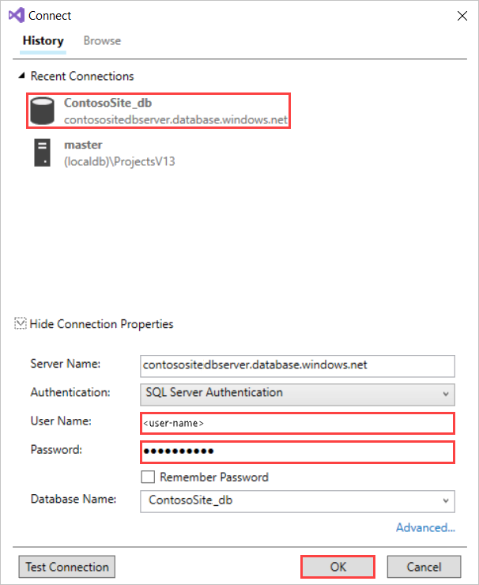

Click OK.

You will probably want to save this profile so you can publish updates in the future without re-entering all of the connection information. Select **Create Profile**.

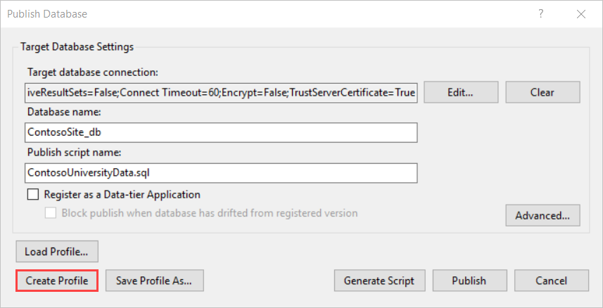

It will create a file in your project named **ContosoUniversityData.publish.xml**. The next time you want to publish the database to Azure, simply load that profile.

Now, click **Publish** to create the database on Azure.

After running for a while, the publishing results are displayed.

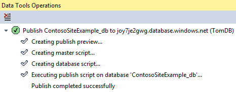

Now, you can go back to the management portal for your database. Refresh the design view, and notice the 3 tables with pre-filled data have been deployed.

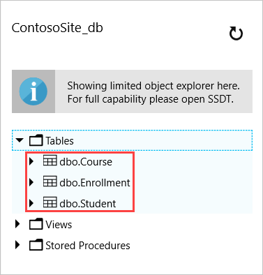

Now you are ready to test the web app that is deployed to Azure. Navigate to the web app on Azure (such as http://contosositeexample.azurewebsites.net/). Click the link for List of students and you should see the index view for students.

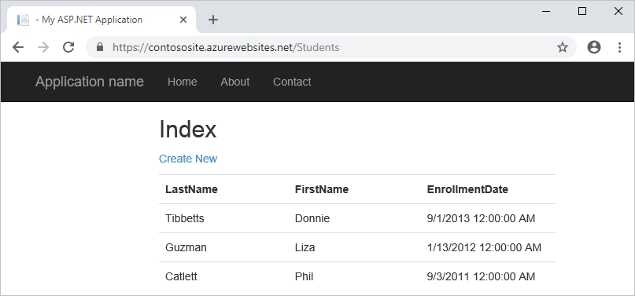

Occasionally, the database and connection need a little time to be properly configured. If you receive an error, wait a few minutes and then try again.

## Conclusion

This series provided a simple example of how to generate code from an existing database that enables users to edit, update, create and delete data. It used ASP.NET MVC 5, Entity Framework and ASP.NET Scaffolding to create the project.

For an introductory example of Code First development, see [Getting Started with ASP.NET MVC 5](../introduction/getting-started.md).

For a more advanced example, see [Creating an Entity Framework Data Model for an ASP.NET MVC 4 App](../getting-started-with-ef-using-mvc/creating-an-entity-framework-data-model-for-an-asp-net-mvc-application.md). Note that the DbContext API that you use for working with data in Database First is the same as the API you use for working with data in Code First. Even if you intend to use Database First, you can learn how to handle more complex scenarios such as reading and updating related data, handling concurrency conflicts, and so forth from a Code First tutorial. The only difference is in how the database, context class, and entity classes are created.

>[!div class="step-by-step"]
[Previous](enhancing-data-validation.md)