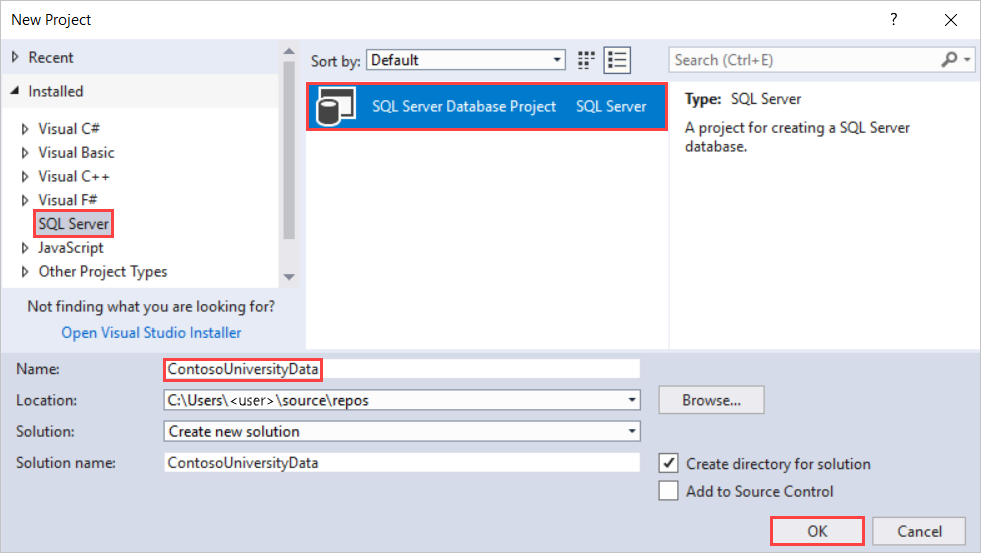
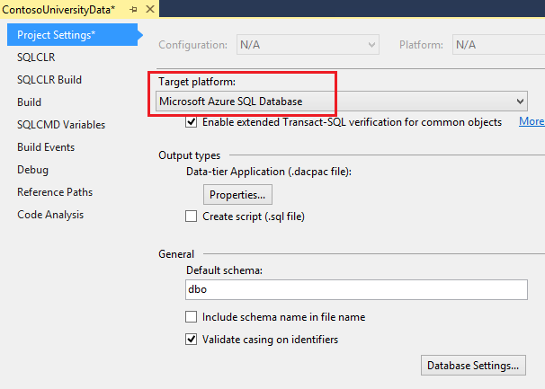
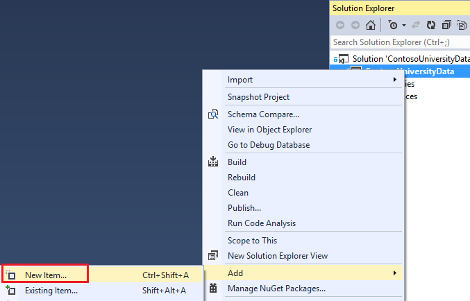
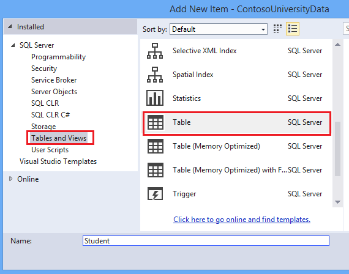
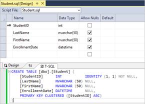
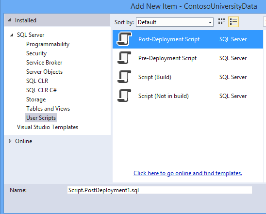
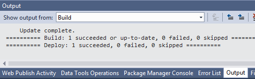
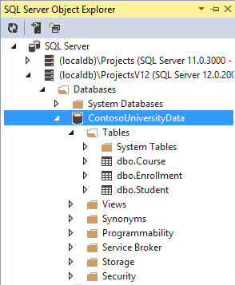
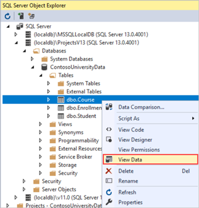
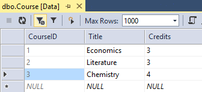

Getting Started with Entity Framework 6 Database First using MVC 5
====================
by [Tom FitzMacken](https://github.com/tfitzmac)

> Using MVC, Entity Framework, and ASP.NET Scaffolding, you can create a web application that provides an interface to an existing database. This tutorial series shows you how to automatically generate code that enables users to display, edit, create, and delete data that resides in a database table. The generated code corresponds to the columns in the database table. In the last part of the series, you will deploy the site and database to Azure.
> 
> This part of the series focuses on creating a database and populating it with data.
> 
> This series was written with contributions from Tom Dykstra and Rick Anderson. It was improved based on feedback from users in the comments section.

## Introduction

This topic shows how to start with an existing database and quickly create a web application that enables users to interact with the data. It uses the Entity Framework 6 and MVC 5 to build the web application. The ASP.NET Scaffolding feature enables you to automatically generate code for displaying, updating, creating and deleting data. Using the publishing tools within Visual Studio, you can easily deploy the site and database to Azure.

This topic addresses the situation where you have a database and want to generate code for a web application based on the fields of that database. This approach is called Database First development. If you do not already have an existing database, you can instead use an approach called Code First development which involves defining data classes and generating the database from the class properties.

For an introductory example of Code First development, see [Getting Started with ASP.NET MVC 5](../introduction/getting-started.md). For a more advanced example, see [Creating an Entity Framework Data Model for an ASP.NET MVC 4 App](../getting-started-with-ef-using-mvc/creating-an-entity-framework-data-model-for-an-asp-net-mvc-application.md).

For guidance on selecting which Entity Framework approach to use, see [Entity Framework Development Approaches](https://msdn.microsoft.com/en-us/library/ms178359.aspx#dbfmfcf).

## Prerequisites

Visual Studio 2013 or Visual Studio Express 2013 for Web

## Set up the database

To mimic the environment of having an existing database, you will first create a database with some pre-filled data, and then create your web application that connects to the database.

This tutorial was developed using LocalDB with either Visual Studio 2013 or Visual Studio Express 2013 for Web. You can use an existing database server instead of LocalDB, but depending on your version of Visual Studio and your type of database, all of the data tools in Visual Studio might not be supported. If the tools are not available for your database, you may need to perform some of the database-specific steps within the management suite for your database.

If you have a problem with the database tools in your version of Visual Studio, make sure you have installed the latest version of the database tools. For information about updating or installing the database tools, see [Microsoft SQL Server Data Tools](https://msdn.microsoft.com/en-us/data/hh297027).

Launch Visual Studio and create a **SQL Server Database Project**. Name the project **ContosoUniversityData**.

You now have an empty database project. You will deploy this database to Azure later in this tutorial, so you'll need to set Azure SQL Database as the target platform for the project. Setting the target platform does not actually deploy the database; it only means that the database project will verify that the database design is compatible with the target platform. To set the target platform, open the **Properties** for the project and select **Microsoft Azure SQL Database** for the target platform.

You can create the tables needed for this tutorial by adding SQL scripts that define the tables. Right-click your project and add a new item.

Add a new table named Student.

In the table file, replace the T-SQL command with the following code to create the table.

[!code-sql[Main](setting-up-database/samples/sample1.sql)]

Notice that the design window automatically synchronizes with the code. You can work with either the code or designer.

Add another table. This time name it Course and use the following T-SQL command.

[!code-sql[Main](setting-up-database/samples/sample2.sql)]

And, repeat one more time to create a table named Enrollment.

[!code-sql[Main](setting-up-database/samples/sample3.sql)]

You can populate your database with data through a script that is run after the database is deployed. Add a Post-Deployment Script to the project. You can use the default name.

Add the following T-SQL code to the post-deployment script. This script simply adds data to the database when no matching record is found. It does not overwrite or delete any data you may have entered into the database.

[!code-sql[Main](setting-up-database/samples/sample4.sql)]

It is important to note that the post-deployment script is run every time you deploy your database project. Therefore, you need to carefully consider your requirements when writing this script. In some cases, you may wish to start over from a known set of data every time the project is deployed. In other cases, you may not want to alter the existing data in any way. Based on your requirements, you can decide whether you need a post-deployment script or what you need to include in the script. For more information about populating your database with a post-deployment script, see [Including Data in a SQL Server Database Project](https://blogs.msdn.com/b/ssdt/archive/2012/02/02/including-data-in-an-sql-server-database-project.aspx).

You now have 4 SQL script files but no actual tables. You are ready to deploy your database project to localdb. In Visual Studio, click the Start button (or F5) to build and deploy your database project. Check the Output tab to verify that the build and deployment succeeded.

To see that the new database has been created, open **SQL Server Object Explorer** and look for the name of the project in the correct local database server (in this case **(localdb)\ProjectsV12**).

To see that the tables are populated with data, right-click a table, and select **View Data**.

An editable view of the table data is displayed.

Your database is now set up and populated with data. In the next tutorial, you will create a web application for the database.

>[!div class="step-by-step"]
[Next](creating-the-web-application.md)