Advanced Entity Framework 6 Scenarios for an MVC 5 Web Application (12 of 12)
====================
by [Tom Dykstra](https://github.com/tdykstra)

[Download Completed Project](http://code.msdn.microsoft.com/ASPNET-MVC-Application-b01a9fe8) or [Download PDF](http://download.microsoft.com/download/0/F/B/0FBFAA46-2BFD-478F-8E56-7BF3C672DF9D/Getting%20Started%20with%20Entity%20Framework%206%20Code%20First%20using%20MVC%205.pdf)

> The Contoso University sample web application demonstrates how to create ASP.NET MVC 5 applications using the Entity Framework 6 Code First and Visual Studio 2013. For information about the tutorial series, see [the first tutorial in the series](creating-an-entity-framework-data-model-for-an-asp-net-mvc-application.md).

In the previous tutorial you implemented table-per-hierarchy inheritance. This tutorial includes introduces several topics that are useful to be aware of when you go beyond the basics of developing ASP.NET web applications that use Entity Framework Code First. Step-by-step instructions walk you through the code and using Visual Studio for the following topics:

- [Performing raw SQL queries](#rawsql)
- [Performing no-tracking queries](#notracking)
- [Examining SQL sent to the database](#sql)

The tutorial introduces several topics with brief introductions followed by links to resources for more information:

- [Repository and unit of work patterns](#repo)
- [Proxy classes](#proxies)
- [Automatic change detection](#changedetection)
- [Automatic validation](#validation)
- [EF tools for Visual Studio](#tools)
- [Entity Framework source code](#source)

The tutorial also includes the following sections:

- [Summary](#summary)
- [Acknowledgments](#acknowledgments)
- [A note about VB](#vb)
- [Common errors, and solutions or workarounds for them](#errors)

For most of these topics, you'll work with pages that you already created. To use raw SQL to do bulk updates you'll create a new page that updates the number of credits of all courses in the database:

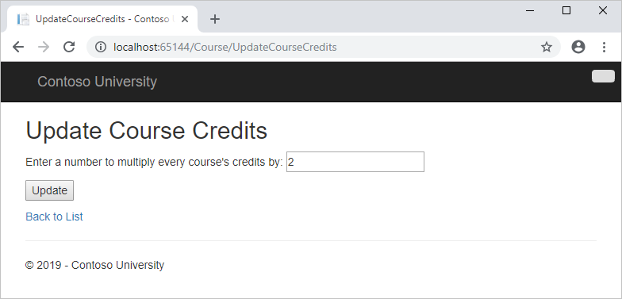

## Performing Raw SQL Queries

The Entity Framework Code First API includes methods that enable you to pass SQL commands directly to the database. You have the following options:

- Use the [DbSet.SqlQuery](https://msdn.microsoft.com/en-us/library/system.data.entity.dbset.sqlquery.aspx) method for queries that return entity types. The returned objects must be of the type expected by the `DbSet` object, and they are automatically tracked by the database context unless you turn tracking off. (See the following section about the [AsNoTracking](https://msdn.microsoft.com/en-us/library/system.data.entity.dbextensions.asnotracking.aspx) method.)
- Use the [Database.SqlQuery](https://msdn.microsoft.com/en-us/library/system.data.entity.database.sqlquery.aspx) method for queries that return types that aren't entities. The returned data isn't tracked by the database context, even if you use this method to retrieve entity types.
- Use the [Database.ExecuteSqlCommand](https://msdn.microsoft.com/en-us/library/gg679456.aspx) for non-query commands.

One of the advantages of using the Entity Framework is that it avoids tying your code too closely to a particular method of storing data. It does this by generating SQL queries and commands for you, which also frees you from having to write them yourself. But there are exceptional scenarios when you need to run specific SQL queries that you have manually created, and these methods make it possible for you to handle such exceptions.

As is always true when you execute SQL commands in a web application, you must take precautions to protect your site against SQL injection attacks. One way to do that is to use parameterized queries to make sure that strings submitted by a web page can't be interpreted as SQL commands. In this tutorial you'll use parameterized queries when integrating user input into a query.

### Calling a Query that Returns Entities

The [DbSet&lt;TEntity&gt;](https://msdn.microsoft.com/en-us/library/gg696460.aspx) class provides a method that you can use to execute a query that returns an entity of type `TEntity`. To see how this works you'll change the code in the `Details` method of the `Department` controller.

In *DepartmentController.cs*, in the `Details` method, replace the `db.Departments.FindAsync` method call with a `db.Departments.SqlQuery` method call, as shown in the following highlighted code:

[!code-csharp[Main](advanced-entity-framework-scenarios-for-an-mvc-web-application/samples/sample1.cs?highlight=8-14)]

To verify that the new code works correctly, select the **Departments** tab and then **Details** for one of the departments.

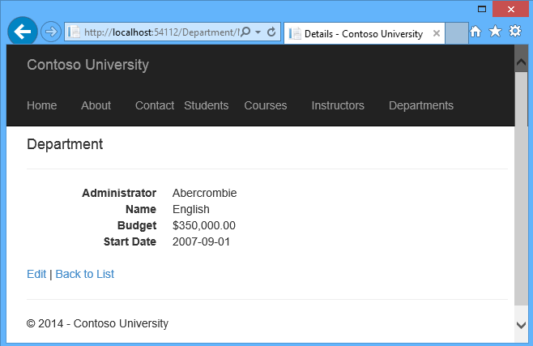

### Calling a Query that Returns Other Types of Objects

Earlier you created a student statistics grid for the About page that showed the number of students for each enrollment date. The code that does this in *HomeController.cs* uses LINQ:

[!code-csharp[Main](advanced-entity-framework-scenarios-for-an-mvc-web-application/samples/sample2.cs)]

Suppose you want to write the code that retrieves this data directly in SQL rather than using LINQ. To do that you need to run a query that returns something other than entity objects, which means you need to use the [Database.SqlQuery](https://msdn.microsoft.com/en-us/library/system.data.entity.database.sqlquery(v=VS.103).aspx) method.

In *HomeController.cs*, replace the LINQ statement in the `About` method with a SQL statement, as shown in the following highlighted code:

[!code-csharp[Main](advanced-entity-framework-scenarios-for-an-mvc-web-application/samples/sample3.cs?highlight=3-18)]

Run the About page. It displays the same data it did before.

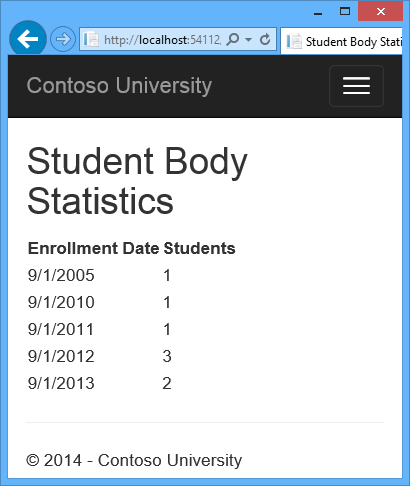

### Calling an Update Query

Suppose Contoso University administrators want to be able to perform bulk changes in the database, such as changing the number of credits for every course. If the university has a large number of courses, it would be inefficient to retrieve them all as entities and change them individually. In this section you'll implement a web page that enables the user to specify a factor by which to change the number of credits for all courses, and you'll make the change by executing a SQL `UPDATE` statement. The web page will look like the following illustration:

In *CourseContoller.cs*, add `UpdateCourseCredits` methods for `HttpGet` and `HttpPost`:

[!code-csharp[Main](advanced-entity-framework-scenarios-for-an-mvc-web-application/samples/sample4.cs)]

When the controller processes an `HttpGet` request, nothing is returned in the `ViewBag.RowsAffected` variable, and the view displays an empty text box and a submit button, as shown in the preceding illustration.

When the **Update** button is clicked, the `HttpPost` method is called, and `multiplier` has the value entered in the text box. The code then executes the SQL that updates courses and returns the number of affected rows to the view in the `ViewBag.RowsAffected` variable. When the view gets a value in that variable, it displays the number of rows updated instead of the text box and submit button, as shown in the following illustration:

In *CourseController.cs*, right-click one of the `UpdateCourseCredits` methods, and then click **Add View**.

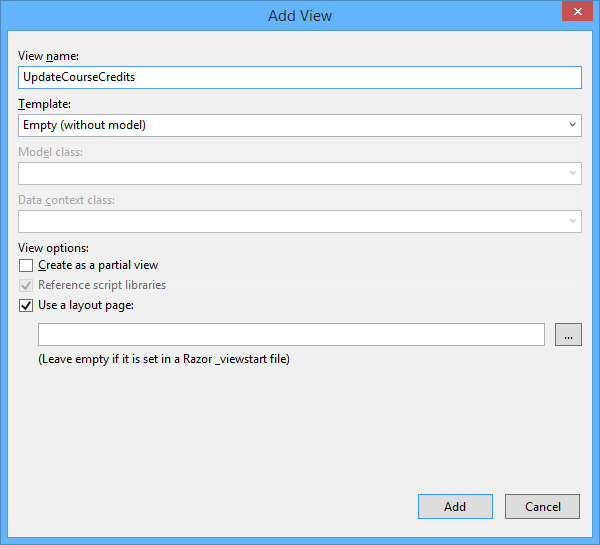

In *Views\Course\UpdateCourseCredits.cshtml*, replace the template code with the following code:

[!code-cshtml[Main](advanced-entity-framework-scenarios-for-an-mvc-web-application/samples/sample5.cshtml)]

Run the `UpdateCourseCredits` method by selecting the **Courses** tab, then adding "/UpdateCourseCredits" to the end of the URL in the browser's address bar (for example: `http://localhost:50205/Course/UpdateCourseCredits`). Enter a number in the text box:

Click **Update**. You see the number of rows affected:

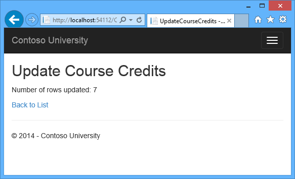

Click **Back to List** to see the list of courses with the revised number of credits.

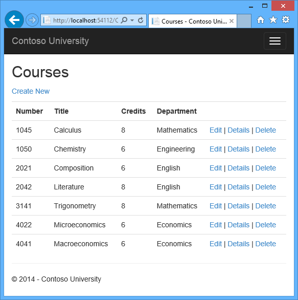

For more information about raw SQL queries, see [Raw SQL Queries](https://msdn.microsoft.com/en-us/data/jj592907) on MSDN.

## No-Tracking Queries

When a database context retrieves table rows and creates entity objects that represent them, by default it keeps track of whether the entities in memory are in sync with what's in the database. The data in memory acts as a cache and is used when you update an entity. This caching is often unnecessary in a web application because context instances are typically short-lived (a new one is created and disposed for each request) and the context that reads an entity is typically disposed before that entity is used again.

You can disable tracking of entity objects in memory by using the [AsNoTracking](https://msdn.microsoft.com/en-us/library/gg679352(v=vs.103).aspx) method. Typical scenarios in which you might want to do that include the following:

- A query retrieves such a large volume of data that turning off tracking might noticeably enhance performance.
- You want to attach an entity in order to update it, but you earlier retrieved the same entity for a different purpose. Because the entity is already being tracked by the database context, you can't attach the entity that you want to change. One way to handle this situation is to use the `AsNoTracking` option with the earlier query.

For an example that demonstrates how to use the [AsNoTracking](https://msdn.microsoft.com/en-us/library/gg679352(v=vs.103).aspx) method, see [the earlier version of this tutorial](../../older-versions/getting-started-with-ef-5-using-mvc-4/advanced-entity-framework-scenarios-for-an-mvc-web-application.md). This version of the tutorial doesn't set the Modified flag on a model-binder-created entity in the Edit method, so it doesn't need `AsNoTracking`.

## Examining SQL sent to the database

Sometimes it's helpful to be able to see the actual SQL queries that are sent to the database. In an earlier tutorial you saw how to do that in interceptor code; now you'll see some ways to do it without writing interceptor code. To try this out, you'll look at a simple query and then look at what happens to it as you add options such eager loading, filtering, and sorting.

In *Controllers/CourseController*, replace the `Index` method with the following code, in order to temporarily stop eager loading:

[!code-csharp[Main](advanced-entity-framework-scenarios-for-an-mvc-web-application/samples/sample6.cs)]

Now set a breakpoint on the `return` statement (F9 with the cursor on that line). Press F5 to run the project in debug mode, and select the Course Index page. When the code reaches the breakpoint, examine the `sql` variable. You see the query that's sent to SQL Server. It's a simple `Select` statement.

[!code-json[Main](advanced-entity-framework-scenarios-for-an-mvc-web-application/samples/sample7.json)]

Click the magnifying class to see the query in the **Text Visualizer**.

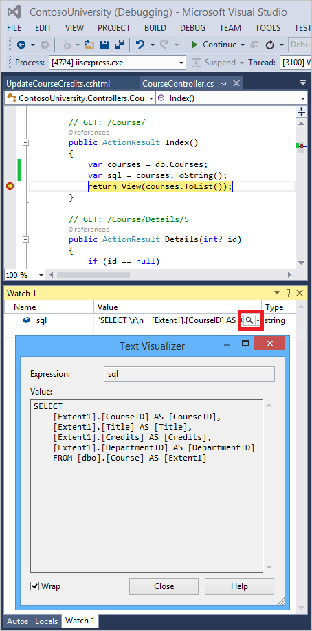

Now you'll add a drop-down list to the Courses Index page so that users can filter for a particular department. You'll sort the courses by title, and you'll specify eager loading for the `Department` navigation property.

In *CourseController.cs*, replace the `Index` method with the following code:

[!code-csharp[Main](advanced-entity-framework-scenarios-for-an-mvc-web-application/samples/sample8.cs)]

Restore the breakpoint on the `return` statement.

The method receives the selected value of the drop-down list in the `SelectedDepartment` parameter. If nothing is selected, this parameter will be null.

A `SelectList` collection containing all departments is passed to the view for the drop-down list. The parameters passed to the `SelectList` constructor specify the value field name, the text field name, and the selected item.

For the `Get` method of the `Course` repository, the code specifies a filter expression, a sort order, and eager loading for the `Department` navigation property. The filter expression always returns `true` if nothing is selected in the drop-down list (that is, `SelectedDepartment` is null).

In *Views\Course\Index.cshtml*, immediately before the opening `table` tag, add the following code to create the drop-down list and a submit button:

[!code-cshtml[Main](advanced-entity-framework-scenarios-for-an-mvc-web-application/samples/sample9.cshtml)]

With the breakpoint still set, run the Course Index page. Continue through the first times that the code hits a breakpoint, so that the page is displayed in the browser. Select a department from the drop-down list and click **Filter**:

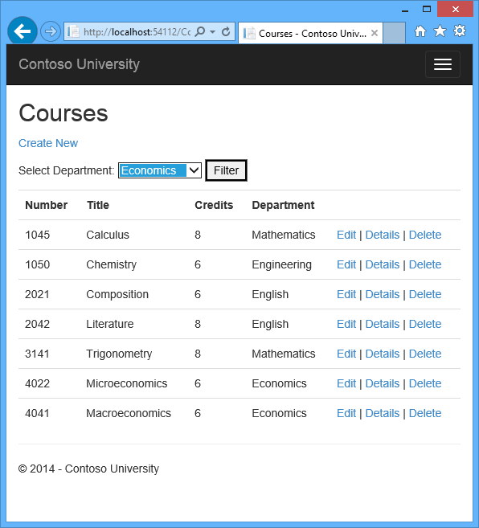

This time the first breakpoint will be for the departments query for the drop-down list. Skip that and view the `query` variable the next time the code reaches the breakpoint in order to see what the `Course` query now looks like. You'll see something like the following:

[!code-sql[Main](advanced-entity-framework-scenarios-for-an-mvc-web-application/samples/sample10.sql)]

You can see that the query is now a `JOIN` query that loads `Department` data along with the `Course` data, and that it includes a `WHERE` clause.

Remove the `var sql = courses.ToString()` line.

## Repository and unit of work patterns

Many developers write code to implement the repository and unit of work patterns as a wrapper around code that works with the Entity Framework. These patterns are intended to create an abstraction layer between the data access layer and the business logic layer of an application. Implementing these patterns can help insulate your application from changes in the data store and can facilitate automated unit testing or test-driven development (TDD). However, writing additional code to implement these patterns is not always the best choice for applications that use EF, for several reasons:

- The EF context class itself insulates your code from data-store-specific code.
- The EF context class can act as a unit-of-work class for database updates that you do using EF.
- Features introduced in Entity Framework 6 make it easier to implement TDD without writing repository code.

For more information about how to implement the repository and unit of work patterns, see [the Entity Framework 5 version of this tutorial series](../../older-versions/getting-started-with-ef-5-using-mvc-4/implementing-the-repository-and-unit-of-work-patterns-in-an-asp-net-mvc-application.md). For information about ways to implement TDD in Entity Framework 6, see the following resources:

- [How EF6 Enables Mocking DbSets more easily](http://thedatafarm.com/data-access/how-ef6-enables-mocking-dbsets-more-easily/)
- [Testing with a mocking framework](https://msdn.microsoft.com/en-us/data/dn314429)
- [Testing with your own test doubles](https://msdn.microsoft.com/en-us/data/dn314431)

## Proxy classes

When the Entity Framework creates entity instances (for example, when you execute a query), it often creates them as instances of a dynamically generated derived type that acts as a proxy for the entity. For example, see the following two debugger images. In the first image, you see that the `student` variable is the expected `Student` type immediately after you instantiate the entity. In the second image, after EF has been used to read a student entity from the database, you see the proxy class.

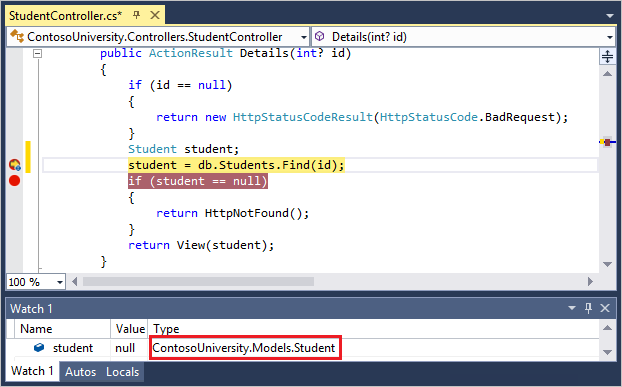

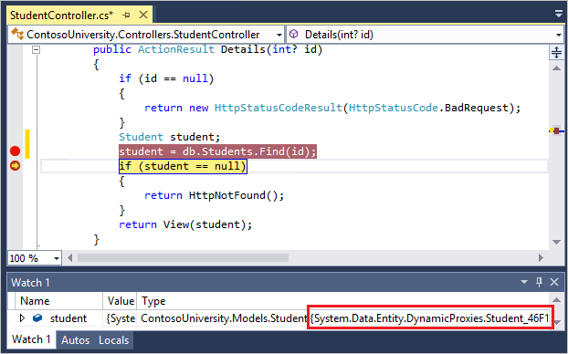

This proxy class overrides some virtual properties of the entity to insert hooks for performing actions automatically when the property is accessed. One function this mechanism is used for is lazy loading.

Most of the time you don't need to be aware of this use of proxies, but there are exceptions:

- In some scenarios you might want to prevent the Entity Framework from creating proxy instances. For example, when you're serializing entities you generally want the POCO classes, not the proxy classes. One way to avoid serialization problems is to serialize data transfer objects (DTOs) instead of entity objects, as shown in the [Using Web API with Entity Framework](../../../../web-api/overview/data/using-web-api-with-entity-framework/part-1.md) tutorial. Another way is to [disable proxy creation](https://msdn.microsoft.com/en-US/data/jj592886.aspx).
- When you instantiate an entity class using the `new` operator, you don't get a proxy instance. This means you don't get functionality such as lazy loading and automatic change tracking. This is typically okay; you generally don't need lazy loading, because you're creating a new entity that isn't in the database, and you generally don't need change tracking if you're explicitly marking the entity as `Added`. However, if you do need lazy loading and you need change tracking, you can create new entity instances with proxies using the [Create](https://msdn.microsoft.com/en-us/library/gg679504.aspx) method of the `DbSet` class.
- You might want to get an actual entity type from a proxy type. You can use the [GetObjectType](https://msdn.microsoft.com/en-us/library/system.data.objects.objectcontext.getobjecttype.aspx) method of the `ObjectContext` class to get the actual entity type of a proxy type instance.

For more information, see [Working with Proxies](https://msdn.microsoft.com/en-us/data/JJ592886.aspx) on MSDN.

## Automatic change detection

The Entity Framework determines how an entity has changed (and therefore which updates need to be sent to the database) by comparing the current values of an entity with the original values. The original values are stored when the entity is queried or attached. Some of the methods that cause automatic change detection are the following:

- `DbSet.Find`
- `DbSet.Local`
- `DbSet.Remove`
- `DbSet.Add`
- `DbSet.Attach`
- `DbContext.SaveChanges`
- `DbContext.GetValidationErrors`
- `DbContext.Entry`
- `DbChangeTracker.Entries`

If you're tracking a large number of entities and you call one of these methods many times in a loop, you might get significant performance improvements by temporarily turning off automatic change detection using the [AutoDetectChangesEnabled](https://msdn.microsoft.com/en-us/library/system.data.entity.infrastructure.dbcontextconfiguration.autodetectchangesenabled.aspx) property. For more information, see [Automatically Detecting Changes](https://msdn.microsoft.com/en-us/data/jj556205) on MSDN.

## Automatic validation

When you call the `SaveChanges` method, by default the Entity Framework validates the data in all properties of all changed entities before updating the database. If you've updated a large number of entities and you've already validated the data, this work is unnecessary and you could make the process of saving the changes take less time by temporarily turning off validation. You can do that using the [ValidateOnSaveEnabled](https://msdn.microsoft.com/en-us/library/system.data.entity.infrastructure.dbcontextconfiguration.validateonsaveenabled.aspx) property. For more information, see [Validation](https://msdn.microsoft.com/en-us/data/gg193959) on MSDN.

## Entity Framework Power Tools

[Entity Framework Power Tools](https://visualstudiogallery.msdn.microsoft.com/72a60b14-1581-4b9b-89f2-846072eff19d) is a Visual Studio add-in that was used to create the data model diagrams shown in these tutorials. The tools can also do other function such as generate entity classes based on the tables in an existing database so that you can use the database with Code First. After you install the tools, some additional options appear in context menus. For example, when you right-click your context class in **Solution Explorer**, you get an option to generate a diagram. When you're using Code First you can't change the data model in the diagram, but you can move things around to make it easier to understand.

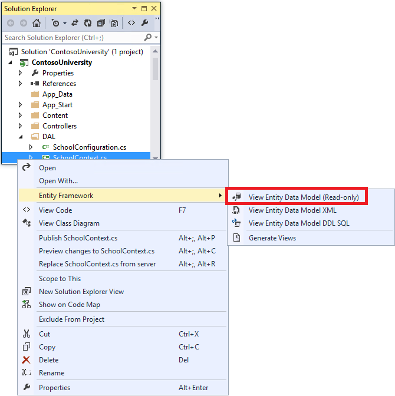

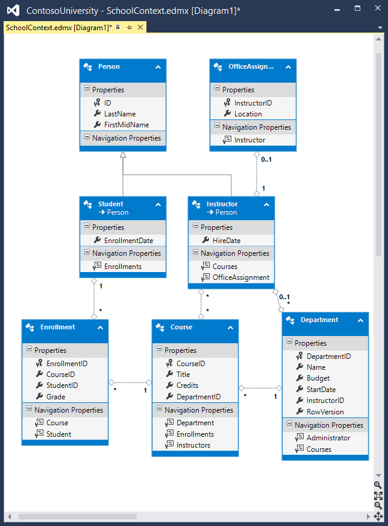

## Entity Framework source code

The source code for Entity Framework 6 is available at [http://entityframework.codeplex.com/](http://entityframework.codeplex.com/). Besides source code, you can get [nightly builds](https://entityframework.codeplex.com/wikipage?title=Nightly%20Builds), [issue tracking](http://entityframework.codeplex.com/workitem/list/basic), [feature specs](http://entityframework.codeplex.com/wikipage?title=specs), [design meeting notes](http://entityframework.codeplex.com/wikipage?title=Design%20Meeting%20Notes), and more. You can file bugs, and you can contribute your own enhancements to the EF source code.

Although the source code is open, Entity Framework is fully supported as a Microsoft product. The Microsoft Entity Framework team keeps control over which contributions are accepted and tests all code changes to ensure the quality of each release.

## Summary

This completes this series of tutorials on using the Entity Framework in an ASP.NET MVC application. For more information about how to work with data using the Entity Framework, see the [EF documentation page on MSDN](https://msdn.microsoft.com/en-us/data/ee712907) and [ASP.NET Data Access - Recommended Resources](../../../../whitepapers/aspnet-data-access-content-map.md).

For more information about how to deploy your web application after you've built it, see [ASP.NET Web Deployment - Recommended Resources](../../../../whitepapers/aspnet-web-deployment-content-map.md) in the MSDN Library.

For information about other topics related to MVC, such as authentication and authorization, see the [ASP.NET MVC - Recommended Resources](../recommended-resources-for-mvc.md).

## Acknowledgments

- Tom Dykstra wrote the original version of this tutorial, co-authored the EF 5 update, and wrote the EF 6 update. Tom is a senior programming writer on the Microsoft Web Platform and Tools Content Team.
- [Rick Anderson](https://blogs.msdn.com/b/rickandy/) (twitter [@RickAndMSFT](http://twitter.com/RickAndMSFT)) did most of the work updating the tutorial for EF 5 and MVC 4 and co-authored the EF 6 update. Rick is a senior programming writer for Microsoft focusing on Azure and MVC.
- [Rowan Miller](http://www.romiller.com) and other members of the Entity Framework team assisted with code reviews and helped debug many issues with migrations that arose while we were updating the tutorial for EF 5 and EF 6.

## VB

When the tutorial was originally produced for EF 4.1, we provided both C# and VB versions of the completed download project. Due to time limitations and other priorities we have not done that for this version. If you build a VB project using these tutorials and would be willing to share that with others, please let us know.

## Common errors, and solutions or workarounds for them

### Cannot create/shadow copy

Error Message:

> Cannot create/shadow copy '&lt;filename&gt;' when that file already exists.

Solution

Wait a few seconds and refresh the page.

### Update-Database not recognized

Error Message (from the `Update-Database` command in the PMC):

> The term 'Update-Database' is not recognized as the name of a cmdlet, function, script file, or operable program. Check the spelling of the name, or if a path was included, verify that the path is correct and try again.

Solution

Exit Visual Studio. Reopen project and try again.

### Validation failed

Error Message (from the `Update-Database` command in the PMC):

> Validation failed for one or more entities. See 'EntityValidationErrors' property for more details.

Solution

One cause of this problem is validation errors when the `Seed` method runs. See [Seeding and Debugging Entity Framework (EF) DBs](https://blogs.msdn.com/b/rickandy/archive/2013/02/12/seeding-and-debugging-entity-framework-ef-dbs.aspx) for tips on debugging the `Seed` method.

### HTTP 500.19 error

Error Message:

> HTTP Error 500.19 - Internal Server Error  
> The requested page cannot be accessed because the related configuration data for the page is invalid.

Solution

One way you can get this error is from having multiple copies of the solution, each of them using the same port number. You can usually solve this problem by exiting all instances of Visual Studio, then restarting the project you're working on. If that doesn't work, try changing the port number. Right click on the project file and then click properties. Select the **Web** tab and then change the port number in the **Project Url** text box.

### Error locating SQL Server instance

Error Message:

> A network-related or instance-specific error occurred while establishing a connection to SQL Server. The server was not found or was not accessible. Verify that the instance name is correct and that SQL Server is configured to allow remote connections. (provider: SQL Network Interfaces, error: 26 - Error Locating Server/Instance Specified)

Solution

Check the connection string. If you have manually deleted the database, change the name of the database in the construction string.

>[!div class="step-by-step"]
[Previous](implementing-inheritance-with-the-entity-framework-in-an-asp-net-mvc-application.md)