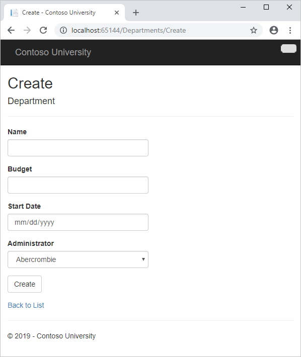
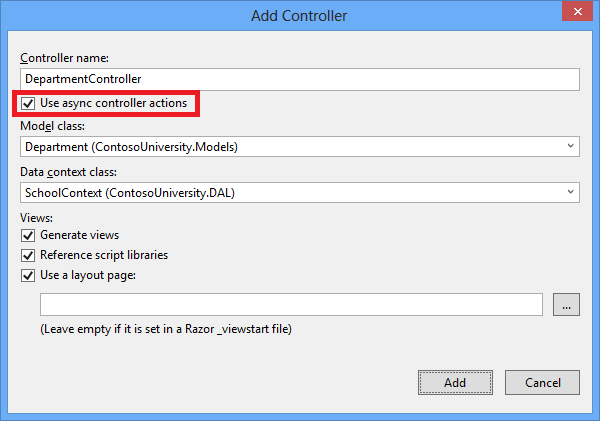
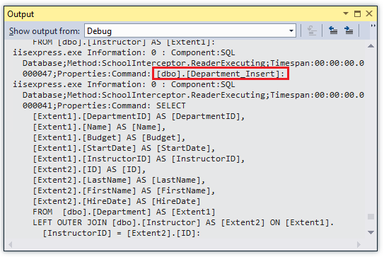

Async and Stored Procedures with the Entity Framework in an ASP.NET MVC Application
====================
by [Tom Dykstra](https://github.com/tdykstra)

[Download Completed Project](http://code.msdn.microsoft.com/ASPNET-MVC-Application-b01a9fe8) or [Download PDF](http://download.microsoft.com/download/0/F/B/0FBFAA46-2BFD-478F-8E56-7BF3C672DF9D/Getting%20Started%20with%20Entity%20Framework%206%20Code%20First%20using%20MVC%205.pdf)

> The Contoso University sample web application demonstrates how to create ASP.NET MVC 5 applications using the Entity Framework 6 Code First and Visual Studio 2013. For information about the tutorial series, see [the first tutorial in the series](creating-an-entity-framework-data-model-for-an-asp-net-mvc-application.md).

In earlier tutorials you learned how to read and update data using the synchronous programming model. In this tutorial you see how to implement the asynchronous programming model. Asynchronous code can help an application perform better because it makes better use of server resources.

In this tutorial you'll also see how to use stored procedures for insert, update, and delete operations on an entity.

Finally, you'll redeploy the application to Azure, along with all of the database changes that you've implemented since the first time you deployed.

The following illustrations show some of the pages that you'll work with.

## Why bother with asynchronous code

A web server has a limited number of threads available, and in high load situations all of the available threads might be in use. When that happens, the server can't process new requests until the threads are freed up. With synchronous code, many threads may be tied up while they aren't actually doing any work because they're waiting for I/O to complete. With asynchronous code, when a process is waiting for I/O to complete, its thread is freed up for the server to use for processing other requests. As a result, asynchronous code enables server resources to be use more efficiently, and the server is enabled to handle more traffic without delays.

In earlier versions of .NET, writing and testing asynchronous code was complex, error prone, and hard to debug. In .NET 4.5, writing, testing, and debugging asynchronous code is so much easier that you should generally write asynchronous code unless you have a reason not to. Asynchronous code does introduce a small amount of overhead, but for low traffic situations the performance hit is negligible, while for high traffic situations, the potential performance improvement is substantial.

For more information about asynchronous programming, see [Use .NET 4.5's async support to avoid blocking calls](../../../../aspnet/overview/developing-apps-with-windows-azure/building-real-world-cloud-apps-with-windows-azure/web-development-best-practices.md#async).

## Create the Department controller

Create a Department controller the same way you did the earlier controllers, except this time select the **Use async controller** actions check box.

The following highlights show what was added to the synchronous code for the `Index` method to make it asynchronous:

[!code-csharp[Main](async-and-stored-procedures-with-the-entity-framework-in-an-asp-net-mvc-application/samples/sample1.cs?highlight=1,4)]

Four changes were applied to enable the Entity Framework database query to execute asynchronously:

- The method is marked with the `async` keyword, which tells the compiler to generate callbacks for parts of the method body and to automatically create the `Task<ActionResult>` object that is returned.
- The return type was changed from `ActionResult` to `Task<ActionResult>`. The `Task<T>` type represents ongoing work with a result of type `T`.
- The `await` keyword was applied to the web service call. When the compiler sees this keyword, behind the scenes it splits the method into two parts. The first part ends with the operation that is started asynchronously. The second part is put into a callback method that is called when the operation completes.
- The asynchronous version of the `ToList` extension method was called.

Why is the `departments.ToList` statement modified but not the `departments = db.Departments` statement? The reason is that only statements that cause queries or commands to be sent to the database are executed asynchronously. The `departments = db.Departments` statement sets up a query but the query is not executed until the `ToList` method is called. Therefore, only the `ToList` method is executed asynchronously.

In the `Details` method and the `HttpGet` `Edit` and `Delete` methods, the `Find` method is the one that causes a query to be sent to the database, so that's the method that gets executed asynchronously:

[!code-csharp[Main](async-and-stored-procedures-with-the-entity-framework-in-an-asp-net-mvc-application/samples/sample2.cs?highlight=7)]

In the `Create`, `HttpPost Edit`, and `DeleteConfirmed` methods, it is the `SaveChanges` method call that causes a command to be executed, not statements such as `db.Departments.Add(department)` which only cause entities in memory to be modified.

[!code-csharp[Main](async-and-stored-procedures-with-the-entity-framework-in-an-asp-net-mvc-application/samples/sample3.cs?highlight=6)]

Open *Views\Department\Index.cshtml*, and replace the template code with the following code:

[!code-cshtml[Main](async-and-stored-procedures-with-the-entity-framework-in-an-asp-net-mvc-application/samples/sample4.cshtml?highlight=3,5,20-22,36-38)]

This code changes the title from Index to Departments, moves the Administrator name to the right, and provides the full name of the administrator.

In the Create, Delete, Details, and Edit views, change the caption for the `InstructorID` field to "Administrator" the same way you changed the department name field to "Department" in the Course views.

In the Create and Edit views use the following code:

[!code-cshtml[Main](async-and-stored-procedures-with-the-entity-framework-in-an-asp-net-mvc-application/samples/sample5.cshtml)]

In the Delete and Details views use the following code:

[!code-cshtml[Main](async-and-stored-procedures-with-the-entity-framework-in-an-asp-net-mvc-application/samples/sample6.cshtml)]

Run the application, and click the **Departments** tab.

Everything works the same as in the other controllers, but in this controller all of the SQL queries are executing asynchronously.

Some things to be aware of when you are using asynchronous programming with the Entity Framework:

- The async code is not thread safe. In other words, in other words, don't try to do multiple operations in parallel using the same context instance.
- If you want to take advantage of the performance benefits of async code, make sure that any library packages that you're using (such as for paging), also use async if they call any Entity Framework methods that cause queries to be sent to the database.

## Use stored procedures for inserting, updating, and deleting

Some developers and DBAs prefer to use stored procedures for database access. In earlier versions of Entity Framework you can retrieve data using a stored procedure by [executing a raw SQL query](advanced-entity-framework-scenarios-for-an-mvc-web-application.md), but you can't instruct EF to use stored procedures for update operations. In EF 6 it's easy to configure Code First to use stored procedures.

1. In *DAL\SchoolContext.cs*, add the highlighted code to the `OnModelCreating` method.

    [!code-csharp[Main](async-and-stored-procedures-with-the-entity-framework-in-an-asp-net-mvc-application/samples/sample7.cs?highlight=9)]

    This code instructs Entity Framework to use stored procedures for insert, update, and delete operations on the `Department` entity.
2. In Package Manage Console, enter the following command:

    `add-migration DepartmentSP`

    Open *Migrations\&lt;timestamp&gt;\_DepartmentSP.cs* to see the code in the `Up` method that creates Insert, Update, and Delete stored procedures:

    [!code-csharp[Main](async-and-stored-procedures-with-the-entity-framework-in-an-asp-net-mvc-application/samples/sample8.cs?highlight=3-4,26-27,42-43)]
- In Package Manage Console, enter the following command:

    `update-database`
- Run the application in debug mode, click the **Departments** tab, and then click **Create New**.
- Enter data for a new department, and then click **Create**.

    
- In Visual Studio, look at the logs in the **Output** window to see that a stored procedure was used to insert the new Department row.

    

Code First creates default stored procedure names. If you are using an existing database, you might need to customize the stored procedure names in order to use stored procedures already defined in the database. For information about how to do that, see [Entity Framework Code First Insert/Update/Delete Stored Procedures](https://msdn.microsoft.com/en-us/data/dn468673).

If you want to customize what generated stored procedures do, you can edit the scaffolded code for the migrations `Up` method that creates the stored procedure. That way your changes are reflected whenever that migration is run and will be applied to your production database when migrations runs automatically in production after deployment.

If you want to change an existing stored procedure that was created in a previous migration, you can use the Add-Migration command to generate a blank migration, and then manually write code that calls the [AlterStoredProcedure](https://msdn.microsoft.com/en-us/library/system.data.entity.migrations.dbmigration.alterstoredprocedure.aspx) method.

## Deploy to Azure

This section requires you to have completed the optional **Deploying the app to Azure** section in the [Migrations and Deployment](migrations-and-deployment-with-the-entity-framework-in-an-asp-net-mvc-application.md) tutorial of this series. If you had migrations errors that you resolved by deleting the database in your local project, skip this section.

1. In Visual Studio, right-click the project in **Solution Explorer** and select **Publish** from the context menu.
2. Click **Publish**.

    Visual Studio deploys the application to Azure, and the application opens in your default browser, running in Azure.
3. Test the application to verify it's working.

    The first time you run a page that accesses the database, the Entity Framework runs all of the migrations `Up` methods required to bring the database up to date with the current data model. You can now use all of the web pages that you added since the last time you deployed, including the Department pages that you added in this tutorial.

## Summary

In this tutorial you saw how to improve server efficiency by writing code that executes asynchronously, and how to use stored procedures for insert, update, and delete operations. In the next tutorial, you'll see how to prevent data loss when multiple users try to edit the same record at the same time.

Links to other Entity Framework resources can be found in the [ASP.NET Data Access - Recommended Resources](../../../../whitepapers/aspnet-data-access-content-map.md).

>[!div class="step-by-step"]
[Previous](updating-related-data-with-the-entity-framework-in-an-asp-net-mvc-application.md)
[Next](handling-concurrency-with-the-entity-framework-in-an-asp-net-mvc-application.md)