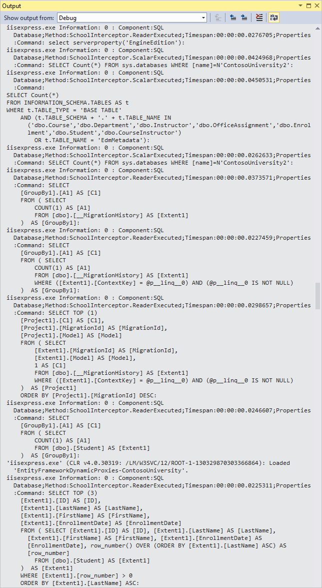
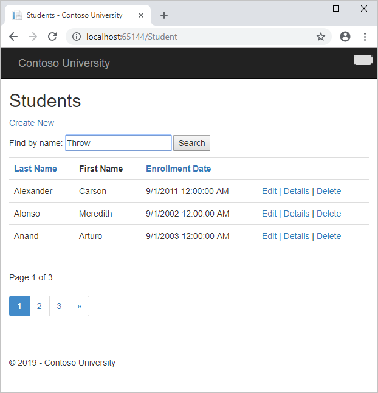
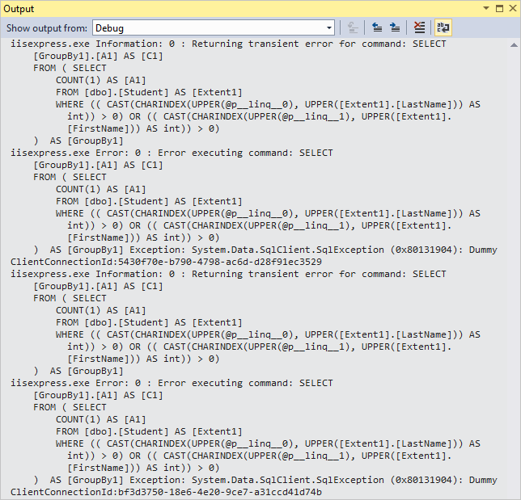
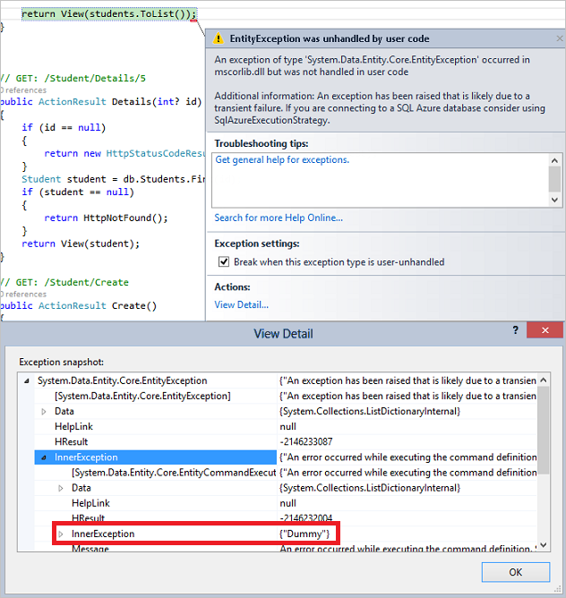

Connection Resiliency and Command Interception with the Entity Framework in an ASP.NET MVC Application
====================
by [Tom Dykstra](https://github.com/tdykstra)

[Download Completed Project](http://code.msdn.microsoft.com/ASPNET-MVC-Application-b01a9fe8) or [Download PDF](http://download.microsoft.com/download/0/F/B/0FBFAA46-2BFD-478F-8E56-7BF3C672DF9D/Getting%20Started%20with%20Entity%20Framework%206%20Code%20First%20using%20MVC%205.pdf)

> The Contoso University sample web application demonstrates how to create ASP.NET MVC 5 applications using the Entity Framework 6 Code First and Visual Studio 2013. For information about the tutorial series, see [the first tutorial in the series](creating-an-entity-framework-data-model-for-an-asp-net-mvc-application.md).

So far the application has been running locally in IIS Express on your development computer. To make a real application available for other people to use over the Internet, you have to deploy it to a web hosting provider, and you have to deploy the database to a database server.

In this tutorial you'll learn how to use two features of Entity Framework 6 that are especially valuable when you are deploying to the cloud environment: connection resiliency (automatic retries for transient errors) and command interception (catch all SQL queries sent to the database in order to log or change them).

This connection resiliency and command interception tutorial is optional. If you skip this tutorial, a few minor adjustments will have to be made in subsequent tutorials.

## Enable connection resiliency

When you deploy the application to Windows Azure, you'll deploy the database to Windows Azure SQL Database, a cloud database service. Transient connection errors are typically more frequent when you connect to a cloud database service than when your web server and your database server are directly connected together in the same data center. Even if a cloud web server and a cloud database service are hosted in the same data center, there are more network connections between them that can have problems, such as load balancers.

Also a cloud service is typically shared by other users, which means its responsiveness can be affected by them. And your access to the database might be subject to throttling. Throttling means the database service throws exceptions when you try to access it more frequently than is allowed in your Service Level Agreement (SLA).

Many or most connection problems when you're accessing a cloud service are transient, that is, they resolve themselves in a short period of time. So when you try a database operation and get a type of error that is typically transient, you could try the operation again after a short wait, and the operation might be successful. You can provide a much better experience for your users if you handle transient errors by automatically trying again, making most of them invisible to the customer. The connection resiliency feature in Entity Framework 6 automates that process of retrying failed SQL queries.

The connection resiliency feature must be configured appropriately for a particular database service:

- It has to know which exceptions are likely to be transient. You want to retry errors caused by a temporary loss in network connectivity, not errors caused by program bugs, for example.
- It has to wait an appropriate amount of time between retries of a failed operation. You can wait longer between retries for a batch process than you can for an online web page where a user is waiting for a response.
- It has to retry an appropriate number of times before it gives up. You might want to retry more times in a batch process that you would in an online application.

You can configure these settings manually for any database environment supported by an Entity Framework provider, but default values that typically work well for an online application that uses Windows Azure SQL Database have already been configured for you, and those are the settings you'll implement for the Contoso University application.

All you have to do to enable connection resiliency is create a class in your assembly that derives from the [DbConfiguration](https://msdn.microsoft.com/en-us/data/jj680699.aspx) class, and in that class set the SQL Database *execution strategy*, which in EF is another term for *retry policy*.

1. In the DAL folder, add a class file named *SchoolConfiguration.cs*.
2. Replace the template code with the following code:

    [!code-csharp[Main](connection-resiliency-and-command-interception-with-the-entity-framework-in-an-asp-net-mvc-application/samples/sample1.cs)]

    The Entity Framework automatically runs the code it finds in a class that derives from `DbConfiguration`. You can use the `DbConfiguration` class to do configuration tasks in code that you would otherwise do in the *Web.config* file. For more information, see [EntityFramework Code-Based Configuration](https://msdn.microsoft.com/en-us/data/jj680699).
3. In *StudentController.cs*, add a `using` statement for `System.Data.Entity.Infrastructure`.

    [!code-csharp[Main](connection-resiliency-and-command-interception-with-the-entity-framework-in-an-asp-net-mvc-application/samples/sample2.cs)]
4. Change all of the `catch` blocks that catch `DataException` exceptions so that they catch `RetryLimitExceededException` exceptions instead. For example:

    [!code-csharp[Main](connection-resiliency-and-command-interception-with-the-entity-framework-in-an-asp-net-mvc-application/samples/sample3.cs?highlight=1)]

    You were using `DataException` to try to identify errors that might be transient in order to give a friendly "try again" message. But now that you've turned on a retry policy, the only errors likely to be transient will already have been tried and failed several times and the actual exception returned will be wrapped in the `RetryLimitExceededException` exception.

For more information, see [Entity Framework Connection Resiliency / Retry Logic](https://msdn.microsoft.com/en-us/data/dn456835).

## Enable Command Interception

Now that you've turned on a retry policy, how do you test to verify that it is working as expected? It's not so easy to force a transient error to happen, especially when you're running locally, and it would be especially difficult to integrate actual transient errors into an automated unit test. To test the connection resiliency feature, you need a way to intercept queries that Entity Framework sends to SQL Server and replace the SQL Server response with an exception type that is typically transient.

You can also use query interception in order to implement a best practice for cloud applications: [log the latency and success or failure of all calls to external services](../../../../aspnet/overview/developing-apps-with-windows-azure/building-real-world-cloud-apps-with-windows-azure/monitoring-and-telemetry.md#log) such as database services. EF6 provides a [dedicated logging API](https://msdn.microsoft.com/en-us/data/dn469464) that can make it easier to do logging, but in this section of the tutorial you'll learn how to use the Entity Framework's [interception feature](https://msdn.microsoft.com/en-us/data/dn469464) directly, both for logging and for simulating transient errors.

### Create a logging interface and class

A [best practice for logging](../../../../aspnet/overview/developing-apps-with-windows-azure/building-real-world-cloud-apps-with-windows-azure/monitoring-and-telemetry.md#log) is to do it by using an interface rather than hard-coding calls to System.Diagnostics.Trace or a logging class. That makes it easier to change your logging mechanism later if you ever need to do that. So in this section you'll create the logging interface and a class to implement it./p> 

1. Create a folder in the project and name it *Logging*.
2. In the *Logging* folder, create a class file named *ILogger.cs*, and replace the template code with the following code:

    [!code-csharp[Main](connection-resiliency-and-command-interception-with-the-entity-framework-in-an-asp-net-mvc-application/samples/sample4.cs)]

    The interface provides three tracing levels to indicate the relative importance of logs, and one designed to provide latency information for external service calls such as database queries. The logging methods have overloads that let you pass in an exception. This is so that exception information including stack trace and inner exceptions is reliably logged by the class that implements the interface, instead of relying on that being done in each logging method call throughout the application.

    The TraceApi methods enable you to track the latency of each call to an external service such as SQL Database.
3. In the *Logging* folder, create a class file named *Logger.cs*, and replace the template code with the following code:

    [!code-csharp[Main](connection-resiliency-and-command-interception-with-the-entity-framework-in-an-asp-net-mvc-application/samples/sample5.cs)]

    The implementation uses System.Diagnostics to do the tracing. This is a built-in feature of .NET which makes it easy to generate and use tracing information. There are many "listeners" you can use with System.Diagnostics tracing, to write logs to files, for example, or to write them to blob storage in Azure. See some of the options, and links to other resources for more information, in [Troubleshooting Azure Web Sites in Visual Studio](https://www.windowsazure.com/en-us/develop/net/tutorials/troubleshoot-web-sites-in-visual-studio/). For this tutorial you'll only look at logs in the Visual Studio **Output** window.

    In a production application you might want to consider tracing packages other than System.Diagnostics, and the ILogger interface makes it relatively easy to switch to a different tracing mechanism if you decide to do that.

### Create interceptor classes

Next you'll create the classes that the Entity Framework will call into every time it is going to send a query to the database, one to simulate transient errors and one to do logging. These interceptor classes must derive from the `DbCommandInterceptor` class. In them you write method overrides that are automatically called when query is about to be executed. In these methods you can examine or log the query that is being sent to the database, and you can change the query before it's sent to the database or return something to Entity Framework yourself without even passing the query to the database.

1. To create the interceptor class that will log every SQL query that is sent to the database, create a class file named *SchoolInterceptorLogging.cs* in the *DAL* folder, and replace the template code with the following code:

    [!code-csharp[Main](connection-resiliency-and-command-interception-with-the-entity-framework-in-an-asp-net-mvc-application/samples/sample6.cs)]

    For successful queries or commands, this code writes an Information log with latency information. For exceptions, it creates an Error log.
2. To create the interceptor class that will generate dummy transient errors when you enter "Throw" in the **Search** box, create a class file named *SchoolInterceptorTransientErrors.cs* in the *DAL* folder, and replace the template code with the following code:

    [!code-csharp[Main](connection-resiliency-and-command-interception-with-the-entity-framework-in-an-asp-net-mvc-application/samples/sample7.cs)]

    This code only overrides the `ReaderExecuting` method, which is called for queries that can return multiple rows of data. If you wanted to check connection resiliency for other types of queries, you could also override the `NonQueryExecuting` and `ScalarExecuting` methods, as the logging interceptor does.

    When you run the Student page and enter "Throw" as the search string, this code creates a dummy SQL Database exception for error number 20, a type known to be typically transient. Other error numbers currently recognized as transient are 64, 233, 10053, 10054, 10060, 10928, 10929, 40197, 40501, abd 40613, but these are subject to change in new versions of SQL Database.

    The code returns the exception to Entity Framework instead of running the query and passing back query results. The transient exception is returned four times, and then the code reverts to the normal procedure of passing the query to the database.

    Because everything is logged, you'll be able to see that Entity Framework tries to execute the query four times before finally succeeding, and the only difference in the application is that it takes longer to render a page with query results.

    The number of times the Entity Framework will retry is configurable; the code specifies four times because that's the default value for the SQL Database execution policy. If you change the execution policy, you'd also change the code here that specifies how many times transient errors are generated. You could also change the code to generate more exceptions so that Entity Framework will throw the `RetryLimitExceededException` exception.

    The value you enter in the Search box will be in `command.Parameters[0]` and `command.Parameters[1]` (one is used for the first name and one for the last name). When the value "%Throw%" is found, "Throw" is replaced in those parameters by "an" so that some students will be found and returned.

    This is just a convenient way to test connection resiliency based on changing some input to the application UI. You can also write code that generates transient errors for all queries or updates, as explained later in the comments about the *DbInterception.Add* method.
3. In *Global.asax*, add the following `using` statements:

    [!code-csharp[Main](connection-resiliency-and-command-interception-with-the-entity-framework-in-an-asp-net-mvc-application/samples/sample8.cs)]
4. Add the highlighted lines to the `Application_Start` method:

    [!code-csharp[Main](connection-resiliency-and-command-interception-with-the-entity-framework-in-an-asp-net-mvc-application/samples/sample9.cs?highlight=7-8)]

    These lines of code are what causes your interceptor code to be run when Entity Framework sends queries to the database. Notice that because you created separate interceptor classes for transient error simulation and logging, you can independently enable and disable them.

    You can add interceptors using the `DbInterception.Add` method anywhere in your code; it doesn't have to be in the `Application_Start` method. Another option is to put this code in the DbConfiguration class that you created earlier to configure the execution policy.

    [!code-csharp[Main](connection-resiliency-and-command-interception-with-the-entity-framework-in-an-asp-net-mvc-application/samples/sample10.cs?highlight=6-7)]

    Wherever you put this code, be careful not to execute `DbInterception.Add` for the same interceptor more than once, or you'll get additional interceptor instances. For example, if you add the logging interceptor twice, you'll see two logs for every SQL query.

    Interceptors are executed in the order of registration (the order in which the `DbInterception.Add` method is called). The order might matter depending on what you're doing in the interceptor. For example, an interceptor might change the SQL command that it gets in the `CommandText` property. If it does change the SQL command, the next interceptor will get the changed SQL command, not the original SQL command.

    You've written the transient error simulation code in a way that lets you cause transient errors by entering a different value in the UI. As an alternative, you could write the interceptor code to always generate the sequence of transient exceptions without checking for a particular parameter value. You could then add the interceptor only when you want to generate transient errors. If you do this, however, don't add the interceptor until after database initialization has completed. In other words, do at least one database operation such as a query on one of your entity sets before you start generating transient errors. The Entity Framework executes several queries during database initialization, and they aren't executed in a transaction, so errors during initialization could cause the context to get into an inconsistent state.

## Test logging and connection resiliency

1. Press F5 to run the application in debug mode, and then click the **Students** tab.
2. Look at the Visual Studio **Output** window to see the tracing output. You might have to scroll up past some JavaScript errors to get to the logs written by your logger.

    Notice that you can see the actual SQL queries sent to the database. You see some initial queries and commands that Entity Framework does to get started, checking the database version and migration history table (you'll learn about migrations in the next tutorial). And you see a query for paging, to find out how many students there are, and finally you see the query that gets the student data.

    
3. In the **Students** page, enter "Throw" as the search string, and click **Search**.

    

    You'll notice that the browser seems to hang for several seconds while Entity Framework is retrying the query several times. The first retry happens very quickly, then the wait before increases before each additional retry. This process of waiting longer before each retry is called *exponential backoff*.

    When the page displays, showing students who have "an" in their names, look at the output window, and you'll see that the same query was attempted five times, the first four times returning transient exceptions. For each transient error you'll see the log that you write when generating the transient error in the `SchoolInterceptorTransientErrors` class ("Returning transient error for command...") and you'll see the log written when `SchoolInterceptorLogging` gets the exception.

    

    Since you entered a search string, the query that returns student data is parameterized:

    [!code-sql[Main](connection-resiliency-and-command-interception-with-the-entity-framework-in-an-asp-net-mvc-application/samples/sample11.sql)]

    You're not logging the value of the parameters, but you could do that. If you want to see the parameter values, you can write logging code to get parameter values from the `Parameters` property of the `DbCommand` object that you get in the interceptor methods.

    Note that you can't repeat this test unless you stop the application and restart it. If you wanted to be able to test connection resiliency multiple times in a single run of the application, you could write code to reset the error counter in `SchoolInterceptorTransientErrors`.
4. To see the difference the execution strategy (retry policy) makes, comment out the `SetExecutionStrategy` line in *SchoolConfiguration.cs*, run the Students page in debug mode again, and search for "Throw" again.

    This time the debugger stops on the first generated exception immediately when it tries to execute the query the first time.

    
5. Uncomment the *SetExecutionStrategy* line in *SchoolConfiguration.cs*.

## Summary

In this tutorial you've seen how to enable connection resiliency and log SQL commands that Entity Framework composes and sends to the database. In the next tutorial you'll deploy the application to the Internet, using Code First Migrations to deploy the database.

Please leave feedback on how you liked this tutorial and what we could improve. You can also request new topics at [Show Me How With Code](http://aspnet.uservoice.com/forums/228522-show-me-how-with-code).

Links to other Entity Framework resources can be found in [ASP.NET Data Access - Recommended Resources](../../../../whitepapers/aspnet-data-access-content-map.md).

>[!div class="step-by-step"]
[Previous](sorting-filtering-and-paging-with-the-entity-framework-in-an-asp-net-mvc-application.md)
[Next](migrations-and-deployment-with-the-entity-framework-in-an-asp-net-mvc-application.md)