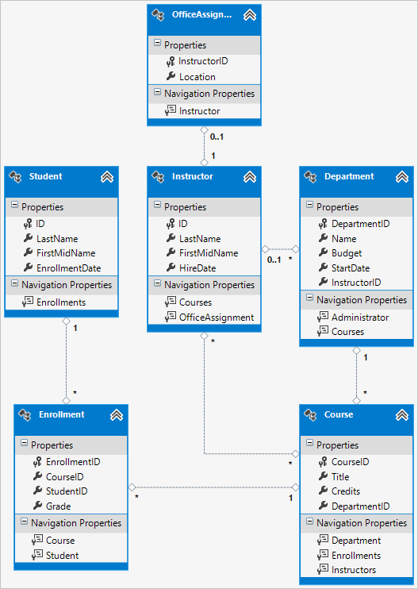
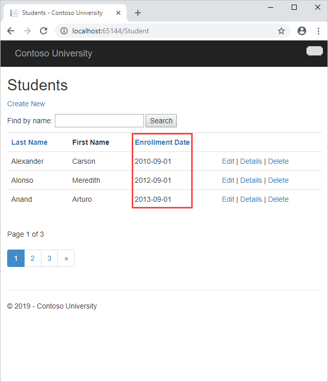
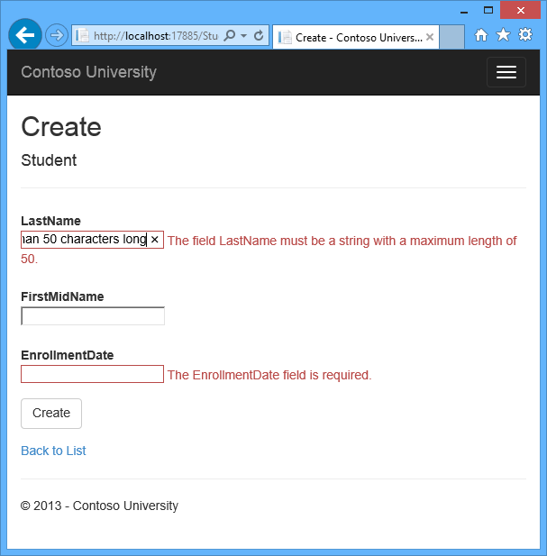

Creating a More Complex Data Model for an ASP.NET MVC Application
====================
by [Tom Dykstra](https://github.com/tdykstra)

[Download Completed Project](http://code.msdn.microsoft.com/ASPNET-MVC-Application-b01a9fe8) or [Download PDF](http://download.microsoft.com/download/0/F/B/0FBFAA46-2BFD-478F-8E56-7BF3C672DF9D/Getting%20Started%20with%20Entity%20Framework%206%20Code%20First%20using%20MVC%205.pdf)

> The Contoso University sample web application demonstrates how to create ASP.NET MVC 5 applications using the Entity Framework 6 Code First and Visual Studio 2013. For information about the tutorial series, see [the first tutorial in the series](creating-an-entity-framework-data-model-for-an-asp-net-mvc-application.md).

In the previous tutorials you worked with a simple data model that was composed of three entities. In this tutorial you'll add more entities and relationships and you'll customize the data model by specifying formatting, validation, and database mapping rules. You'll see two ways to customize the data model: by adding attributes to entity classes and by adding code to the database context class.

When you're finished, the entity classes will make up the completed data model that's shown in the following illustration:

## Customize the Data Model by Using Attributes

In this section you'll see how to customize the data model by using attributes that specify formatting, validation, and database mapping rules. Then in several of the following sections you'll create the complete `School` data model by adding attributes to the classes you already created and creating new classes for the remaining entity types in the model.

### The DataType Attribute

For student enrollment dates, all of the web pages currently display the time along with the date, although all you care about for this field is the date. By using data annotation attributes, you can make one code change that will fix the display format in every view that shows the data. To see an example of how to do that, you'll add an attribute to the `EnrollmentDate` property in the `Student` class.

In *Models\Student.cs*, add a `using` statement for the `System.ComponentModel.DataAnnotations` namespace and add `DataType` and `DisplayFormat` attributes to the `EnrollmentDate` property, as shown in the following example:

[!code[Main](creating-a-more-complex-data-model-for-an-asp-net-mvc-application/samples/sample1.xml?highlight=3,12-13)]

The [DataType](https://msdn.microsoft.com/en-us/library/system.componentmodel.dataannotations.datatypeattribute.aspx) attribute is used to specify a data type that is more specific than the database intrinsic type. In this case we only want to keep track of the date, not the date and time. The [DataType Enumeration](https://msdn.microsoft.com/en-us/library/system.componentmodel.dataannotations.datatype.aspx) provides for many data types, such as *Date, Time, PhoneNumber, Currency, EmailAddress* and more. The `DataType` attribute can also enable the application to automatically provide type-specific features. For example, a `mailto:` link can be created for [DataType.EmailAddress](https://msdn.microsoft.com/en-us/library/system.componentmodel.dataannotations.datatype.aspx), and a date selector can be provided for [DataType.Date](https://msdn.microsoft.com/en-us/library/system.componentmodel.dataannotations.datatype.aspx) in browsers that support [HTML5](http://html5.org/). The [DataType](https://msdn.microsoft.com/en-us/library/system.componentmodel.dataannotations.datatypeattribute.aspx) attributes emits HTML 5 [data-](http://ejohn.org/blog/html-5-data-attributes/) (pronounced *data dash*) attributes that HTML 5 browsers can understand. The [DataType](https://msdn.microsoft.com/en-us/library/system.componentmodel.dataannotations.datatypeattribute.aspx) attributes do not provide any validation.

`DataType.Date` does not specify the format of the date that is displayed. By default, the data field is displayed according to the default formats based on the server's [CultureInfo](https://msdn.microsoft.com/en-us/library/vstudio/system.globalization.cultureinfo(v=vs.110).aspx).

The `DisplayFormat` attribute is used to explicitly specify the date format:

[!code[Main](creating-a-more-complex-data-model-for-an-asp-net-mvc-application/samples/sample2.xml)]

The `ApplyFormatInEditMode` setting specifies that the specified formatting should also be applied when the value is displayed in a text box for editing. (You might not want that for some fields — for example, for currency values, you might not want the currency symbol in the text box for editing.)

You can use the [DisplayFormat](https://msdn.microsoft.com/en-us/library/system.componentmodel.dataannotations.displayformatattribute.aspx) attribute by itself, but it's generally a good idea to use the [DataType](https://msdn.microsoft.com/en-us/library/system.componentmodel.dataannotations.datatypeattribute.aspx) attribute also. The `DataType` attribute conveys the *semantics* of the data as opposed to how to render it on a screen, and provides the following benefits that you don't get with `DisplayFormat`:

- The browser can enable HTML5 features (for example to show a calendar control, the locale-appropriate currency symbol, email links, some client-side input validation, etc.).
- By default, the browser will render data using the correct format based on your [locale](https://msdn.microsoft.com/en-us/library/vstudio/wyzd2bce.aspx).
- The [DataType](https://msdn.microsoft.com/en-us/library/system.componentmodel.dataannotations.datatypeattribute.aspx) attribute can enable MVC to choose the right field template to render the data (the [DisplayFormat](https://msdn.microsoft.com/en-us/library/system.componentmodel.dataannotations.displayformatattribute.aspx) uses the string template). For more information, see Brad Wilson's [ASP.NET MVC 2 Templates](http://bradwilson.typepad.com/blog/2009/10/aspnet-mvc-2-templates-part-1-introduction.html). (Though written for MVC 2, this article still applies to the current version of ASP.NET MVC.)

If you use the `DataType` attribute with a date field, you have to specify the `DisplayFormat` attribute also in order to ensure that the field renders correctly in Chrome browsers. For more information, see [this StackOverflow thread](http://stackoverflow.com/questions/12633471/mvc4-datatype-date-editorfor-wont-display-date-value-in-chrome-fine-in-ie).

For more information about how to handle other date formats in MVC, go to [MVC 5 Introduction: Examining the Edit Methods and Edit View](../introduction/examining-the-edit-methods-and-edit-view.md) and search in the page for &quot;internationalization&quot;.

Run the Student Index page again and notice that times are no longer displayed for the enrollment dates. The same will be true for any view that uses the `Student` model.

### The StringLengthAttribute

You can also specify data validation rules and validation error messages using attributes. The [StringLength attribute](https://msdn.microsoft.com/en-us/library/system.componentmodel.dataannotations.stringlengthattribute.aspx) sets the maximum length in the database and provides client side and server side validation for ASP.NET MVC. You can also specify the minimum string length in this attribute, but the minimum value has no impact on the database schema.

Suppose you want to ensure that users don't enter more than 50 characters for a name. To add this limitation, add [StringLength](https://msdn.microsoft.com/en-us/library/system.componentmodel.dataannotations.stringlengthattribute.aspx) attributes to the `LastName` and `FirstMidName` properties, as shown in the following example:

[!code[Main](creating-a-more-complex-data-model-for-an-asp-net-mvc-application/samples/sample3.xml?highlight=10,12)]

The [StringLength](https://msdn.microsoft.com/en-us/library/system.componentmodel.dataannotations.stringlengthattribute.aspx) attribute won't prevent a user from entering white space for a name. You can use the [RegularExpression](https://msdn.microsoft.com/en-us/library/system.componentmodel.dataannotations.regularexpressionattribute.aspx) attribute to apply restrictions to the input. For example the following code requires the first character to be upper case and the remaining characters to be alphabetical:

`[RegularExpression(@"^[A-Z]+[a-zA-Z''-'\s]*$")]`

The [MaxLength](https://msdn.microsoft.com/en-us/library/System.ComponentModel.DataAnnotations.MaxLengthAttribute.aspx) attribute provides similar functionality to the [StringLength](https://msdn.microsoft.com/en-us/library/system.componentmodel.dataannotations.stringlengthattribute.aspx) attribute but doesn't provide client side validation.

Run the application and click the **Students** tab. You get the following error:

*The model backing the 'SchoolContext' context has changed since the database was created. Consider using Code First Migrations to update the database ([https://go.microsoft.com/fwlink/?LinkId=238269](https://go.microsoft.com/fwlink/?LinkId=238269)).*

The database model has changed in a way that requires a change in the database schema, and Entity Framework detected that. You'll use migrations to update the schema without losing any data that you added to the database by using the UI. If you changed data that was created by the `Seed` method, that will be changed back to its original state because of the [AddOrUpdate](https://msdn.microsoft.com/en-us/library/hh846520(v=vs.103).aspx) method that you're using in the `Seed` method. ([AddOrUpdate](https://msdn.microsoft.com/en-us/library/hh846520(v=vs.103).aspx) is equivalent to an "upsert" operation from database terminology.)

In the Package Manager Console (PMC), enter the following commands:

[!code[Main](creating-a-more-complex-data-model-for-an-asp-net-mvc-application/samples/sample4.xml)]

The `add-migration` command creates a file named *&lt;timeStamp&gt;\_MaxLengthOnNames.cs*. This file contains code in the `Up` method that will update the database to match the current data model. The `update-database` command ran that code.

The timestamp prepended to the migrations file name is used by Entity Framework to order the migrations. You can create multiple migrations before running the `update-database` command, and then all of the migrations are applied in the order in which they were created.

Run the **Create** page, and enter either name longer than 50 characters. When you click **Create**, client side validation shows an error message.

### The Column Attribute

You can also use attributes to control how your classes and properties are mapped to the database. Suppose you had used the name `FirstMidName` for the first-name field because the field might also contain a middle name. But you want the database column to be named `FirstName`, because users who will be writing ad-hoc queries against the database are accustomed to that name. To make this mapping, you can use the `Column` attribute.

The `Column` attribute specifies that when the database is created, the column of the `Student` table that maps to the `FirstMidName` property will be named `FirstName`. In other words, when your code refers to `Student.FirstMidName`, the data will come from or be updated in the `FirstName` column of the `Student` table. If you don't specify column names, they are given the same name as the property name.

In the *Student.cs* file, add a `using` statement for [System.ComponentModel.DataAnnotations.Schema](https://msdn.microsoft.com/en-us/library/system.componentmodel.dataannotations.schema.aspx) and add the column name attribute to the `FirstMidName` property, as shown in the following highlighted code:

[!code[Main](creating-a-more-complex-data-model-for-an-asp-net-mvc-application/samples/sample5.xml?highlight=4,14)]

The addition of the [Column attribute](https://msdn.microsoft.com/en-us/library/system.componentmodel.dataannotations.schema.columnattribute.aspx)changes the model backing the SchoolContext, so it won't match the database. Enter the following commands in the PMC to create another migration:

[!code[Main](creating-a-more-complex-data-model-for-an-asp-net-mvc-application/samples/sample6.xml?highlight=33,35,37,40,44,47-54,71,352,366,744-748,771)]

>[!div class="step-by-step"]
[Previous](migrations-and-deployment-with-the-entity-framework-in-an-asp-net-mvc-application.md)
[Next](reading-related-data-with-the-entity-framework-in-an-asp-net-mvc-application.md)