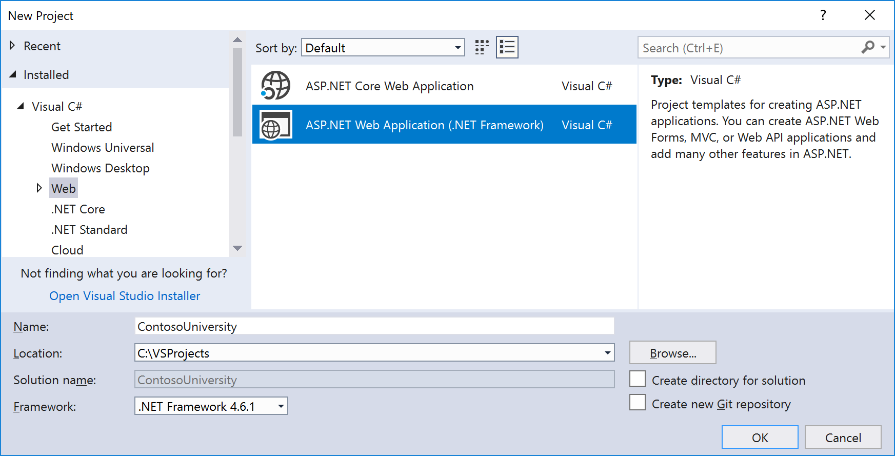
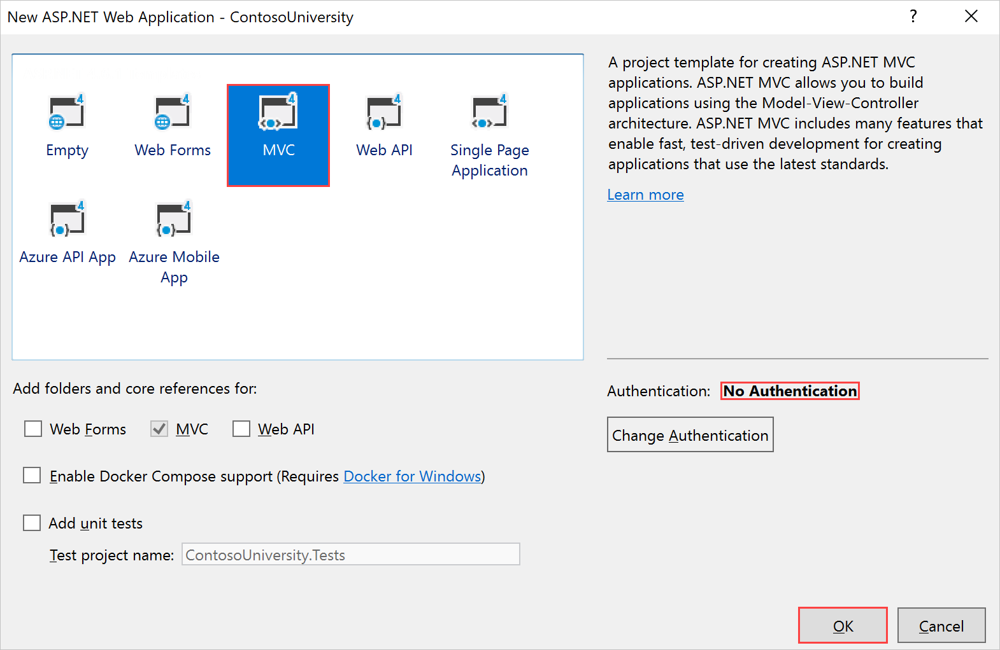

# Tutorial: Create Entity Framework 6 Code First data model by using MVC 5

> [!NOTE]
> For new development, it's recommend to use [ASP.NET Core Razor Pages](/aspnet/core/razor-pages) over ASP.NET MVC controllers and views. For a tutorial series similar to this one using Razor Pages, see [Tutorial: Get started with Razor Pages in ASP.NET Core](/aspnet/core/tutorials/razor-pages/razor-pages-start). The new tutorial:
> * Is easier to follow.
> * Provides more EF 6 Core best practices.
> * Uses more efficient queries.
> * Is more current with the latest API.
> * Covers more features.
> * Is the preferred approach for new application development.

In this article, you learn how to create ASP.NET MVC 5 data model applications using Entity Framework (EF) 6 and Visual Studio. This tutorial uses the Code First workflow. For information about how to choose between Code First, Database First, and Model First, see [Create a model](/ef/ef6/modeling/).

This tutorial series explains how to build the Contoso University sample application. The sample application is a simple university website. With it, you can view and update student, course, and instructor information. Here are two of the screens you create:


In this tutorial, you:

> [!div class="checklist"]
> * Create an MVC web app
> * Set up the site style
> * Install Entity Framework 6
> * Create the data model
> * Create the database context
> * Initialize DB with test data
> * Set up EF 6 to use LocalDB
> * Create controller and views
> * View the database

## Prerequisites

* [Visual Studio 2017](https://visualstudio.microsoft.com/downloads/?utm_medium=microsoft&utm_source=docs.microsoft.com&utm_campaign=button+cta&utm_content=download+vs2017)

* [Entity Framework 6](https://www.nuget.org/packages/EntityFramework)

* [Windows Azure SDK 2.2](https://go.microsoft.com/fwlink/p/?linkid=323510) (optional)

## Create an MVC web app

1. Open Visual Studio and create a C# web project using the **ASP.NET Web Application (.NET Framework)** template. Name the project *ContosoUniversity* and select **OK**.

   

1. In **New ASP.NET Web Application - ContosoUniversity**, select **MVC**.

   

    > [!NOTE]
    > By default, the **Authentication** option is set to **No Authentication**. For this tutorial, the web app doesn't require users to sign in. Also, it doens't restrict access based on who's signed in.

1. Select **OK** to create the project.

## Set up the site style

A few simple changes set up the site menu, layout, and home page.

1. In **Solution Explorer**, open **Views** > **Shared** > *_Layout.cshtml*.

1. Replace the code in the *_Layout.cshtml* file with this code:

   [!code-cshtml[Main](creating-an-entity-framework-data-model-for-an-asp-net-mvc-application/samples/sample1.cshtml?highlight=6,19,24-27,38)]

    The code you copied into the file:

    * Changed each occurrence of `My ASP.NET Application` and `Application name` to `Contoso University`.

    * Added menu entries for `Students`, `Courses`, `Instructors`, and `Departments`.

    * Deleted the `Contact` menu entry.

1. In **Solution Explorer**, open **Views** > **Home** > *Index.cshtml*.

1. Replace the code in the *Index.cshtml* file with this code:

   [!code-cshtml[Main](creating-an-entity-framework-data-model-for-an-asp-net-mvc-application/samples/sample2.cshtml)]

1. From the menu bar, select **File** > **Save All**.

1. To run the project, press **F5**.

    A browser window opens and the Contoso University home page appears.

1. To stop the project, close the browser.

## Install Entity Framework 6

This step is one of a few steps in this tutorial that you have to do manually. You can install EF 6 automatically using the ASP.NET MVC scaffolding feature. In this tutorial, it's done manually so you can see the steps required to use EF 6. Later, you use scaffolding later to create the MVC controller and views.

1. From the **Tools** menu, select **NuGet Package Manager**, and then select **Package Manager Console**.

1. In the **Package Manager Console** window, enter this command:

   ```console
   Install-Package EntityFramework
   ```

## Create the data model

Next you create entity classes for the Contoso University application. Start with these three entities:

**Course** <-> **Enrollment** <-> **Student**

| Entities | Relationship |
| -------- | ------------ |
| Course to Enrollment | One-to-many |
| Student to Enrollment | One-to-many |

There's a one-to-many relationship between `Student` and `Enrollment` entities, and there's a one-to-many relationship between `Course` and `Enrollment` entities. In other words, you can enroll a  student in any number of courses, and a course can have any number of students enrolled in it.

In the following sections, you create a class for each one of these entities.

> [!NOTE]
> If you try to compile the project before you finish creating all of these entity classes, you receive compiler errors.

### The Student entity

In the **Models** folder, create a class file named *Student.cs*.

1. In **Solution Explorer**, right-click **Models** and select **Add** > **Class**.

1. Name the class *Student* and add it to the project.

1. Replace the code in the *Student.cs* class file with this code:

   [!code-csharp[Main](creating-an-entity-framework-data-model-for-an-asp-net-mvc-application/samples/sample3.cs)]

1. Save the file.

The `ID` property becomes the primary key column of the database table that corresponds to this class. By default, EF 6 interprets a property that's named `ID` or `<classname> ID` as the primary key.

The `Enrollments` property is a navigation property. Navigation properties hold other entities related to this entity. In this case, the `Enrollments` property of a `Student` entity holds all `Enrollment` entities related to that `Student` entity. In other words, if a given `Student` row in the database has two related `Enrollment` rows (rows that include the student's primary key value in their `StudentID` foreign key column), that `Student` entity's `Enrollments` navigation property contains those two `Enrollment` entities.

Navigation properties are typically defined as `virtual` so that they can take advantage of an EF 6 functionality called lazy loading. Lazy loading is  explained in the [Reading Related Data](reading-related-data-with-the-entity-framework-in-an-asp-net-mvc-application.md) tutorial later in this series.

If a navigation property can hold multiple entities (as in many-to-many or one-to-many relationships), its type must be a list to which you can add, delete, and update entries. `ICollection` is a good example.

### The Enrollment entity

In the **Models** folder, create a class file named *Enrollment.cs*.

1. In **Solution Explorer**, right-click **Models** and select **Add** > **Class**.

1. Name the class *Enrollment* and add it to the project.

1. Replace the code in the *Enrollment.cs* class file with this code:

   [!code-csharp[Main](creating-an-entity-framework-data-model-for-an-asp-net-mvc-application/samples/sample4.cs)]

1. Save the file.

The `EnrollmentID` property is the primary key. This entity uses the `<classname> ID` pattern instead of `ID` by itself as you saw in the `Student` entity. Ordinarily, you would choose one pattern and use it throughout your data model. Here, the variation illustrates that you can use either pattern. In a later tutorial, you see how using `ID` without `classname` makes it easier to implement inheritance in the data model.

The `Grade` property is an [enum](/ef/ef6/modeling/code-first/data-types/enums). The question mark after the `Grade` type declaration indicates that the `Grade` property is [nullable](/dotnet/csharp/programming-guide/nullable-types/using-nullable-types). A grade that's null is different from a zero grade. Null means a grade isn't known or the instructor didn't assign it yet.

The `StudentID` property is a foreign key, and the corresponding navigation property is `Student`. You associate an `Enrollment` entity with one `Student` entity, so the property can only hold a single `Student` entity. That's different than the `Student.Enrollments` navigation property you saw earlier. It can hold multiple `Enrollment` entities.

The `CourseID` property is a foreign key, and the corresponding navigation property is `Course`. You associate an `Enrollment` entity with one `Course` entity.

EF 6 interprets a property as a foreign key property if it's named `<navigation property name><primary key property name>` (for example, `StudentID` for the `Student` navigation property because the `Student` entity's primary key is `ID`). You can also name foreign key properties `<primary key property name>`. For example, `CourseID` because the `Course` entity's primary key is `CourseID`.

### The Course entity

In the **Models** folder, create a class file named *Course.cs*.

1. In **Solution Explorer**, right-click **Models** and select **Add** > **Class**.

1. Name the class *Course* and add it to the project.

1. Replace the code in the *Course.cs* class file with this code:

   [!code-csharp[Main](creating-an-entity-framework-data-model-for-an-asp-net-mvc-application/samples/sample5.cs)]

1. Save the file.

The `Enrollments` property is a navigation property. You can relate a `Course` entity to any number of `Enrollment` entities.

`<xref:System.ComponentModel.DataAnnotations.Schema.DatabaseGeneratedAttribute>` is basically an attribute that prompts you to enter the primary key for the course rather than having the database generate it. You can find a more in-depth explanation later in this tutorial series.

## Create the database context

The main class that coordinates EF 6 functionality for a given data model is the *database context* class. You create this class by deriving from the [System.Data.Entity.DbContext](https://msdn.microsoft.com/library/system.data.entity.dbcontext(v=vs.113).aspx) class. In your code, you specify which entities you include in the data model. You can also customize certain EF 6 behavior. You name the class `SchoolContext` in this project.

Create a folder in the ContosoUniversity project.

1. In **Solution Explorer**, right-click the project and select **Add** > **New Folder**.

1. Name the folder *DAL* for Data Access Layer.

1. Right-click **DAL** and select **Add** > **Class**.

1. Name the class *SchoolContext* and add it to the project.

1. Replace the code in the *SchoolContext.cs* class file with this code:

   [!code-csharp[Main](creating-an-entity-framework-data-model-for-an-asp-net-mvc-application/samples/sample6.cs)]

1. Save the file.

### Specify entity sets

This code creates a [DbSet](https://msdn.microsoft.com/library/system.data.entity.dbset(v=vs.113).aspx) property for each entity set. In EF 6 terminology, an *entity set* typically corresponds to a database table, and an *entity* corresponds to a row in the table.

> [!NOTE]
> You can omit the `DbSet<Enrollment>` and `DbSet<Course>` statements and it would work the same. EF 6 would include them implicitly because the `Student` entity references the `Enrollment` entity and the `Enrollment` entity references the `Course` entity.

### Specify the connection string

The app passes the name of the connection string (which you add to the Web.config file later) to the constructor.

[!code-csharp[Main](creating-an-entity-framework-data-model-for-an-asp-net-mvc-application/samples/sample7.cs?highlight=1)]

You can also pass in the connection string itself instead of the name of one that the app stores in the `Web.config` file. For more info about options for specifying the database to use, see [Connection strings and models](/ef/ef6/fundamentals/configuring/connection-strings).

If you don't specify a connection string or the name of one explicitly, EF 6 assumes that the connection string name is the same as the class name. The default connection string name in this example would then be `SchoolContext`. It's the same as the one you're specifying explicitly.

### Specify singular table names

The `modelBuilder.Conventions.Remove` statement in the [OnModelCreating](https://msdn.microsoft.com/library/system.data.entity.dbcontext.onmodelcreating(v=vs.103).aspx) method prevents the app from pluralizing table names. If you don't use the statement, the app names the generated tables in the database `Students`, `Courses`, and `Enrollments`. Instead, the table names are `Student`, `Course`, and `Enrollment`. Developers disagree about whether you should pluralize table names or not. This tutorial uses the singular form. The important point is that you can select whichever form you prefer by including or omitting this line of code.

## Initialize DB with test data

EF 6 can automatically create (or drop and re-create) a database for you when the application runs. You can specify that the app create a database every time your application runs or only when the model is out of sync with the existing database. You can also write a `Seed` method that EF 6 automatically calls after creating the database to populate it with test data.

The default behavior is to create a database only if it doesn't exist. If the model has changed and the database already exists, the app throws an exception. In this section, you specify that the app drops and re-creates the database whenever the model changes. Dropping the database causes the loss of all your data. Losing data is generally okay during development, because the `Seed` method runs when the database is re-created and re-creates your test data. But in production you generally don't want to lose all your data every time you need to change the database schema. Later you see how to handle model changes by using Code First Migrations to change the database schema instead of dropping and re-creating the database.

1. Right-click **DAL** and select **Add** > **Class**.

1. Name the class *SchoolInitializer* and add it to the project.

1. Replace the code in the *SchoolInitializer.cs* class file with this code:

    [!code-csharp[Main](creating-an-entity-framework-data-model-for-an-asp-net-mvc-application/samples/sample8.cs)]

    This code causes the app to create a database when needed and loads test data into the new database.

1. Save the file.

The `Seed` method takes the database context object as an input parameter, and the code in the method uses that object to add new entities to the database. For each entity type, the code creates a collection of new  entities, adds them to the appropriate `DbSet` property, and then saves the changes to the database. As shown here, it isn't necessary to call the `SaveChanges` method after each group of entities. If an exception occurs while the code writes to the database, calling the method helps you locate the source of a problem.

## Web.config update

To tell EF 6 to use your initializer class, add an element to the `entityFramework` element in the application *Web.config* file.

1. In **Solution Explorer**, double-click the `WebConfig` file.

1. Copy the highlighted `<contexts>` block in this code sample:

   [!code-xml[Main](creating-an-entity-framework-data-model-for-an-asp-net-mvc-application/samples/sample9.xml?highlight=2-6)]

    > [!NOTE]
    >Make sure you update the *Web.config* file in the root project folder. There's also a *Web.config* file in the *Views* subfolder. You don't need to update that one.

1. Paste it into the *<entityFramework>* element.

1. Save the file.

The `context type` specifies the fully qualified context class name and the assembly it's in. The `databaseinitializer` type specifies the fully qualified name of the initializer class and the assembly it's in.

> [!NOTE]
> When you don't want EF 6 to use the initializer, you can set an attribute on the `context` element: `disableDatabaseInitialization="true"`. For more info, see [Configuration File Settings](/ef/ef6/fundamentals/configuring/config-file).

The application is now set up. When you access the database for the first time in a given run of the application, EF 6 compares the database to the model (your `SchoolContext` and entity classes). If there's a difference, the application drops and re-creates the database.

> [!NOTE]
> When you deploy an application to a production web server, you must remove or disable code that drops and re-creates the database. A later tutorial in this series covers this topic.

## Set up EF 6 to use LocalDB

[LocalDB](/sql/database-engine/configure-windows/sql-server-2016-express-localdb?view=sql-server-2017) is a lightweight version of the SQL Server Express database engine. It's easy to install and configure, starts on demand, and runs in user mode. LocalDB runs in a special execution mode of SQL Server Express that enables you to work with databases as *.mdf* files. If you want the ability to copy the database with the project, you can put LocalDB database files in the *App\_Data* folder of a web project. It's recommend to use LocalDB for working with *.mdf* files. Visual Studio comes with LocalDB by default.

Typically, SQL Server Express isn't used for production web applications. LocalDB in particular isn't recommended for production use with a web application because it's not designed to work with IIS.

### Add the connectionString

1. In **Solution Explorer**, double-click the `WebConfig` file.

1. Copy the highlighted `<connectionStrings>` block in this code sample:

   [!code-xml[Main](creating-an-entity-framework-data-model-for-an-asp-net-mvc-application/samples/sample10.xml?highlight=1-3)]

    > [!NOTE]
    >Make sure you update the *Web.config* file in the root project folder. There's also a *Web.config* file in the *Views* subfolder. You don't need to update that one.

1. Paste it between the `<configSections>` and `<appSettings>` elements.

1. Save the file.

The connection string you've added specifies that EF 6 uses a LocalDB database named *ContosoUniversity1.mdf*. The database doesn't exist yet. EF 6 creates it. If you want to create the database in your *App\_Data* folder, you can add `AttachDBFilename=|DataDirectory|\ContosoUniversity1.mdf` to the connection string. For more info about connection strings, see [SQL Server Connection Strings for ASP.NET Web Applications](/previous-versions/aspnet/jj653752(v=vs.110)).

You don't actually need a connection string in the *Web.config* file. If you don't supply a connection string, EF 6 uses a default connection string based on your context class. For more info, see [Code First to a New Database](/ef/ef6/modeling/code-first/workflows/new-database).

## Create controller and views

Now you create a web page to display data. The process of requesting the data automatically triggers the creation of the database. Begin by creating a controller. Before you do that, build the project to make the model and context classes available to MVC controller scaffolding.

1. In **Solution Explorer**, right-click **Controllers** and select **Add** > **New Scaffolded Item**.

1. In **Add Scaffold**, select **MVC 5 Controller with views, using Entity Framework**.

1. Select **Add**. the **Add Controller** dialog box appears.

1. In **Add Controller**, make the following selections:

    | Setting | Value |
    | ------- | ----- |
    | Model class | Select **Student (ContosoUniversity.Models)**. If you don't see this option in the drop-down list, press **F5** to build the project and try again. |
    | Data context class | Select **SchoolContext (ContosoUniversity.DAL)**. |
    | Controller name | Enter **StudentController**. Be careful. The pluralized value *StudentsController* is automatically populated in the **Controller name** field. Make sure you edit it to make *Students* singular. |

    Leave the default values for the other fields.

1. Select **Add**.

When you select **Add**, the scaffolder creates a *StudentController.cs* file and a set of views (*.cshtml* files) that work with the controller. In the future, when you create projects that use EF 6, you can also take advantage of some other scaffolder functionality. Here's the general workflow:

> You don't have do these steps now. This is just an example: 
>
> 1. Create your first model class.
>
> 1. Don't create a connection string.
>
> 1. In **Add Controller**, specify **New data context** by selecting the **+** button next to **Data context class**.
>
> The scaffolder creates your `DbContext` class and your connection string as well as the controller and views.

Visual Studio opens the *Controllers\StudentController.cs* file. You see that the app created class variable that instantiates a database context object:

    [!code-csharp[Main](creating-an-entity-framework-data-model-for-an-asp-net-mvc-application/samples/sample11.cs)]

    The `Index` action method gets a list of students from the *Students* entity set by reading the `Students` property of the database context instance:

    [!code-csharp[Main](creating-an-entity-framework-data-model-for-an-asp-net-mvc-application/samples/sample12.cs)]

    The *Student\Index.cshtml* view displays this list in a table:

    [!code-cshtml[Main](creating-an-entity-framework-data-model-for-an-asp-net-mvc-application/samples/sample13.cshtml)]

1. To run the project, press **F5**.

    If you get a **Cannot create Shadow Copy** error, close the browser and try again.

1. Click the **Students** tab to see the test data that the `Seed` method inserted.

     

1. To stop the project, close the browser.

## View the database

When you ran the **Students** page, EF 6 discovered that there was no database and created one. EF 6 then ran the seed method to populate the database with data.

You can use **Server Explorer** to view the database in Visual Studio.

1. In **Server Explorer**, select the refresh button to populate **Data Connections** with the project's database info.

1. To see the tables in your new database, expand **Data Connections** > **School Context (ContosoUniversity)** > **Tables**.

    * _MigrationHistory

    * Course

    * Enrollment

    * Student

1. Right-click **Student** and select **Show Table Data** to see the columns that the app created and the rows that the app inserted into the table.

1. Close **Server Explorer**.

> [!NOTE]
> The *ContosoUniversity1.mdf* and *.ldf* database files are in the *%USERPROFILE%* folder.

Because you're using the `DropCreateDatabaseIfModelChanges` initializer, you can make changes to the database by making changes to the project. If you make a change to the `Student` class and run the application again, the database would automatically be re-created to match your change. For example, if you add an `EmailAddress` property to the `Student` class, run the Students page, and then look at the table again, you see the new `EmailAddress` column.

## Conventions

The amount of code you had to write for EF 6 to create a complete database for you is minimal because of conventions. Conventions are assumptions that EF 6 makes. This tutorial explained some of them. The app used other conventions without your being aware of them:

* The app uses pluralized forms of entity class names as table names.

* The app uses entity property names column names.

* The app recognizes entity properties named `ID` or `<classname> ID` as primary key properties.

* The app interprets properties named `<navigation property name><primary key property name>;` as a foreign key property. For example, `StudentID` for the `Student` navigation property because the `Student` entity's primary key is `ID`. You can also simply name foreign key properties `<primary key property name>`. For example, `EnrollmentID` because the `Enrollment` entity's primary key is `EnrollmentID`.

You've seen that conventions can be overridden. For example, you specified you can't pluralize that table names. You learn in a later article how to explicitly mark a property as a foreign key property.

## Additional resources

For more about EF 6, see these articles:

* You can find links to other EF 6 resources in [ASP.NET Data Access - Recommended Resources](../../../../whitepapers/aspnet-data-access-content-map.md).

* To learn about conventions, see [Code First Conventions](/ef/ef6/modeling/code-first/conventions/built-in).

* To learn how to override conventions, see [Creating a More Complex Data Model](creating-a-more-complex-data-model-for-an-asp-net-mvc-application.md) tutorial later in this series.

## Next steps

In this tutorial, you:

> [!div class="checklist"]
> * Created an MVC web app
> * Set up the site style
> * Installed Entity Framework 6
> * Created the data model
> * Created the database context
> * Initialized DB with test data
> * Set up EF 6 to use LocalDB
> * Created controller and views
> * Viewed the database

Advance to the next article to learn how to review and customize the create, read, update, delete (CRUD) code in your controllers and views.
> [!div class="nextstepaction"]
> [Implement basic CRUD functionality](implementing-basic-crud-functionality-with-the-entity-framework-in-asp-net-mvc-application.md)