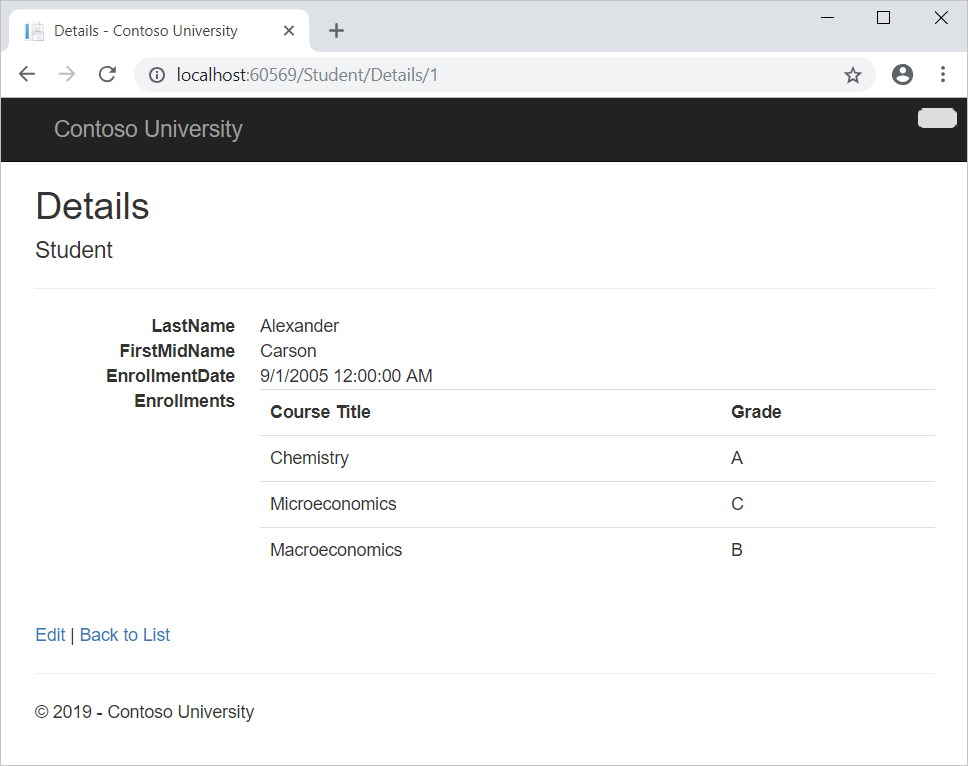
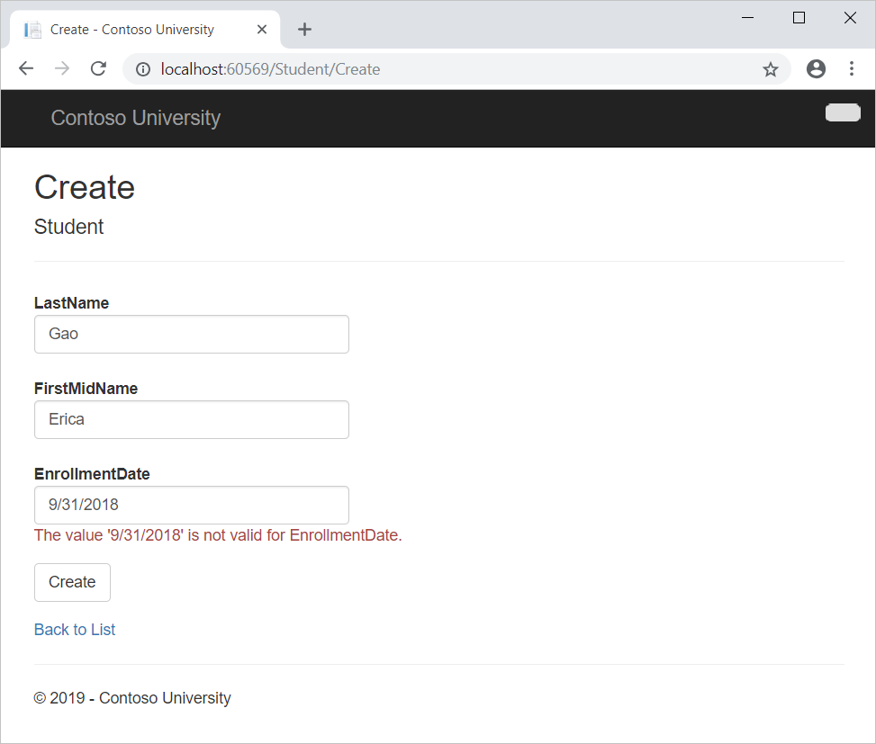
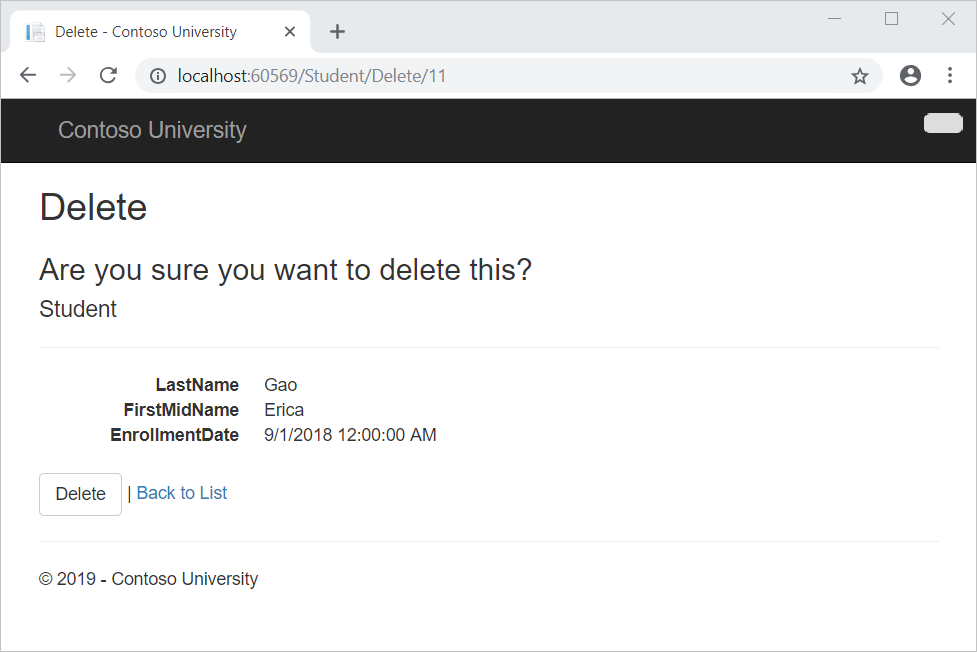
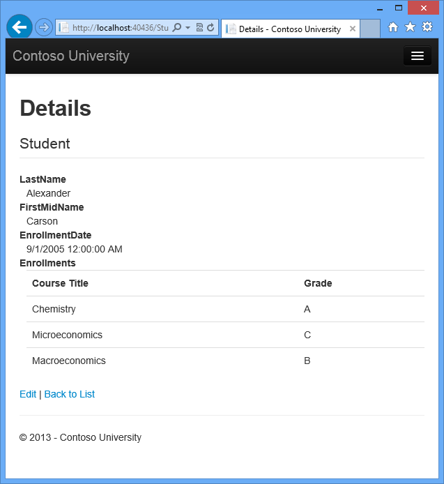
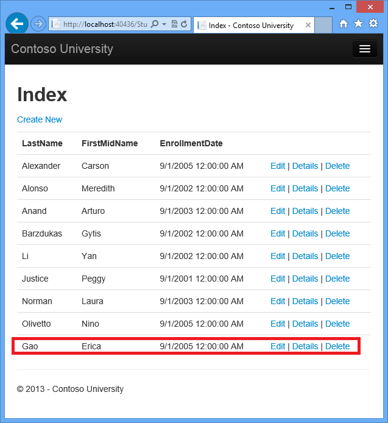
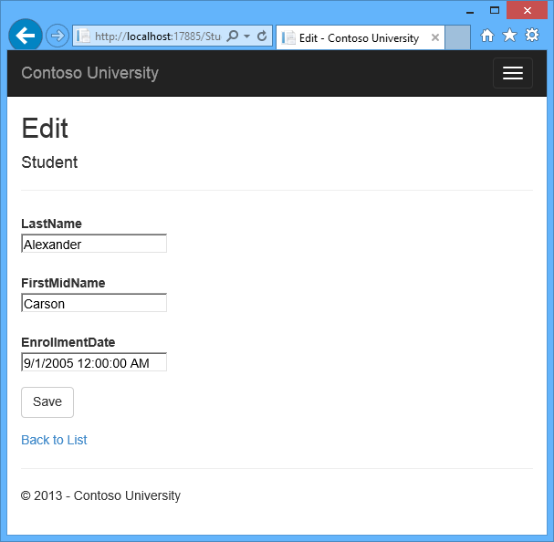
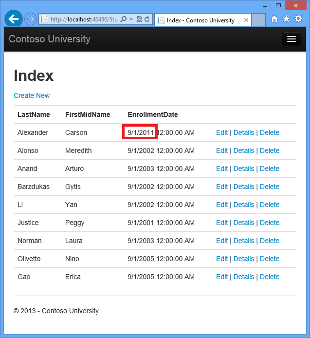

Implementing Basic CRUD Functionality with the Entity Framework in ASP.NET MVC Application
====================
by [Tom Dykstra](https://github.com/tdykstra)

[Download Completed Project](http://code.msdn.microsoft.com/ASPNET-MVC-Application-b01a9fe8) or [Download PDF](http://download.microsoft.com/download/0/F/B/0FBFAA46-2BFD-478F-8E56-7BF3C672DF9D/Getting%20Started%20with%20Entity%20Framework%206%20Code%20First%20using%20MVC%205.pdf)

> The Contoso University sample web application demonstrates how to create ASP.NET MVC 5 applications using the Entity Framework 6 Code First and Visual Studio 2013. For information about the tutorial series, see [the first tutorial in the series](creating-an-entity-framework-data-model-for-an-asp-net-mvc-application.md).

In the previous tutorial you created an MVC application that stores and displays data using the Entity Framework and SQL Server LocalDB. In this tutorial you'll review and customize the CRUD (create, read, update, delete) code that the MVC scaffolding automatically creates for you in controllers and views.

> [!NOTE]
> It's a common practice to implement the repository pattern in order to create an abstraction layer between your controller and the data access layer. To keep these tutorials simple and focused on teaching how to use the Entity Framework itself, they don't use repositories. For information about how to implement repositories, see the [ASP.NET Data Access Content Map](../../../../whitepapers/aspnet-data-access-content-map.md).

In this tutorial, you'll create the following web pages:

## Create a Details Page

The scaffolded code for the Students `Index` page left out the `Enrollments` property, because that property holds a collection. In the `Details` page you'll display the contents of the collection in an HTML table.

 In *Controllers\StudentController.cs*, the action method for the `Details` view uses the [Find](https://msdn.microsoft.com/en-us/library/gg696418(v=VS.103).aspx) method to retrieve a single `Student` entity. 

[!code-csharp[Main](implementing-basic-crud-functionality-with-the-entity-framework-in-asp-net-mvc-application/samples/sample1.cs)]

The key value is passed to the method as the `id` parameter and comes from *route data* in the **Details** hyperlink on the Index page.

> [!TIP] 
> 
> **Route data**
> 
> Route data is data that the model binder found in a URL segment specified in the routing table. For example, the default route specifies `controller`, `action`, and `id` segments:
> 
> [!code-csharp[Main](implementing-basic-crud-functionality-with-the-entity-framework-in-asp-net-mvc-application/samples/sample2.cs?highlight=3)]
> 
> In the following URL, the default route maps `Instructor` as the `controller`, `Index` as the `action` and 1 as the `id`; these are route data values.
> 
> `http://localhost:1230/Instructor/Index/1?courseID=2021`
> 
> "?courseID=2021" is a query string value. The model binder will also work if you pass the `id` as a query string value:
> 
> `http://localhost:1230/Instructor/Index?id=1&CourseID=2021`
> 
> The URLs are created by `ActionLink` statements in the Razor view. In the following code, the `id` parameter matches the default route, so `id` is added to the route data.
> 
> [!code-cshtml[Main](implementing-basic-crud-functionality-with-the-entity-framework-in-asp-net-mvc-application/samples/sample3.cshtml)]
> 
> In the following code, `courseID` doesn't match a parameter in the default route, so it's added as a query string.
> 
> [!code-cshtml[Main](implementing-basic-crud-functionality-with-the-entity-framework-in-asp-net-mvc-application/samples/sample4.cshtml)]

1. Open *Views\Student\Details.cshtml*. Each field is displayed using a `DisplayFor` helper, as shown in the following example:

    [!code-cshtml[Main](implementing-basic-crud-functionality-with-the-entity-framework-in-asp-net-mvc-application/samples/sample5.cshtml)]
2. After the `EnrollmentDate` field and immediately before the closing `</dl>` tag, add the highlighted code to display a list of enrollments, as shown in the following example:

    [!code-cshtml[Main](implementing-basic-crud-functionality-with-the-entity-framework-in-asp-net-mvc-application/samples/sample6.cshtml?highlight=8-29)]

    If code indentation is wrong after you paste the code, press CTRL-K-D to correct it.

    This code loops through the entities in the `Enrollments` navigation property. For each `Enrollment` entity in the property, it displays the course title and the grade. The course title is retrieved from the `Course` entity that's stored in the `Course` navigation property of the `Enrollments` entity. All of this data is retrieved from the database automatically when it's needed. (In other words, you are using lazy loading here. You did not specify *eager loading* for the `Courses` navigation property, so the enrollments were not retrieved in the same query that got the students. Instead, the first time you try to access the `Enrollments` navigation property, a new query is sent to the database to retrieve the data. You can read more about lazy loading and eager loading in the [Reading Related Data](reading-related-data-with-the-entity-framework-in-an-asp-net-mvc-application.md) tutorial later in this series.)
3. Run the page by selecting the **Students** tab and clicking a **Details** link for Alexander Carson. (If you press CTRL+F5 while the Details.cshtml file is open, you'll get an HTTP 400 error because Visual Studio tries to run the Details page but it wasn't reached from a link that specifies the student to display. In that case, just remove "Student/Details" from the URL and try again, or close the browser, right-click the project, and click **View**, and then click **View in Browser**.)

    You see the list of courses and grades for the selected student:

    

## Update the Create Page

1. In *Controllers\StudentController.cs*, replace the `HttpPost``Create` action method with the following code to add a `try-catch` block and remove `ID` from the [Bind attribute](https://msdn.microsoft.com/en-us/library/system.web.mvc.bindattribute(v=vs.108).aspx) for the scaffolded method:

    [!code-csharp[Main](implementing-basic-crud-functionality-with-the-entity-framework-in-asp-net-mvc-application/samples/sample7.cs?highlight=3,5-6,13-18)]

    This code adds the `Student` entity created by the ASP.NET MVC model binder to the `Students` entity set and then saves the changes to the database. (*Model binder* refers to the ASP.NET MVC functionality that makes it easier for you to work with data submitted by a form; a model binder converts posted form values to CLR types and passes them to the action method in parameters. In this case, the model binder instantiates a `Student` entity for you using property values from the `Form` collection.)

    You removed `ID` from the Bind attribute because `ID` is the primary key value which SQL Server will set automatically when the row is inserted. Input from the user does not set the `ID` value.

    

    > [!WARNING]
    > Security - The `ValidateAntiForgeryToken` attribute helps prevent [cross-site request forgery](../../security/xsrfcsrf-prevention-in-aspnet-mvc-and-web-pages.md) attacks. It requires a corresponding `Html.AntiForgeryToken()` statement in the view, which you'll see later.
    > 
    > The `Bind` attribute is one way to protect against *over-posting* in create scenarios. For example, suppose the `Student` entity includes a `Secret` property that you don't want this web page to set.
    > 
    > [!code-csharp[Main](implementing-basic-crud-functionality-with-the-entity-framework-in-asp-net-mvc-application/samples/sample8.cs?highlight=7)]
    > 
    > Even if you don't have a `Secret` field on the web page, a hacker could use a tool such as [fiddler](http://fiddler2.com/home), or write some JavaScript, to post a `Secret` form value. Without the [Bind](https://msdn.microsoft.com/en-us/library/system.web.mvc.bindattribute(v=vs.108).aspx) attribute limiting the fields that the model binder uses when it creates a `Student` instance*,* the model binder would pick up that `Secret` form value and use it to create the `Student` entity instance. Then whatever value the hacker specified for the `Secret` form field would be updated in your database. The following image shows the fiddler tool adding the `Secret` field (with the value "OverPost") to the posted form values.
    > 
    >   
    > 
    > The value "OverPost" would then be successfully added to the `Secret` property of the inserted row, although you never intended that the web page be able to set that property.
    > 
    > It's a security best practice to use the `Include` parameter with the `Bind` attribute to *whitelist* fields. It's also possible to use the `Exclude` parameter to *blacklist* fields you want to exclude. The reason `Include` is more secure is that when you add a new property to the entity, the new field is not automatically protected by an `Exclude` list.
    > 
    > You can prevent overposting in edit scenarios is by reading the entity from the database first and then calling `TryUpdateModel`, passing in an explicit allowed properties list. That is the method used in these tutorials.
    > 
    > An alternative way to prevent overposting that is preferred by many developers is to use view models rather than entity classes with model binding. Include only the properties you want to update in the view model. Once the MVC model binder has finished, copy the view model properties to the entity instance, optionally using a tool such as [AutoMapper](http://automapper.org/). Use db.Entry on the entity instance to set its state to Unchanged, and then set Property("PropertyName").IsModified to true on each entity property that is included in the view model. This method works in both edit and create scenarios.

    Other than the `Bind` attribute, the `try-catch` block is the only change you've made to the scaffolded code. If an exception that derives from [DataException](https://msdn.microsoft.com/en-us/library/system.data.dataexception.aspx) is caught while the changes are being saved, a generic error message is displayed. [DataException](https://msdn.microsoft.com/en-us/library/system.data.dataexception.aspx) exceptions are sometimes caused by something external to the application rather than a programming error, so the user is advised to try again. Although not implemented in this sample, a production quality application would log the exception. For more information, see the **Log for insight** section in [Monitoring and Telemetry (Building Real-World Cloud Apps with Azure)](../../../../aspnet/overview/developing-apps-with-windows-azure/building-real-world-cloud-apps-with-windows-azure/monitoring-and-telemetry.md#log).

    The code in *Views\Student\Create.cshtml* is similar to what you saw in *Details.cshtml*, except that `EditorFor` and `ValidationMessageFor` helpers are used for each field instead of `DisplayFor`. Here is the relevant code:

    [!code-cshtml[Main](implementing-basic-crud-functionality-with-the-entity-framework-in-asp-net-mvc-application/samples/sample9.cshtml)]

    *Create.chstml* also includes `@Html.AntiForgeryToken()`, which works with the `ValidateAntiForgeryToken` attribute in the controller to help prevent [cross-site request forgery](../../security/xsrfcsrf-prevention-in-aspnet-mvc-and-web-pages.md) attacks.

    No changes are required in *Create.cshtml*.
2. Run the page by selecting the **Students** tab and clicking **Create New**.
3. Enter names and an invalid date and click **Create** to see the error message.

    

    This is server-side validation that you get by default; in a later tutorial you'll see how to add attributes that will generate code for client-side validation also. The following highlighted code shows the model validation check in the **Create** method.

    [!code-csharp[Main](implementing-basic-crud-functionality-with-the-entity-framework-in-asp-net-mvc-application/samples/sample10.cs?highlight=1)]
4. Change the date to a valid value and click **Create** to see the new student appear in the **Index** page.

    

## Update the Edit HttpPost Method

In *Controllers\StudentController.cs*, the `HttpGet` `Edit` method (the one without the `HttpPost` attribute) uses the `Find` method to retrieve the selected `Student` entity, as you saw in the `Details` method. You don't need to change this method.

However, replace the `HttpPost` `Edit` action method with the following code:

[!code-csharp[Main](implementing-basic-crud-functionality-with-the-entity-framework-in-asp-net-mvc-application/samples/sample11.cs)]

These changes implement a security best practice to prevent [overposting](#overpost), The scaffolder generated a `Bind` attribute and added the entity created by the model binder to the entity set with a Modified flag. That code is no longer recommended because the `Bind` attribute clears out any pre-existing data in fields not listed in the `Include` parameter. In the future, the MVC controller scaffolder will be updated so that it doesn't generate `Bind` attributes for Edit methods.

The new code reads the existing entity and calls [TryUpdateModel](https://msdn.microsoft.com/en-us/library/system.web.mvc.controller.tryupdatemodel(v=vs.118).aspx) to update fields from user input in the posted form data. The Entity Framework's automatic change tracking sets the [Modified](https://msdn.microsoft.com/en-us/library/system.data.entitystate.aspx) flag on the entity. When the [SaveChanges](https://msdn.microsoft.com/en-us/library/system.data.entity.dbcontext.savechanges(v=VS.103).aspx) method is called, the `Modified` flag causes the Entity Framework to create SQL statements to update the database row. [Concurrency conflicts](handling-concurrency-with-the-entity-framework-in-an-asp-net-mvc-application.md) are ignored, and all columns of the database row are updated, including those that the user didn't change. (A later tutorial shows how to handle concurrency conflicts, and if you only want individual fields to be updated in the database, you can set the entity to Unchanged and set individual fields to Modified.)

As a best practice to prevent overposting, the fields that you want to be updateable by the Edit page are whitelisted in the `TryUpdateModel` parameters. Currently there are no extra fields that you're protecting, but listing the fields that you want the model binder to bind ensures that if you add fields to the data model in the future, they're automatically protected until you explicitly add them here.

As a result of these changes, the method signature of the HttpPost Edit method is the same as the HttpGet edit method; therefore you've renamed the method EditPost.

> [!TIP] 
> 
> **Entity States and the Attach and SaveChanges Methods**
> 
> The database context keeps track of whether entities in memory are in sync with their corresponding rows in the database, and this information determines what happens when you call the `SaveChanges` method. For example, when you pass a new entity to the [Add](https://msdn.microsoft.com/en-us/library/system.data.entity.dbset.add(v=vs.103).aspx) method, that entity's state is set to `Added`. Then when you call the [SaveChanges](https://msdn.microsoft.com/en-us/library/system.data.entity.dbcontext.savechanges(v=VS.103).aspx) method, the database context issues a SQL `INSERT` command.
> 
> An entity may be in one of the[following states](https://msdn.microsoft.com/en-us/library/system.data.entitystate.aspx):
> 
> - `Added`. The entity does not yet exist in the database. The `SaveChanges` method must issue an `INSERT` statement.
> - `Unchanged`. Nothing needs to be done with this entity by the `SaveChanges` method. When you read an entity from the database, the entity starts out with this status.
> - `Modified`. Some or all of the entity's property values have been modified. The `SaveChanges` method must issue an `UPDATE` statement.
> - `Deleted`. The entity has been marked for deletion. The `SaveChanges` method must issue a `DELETE` statement.
> - `Detached`. The entity isn't being tracked by the database context.
> 
> In a desktop application, state changes are typically set automatically. In a desktop type of application, you read an entity and make changes to some of its property values. This causes its entity state to automatically be changed to `Modified`. Then when you call `SaveChanges`, the Entity Framework generates a SQL `UPDATE` statement that updates only the actual properties that you changed.
> 
> The disconnected nature of web apps doesn't allow for this continuous sequence. The [DbContext](https://msdn.microsoft.com/en-us/library/system.data.entity.dbcontext(v=VS.103).aspx) that reads an entity is disposed after a page is rendered. When the `HttpPost` `Edit` action method is called, a new request is made and you have a new instance of the [DbContext](https://msdn.microsoft.com/en-us/library/system.data.entity.dbcontext(v=VS.103).aspx), so you have to manually set the entity state to `Modified.` Then when you call `SaveChanges`, the Entity Framework updates all columns of the database row, because the context has no way to know which properties you changed.
> 
> If you want the SQL `Update` statement to update only the fields that the user actually changed, you can save the original values in some way (such as hidden fields) so that they are available when the `HttpPost` `Edit` method is called. Then you can create a `Student` entity using the original values, call the `Attach` method with that original version of the entity, update the entity's values to the new values, and then call `SaveChanges.` For more information, see [Entity states and SaveChanges](https://msdn.microsoft.com/en-us/data/jj592676) and [Local Data](https://msdn.microsoft.com/en-us/data/jj592872) in the MSDN Data Developer Center.

The HTML and Razor code in *Views\Student\Edit.cshtml* is similar to what you saw in *Create.cshtml*, and no changes are required.

Run the page by selecting the **Students** tab and then clicking an **Edit** hyperlink.

Change some of the data and click **Save**. You see the changed data in the Index page.

## Updating the Delete Page

In *Controllers\StudentController.cs*, the template code for the `HttpGet` `Delete` method uses the `Find` method to retrieve the selected `Student` entity, as you saw in the `Details` and `Edit` methods. However, to implement a custom error message when the call to `SaveChanges` fails, you'll add some functionality to this method and its corresponding view.

As you saw for update and create operations, delete operations require two action methods. The method that is called in response to a GET request displays a view that gives the user a chance to approve or cancel the delete operation. If the user approves it, a POST request is created. When that happens, the `HttpPost` `Delete` method is called and then that method actually performs the delete operation.

You'll add a `try-catch` block to the `HttpPost` `Delete` method to handle any errors that might occur when the database is updated. If an error occurs, the `HttpPost` `Delete` method calls the `HttpGet` `Delete` method, passing it a parameter that indicates that an error has occurred. The `HttpGet Delete` method then redisplays the confirmation page along with the error message, giving the user an opportunity to cancel or try again.

1. Replace the `HttpGet` `Delete` action method with the following code, which manages error reporting: 

    [!code-csharp[Main](implementing-basic-crud-functionality-with-the-entity-framework-in-asp-net-mvc-application/samples/sample12.cs?highlight=1,7-10)]

    This code accepts an [optional parameter](https://msdn.microsoft.com/en-us/library/dd264739.aspx) that indicates whether the method was called after a failure to save changes. This parameter is `false` when the `HttpGet` `Delete` method is called without a previous failure. When it is called by the `HttpPost` `Delete` method in response to a database update error, the parameter is `true` and an error message is passed to the view.
- Replace the `HttpPost` `Delete` action method (named `DeleteConfirmed`) with the following code, which performs the actual delete operation and catches any database update errors.

    [!code-csharp[Main](implementing-basic-crud-functionality-with-the-entity-framework-in-asp-net-mvc-application/samples/sample13.cs)]

    This code retrieves the selected entity, then calls the [Remove](https://msdn.microsoft.com/en-us/library/system.data.entity.dbset.remove(v=vs.103).aspx) method to set the entity's status to `Deleted`. When `SaveChanges` is called, a SQL `DELETE` command is generated. You have also changed the action method name from `DeleteConfirmed` to `Delete`. The scaffolded code named the `HttpPost` `Delete` method `DeleteConfirmed` to give the `HttpPost` method a unique signature. ( The CLR requires overloaded methods to have different method parameters.) Now that the signatures are unique, you can stick with the MVC convention and use the same name for the `HttpPost` and `HttpGet` delete methods.

    If improving performance in a high-volume application is a priority, you could avoid an unnecessary SQL query to retrieve the row by replacing the lines of code that call the `Find` and `Remove` methods with the following code:

    [!code-csharp[Main](implementing-basic-crud-functionality-with-the-entity-framework-in-asp-net-mvc-application/samples/sample14.cs)]

    This code instantiates a `Student` entity using only the primary key value and then sets the entity state to `Deleted`. That's all that the Entity Framework needs in order to delete the entity.

    As noted, the `HttpGet` `Delete` method doesn't delete the data. Performing a delete operation in response to a GET request (or for that matter, performing any edit operation, create operation, or any other operation that changes data) creates a security risk. For more information, see [ASP.NET MVC Tip #46 — Don't use Delete Links because they create Security Holes](http://stephenwalther.com/blog/archive/2009/01/21/asp.net-mvc-tip-46-ndash-donrsquot-use-delete-links-because.aspx) on Stephen Walther's blog.
- In *Views\Student\Delete.cshtml*, add an error message between the `h2` heading and the `h3` heading, as shown in the following example:

    [!code-cshtml[Main](implementing-basic-crud-functionality-with-the-entity-framework-in-asp-net-mvc-application/samples/sample15.cshtml?highlight=2)]

    Run the page by selecting the **Students** tab and clicking a **Delete** hyperlink:

    
- Click **Delete**. The Index page is displayed without the deleted student. (You'll see an example of the error handling code in action in the [concurrency tutorial](handling-concurrency-with-the-entity-framework-in-an-asp-net-mvc-application.md).)

## Closing Database Connections

To close database connections and free up the resources they hold as soon as possible, dispose the context instance when you are done with it. That is why the scaffolded code provides a [Dispose](https://msdn.microsoft.com/en-us/library/system.idisposable.dispose(v=vs.110).aspx) method at the end of the `StudentController` class in *StudentController.cs*, as shown in the following example:

[!code-csharp[Main](implementing-basic-crud-functionality-with-the-entity-framework-in-asp-net-mvc-application/samples/sample16.cs)]

The base `Controller` class already implements the `IDisposable` interface, so this code simply adds an override to the `Dispose(bool)` method to explicitly dispose the context instance.

## Handling Transactions

By default the Entity Framework implicitly implements transactions. In scenarios where you make changes to multiple rows or tables and then call `SaveChanges`, the Entity Framework automatically makes sure that either all of your changes succeed or all fail. If some changes are done first and then an error happens, those changes are automatically rolled back. For scenarios where you need more control -- for example, if you want to include operations done outside of Entity Framework in a transaction -- see [Working with Transactions](https://msdn.microsoft.com/en-US/data/dn456843) on MSDN.

## Summary

You now have a complete set of pages that perform simple CRUD operations for `Student` entities. You used MVC helpers to generate UI elements for data fields. For more information about MVC helpers, see [Rendering a Form Using HTML Helpers](https://msdn.microsoft.com/en-us/library/dd410596(v=VS.98).aspx) (the page is for MVC 3 but is still relevant for MVC 5).

In the next tutorial you'll expand the functionality of the Index page by adding sorting and paging.

Please leave feedback on how you liked this tutorial and what we could improve. You can also request new topics at [Show Me How With Code](http://aspnet.uservoice.com/forums/228522-show-me-how-with-code).

Links to other Entity Framework resources can be found in [ASP.NET Data Access - Recommended Resources](../../../../whitepapers/aspnet-data-access-content-map.md).

>[!div class="step-by-step"]
[Previous](creating-an-entity-framework-data-model-for-an-asp-net-mvc-application.md)
[Next](sorting-filtering-and-paging-with-the-entity-framework-in-an-asp-net-mvc-application.md)
