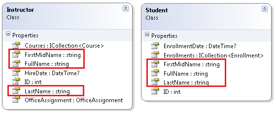
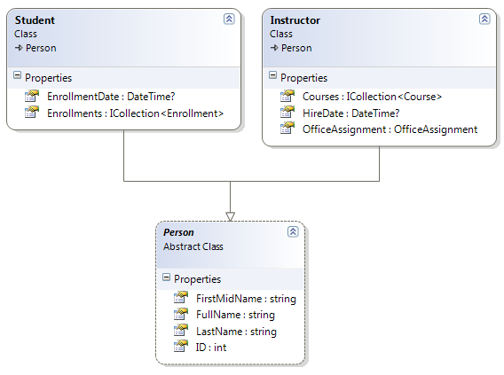
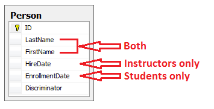
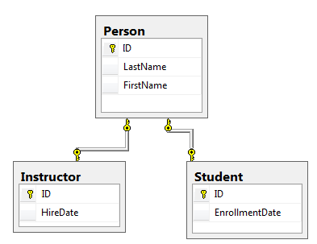
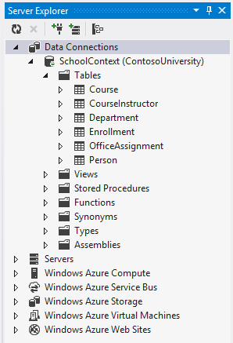
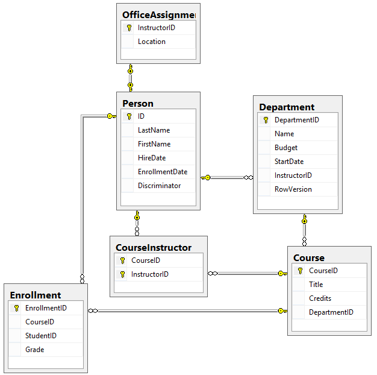
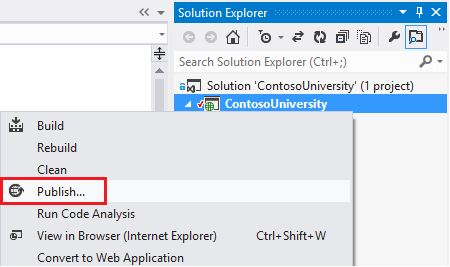
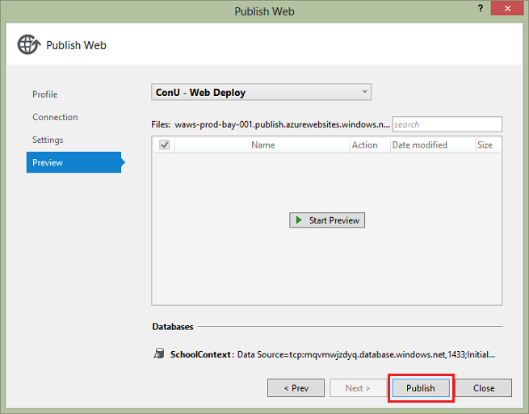

Implementing Inheritance with the Entity Framework 6 in an ASP.NET MVC 5 Application (11 of 12)
====================
by [Tom Dykstra](https://github.com/tdykstra)

[Download Completed Project](http://code.msdn.microsoft.com/ASPNET-MVC-Application-b01a9fe8) or [Download PDF](http://download.microsoft.com/download/0/F/B/0FBFAA46-2BFD-478F-8E56-7BF3C672DF9D/Getting%20Started%20with%20Entity%20Framework%206%20Code%20First%20using%20MVC%205.pdf)

> The Contoso University sample web application demonstrates how to create ASP.NET MVC 5 applications using the Entity Framework 6 Code First and Visual Studio 2013. For information about the tutorial series, see [the first tutorial in the series](creating-an-entity-framework-data-model-for-an-asp-net-mvc-application.md).

In the previous tutorial you handled concurrency exceptions. This tutorial will show you how to implement inheritance in the data model.

In object-oriented programming, you can use [inheritance](http://en.wikipedia.org/wiki/Inheritance_(object-oriented_programming)) to facilitate [code reuse](http://en.wikipedia.org/wiki/Code_reuse). In this tutorial, you'll change the `Instructor` and `Student` classes so that they derive from a `Person` base class which contains properties such as `LastName` that are common to both instructors and students. You won't add or change any web pages, but you'll change some of the code and those changes will be automatically reflected in the database.

## Options for mapping inheritance to database tables

The `Instructor` and `Student` classes in the `School` data model have several properties that are identical:

Suppose you want to eliminate the redundant code for the properties that are shared by the `Instructor` and `Student` entities. Or you want to write a service that can format names without caring whether the name came from an instructor or a student. You could create a `Person` base class which contains only those shared properties, then make the `Instructor` and `Student` entities inherit from that base class, as shown in the following illustration:

There are several ways this inheritance structure could be represented in the database. You could have a `Person` table that includes information about both students and instructors in a single table. Some of the columns could apply only to instructors (`HireDate`), some only to students (`EnrollmentDate`), some to both (`LastName`, `FirstName`). Typically, you'd have a *discriminator* column to indicate which type each row represents. For example, the discriminator column might have "Instructor" for instructors and "Student" for students.

This pattern of generating an entity inheritance structure from a single database table is called *table-per-hierarchy* (TPH) inheritance.

An alternative is to make the database look more like the inheritance structure. For example, you could have only the name fields in the `Person` table and have separate `Instructor` and `Student` tables with the date fields.

This pattern of making a database table for each entity class is called *table per type* (TPT) inheritance.

Yet another option is to map all non-abstract types to individual tables. All properties of a class, including inherited properties, map to columns of the corresponding table. This pattern is called Table-per-Concrete Class (TPC) inheritance. If you implemented TPC inheritance for the `Person`, `Student`, and `Instructor` classes as shown earlier, the `Student` and `Instructor` tables would look no different after implementing inheritance than they did before.

TPC and TPH inheritance patterns generally deliver better performance in the Entity Framework than TPT inheritance patterns, because TPT patterns can result in complex join queries.

This tutorial demonstrates how to implement TPH inheritance. TPH is the default inheritance pattern in the Entity Framework, so all you have to do is create a `Person` class, change the `Instructor` and `Student` classes to derive from `Person`, add the new class to the `DbContext`, and create a migration. (For information about how to implement the other inheritance patterns, see [Mapping the Table-Per-Type (TPT) Inheritance](https://msdn.microsoft.com/en-us/data/jj591617#2.5) and [Mapping the Table-Per-Concrete Class (TPC) Inheritance](https://msdn.microsoft.com/en-us/data/jj591617#2.6) in the MSDN Entity Framework documentation.)

## Create the Person class

In the *Models* folder, create *Person.cs* and replace the template code with the following code:

[!code-csharp[Main](implementing-inheritance-with-the-entity-framework-in-an-asp-net-mvc-application/samples/sample1.cs)]

## Make Student and Instructor classes inherit from Person

In *Instructor.cs*, derive the `Instructor` class from the `Person` class and remove the key and name fields. The code will look like the following example:

[!code-csharp[Main](implementing-inheritance-with-the-entity-framework-in-an-asp-net-mvc-application/samples/sample2.cs)]

Make similar changes to *Student.cs*. The `Student` class will look like the following example:

[!code-csharp[Main](implementing-inheritance-with-the-entity-framework-in-an-asp-net-mvc-application/samples/sample3.cs)]

## Add the Person Entity Type to the Model

In *SchoolContext.cs*, add a `DbSet` property for the `Person` entity type:

[!code-csharp[Main](implementing-inheritance-with-the-entity-framework-in-an-asp-net-mvc-application/samples/sample4.cs)]

This is all that the Entity Framework needs in order to configure table-per-hierarchy inheritance. As you'll see, when the database is updated, it will have a `Person` table in place of the `Student` and `Instructor` tables.

## Create and Update a Migrations File

In the Package Manager Console (PMC), enter the following command:

`Add-Migration Inheritance`

Run the `Update-Database` command in the PMC. The command will fail at this point because we have existing data that migrations doesn't know how to handle. You get an error message like the following one:

> *Could not drop object 'dbo.Instructor' because it is referenced by a FOREIGN KEY constraint.*

Open *Migrations\&lt;timestamp&gt;\_Inheritance.cs* and replace the `Up` method with the following code:

[!code-csharp[Main](implementing-inheritance-with-the-entity-framework-in-an-asp-net-mvc-application/samples/sample5.cs)]

This code takes care of the following database update tasks:

- Removes foreign key constraints and indexes that point to the Student table.
- Renames the Instructor table as Person and makes changes needed for it to store Student data:

    - Adds nullable EnrollmentDate for students.
    - Adds Discriminator column to indicate whether a row is for a student or an instructor.
    - Makes HireDate nullable since student rows won't have hire dates.
    - Adds a temporary field that will be used to update foreign keys that point to students. When you copy students into the Person table they'll get new primary key values.
- Copies data from the Student table into the Person table. This causes students to get assigned new primary key values.
- Fixes foreign key values that point to students.
- Re-creates foreign key constraints and indexes, now pointing them to the Person table.

(If you had used GUID instead of integer as the primary key type, the student primary key values wouldn't have to change, and several of these steps could have been omitted.)

Run the `update-database` command again.

(In a production system you would make corresponding changes to the Down method in case you ever had to use that to go back to the previous database version. For this tutorial you won't be using the Down method.)

> [!NOTE]
> It's possible to get other errors when migrating data and making schema changes. If you get migration errors you can't resolve, you can continue with the tutorial by changing the connection string in the *Web.config* file or by deleting the database. The simplest approach is to rename the database in the *Web.config* file. For example, change the database name to ContosoUniversity2 as shown in the following example:
> 
> [!code-xml[Main](implementing-inheritance-with-the-entity-framework-in-an-asp-net-mvc-application/samples/sample6.xml?highlight=2)]
> 
> With a new database, there is no data to migrate, and the `update-database` command is much more likely to complete without errors. For instructions on how to delete the database, see [How to Drop a Database from Visual Studio 2012](http://romiller.com/2013/05/17/how-to-drop-a-database-from-visual-studio-2012/). If you take this approach in order to continue with the tutorial, skip the deployment step at the end of this tutorial or deploy to a new site and database. If you deploy an update to the same site you've been deploying to already, EF will get the same error there when it runs migrations automatically. If you want to troubleshoot a migrations error, the best resource is one of the Entity Framework forums or StackOverflow.com.

## Testing

Run the site and try various pages. Everything works the same as it did before.

In **Server Explorer,** expand **Data Connections\SchoolContext** and then **Tables**, and you see that the **Student** and **Instructor** tables have been replaced by a **Person** table. Expand the **Person** table and you see that it has all of the columns that used to be in the **Student** and **Instructor** tables.

Right-click the Person table, and then click **Show Table Data** to see the discriminator column.

The following diagram illustrates the structure of the new School database:

## Deploy to Azure

This section requires you to have completed the optional **Deploying the app to Azure** section in [Part 3, Sorting, Filtering, and Paging](sorting-filtering-and-paging-with-the-entity-framework-in-an-asp-net-mvc-application.md) of this tutorial series. If you had migrations errors that you resolved by deleting the database in your local project, skip this step; or create a new site and database, and deploy to the new environment.

1. In Visual Studio, right-click the project in **Solution Explorer** and select **Publish** from the context menu.  
  
    
2. Click **Publish**.  
  
      
  
 The Web app will open in your default browser.
3. Test the application to verify it's working.

    The first time you run a page that accesses the database, the Entity Framework runs all of the migrations `Up` methods required to bring the database up to date with the current data model.

## Summary

You've implemented table-per-hierarchy inheritance for the `Person`, `Student`, and `Instructor` classes. For more information about this and other inheritance structures, see [TPT Inheritance Pattern](https://msdn.microsoft.com/en-us/data/jj618293) and [TPH Inheritance Pattern](https://msdn.microsoft.com/en-us/data/jj618292) on MSDN. In the next tutorial you'll see how to handle a variety of relatively advanced Entity Framework scenarios.

Links to other Entity Framework resources can be found in the [ASP.NET Data Access - Recommended Resources](../../../../whitepapers/aspnet-data-access-content-map.md).

>[!div class="step-by-step"]
[Previous](handling-concurrency-with-the-entity-framework-in-an-asp-net-mvc-application.md)
[Next](advanced-entity-framework-scenarios-for-an-mvc-web-application.md)