Code First Migrations and Deployment with the Entity Framework in an ASP.NET MVC Application
====================
by [Tom Dykstra](https://github.com/tdykstra)

[Download Completed Project](http://code.msdn.microsoft.com/ASPNET-MVC-Application-b01a9fe8) or [Download PDF](http://download.microsoft.com/download/0/F/B/0FBFAA46-2BFD-478F-8E56-7BF3C672DF9D/Getting%20Started%20with%20Entity%20Framework%206%20Code%20First%20using%20MVC%205.pdf)

> The Contoso University sample web application demonstrates how to create ASP.NET MVC 5 applications using the Entity Framework 6 Code First and Visual Studio 2013. For information about the tutorial series, see [the first tutorial in the series](creating-an-entity-framework-data-model-for-an-asp-net-mvc-application.md).

So far the application has been running locally in IIS Express on your development computer. To make a real application available for other people to use over the Internet, you have to deploy it to a web hosting provider. In this tutorial you'll deploy the Contoso University application to the cloud in Azure.

The tutorial contains the following sections:

- Enable Code First Migrations. The Migrations feature enables you to change the data model and deploy your changes to production by updating the database schema without having to drop and re-create the database.
- Deploy to Azure. This step is optional; you can continue with the remaining tutorials without having deployed the project.

We recommend that you use a continuous integration process with source control for deployment, but this tutorial does not cover those topics. For more information, see the [source control](../../../../aspnet/overview/developing-apps-with-windows-azure/building-real-world-cloud-apps-with-windows-azure/source-control.md) and [continuous integration](../../../../aspnet/overview/developing-apps-with-windows-azure/building-real-world-cloud-apps-with-windows-azure/continuous-integration-and-continuous-delivery.md) chapters of the [Building Real-World Cloud Apps with Azure](../../../../aspnet/overview/developing-apps-with-windows-azure/building-real-world-cloud-apps-with-windows-azure/introduction.md) e-book.

## Enable Code First Migrations

When you develop a new application, your data model changes frequently, and each time the model changes, it gets out of sync with the database. You have configured the Entity Framework to automatically drop and re-create the database each time you change the data model. When you add, remove, or change entity classes or change your `DbContext` class, the next time you run the application it automatically deletes your existing database, creates a new one that matches the model, and seeds it with test data.

This method of keeping the database in sync with the data model works well until you deploy the application to production. When the application is running in production it is usually storing data that you want to keep, and you don't want to lose everything each time you make a change such as adding a new column. The [Code First Migrations](https://msdn.microsoft.com/en-us/data/jj591621) feature solves this problem by enabling Code First to update the database schema instead of dropping and re-creating the database. In this tutorial, you'll deploy the application, and to prepare for that you'll enable Migrations.

1. Disable the initializer that you set up earlier by commenting out or deleting the `contexts` element that you added to the application Web.config file.

    [!code-xml[Main](migrations-and-deployment-with-the-entity-framework-in-an-asp-net-mvc-application/samples/sample1.xml?highlight=2,6)]
2. Also in the application *Web.config* file, change the name of the database in the connection string to ContosoUniversity2.

    [!code-xml[Main](migrations-and-deployment-with-the-entity-framework-in-an-asp-net-mvc-application/samples/sample2.xml?highlight=2)]

    This change sets up the project so that the first migration will create a new database. This isn't required but you'll see later why it's a good idea.
3. From the **Tools** menu, click **Library Package Manager** and then **Package Manager Console**.

    
4. At the `PM>` prompt enter the following commands:

    `enable-migrations`  
    `add-migration InitialCreate`

    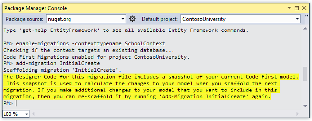

    The `enable-migrations` command creates a *Migrations* folder in the ContosoUniversity project, and it puts in that folder a *Configuration.cs* file that you can edit to configure Migrations.

    (If you missed the step above that directs you to change the database name, Migrations will find the existing database and automatically do the `add-migration` command. That's OK, it just means you won't run a test of the migrations code before you deploy the database. Later when you run the `update-database` command nothing will happen because the database will already exist.)

    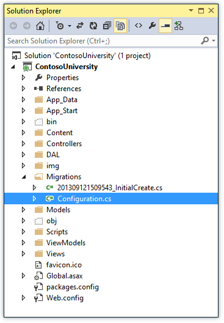

    Like the initializer class that you saw earlier, the `Configuration` class includes a `Seed` method.

    [!code-csharp[Main](migrations-and-deployment-with-the-entity-framework-in-an-asp-net-mvc-application/samples/sample3.cs)]

    The purpose of the [Seed](https://msdn.microsoft.com/en-us/library/hh829453(v=vs.103).aspx) method is to enable you to insert or update test data after Code First creates or updates the database. The method is called when the database is created and every time the database schema is updated after a data model change.

### Set up the Seed Method

When you are dropping and re-creating the database for every data model change, you use the initializer class's `Seed` method to insert test data, because after every model change the database is dropped and all the test data is lost. With Code First Migrations, test data is retained after database changes, so including test data in the [Seed](https://msdn.microsoft.com/en-us/library/hh829453(v=vs.103).aspx) method is typically not necessary. In fact, you don't want the `Seed` method to insert test data if you'll be using Migrations to deploy the database to production, because the `Seed` method will run in production. In that case you want the `Seed` method to insert into the database only the data that you need in production. For example, you might want the database to include actual department names in the `Department` table when the application becomes available in production.

For this tutorial, you'll be using Migrations for deployment, but your `Seed` method will insert test data anyway in order to make it easier to see how application functionality works without having to manually insert a lot of data.

1. Replace the contents of the *Configuration.cs* file with the following code, which will load test data into the new database. 

    [!code-csharp[Main](migrations-and-deployment-with-the-entity-framework-in-an-asp-net-mvc-application/samples/sample4.cs)]

    The [Seed](https://msdn.microsoft.com/en-us/library/hh829453(v=vs.103).aspx) method takes the database context object as an input parameter, and the code in the method uses that object to add new entities to the database. For each entity type, the code creates a collection of new entities, adds them to the appropriate [DbSet](https://msdn.microsoft.com/en-us/library/system.data.entity.dbset(v=vs.103).aspx) property, and then saves the changes to the database. It isn't necessary to call the [SaveChanges](https://msdn.microsoft.com/en-us/library/system.data.entity.dbcontext.savechanges(v=VS.103).aspx) method after each group of entities, as is done here, but doing that helps you locate the source of a problem if an exception occurs while the code is writing to the database.

    Some of the statements that insert data use the [AddOrUpdate](https://msdn.microsoft.com/en-us/library/system.data.entity.migrations.idbsetextensions.addorupdate(v=vs.103).aspx) method to perform an "upsert" operation. Because the `Seed` method runs every time you execute the `update-database` command, typically after each migration, you can't just insert data, because the rows you are trying to add will already be there after the first migration that creates the database. The "upsert" operation prevents errors that would happen if you try to insert a row that already exists, but it ***overrides*** any changes to data that you may have made while testing the application. With test data in some tables you might not want that to happen: in some cases when you change data while testing you want your changes to remain after database updates. In that case you want to do a conditional insert operation: insert a row only if it doesn't already exist. The Seed method uses both approaches.

    The first parameter passed to the [AddOrUpdate](https://msdn.microsoft.com/en-us/library/system.data.entity.migrations.idbsetextensions.addorupdate(v=vs.103).aspx) method specifies the property to use to check if a row already exists. For the test student data that you are providing, the `LastName` property can be used for this purpose since each last name in the list is unique:

    [!code-csharp[Main](migrations-and-deployment-with-the-entity-framework-in-an-asp-net-mvc-application/samples/sample5.cs)]

    This code assumes that last names are unique. If you manually add a student with a duplicate last name, you'll get the following exception the next time you perform a migration.

    Sequence contains more than one element

    For information about how to handle redundant data such as two students named "Alexander Carson", see [Seeding and Debugging Entity Framework (EF) DBs](https://blogs.msdn.com/b/rickandy/archive/2013/02/12/seeding-and-debugging-entity-framework-ef-dbs.aspx) on Rick Anderson's blog. For more information about the `AddOrUpdate` method, see [Take care with EF 4.3 AddOrUpdate Method](http://thedatafarm.com/blog/data-access/take-care-with-ef-4-3-addorupdate-method/) on Julie Lerman's blog.

    The code that creates `Enrollment` entities assumes you have the `ID` value in the entities in the `students` collection, although you didn't set that property in the code that creates the collection.

    [!code-csharp[Main](migrations-and-deployment-with-the-entity-framework-in-an-asp-net-mvc-application/samples/sample6.cs?highlight=2)]

    You can use the `ID` property here because the `ID` value is set when you call `SaveChanges` for the `students` collection. EF automatically gets the primary key value when it inserts an entity into the database, and it updates the `ID` property of the entity in memory.

    The code that adds each `Enrollment` entity to the `Enrollments` entity set doesn't use the `AddOrUpdate` method. It checks if an entity already exists and inserts the entity if it doesn't exist. This approach will preserve changes you make to an enrollment grade by using the application UI. The code loops through each member of the `Enrollment`[List](https://msdn.microsoft.com/en-us/library/6sh2ey19.aspx) and if the enrollment is not found in the database, it adds the enrollment to the database. The first time you update the database, the database will be empty, so it will add each enrollment.

    [!code-csharp[Main](migrations-and-deployment-with-the-entity-framework-in-an-asp-net-mvc-application/samples/sample7.cs)]
2. Build the project.

### Execute the First Migration

When you executed the `add-migration` command, Migrations generated the code that would create the database from scratch. This code is also in the *Migrations* folder, in the file named *&lt;timestamp&gt;\_InitialCreate.cs*. The `Up` method of the `InitialCreate` class creates the database tables that correspond to the data model entity sets, and the `Down` method deletes them.

[!code-csharp[Main](migrations-and-deployment-with-the-entity-framework-in-an-asp-net-mvc-application/samples/sample8.cs)]

Migrations calls the `Up` method to implement the data model changes for a migration. When you enter a command to roll back the update, Migrations calls the `Down` method.

This is the initial migration that was created when you entered the `add-migration InitialCreate` command. The parameter (`InitialCreate` in the example) is used for the file name and can be whatever you want; you typically choose a word or phrase that summarizes what is being done in the migration. For example, you might name a later migration &quot;AddDepartmentTable&quot;.

If you created the initial migration when the database already exists, the database creation code is generated but it doesn't have to run because the database already matches the data model. When you deploy the app to another environment where the database doesn't exist yet, this code will run to create your database, so it's a good idea to test it first. That's why you changed the name of the database in the connection string earlier -- so that migrations can create a new one from scratch.

1. In the **Package Manager Console** window, enter the following command:

    `update-database`

    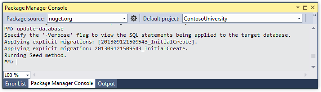

    The `update-database` command runs the `Up` method to create the database and then it runs the `Seed` method to populate the database. The same process will run automatically in production after you deploy the application, as you'll see in the following section.
- Use **Server Explorer** to inspect the database as you did in the first tutorial, and run the application to verify that everything still works the same as before.

## Deploy to Azure

So far the application has been running locally in IIS Express on your development computer. To make it available for other people to use over the Internet, you have to deploy it to a web hosting provider. In this section of the tutorial you'll deploy it to Azure. This section is optional; you can skip this and continue with the following tutorial, or you can adapt the instructions in this section for a different hosting provider of your choice.

### Using Code First Migrations to Deploy the Database

To deploy the database you'll use Code First Migrations. When you create the publish profile that you use to configure settings for deploying from Visual Studio, you'll select a check box labeled **Execute Code First Migrations (runs on application start)**. This setting causes the deployment process to automatically configure the application *Web.config* file on the destination server so that Code First uses the `MigrateDatabaseToLatestVersion` initializer class.

Visual Studio doesn't do anything with the database during the deployment process while it is copying your project to the destination server. When you run the deployed application and it accesses the database for the first time after deployment, Code First checks if the database matches the data model. If there's a mismatch, Code First automatically creates the database (if it doesn't exist yet) or updates the database schema to the latest version (if a database exists but doesn't match the model). If the application implements a Migrations `Seed` method, the method runs after the database is created or the schema is updated.

Your Migrations `Seed` method inserts test data. If you were deploying to a production environment, you would have to change the `Seed` method so that it only inserts data that you want to be inserted into your production database. For example, in your current data model you might want to have real courses but fictional students in the development database. You can write a `Seed` method to load both in development, and then comment out the fictional students before you deploy to production. Or you can write a `Seed` method to load only courses, and enter the fictional students in the test database manually by using the application's UI.

### Get an Azure account

You'll need an Azure account. If you don't already have one, but you do have an MSDN subscription, you can [activate your MSDN subscription benefits](https://www.windowsazure.com/en-us/pricing/member-offers/msdn-benefits-details/?WT.mc_id=A443DD604). Otherwise, you can create a free trial account in just a couple of minutes. For details, see [Azure Free Trial](https://www.windowsazure.com/en-us/pricing/free-trial/?WT.mc_id=A443DD604).

### Create a web site and a SQL database in Azure

Your web app in Azure will run in a shared hosting environment, which means it runs on virtual machines (VMs) that are shared with other Azure clients. A shared hosting environment is a low-cost way to get started in the cloud. Later, if your web traffic increases, the application can scale to meet the need by running on dedicated VMs.

You'll deploy the database to Azure SQL Database. SQL Database is a cloud-based relational database service that is built on SQL Server technologies. Tools and applications that work with SQL Server also work with SQL Database.

1. In the [Azure Management Portal](https://manage.windowsazure.com/), click **Web Sites** in the left tab, and then click **New**.

    
2. Click **CUSTOM CREATE**.

    

 The **New Web Site - Custom Create** wizard opens.
3. In the **New Web Site** step of the wizard, enter a string in the **URL** box to use as the unique URL for your application. The complete URL will consist of what you enter here plus the suffix that you see next to the text box. The illustration shows "ConU", but that URL is probably taken so you will have to choose a different one.

    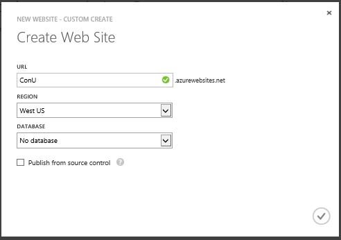
4. In the **Region** drop-down list, choose a region close to you. This setting specifies which data center your web site will run in.
5. In the **Database** drop-down list, choose **Create a free 20 MB SQL database**.

    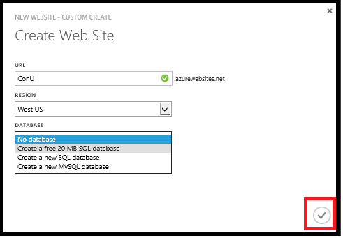
6. In the **DB CONNECTION STRING NAME**, enter *SchoolContext*.

    
7. Click the arrow that points to the right at the bottom of the box. The wizard advances to the **Database Settings** step.
8. In the **Name** box, enter *ContosoUniversityDB*.
9. In the **Server** box, select **New SQL Database server**. Alternatively, if you previously created a server, you can select that server from the drop-down list.
10. Enter an administrator **LOGIN NAME** and **PASSWORD**. If you selected **New SQL Database server** you aren't entering an existing name and password here, you're entering a new name and password that you're defining now to use later when you access the database. If you selected a server that you created previously, you'll enter credentials for that server. For this tutorial, you won't select the ***Advanced*** check box. The ***Advanced*** options enable you to set the database [collation](https://msdn.microsoft.com/en-us/library/aa174903(v=SQL.80).aspx).
11. Choose the same **Region** that you chose for the web site.
12. Click the check mark at the bottom right of the box to indicate that you're finished.   
  
    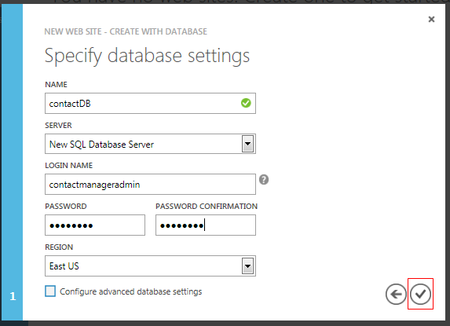  
  
 The Management Portal returns to the Web Sites page, and the **Status** column shows that the site is being created. After a while (typically less than a minute), the **Status** column shows that the site was successfully created. In the navigation bar at the left, the number of sites you have in your account appears next to the **Web Sites** icon, and the number of databases appears next to the **SQL Databases** icon.

### Deploy the application to Azure

1. In Visual Studio, right-click the project in **Solution Explorer** and select **Publish** from the context menu.  
  
    
2. In the **Profile** tab of the **Publish Web** wizard, click **Import**.  
  
    
3. If you have not previously added your Azure subscription in Visual Studio, perform the following steps. These steps enable Visual Studio to connect to your Azure subscription so that the drop-down list under **Import from Azure** will include your web site.

    As an alternative, you can sign in directly to your Azure account without downloading a subscription file. To use this method, click **Sign In** instead of **Manage subscriptions** in the next step. This alternative is simpler, but as this tutorial is being written in November, 2013, only the subscription file download enables **Server Explorer** to connect to Azure SQL Database.

    a. In the **Import Publish Profile** dialog box, click **Manage subscriptions**.

    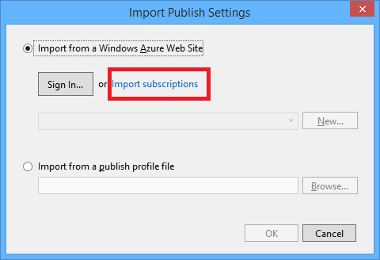

    b. In the **Manage Azure Subscriptions** dialog box, click the **Certificates** tab, and then click **Import**.

    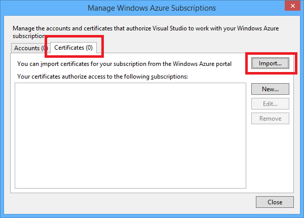

    c. In the **Import Azure Subscriptions** dialog box, click **Download subscription file** .

    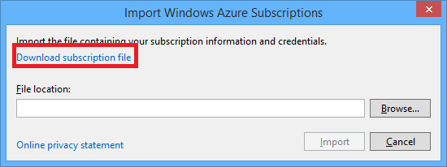

    d. In your browser window, save the *.publishsettings* file.

    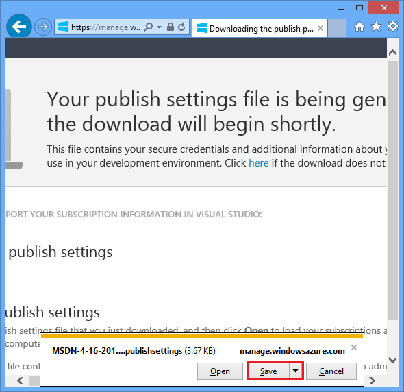

    > [!WARNING]
    > Security - The *publishsettings* file contains your credentials (unencoded) that are used to administer your Azure subscriptions and services. The security best practice for this file is to store it temporarily outside your source directories (for example in the *Downloads* folder), and then delete it once the import has completed. A malicious user who gains access to the `.publishsettings` file can edit, create, and delete your Azure services.

    e. In the **Import Azure Subscriptions** dialog box, click **Browse** and navigate to the *.publishsettings* file.

    

    e. Click **Import**.

    
4. Close the **Manage Azure Subscriptions** box.
5. In the **Import Publish Profile** dialog box, select **Import from an Azure**, select your web site from the drop-down list, and then click **OK**.  
  
    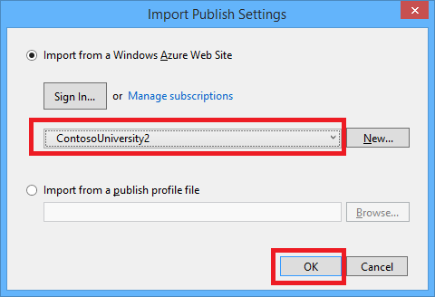
6. In the **Connection** tab, click **Validate Connection** to make sure that the settings are correct.  
  
    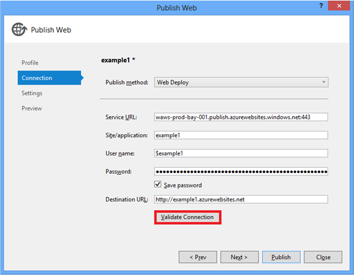
7. When the connection has been validated, a green check mark is shown next to the **Validate Connection** button. Click **Next**.  
  
    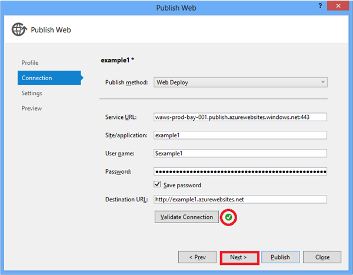
8. Open the **Remote connection string** drop-down list under **SchoolContext** and select the connection string for the database you created.
9. Select **Execute Code First Migrations (runs on application start)**.  

    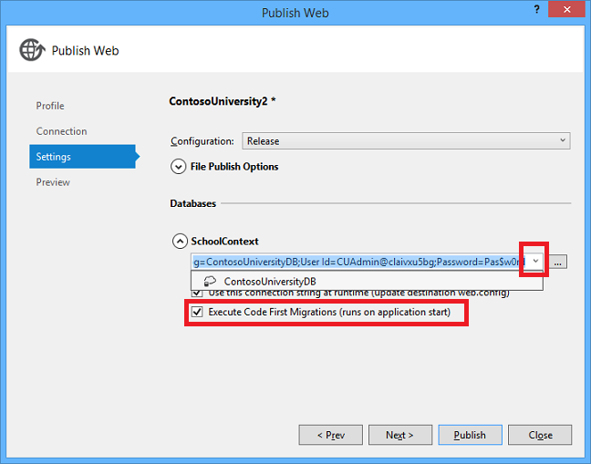

    This setting causes the deployment process to automatically configure the application *Web.config* file on the destination server so that Code First uses the `MigrateDatabaseToLatestVersion` initializer class.
10. Click **Next**.
11. In the **Preview** tab, click **Start Preview**.  
  
    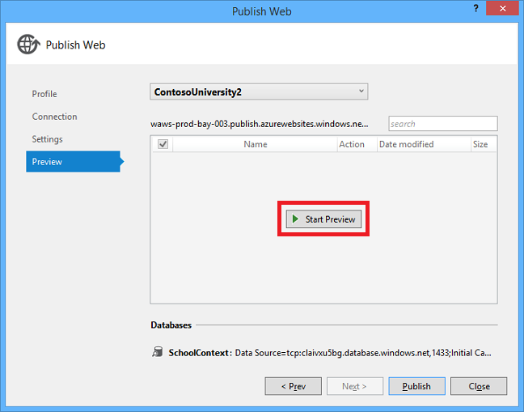  
  
 The tab displays a list of the files that will be copied to the server. Displaying the preview isn't required to publish the application but is a useful function to be aware of. In this case, you don't need to do anything with the list of files that is displayed. The next time you deploy this application, only the files that have changed will be in this list.  
  
    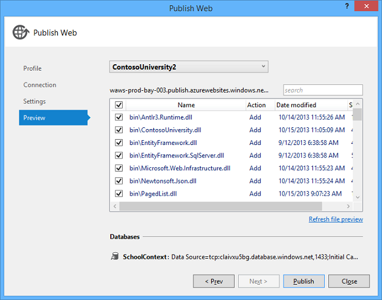
12. Click **Publish**.  
 Visual Studio begins the process of copying the files to the Azure server.
13. The **Output** window shows what deployment actions were taken and reports successful completion of the deployment.  
  
    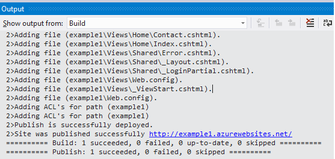
14. Upon successful deployment, the default browser automatically opens to the URL of the deployed web site.  
 The application you created is now running in the cloud. Click the Students tab.  
  
    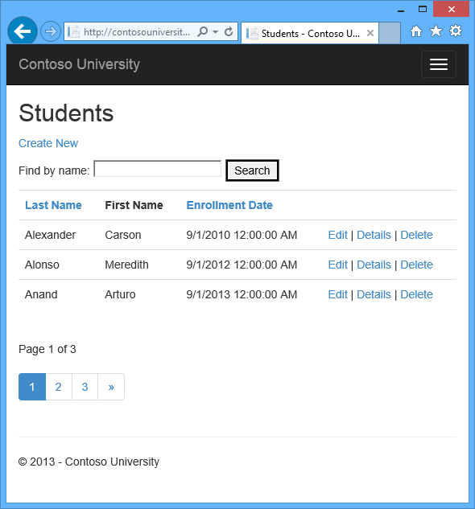

At this point your *SchoolContext* database has been created in the Azure SQL Database because you selected **Execute Code First Migrations (runs on app start)**. The *Web.config* file in the deployed web site has been changed so that the [MigrateDatabaseToLatestVersion](https://msdn.microsoft.com/en-us/library/hh829476(v=vs.103).aspx) initializer runs the first time your code reads or writes data in the database (which happened when you selected the **Students** tab):

The deployment process also created a new connection string *(SchoolContext\_DatabasePublish*) for Code First Migrations to use for updating the database schema and seeding the database.

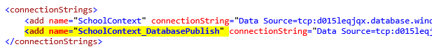

You can find the deployed version of the Web.config file on your own computer in *ContosoUniversity\obj\Release\Package\PackageTmp\Web.config*. You can access the deployed *Web.config* file itself by using FTP. For instructions, see [ASP.NET Web Deployment using Visual Studio: Deploying a Code Update](../../../../web-forms/overview/deployment/visual-studio-web-deployment/deploying-a-code-update.md). Follow the instructions that start with "To use an FTP tool, you need three things: the FTP URL, the user name, and the password."

> [!NOTE]
> The web app doesn't implement security, so anyone who finds the URL can change the data. For instructions on how to secure the web site, see [Deploy a Secure ASP.NET MVC app with Membership, OAuth, and SQL Database to Azure](https://www.windowsazure.com/en-us/develop/net/tutorials/web-site-with-sql-database/). You can prevent other people from using the site by using the Azure Management Portal or **Server Explorer** in Visual Studio to stop the site.

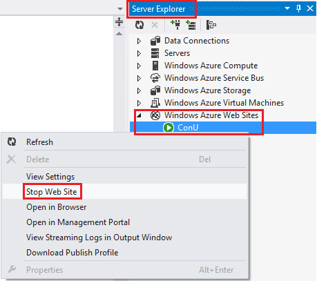

## Advanced Migrations Scenarios

If you deploy a database by running migrations automatically as shown in this tutorial, and you are deploying to a web site that runs on multiple servers, you could get mutiple servers trying to run migrations at the same time. Migrations are atomic, so if two servers try to run the same migration, one will succeed and the other will fail (assuming the operations can't be done twice). In that scenario if you want to avoid those issues, you can call migrations manually and set up your own code so that it only happens once. For more information, see [Running and Scripting Migrations from Code](http://romiller.com/2012/02/09/running-scripting-migrations-from-code/) on Rowan Miller's blog and [Migrate.exe](https://msdn.microsoft.com/en-us/data/jj618307) (for executing migrations from the command line) on MSDN.

For information about other migrations scenarios, see [Migrations Screencast Series](https://blogs.msdn.com/b/adonet/archive/2014/03/12/migrations-screencast-series.aspx).

## Code First Initializers

In the deployment section you saw the [MigrateDatabaseToLatestVersion](https://msdn.microsoft.com/en-us/library/hh829476(v=vs.103).aspx) initializer being used. Code First also provides other initializers, including [CreateDatabaseIfNotExists](https://msdn.microsoft.com/en-us/library/gg679221(v=vs.103).aspx) (the default), [DropCreateDatabaseIfModelChanges](https://msdn.microsoft.com/en-us/library/gg679604(v=VS.103).aspx) (which you used earlier) and [DropCreateDatabaseAlways](https://msdn.microsoft.com/en-us/library/gg679506(v=VS.103).aspx). The `DropCreateAlways` initializer can be useful for setting up conditions for unit tests. You can also write your own initializers, and you can call an initializer explicitly if you don't want to wait until the application reads from or writes to the database. At the time this tutorial is being written in November, 2013, you can only use the Create and DropCreate initializers before you enable migrations. The Entity Framework team is working on making these initializers usable with migrations as well.

For more information about initializers, see [Understanding Database Initializers in Entity Framework Code First](http://www.codeguru.com/csharp/article.php/c19999/Understanding-Database-Initializers-in-Entity-Framework-Code-First.htm) and chapter 6 of the book [Programming Entity Framework: Code First](http://shop.oreilly.com/product/0636920022220.do) by Julie Lerman and Rowan Miller.

## Summary

In this tutorial you've seen how to enable migrations and deploy the application. In the next tutorial you'll begin looking at more advanced topics by expanding the data model.

Please leave feedback on how you liked this tutorial and what we could improve. You can also request new topics at [Show Me How With Code](http://aspnet.uservoice.com/forums/228522-show-me-how-with-code).

Links to other Entity Framework resources can be found in [ASP.NET Data Access - Recommended Resources](../../../../whitepapers/aspnet-data-access-content-map.md).

>[!div class="step-by-step"]
[Previous](connection-resiliency-and-command-interception-with-the-entity-framework-in-an-asp-net-mvc-application.md)
[Next](creating-a-more-complex-data-model-for-an-asp-net-mvc-application.md)