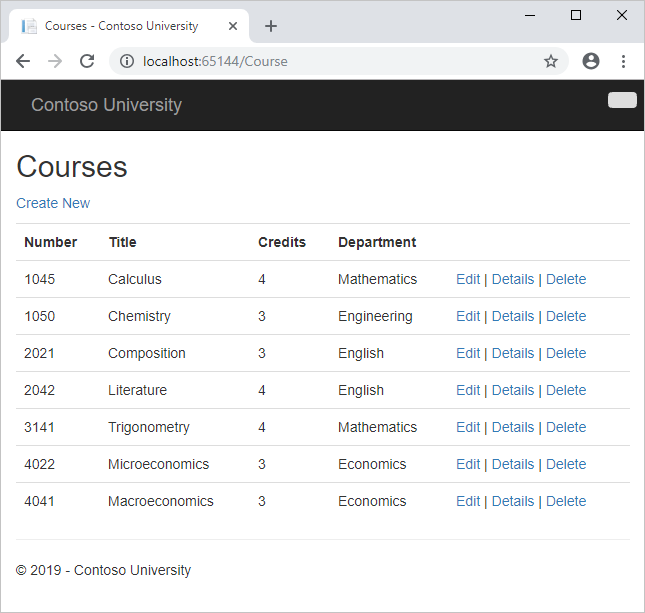
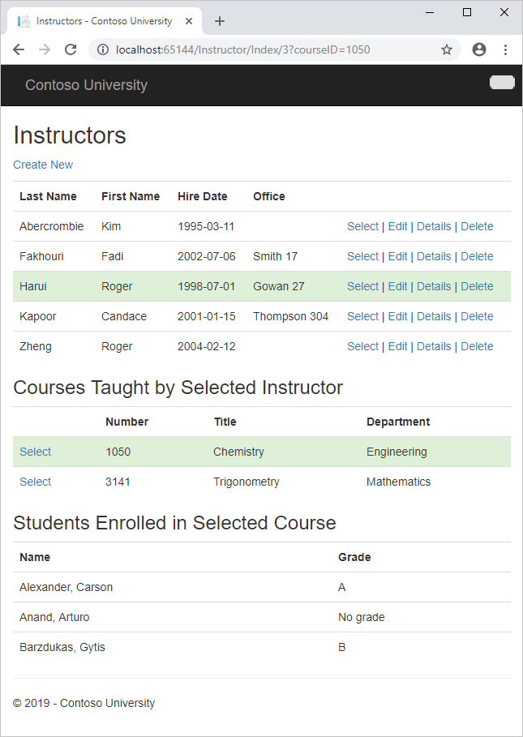
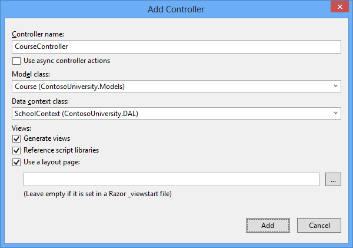
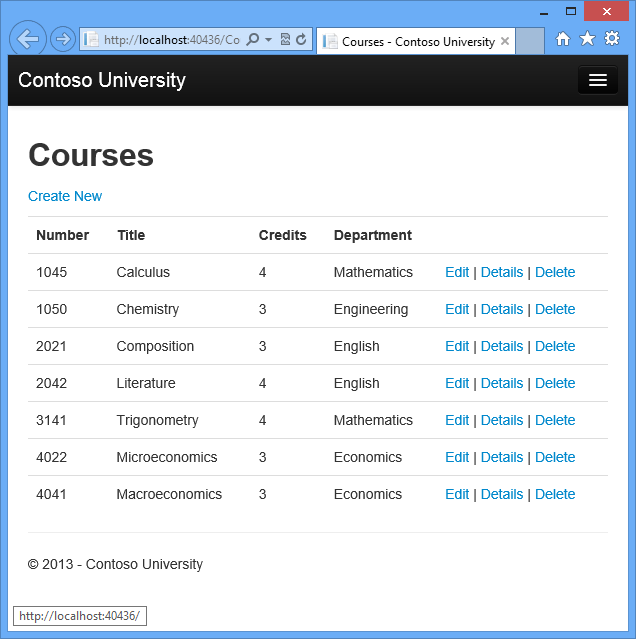
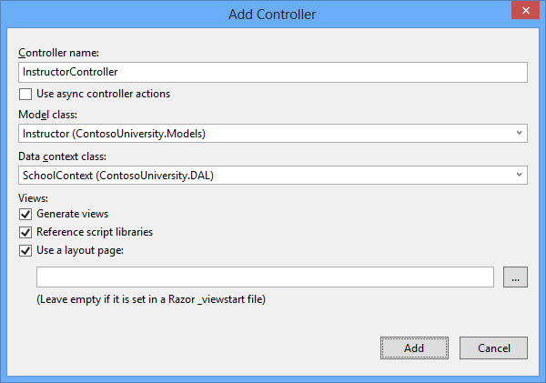
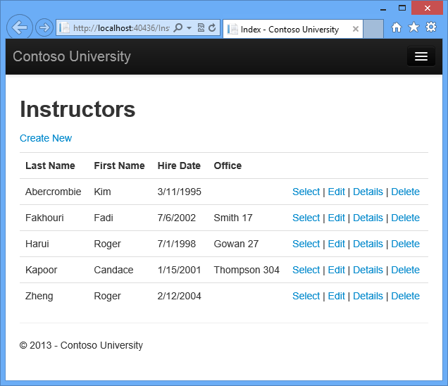
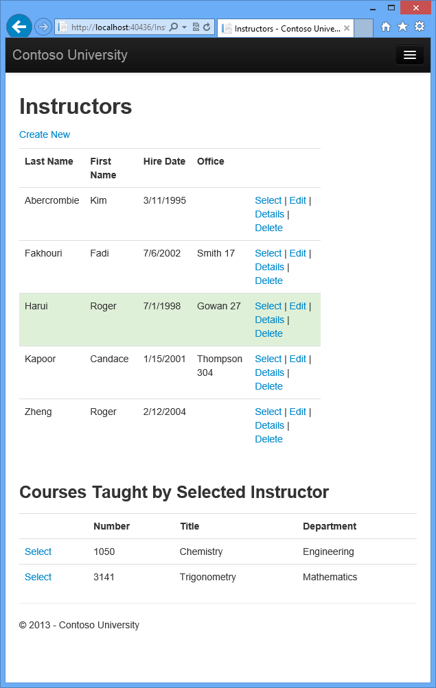
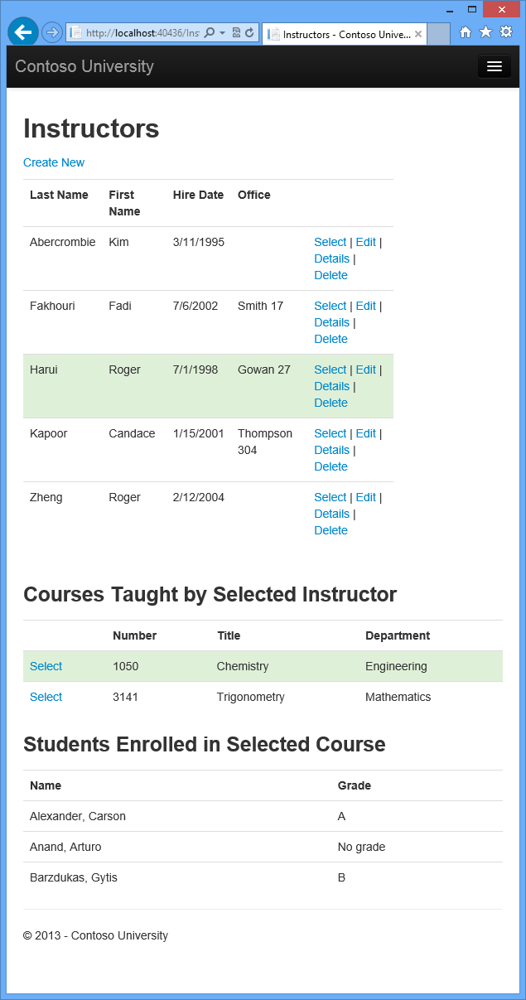

Reading Related Data with the Entity Framework in an ASP.NET MVC Application
====================
by [Tom Dykstra](https://github.com/tdykstra)

[Download Completed Project](http://code.msdn.microsoft.com/ASPNET-MVC-Application-b01a9fe8) or [Download PDF](http://download.microsoft.com/download/0/F/B/0FBFAA46-2BFD-478F-8E56-7BF3C672DF9D/Getting%20Started%20with%20Entity%20Framework%206%20Code%20First%20using%20MVC%205.pdf)

> The Contoso University sample web application demonstrates how to create ASP.NET MVC 5 applications using the Entity Framework 6 Code First and Visual Studio 2013. For information about the tutorial series, see [the first tutorial in the series](creating-an-entity-framework-data-model-for-an-asp-net-mvc-application.md).

In the previous tutorial you completed the School data model. In this tutorial you'll read and display related data — that is, data that the Entity Framework loads into navigation properties.

The following illustrations show the pages that you'll work with.

## Lazy, Eager, and Explicit Loading of Related Data

There are several ways that the Entity Framework can load related data into the navigation properties of an entity:

- *Lazy loading*. When the entity is first read, related data isn't retrieved. However, the first time you attempt to access a navigation property, the data required for that navigation property is automatically retrieved. This results in multiple queries sent to the database — one for the entity itself and one each time that related data for the entity must be retrieved. The `DbContext` class enables lazy loading by default. 

    
- *Eager loading*. When the entity is read, related data is retrieved along with it. This typically results in a single join query that retrieves all of the data that's needed. You specify eager loading by using the `Include` method.

    
- *Explicit loading*. This is similar to lazy loading, except that you explicitly retrieve the related data in code; it doesn't happen automatically when you access a navigation property. You load related data manually by getting the object state manager entry for an entity and calling the [Collection.Load](https://msdn.microsoft.com/en-us/library/gg696220(v=vs.103).aspx) method for collections or the [Reference.Load](https://msdn.microsoft.com/en-us/library/gg679166(v=vs.103).aspx) method for properties that hold a single entity. (In the following example, if you wanted to load the Administrator navigation property, you'd replace `Collection(x => x.Courses)` with `Reference(x => x.Administrator)`.) Typically you'd use explicit loading only when you've turned lazy loading off.

    

Because they don't immediately retrieve the property values, lazy loading and explicit loading are also both known as *deferred loading*.

### Performance considerations

If you know you need related data for every entity retrieved, eager loading often offers the best performance, because a single query sent to the database is typically more efficient than separate queries for each entity retrieved. For example, in the above examples, suppose that each department has ten related courses. The eager loading example would result in just a single (join) query and a single round trip to the database. The lazy loading and explicit loading examples would both result in eleven queries and eleven round trips to the database. The extra round trips to the database are especially detrimental to performance when latency is high.

On the other hand, in some scenarios lazy loading is more efficient. Eager loading might cause a very complex join to be generated, which SQL Server can't process efficiently. Or if you need to access an entity's navigation properties only for a subset of a set of the entities you're processing, lazy loading might perform better because eager loading would retrieve more data than you need. If performance is critical, it's best to test performance both ways in order to make the best choice.

Lazy loading can mask code that causes performance problems. For example, code that doesn't specify eager or explicit loading but processes a high volume of entities and uses several navigation properties in each iteration might be very inefficient (because of many round trips to the database). An application that performs well in development using an on premise SQL server might have performance problems when moved to Azure SQL Database due to the increased latency and lazy loading. Profiling the database queries with a realistic test load will help you determine if lazy loading is appropriate. For more information see [Demystifying Entity Framework Strategies: Loading Related Data](https://msdn.microsoft.com/en-us/magazine/hh205756.aspx) and [Using the Entity Framework to Reduce Network Latency to SQL Azure](https://msdn.microsoft.com/en-us/magazine/gg309181.aspx).

### Disable lazy loading before serialization

If you leave lazy loading enabled during serialization, you can end up querying significantly more data than you intended. Serialization generally works by accessing each property on an instance of a type. Property access triggers lazy loading, and those lazy loaded entities are serialized. The serialization process then accesses each property of the lazy-loaded entities, potentially causing even more lazy loading and serialization. To prevent this run-away chain reaction, turn lazy loading off before you serialize an entity.

Serialization can also be complicated by the proxy classes that the Entity Framework uses, as explained in the [Advanced Scenarios tutorial](advanced-entity-framework-scenarios-for-an-mvc-web-application.md#proxies).

One way to avoid serialization problems is to serialize data transfer objects (DTOs) instead of entity objects, as shown in the [Using Web API with Entity Framework](../../../../web-api/overview/data/using-web-api-with-entity-framework/part-5.md) tutorial.

If you don't use DTOs, you can disable lazy loading and avoid proxy issues by [disabling proxy creation](https://msdn.microsoft.com/en-US/data/jj592886.aspx).

Here are some other [ways to disable lazy loading](https://msdn.microsoft.com/en-US/data/jj574232):

- For specific navigation properties, omit the `virtual` keyword when you declare the property.
- For all navigation properties, set `LazyLoadingEnabled` to `false`, put the following code in the constructor of your context class: 

    [!code-csharp[Main](reading-related-data-with-the-entity-framework-in-an-asp-net-mvc-application/samples/sample1.cs)]

## Create a Courses Page That Displays Department Name

The `Course` entity includes a navigation property that contains the `Department` entity of the department that the course is assigned to. To display the name of the assigned department in a list of courses, you need to get the `Name` property from the `Department` entity that is in the `Course.Department` navigation property.

Create a controller named `CourseController` (not CoursesController) for the `Course` entity type, using the same options for the **MVC 5 Controller with views, using Entity Framework** scaffolder that you did earlier for the `Student` controller, as shown in the following illustration:

Open *Controllers\CourseController.cs* and look at the `Index` method:

[!code-csharp[Main](reading-related-data-with-the-entity-framework-in-an-asp-net-mvc-application/samples/sample2.cs)]

The automatic scaffolding has specified eager loading for the `Department` navigation property by using the `Include` method.

Open *Views\Course\Index.cshtml* and replace the template code with the following code. The changes are highlighted:

[!code-cshtml[Main](reading-related-data-with-the-entity-framework-in-an-asp-net-mvc-application/samples/sample3.cshtml?highlight=4,7,14-16,23-25,31-33,40-42)]

You've made the following changes to the scaffolded code:

- Changed the heading from **Index** to **Courses**.
- Added a **Number** column that shows the `CourseID` property value. By default, primary keys aren't scaffolded because normally they are meaningless to end users. However, in this case the primary key is meaningful and you want to show it.
- Moved the **Department** column to the right side and changed its heading. The scaffolder correctly chose to display the `Name` property from the `Department` entity, but here in the Course page the column heading should be **Department** rather than **Name**.

Notice that for the Department column, the scaffolded code displays the `Name` property of the `Department` entity that's loaded into the `Department` navigation property:

[!code-cshtml[Main](reading-related-data-with-the-entity-framework-in-an-asp-net-mvc-application/samples/sample4.cshtml?highlight=2)]

Run the page (select the **Courses** tab on the Contoso University home page) to see the list with department names.

## Create an Instructors Page That Shows Courses and Enrollments

In this section you'll create a controller and view for the `Instructor` entity in order to display the Instructors page:

This page reads and displays related data in the following ways:

- The list of instructors displays related data from the `OfficeAssignment` entity. The `Instructor` and `OfficeAssignment` entities are in a one-to-zero-or-one relationship. You'll use eager loading for the `OfficeAssignment` entities. As explained earlier, eager loading is typically more efficient when you need the related data for all retrieved rows of the primary table. In this case, you want to display office assignments for all displayed instructors.
- When the user selects an instructor, related `Course` entities are displayed. The `Instructor` and `Course` entities are in a many-to-many relationship. You'll use eager loading for the `Course` entities and their related `Department` entities. In this case, lazy loading might be more efficient because you need courses only for the selected instructor. However, this example shows how to use eager loading for navigation properties within entities that are themselves in navigation properties.
- When the user selects a course, related data from the `Enrollments` entity set is displayed. The `Course` and `Enrollment` entities are in a one-to-many relationship. You'll add explicit loading for `Enrollment` entities and their related `Student` entities. (Explicit loading isn't necessary because lazy loading is enabled, but this shows how to do explicit loading.)

### Create a View Model for the Instructor Index View

The Instructors page shows three different tables. Therefore, you'll create a view model that includes three properties, each holding the data for one of the tables.

In the *ViewModels* folder, create *InstructorIndexData.cs* and replace the existing code with the following code:

[!code-csharp[Main](reading-related-data-with-the-entity-framework-in-an-asp-net-mvc-application/samples/sample5.cs)]

### Create the Instructor Controller and Views

Create an `InstructorController` (not InstructorsController) controller with EF read/write actions as shown in the following illustration:

Open *Controllers\InstructorController.cs* and add a `using` statement for the `ViewModels` namespace:

[!code-csharp[Main](reading-related-data-with-the-entity-framework-in-an-asp-net-mvc-application/samples/sample6.cs)]

The scaffolded code in the `Index` method specifies eager loading only for the `OfficeAssignment` navigation property:

[!code-csharp[Main](reading-related-data-with-the-entity-framework-in-an-asp-net-mvc-application/samples/sample7.cs)]

Replace the `Index` method with the following code to load additional related data and put it in the view model:

[!code-csharp[Main](reading-related-data-with-the-entity-framework-in-an-asp-net-mvc-application/samples/sample8.cs)]

The method accepts optional route data (`id`) and a query string parameter (`courseID`) that provide the ID values of the selected instructor and selected course, and passes all of the required data to the view. The parameters are provided by the **Select** hyperlinks on the page.

The code begins by creating an instance of the view model and putting in it the list of instructors. The code specifies eager loading for the `Instructor.OfficeAssignment` and the `Instructor.Courses` navigation property.

[!code-csharp[Main](reading-related-data-with-the-entity-framework-in-an-asp-net-mvc-application/samples/sample9.cs?highlight=3-4)]

The second `Include` method loads Courses, and for each Course that is loaded it does eager loading for the `Course.Department` navigation property.

[!code-csharp[Main](reading-related-data-with-the-entity-framework-in-an-asp-net-mvc-application/samples/sample10.cs)]

As mentioned previously, eager loading is not required but is done to improve performance. Since the view always requires the `OfficeAssignment` entity, it's more efficient to fetch that in the same query. `Course` entities are required when an instructor is selected in the web page, so eager loading is better than lazy loading only if the page is displayed more often with a course selected than without.

If an instructor ID was selected, the selected instructor is retrieved from the list of instructors in the view model. The view model's `Courses` property is then loaded with the `Course` entities from that instructor's `Courses` navigation property.

[!code-csharp[Main](reading-related-data-with-the-entity-framework-in-an-asp-net-mvc-application/samples/sample11.cs)]

The `Where` method returns a collection, but in this case the criteria passed to that method result in only a single `Instructor` entity being returned. The `Single` method converts the collection into a single `Instructor` entity, which gives you access to that entity's `Courses` property.

You use the [Single](https://msdn.microsoft.com/en-us/library/system.linq.enumerable.single.aspx) method on a collection when you know the collection will have only one item. The `Single` method throws an exception if the collection passed to it is empty or if there's more than one item. An alternative is [SingleOrDefault](https://msdn.microsoft.com/en-us/library/bb342451.aspx), which returns a default value (`null` in this case) if the collection is empty. However, in this case that would still result in an exception (from trying to find a `Courses` property on a `null` reference), and the exception message would less clearly indicate the cause of the problem. When you call the `Single` method, you can also pass in the `Where` condition instead of calling the `Where` method separately:

[!code-csharp[Main](reading-related-data-with-the-entity-framework-in-an-asp-net-mvc-application/samples/sample12.cs)]

Instead of:

[!code-csharp[Main](reading-related-data-with-the-entity-framework-in-an-asp-net-mvc-application/samples/sample13.cs)]

Next, if a course was selected, the selected course is retrieved from the list of courses in the view model. Then the view model's `Enrollments` property is loaded with the `Enrollment` entities from that course's `Enrollments` navigation property.

[!code-csharp[Main](reading-related-data-with-the-entity-framework-in-an-asp-net-mvc-application/samples/sample14.cs)]

### Modify the Instructor Index View

In *Views\Instructor\Index.cshtml*, replace the template code with the following code. The changes are highlighted:

[!code-cshtml[Main](reading-related-data-with-the-entity-framework-in-an-asp-net-mvc-application/samples/sample15.cshtml?highlight=1,4,14-18,21,23-28,38-43,45)]

You've made the following changes to the existing code:

- Changed the model class to `InstructorIndexData`.
- Changed the page title from **Index** to **Instructors**.
- Added an **Office** column that displays `item.OfficeAssignment.Location` only if `item.OfficeAssignment` is not null. (Because this is a one-to-zero-or-one relationship, there might not be a related `OfficeAssignment` entity.) 

    [!code-cshtml[Main](reading-related-data-with-the-entity-framework-in-an-asp-net-mvc-application/samples/sample16.cshtml)]
- Added code that will dynamically add `class="success"` to the `tr` element of the selected instructor. This sets a background color for the selected row using a [Bootstrap](../../../../visual-studio/overview/2013/creating-web-projects-in-visual-studio.md#bootstrap) class. 

    [!code-cshtml[Main](reading-related-data-with-the-entity-framework-in-an-asp-net-mvc-application/samples/sample17.cshtml)]
- Added a new `ActionLink` labeled **Select** immediately before the other links in each row, which causes the selected instructor ID to be sent to the `Index` method.

Run the application and select the **Instructors** tab. The page displays the `Location` property of related `OfficeAssignment` entities and an empty table cell when there's no related `OfficeAssignment` entity.

In the *Views\Instructor\Index.cshtml* file, after the closing `table` element (at the end of the file), add the following code. This code displays a list of courses related to an instructor when an instructor is selected.

[!code-cshtml[Main](reading-related-data-with-the-entity-framework-in-an-asp-net-mvc-application/samples/sample18.cshtml)]

This code reads the `Courses` property of the view model to display a list of courses. It also provides a `Select` hyperlink that sends the ID of the selected course to the `Index` action method.

Run the page and select an instructor. Now you see a grid that displays courses assigned to the selected instructor, and for each course you see the name of the assigned department.

After the code block you just added, add the following code. This displays a list of the students who are enrolled in a course when that course is selected.

[!code-cshtml[Main](reading-related-data-with-the-entity-framework-in-an-asp-net-mvc-application/samples/sample19.cshtml)]

This code reads the `Enrollments` property of the view model in order to display a list of students enrolled in the course.

Run the page and select an instructor. Then select a course to see the list of enrolled students and their grades.

### Adding Explicit Loading

Open *InstructorController.cs* and look at how the `Index` method gets the list of enrollments for a selected course:

[!code-csharp[Main](reading-related-data-with-the-entity-framework-in-an-asp-net-mvc-application/samples/sample20.cs)]

When you retrieved the list of instructors, you specified eager loading for the `Courses` navigation property and for the `Department` property of each course. Then you put the `Courses` collection in the view model, and now you're accessing the `Enrollments` navigation property from one entity in that collection. Because you didn't specify eager loading for the `Course.Enrollments` navigation property, the data from that property is appearing in the page as a result of lazy loading.

If you disabled lazy loading without changing the code in any other way, the `Enrollments` property would be null regardless of how many enrollments the course actually had. In that case, to load the `Enrollments` property, you'd have to specify either eager loading or explicit loading. You've already seen how to do eager loading. In order to see an example of explicit loading, replace the `Index` method with the following code, which explicitly loads the `Enrollments` property. The code changed are highlighted.

[!code-csharp[Main](reading-related-data-with-the-entity-framework-in-an-asp-net-mvc-application/samples/sample21.cs?highlight=20-31)]

After getting the selected `Course` entity, the new code explicitly loads that course's `Enrollments` navigation property:

[!code-csharp[Main](reading-related-data-with-the-entity-framework-in-an-asp-net-mvc-application/samples/sample22.cs)]

Then it explicitly loads each `Enrollment` entity's related `Student` entity:

[!code-csharp[Main](reading-related-data-with-the-entity-framework-in-an-asp-net-mvc-application/samples/sample23.cs)]

Notice that you use the `Collection` method to load a collection property, but for a property that holds just one entity, you use the `Reference` method.

Run the Instructor Index page now and you'll see no difference in what's displayed on the page, although you've changed how the data is retrieved.

## Summary

You've now used all three ways (lazy, eager, and explicit) to load related data into navigation properties. In the next tutorial you'll learn how to update related data.

Please leave feedback on how you liked this tutorial and what we could improve. You can also request new topics at [Show Me How With Code](http://aspnet.uservoice.com/forums/228522-show-me-how-with-code).

Links to other Entity Framework resources can be found in the [ASP.NET Data Access - Recommended Resources](../../../../whitepapers/aspnet-data-access-content-map.md).

>[!div class="step-by-step"]
[Previous](creating-a-more-complex-data-model-for-an-asp-net-mvc-application.md)
[Next](updating-related-data-with-the-entity-framework-in-an-asp-net-mvc-application.md)