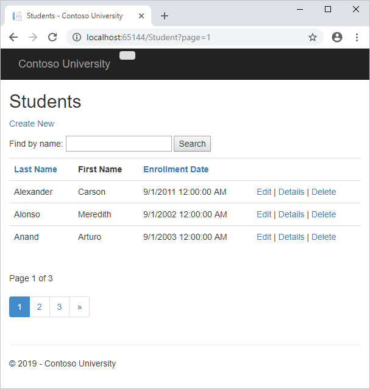
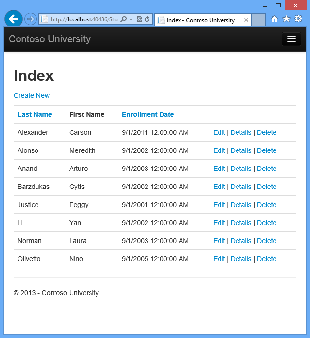
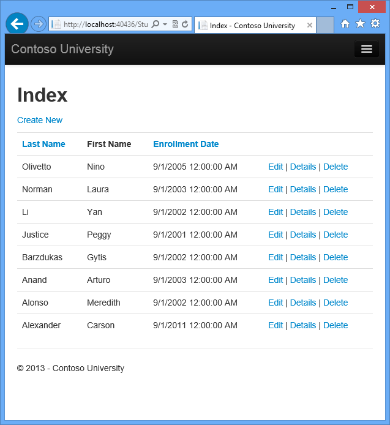
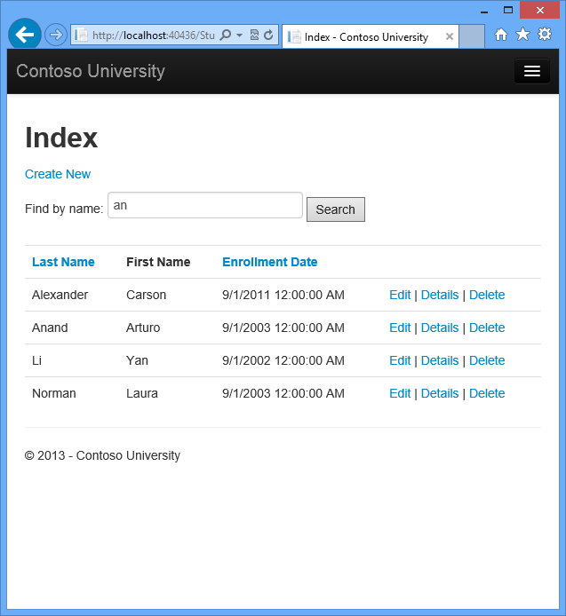
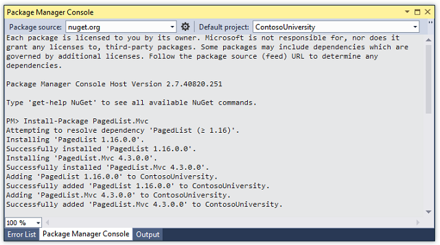
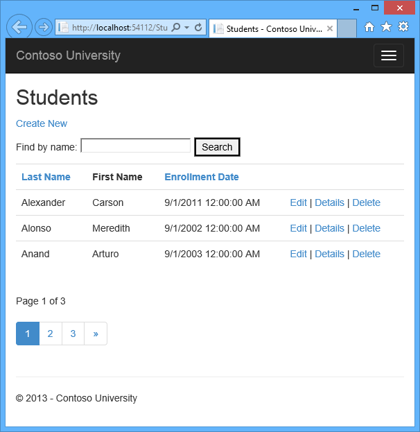
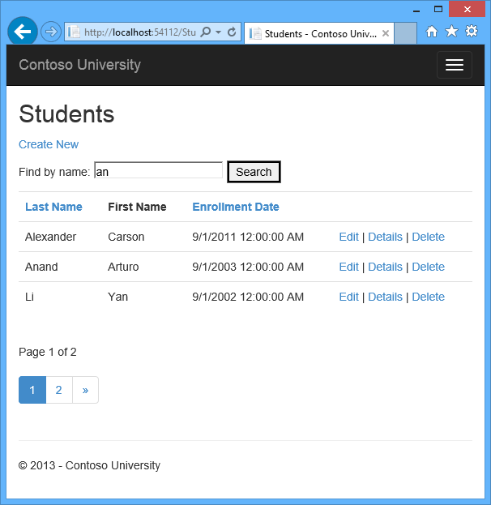
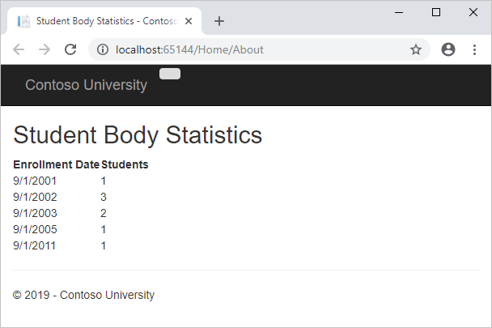

Sorting, Filtering, and Paging with the Entity Framework in an ASP.NET MVC Application
====================
by [Tom Dykstra](https://github.com/tdykstra)

[Download Completed Project](http://code.msdn.microsoft.com/ASPNET-MVC-Application-b01a9fe8) or [Download PDF](http://download.microsoft.com/download/0/F/B/0FBFAA46-2BFD-478F-8E56-7BF3C672DF9D/Getting%20Started%20with%20Entity%20Framework%206%20Code%20First%20using%20MVC%205.pdf)

> The Contoso University sample web application demonstrates how to create ASP.NET MVC 5 applications using the Entity Framework 6 Code First and Visual Studio 2013. For information about the tutorial series, see [the first tutorial in the series](creating-an-entity-framework-data-model-for-an-asp-net-mvc-application.md).

In the previous tutorial you implemented a set of web pages for basic CRUD operations for `Student` entities. In this tutorial you'll add sorting, filtering, and paging functionality to the **Students** Index page. You'll also create a page that does simple grouping.

The following illustration shows what the page will look like when you're done. The column headings are links that the user can click to sort by that column. Clicking a column heading repeatedly toggles between ascending and descending sort order.

## Add Column Sort Links to the Students Index Page

To add sorting to the Student Index page, you'll change the `Index` method of the `Student` controller and add code to the `Student` Index view.

### Add Sorting Functionality to the Index Method

In *Controllers\StudentController.cs*, replace the `Index` method with the following code:

[!code-csharp[Main](sorting-filtering-and-paging-with-the-entity-framework-in-an-asp-net-mvc-application/samples/sample1.cs)]

This code receives a `sortOrder` parameter from the query string in the URL. The query string value is provided by ASP.NET MVC as a parameter to the action method. The parameter will be a string that's either "Name" or "Date", optionally followed by an underscore and the string "desc" to specify descending order. The default sort order is ascending.

The first time the Index page is requested, there's no query string. The students are displayed in ascending order by `LastName`, which is the default as established by the fall-through case in the `switch` statement. When the user clicks a column heading hyperlink, the appropriate `sortOrder` value is provided in the query string.

The two `ViewBag` variables are used so that the view can configure the column heading hyperlinks with the appropriate query string values:

[!code-csharp[Main](sorting-filtering-and-paging-with-the-entity-framework-in-an-asp-net-mvc-application/samples/sample2.cs)]

These are ternary statements. The first one specifies that if the `sortOrder` parameter is null or empty, `ViewBag.NameSortParm` should be set to "name\_desc"; otherwise, it should be set to an empty string. These two statements enable the view to set the column heading hyperlinks as follows:

| Current sort order | Last Name Hyperlink | Date Hyperlink |
| --- | --- | --- |
| Last Name ascending | descending | ascending |
| Last Name descending | ascending | ascending |
| Date ascending | ascending | descending |
| Date descending | ascending | ascending |

The method uses [LINQ to Entities](https://msdn.microsoft.com/en-us/library/bb386964.aspx) to specify the column to sort by. The code creates an [IQueryable](https://msdn.microsoft.com/en-us/library/bb351562.aspx) variable before the `switch` statement, modifies it in the `switch` statement, and calls the `ToList` method after the `switch` statement. When you create and modify `IQueryable` variables, no query is sent to the database. The query is not executed until you convert the `IQueryable` object into a collection by calling a method such as `ToList`. Therefore, this code results in a single query that is not executed until the `return View` statement.

As an alternative to writing different LINQ statements for each sort order, you can dynamically create a LINQ statement. For information about dynamic LINQ, see [Dynamic LINQ](https://go.microsoft.com/fwlink/?LinkID=323957).

### Add Column Heading Hyperlinks to the Student Index View

In *Views\Student\Index.cshtml*, replace the `<tr>` and `<th>` elements for the heading row with the highlighted code:

[!code-cshtml[Main](sorting-filtering-and-paging-with-the-entity-framework-in-an-asp-net-mvc-application/samples/sample3.cshtml?highlight=5-15)]

This code uses the information in the `ViewBag` properties to set up hyperlinks with the appropriate query string values.

Run the page and click the **Last Name** and **Enrollment Date** column headings to verify that sorting works.

After you click the **Last Name** heading, students are displayed in descending last name order.

## Add a Search Box to the Students Index Page

To add filtering to the Students Index page, you'll add a text box and a submit button to the view and make corresponding changes in the `Index` method. The text box will let you enter a string to search for in the first name and last name fields.

### Add Filtering Functionality to the Index Method

In *Controllers\StudentController.cs*, replace the `Index` method with the following code (the changes are highlighted):

[!code-csharp[Main](sorting-filtering-and-paging-with-the-entity-framework-in-an-asp-net-mvc-application/samples/sample4.cs?highlight=1,7-11)]

You've added a `searchString` parameter to the `Index` method. The search string value is received from a text box that you'll add to the Index view. You've also added to the LINQ statement a `where` clause that selects only students whose first name or last name contains the search string. The statement that adds the [where](https://msdn.microsoft.com/en-us/library/bb535040.aspx) clause is executed only if there's a value to search for.

> [!NOTE]
> In many cases you can call the same method either on an Entity Framework entity set or as an extension method on an in-memory collection. The results are normally the same but in some cases may be different.
> 
> For example, the .NET Framework implementation of the `Contains` method returns all rows when you pass an empty string to it, but the Entity Framework provider for SQL Server Compact 4.0 returns zero rows for empty strings. Therefore the code in the example (putting the `Where` statement inside an `if` statement) makes sure that you get the same results for all versions of SQL Server. Also, the .NET Framework implementation of the `Contains` method performs a case-sensitive comparison by default, but Entity Framework SQL Server providers perform case-insensitive comparisons by default. Therefore, calling the `ToUpper` method to make the test explicitly case-insensitive ensures that results do not change when you change the code later to use a repository, which will return an `IEnumerable` collection instead of an `IQueryable` object. (When you call the `Contains` method on an `IEnumerable` collection, you get the .NET Framework implementation; when you call it on an `IQueryable` object, you get the database provider implementation.)
> 
> Null handling may also be different for different database providers or when you use an `IQueryable` object compared to when you use an `IEnumerable` collection. For example, in some scenarios a `Where` condition such as `table.Column != 0` may not return columns that have `null` as the value. For more information, see [Incorrect handling of null variables in 'where' clause](https://data.uservoice.com/forums/72025-entity-framework-feature-suggestions/suggestions/1015361-incorrect-handling-of-null-variables-in-where-cl).

### Add a Search Box to the Student Index View

In *Views\Student\Index.cshtml*, add the highlighted code immediately before the opening `table` tag in order to create a caption, a text box, and a **Search** button.

[!code-cshtml[Main](sorting-filtering-and-paging-with-the-entity-framework-in-an-asp-net-mvc-application/samples/sample5.cshtml?highlight=5-10)]

Run the page, enter a search string, and click **Search** to verify that filtering is working.

Notice the URL doesn't contain the "an" search string, which means that if you bookmark this page, you won't get the filtered list when you use the bookmark. This applies also to the column sort links, as they will sort the whole list. You'll change the **Search** button to use query strings for filter criteria later in the tutorial.

## Add Paging to the Students Index Page

To add paging to the Students Index page, you'll start by installing the **PagedList.Mvc** NuGet package. Then you'll make additional changes in the `Index` method and add paging links to the `Index` view. **PagedList.Mvc** is one of many good paging and sorting packages for ASP.NET MVC, and its use here is intended only as an example, not as a recommendation for it over other options. The following illustration shows the paging links.

### Install the PagedList.MVC NuGet Package

The NuGet **PagedList.Mvc** package automatically installs the **PagedList** package as a dependency. The **PagedList** package installs a `PagedList` collection type and extension methods for `IQueryable` and `IEnumerable` collections. The extension methods create a single page of data in a `PagedList` collection out of your `IQueryable` or `IEnumerable`, and the `PagedList` collection provides several properties and methods that facilitate paging. The **PagedList.Mvc** package installs a paging helper that displays the paging buttons.

From the **Tools** menu, select **Library Package Manager** and then **Package Manager Console**.

In the **Package Manager Console** window, make sure ghe **Package source** is **nuget.org** and the **Default project** is **ContosoUniversity**, and then enter the following command:

`Install-Package PagedList.Mvc`

Build the project. 

### Add Paging Functionality to the Index Method

In *Controllers\StudentController.cs*, add a `using` statement for the `PagedList` namespace:

[!code-csharp[Main](sorting-filtering-and-paging-with-the-entity-framework-in-an-asp-net-mvc-application/samples/sample6.cs)]

Replace the `Index` method with the following code:

[!code-csharp[Main](sorting-filtering-and-paging-with-the-entity-framework-in-an-asp-net-mvc-application/samples/sample7.cs?highlight=1,3,7-16,41-43)]

This code adds a `page` parameter, a current sort order parameter, and a current filter parameter to the method signature:

[!code-csharp[Main](sorting-filtering-and-paging-with-the-entity-framework-in-an-asp-net-mvc-application/samples/sample8.cs)]

The first time the page is displayed, or if the user hasn't clicked a paging or sorting link, all the parameters will be null. If a paging link is clicked, the `page` variable will contain the page number to display.

A `ViewBag` property provides the view with the current sort order, because this must be included in the paging links in order to keep the sort order the same while paging:

[!code-csharp[Main](sorting-filtering-and-paging-with-the-entity-framework-in-an-asp-net-mvc-application/samples/sample9.cs)]

Another property, `ViewBag.CurrentFilter`, provides the view with the current filter string. This value must be included in the paging links in order to maintain the filter settings during paging, and it must be restored to the text box when the page is redisplayed. If the search string is changed during paging, the page has to be reset to 1, because the new filter can result in different data to display. The search string is changed when a value is entered in the text box and the submit button is pressed. In that case, the `searchString` parameter is not null.

[!code-csharp[Main](sorting-filtering-and-paging-with-the-entity-framework-in-an-asp-net-mvc-application/samples/sample10.cs)]

At the end of the method, the `ToPagedList` extension method on the students `IQueryable` object converts the student query to a single page of students in a collection type that supports paging. That single page of students is then passed to the view:

[!code-csharp[Main](sorting-filtering-and-paging-with-the-entity-framework-in-an-asp-net-mvc-application/samples/sample11.cs)]

The `ToPagedList` method takes a page number. The two question marks represent the [null-coalescing operator](https://msdn.microsoft.com/en-us/library/ms173224.aspx). The null-coalescing operator defines a default value for a nullable type; the expression `(page ?? 1)` means return the value of `page` if it has a value, or return 1 if `page` is null.

### Add Paging Links to the Student Index View

In *Views\Student\Index.cshtml*, replace the existing code with the following code. The changes are highlighted.

[!code-cshtml[Main](sorting-filtering-and-paging-with-the-entity-framework-in-an-asp-net-mvc-application/samples/sample12.cshtml?highlight=1-3,6,9,14,17,24,30,55-56,58-59)]

The `@model` statement at the top of the page specifies that the view now gets a `PagedList` object instead of a `List` object.

The `using` statement for `PagedList.Mvc` gives access to the MVC helper for the paging buttons.

The code uses an overload of [BeginForm](https://msdn.microsoft.com/en-us/library/system.web.mvc.html.formextensions.beginform(v=vs.108).aspx) that allows it to specify [FormMethod.Get](https://msdn.microsoft.com/en-us/library/system.web.mvc.formmethod(v=vs.100).aspx/css).

[!code-cshtml[Main](sorting-filtering-and-paging-with-the-entity-framework-in-an-asp-net-mvc-application/samples/sample13.cshtml?highlight=1)]

The default [BeginForm](https://msdn.microsoft.com/en-us/library/system.web.mvc.html.formextensions.beginform(v=vs.108).aspx) submits form data with a POST, which means that parameters are passed in the HTTP message body and not in the URL as query strings. When you specify HTTP GET, the form data is passed in the URL as query strings, which enables users to bookmark the URL. The [W3C guidelines for the use of HTTP GET](http://www.w3.org/2001/tag/doc/whenToUseGet.html) recommend that you should use GET when the action does not result in an update.

The text box is initialized with the current search string so when you click a new page you can see the current search string.

[!code-cshtml[Main](sorting-filtering-and-paging-with-the-entity-framework-in-an-asp-net-mvc-application/samples/sample14.cshtml?highlight=1)]

The column header links use the query string to pass the current search string to the controller so that the user can sort within filter results:

[!code-cshtml[Main](sorting-filtering-and-paging-with-the-entity-framework-in-an-asp-net-mvc-application/samples/sample15.cshtml?highlight=1)]

The current page and total number of pages are displayed.

[!code-cshtml[Main](sorting-filtering-and-paging-with-the-entity-framework-in-an-asp-net-mvc-application/samples/sample16.cshtml)]

If there are no pages to display, "Page 0 of 0" is shown. (In that case the page number is greater than the page count because `Model.PageNumber` is 1, and `Model.PageCount` is 0.)

The paging buttons are displayed by the `PagedListPager` helper:

[!code-cshtml[Main](sorting-filtering-and-paging-with-the-entity-framework-in-an-asp-net-mvc-application/samples/sample17.cshtml)]

The `PagedListPager` helper provides a number of options that you can customize, including URLs and styling. For more information, see [TroyGoode / PagedList](https://github.com/TroyGoode/PagedList) on the GitHub site.

Run the page.

Click the paging links in different sort orders to make sure paging works. Then enter a search string and try paging again to verify that paging also works correctly with sorting and filtering.

## Create an About Page That Shows Student Statistics

For the Contoso University website's About page, you'll display how many students have enrolled for each enrollment date. This requires grouping and simple calculations on the groups. To accomplish this, you'll do the following:

- Create a view model class for the data that you need to pass to the view.
- Modify the `About` method in the `Home` controller.
- Modify the `About` view.

### Create the View Model

Create a *ViewModels* folder in the project folder. In that folder, add a class file *EnrollmentDateGroup.cs* and replace the template code with the following code:

[!code-csharp[Main](sorting-filtering-and-paging-with-the-entity-framework-in-an-asp-net-mvc-application/samples/sample18.cs)]

### Modify the Home Controller

In *HomeController.cs*, add the following `using` statements at the top of the file:

[!code-csharp[Main](sorting-filtering-and-paging-with-the-entity-framework-in-an-asp-net-mvc-application/samples/sample19.cs)]

Add a class variable for the database context immediately after the opening curly brace for the class:

[!code-csharp[Main](sorting-filtering-and-paging-with-the-entity-framework-in-an-asp-net-mvc-application/samples/sample20.cs?highlight=3)]

Replace the `About` method with the following code:

[!code-csharp[Main](sorting-filtering-and-paging-with-the-entity-framework-in-an-asp-net-mvc-application/samples/sample21.cs)]

The LINQ statement groups the student entities by enrollment date, calculates the number of entities in each group, and stores the results in a collection of `EnrollmentDateGroup` view model objects.

Add a `Dispose` method:

[!code-csharp[Main](sorting-filtering-and-paging-with-the-entity-framework-in-an-asp-net-mvc-application/samples/sample22.cs)]

### Modify the About View

Replace the code in the *Views\Home\About.cshtml* file with the following code:

[!code-cshtml[Main](sorting-filtering-and-paging-with-the-entity-framework-in-an-asp-net-mvc-application/samples/sample23.cshtml)]

Run the app and click the **About** link. The count of students for each enrollment date is displayed in a table.

## Summary

In this tutorial you've seen how to create a data model and implement basic CRUD, sorting, filtering, paging, and grouping functionality. In the next tutorial you'll begin looking at more advanced topics by expanding the data model.

Please leave feedback on how you liked this tutorial and what we could improve. You can also request new topics at [Show Me How With Code](http://aspnet.uservoice.com/forums/228522-show-me-how-with-code).

Links to other Entity Framework resources can be found in [ASP.NET Data Access - Recommended Resources](../../../../whitepapers/aspnet-data-access-content-map.md).

>[!div class="step-by-step"]
[Previous](implementing-basic-crud-functionality-with-the-entity-framework-in-asp-net-mvc-application.md)
[Next](connection-resiliency-and-command-interception-with-the-entity-framework-in-an-asp-net-mvc-application.md)
