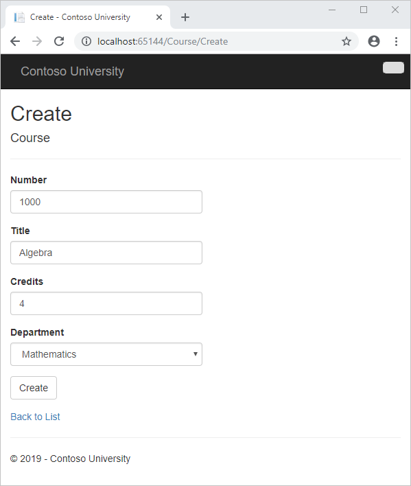
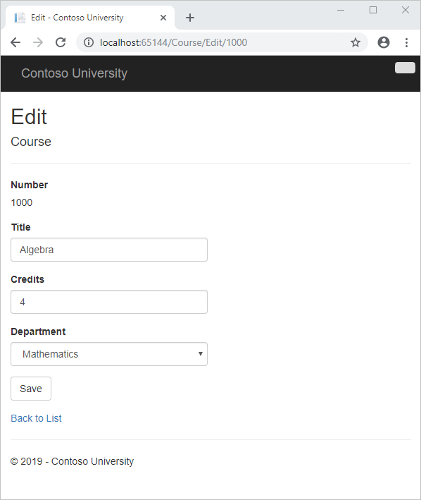
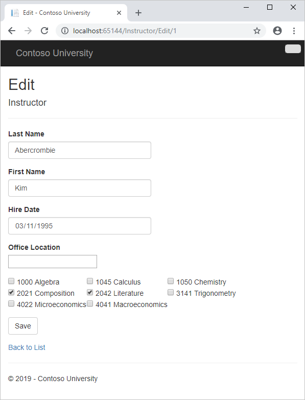
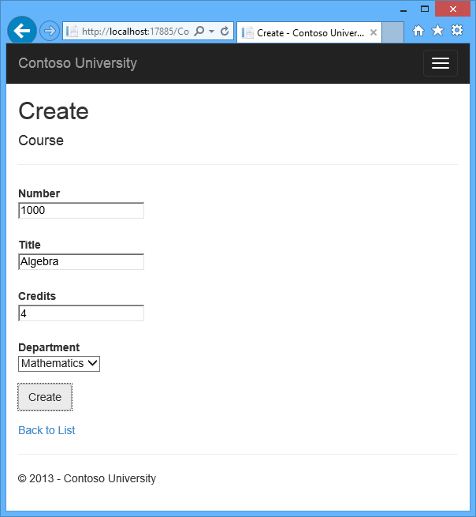
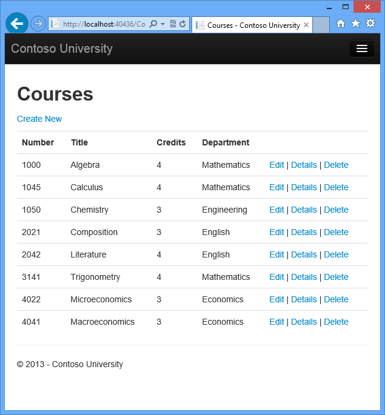
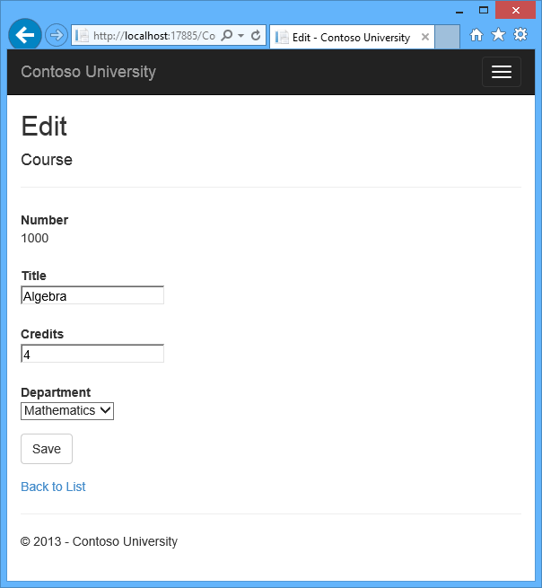
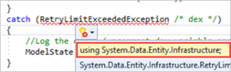
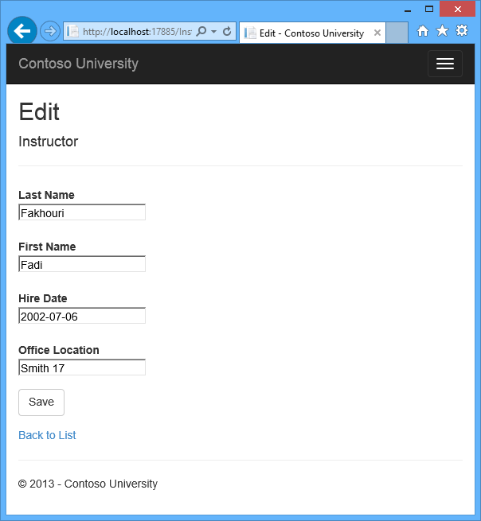
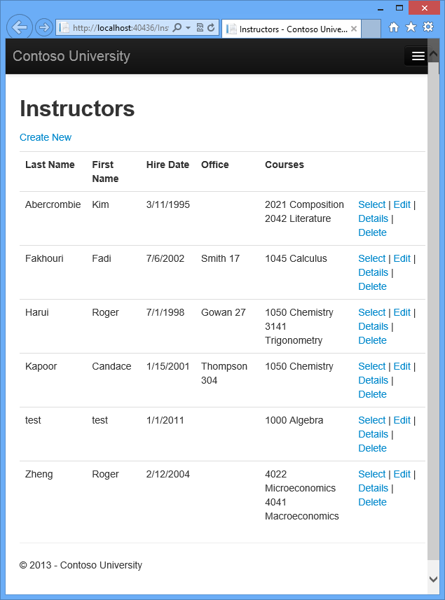
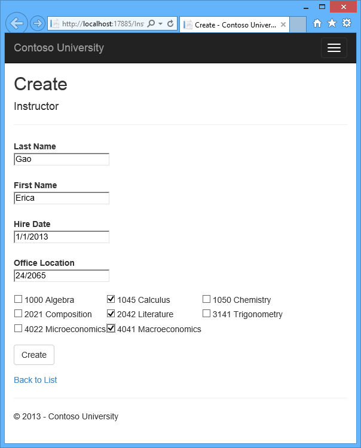

Updating Related Data with the Entity Framework in an ASP.NET MVC Application
====================
by [Tom Dykstra](https://github.com/tdykstra)

[Download Completed Project](http://code.msdn.microsoft.com/ASPNET-MVC-Application-b01a9fe8) or [Download PDF](http://download.microsoft.com/download/0/F/B/0FBFAA46-2BFD-478F-8E56-7BF3C672DF9D/Getting%20Started%20with%20Entity%20Framework%206%20Code%20First%20using%20MVC%205.pdf)

> The Contoso University sample web application demonstrates how to create ASP.NET MVC 5 applications using the Entity Framework 6 Code First and Visual Studio 2013. For information about the tutorial series, see [the first tutorial in the series](creating-an-entity-framework-data-model-for-an-asp-net-mvc-application.md).

In the previous tutorial you displayed related data; in this tutorial you'll update related data. For most relationships, this can be done by updating either foreign key fields or navigation properties. For many-to-many relationships, the Entity Framework doesn't expose the join table directly, so you add and remove entities to and from the appropriate navigation properties.

The following illustrations show some of the pages that you'll work with.

## Customize the Create and Edit Pages for Courses

When a new course entity is created, it must have a relationship to an existing department. To facilitate this, the scaffolded code includes controller methods and Create and Edit views that include a drop-down list for selecting the department. The drop-down list sets the `Course.DepartmentID` foreign key property, and that's all the Entity Framework needs in order to load the `Department` navigation property with the appropriate `Department` entity. You'll use the scaffolded code, but change it slightly to add error handling and sort the drop-down list.

In *CourseController.cs*, delete the four `Create` and `Edit` methods and replace them with the following code:

[!code-csharp[Main](updating-related-data-with-the-entity-framework-in-an-asp-net-mvc-application/samples/sample1.cs?highlight=3,11-12,19-25,40,44,46,48-78)]

Add the following `using` statement at the beginning of the file:

[!code-csharp[Main](updating-related-data-with-the-entity-framework-in-an-asp-net-mvc-application/samples/sample2.cs)]

The `PopulateDepartmentsDropDownList` method gets a list of all departments sorted by name, creates a `SelectList` collection for a drop-down list, and passes the collection to the view in a `ViewBag` property. The method accepts the optional `selectedDepartment` parameter that allows the calling code to specify the item that will be selected when the drop-down list is rendered. The view will pass the name `DepartmentID` to the [DropDownList](../../older-versions/working-with-the-dropdownlist-box-and-jquery/using-the-dropdownlist-helper-with-aspnet-mvc.md) helper, and the helper then knows to look in the `ViewBag` object for a `SelectList` named `DepartmentID`.

The `HttpGet` `Create` method calls the `PopulateDepartmentsDropDownList` method without setting the selected item, because for a new course the department is not established yet:

[!code-csharp[Main](updating-related-data-with-the-entity-framework-in-an-asp-net-mvc-application/samples/sample3.cs)]

The `HttpGet` `Edit` method sets the selected item, based on the ID of the department that is already assigned to the course being edited:

[!code-csharp[Main](updating-related-data-with-the-entity-framework-in-an-asp-net-mvc-application/samples/sample4.cs?highlight=12)]

The `HttpPost` methods for both `Create` and `Edit` also include code that sets the selected item when they redisplay the page after an error:

[!code-csharp[Main](updating-related-data-with-the-entity-framework-in-an-asp-net-mvc-application/samples/sample5.cs?highlight=6)]

This code ensures that when the page is redisplayed to show the error message, whatever department was selected stays selected.

The Course views are already scaffolded with drop-down lists for the department field, but you don't want the DepartmentID caption for this field, so make the following highlighted change to the *Views\Course\Create.cshtml* file to change the caption.

[!code-cshtml[Main](updating-related-data-with-the-entity-framework-in-an-asp-net-mvc-application/samples/sample6.cshtml?highlight=43)]

Make the same change in *Views\Course\Edit.cshtml*.

Normally the scaffolder doesn't scaffold a primary key because the key value is generated by the database and can't be changed and isn't a meaningful value to be displayed to users. For Course entities the scaffolder does include an text box for the `CourseID` field because it understands that the `DatabaseGeneratedOption.None` attribute means the user should be able enter the primary key value. But it doesn't understand that because the number is meaningful you want to see it in the other views, so you need to add it manually.

In *Views\Course\Edit.cshtml*, add a course number field before the **Title** field. Because it's the primary key, it's displayed, but it can't be changed.

[!code-cshtml[Main](updating-related-data-with-the-entity-framework-in-an-asp-net-mvc-application/samples/sample7.cshtml)]

There's already a hidden field (`Html.HiddenFor` helper) for the course number in the Edit view. Adding an *Html.LabelFor* helper doesn't eliminate the need for the hidden field because it doesn't cause the course number to be included in the posted data when the user clicks **Save** on the Edit page.

In *Views\Course\Delete.cshtml* and *Views\Course\Details.cshtml*, change the department name caption from "Name" to "Department" and add a course number field before the **Title** field.

[!code-cshtml[Main](updating-related-data-with-the-entity-framework-in-an-asp-net-mvc-application/samples/sample8.cshtml?highlight=2,9-15)]

Run the **Create** page (display the Course Index page and click **Create New**) and enter data for a new course:

Click **Create**. The Course Index page is displayed with the new course added to the list. The department name in the Index page list comes from the navigation property, showing that the relationship was established correctly.

Run the **Edit** page (display the Course Index page and click **Edit** on a course).

Change data on the page and click **Save**. The Course Index page is displayed with the updated course data.

## Adding an Edit Page for Instructors

When you edit an instructor record, you want to be able to update the instructor's office assignment. The `Instructor` entity has a one-to-zero-or-one relationship with the `OfficeAssignment` entity, which means you must handle the following situations:

- If the user clears the office assignment and it originally had a value, you must remove and delete the `OfficeAssignment` entity.
- If the user enters an office assignment value and it originally was empty, you must create a new `OfficeAssignment` entity.
- If the user changes the value of an office assignment, you must change the value in an existing `OfficeAssignment` entity.

Open *InstructorController.cs* and look at the `HttpGet` `Edit` method:

[!code-csharp[Main](updating-related-data-with-the-entity-framework-in-an-asp-net-mvc-application/samples/sample9.cs)]

The scaffolded code here isn't what you want. It's setting up data for a drop-down list, but you what you need is a text box. Replace this method with the following code:

[!code-csharp[Main](updating-related-data-with-the-entity-framework-in-an-asp-net-mvc-application/samples/sample10.cs?highlight=7-10)]

This code drops the `ViewBag` statement and adds eager loading for the associated `OfficeAssignment` entity. You can't perform eager loading with the `Find` method, so the `Where` and `Single` methods are used instead to select the instructor.

Replace the `HttpPost` `Edit` method with the following code. which handles office assignment updates:

[!code-csharp[Main](updating-related-data-with-the-entity-framework-in-an-asp-net-mvc-application/samples/sample11.cs)]

The reference to `RetryLimitExceededException` requires a `using` statement; to add it, right-click `RetryLimitExceededException`, and then click **Resolve** - **using System.Data.Entity.Infrastructure**.

The code does the following:

- Changes the method name to `EditPost` because the signature is now the same as the `HttpGet` method (the `ActionName` attribute specifies that the /Edit/ URL is still used).
- Gets the current `Instructor` entity from the database using eager loading for the `OfficeAssignment` navigation property. This is the same as what you did in the `HttpGet` `Edit` method.
- Updates the retrieved `Instructor` entity with values from the model binder. The [TryUpdateModel](https://msdn.microsoft.com/en-us/library/dd470908(v=vs.108).aspx) overload used enables you to *whitelist* the properties you want to include. This prevents over-posting, as explained in [the second tutorial](implementing-basic-crud-functionality-with-the-entity-framework-in-asp-net-mvc-application.md).

    [!code-csharp[Main](updating-related-data-with-the-entity-framework-in-an-asp-net-mvc-application/samples/sample12.cs)]
- If the office location is blank, sets the `Instructor.OfficeAssignment` property to null so that the related row in the `OfficeAssignment` table will be deleted.

    [!code-csharp[Main](updating-related-data-with-the-entity-framework-in-an-asp-net-mvc-application/samples/sample13.cs)]
- Saves the changes to the database.

In *Views\Instructor\Edit.cshtml*, after the `div` elements for the **Hire Date** field, add a new field for editing the office location:

[!code-cshtml[Main](updating-related-data-with-the-entity-framework-in-an-asp-net-mvc-application/samples/sample14.cshtml)]

Run the page (select the **Instructors** tab and then click **Edit** on an instructor). Change the **Office Location** and click **Save**.

## Adding Course Assignments to the Instructor Edit Page

Instructors may teach any number of courses. Now you'll enhance the Instructor Edit page by adding the ability to change course assignments using a group of check boxes, as shown in the following screen shot:

The relationship between the `Course` and `Instructor` entities is many-to-many, which means you do not have direct access to the foreign key properties which are in the join table. Instead, you add and remove entities to and from the `Instructor.Courses` navigation property.

The UI that enables you to change which courses an instructor is assigned to is a group of check boxes. A check box for every course in the database is displayed, and the ones that the instructor is currently assigned to are selected. The user can select or clear check boxes to change course assignments. If the number of courses were much greater, you would probably want to use a different method of presenting the data in the view, but you'd use the same method of manipulating navigation properties in order to create or delete relationships.

To provide data to the view for the list of check boxes, you'll use a view model class. Create *AssignedCourseData.cs* in the *ViewModels* folder and replace the existing code with the following code:

[!code-csharp[Main](updating-related-data-with-the-entity-framework-in-an-asp-net-mvc-application/samples/sample15.cs)]

In *InstructorController.cs*, replace the `HttpGet` `Edit` method with the following code. The changes are highlighted.

[!code-csharp[Main](updating-related-data-with-the-entity-framework-in-an-asp-net-mvc-application/samples/sample16.cs?highlight=9,12,20-35)]

The code adds eager loading for the `Courses` navigation property and calls the new `PopulateAssignedCourseData` method to provide information for the check box array using the `AssignedCourseData` view model class.

The code in the `PopulateAssignedCourseData` method reads through all `Course` entities in order to load a list of courses using the view model class. For each course, the code checks whether the course exists in the instructor's `Courses` navigation property. To create efficient lookup when checking whether a course is assigned to the instructor, the courses assigned to the instructor are put into a [HashSet](https://msdn.microsoft.com/en-us/library/bb359438.aspx) collection. The `Assigned` property is set to `true` for courses the instructor is assigned. The view will use this property to determine which check boxes must be displayed as selected. Finally, the list is passed to the view in a `ViewBag` property.

Next, add the code that's executed when the user clicks **Save**. Replace the `EditPost` method with the following code, which calls a new method that updates the `Courses` navigation property of the `Instructor` entity. The changes are highlighted.

[!code-csharp[Main](updating-related-data-with-the-entity-framework-in-an-asp-net-mvc-application/samples/sample17.cs?highlight=3,11,25,37,40-68)]

The method signature is now different from the `HttpGet` `Edit` method, so the method name changes from `EditPost` back to `Edit`.

Since the view doesn't have a collection of `Course` entities, the model binder can't automatically update the `Courses` navigation property. Instead of using the model binder to update the `Courses` navigation property, you'll do that in the new `UpdateInstructorCourses` method. Therefore you need to exclude the `Courses` property from model binding. This doesn't require any change to the code that calls [TryUpdateModel](https://msdn.microsoft.com/en-us/library/dd470908(v=vs.98).aspx) because you're using the *whitelisting* overload and `Courses` isn't in the include list.

If no check boxes were selected, the code in `UpdateInstructorCourses` initializes the `Courses` navigation property with an empty collection:

[!code-csharp[Main](updating-related-data-with-the-entity-framework-in-an-asp-net-mvc-application/samples/sample18.cs)]

The code then loops through all courses in the database and checks each course against the ones currently assigned to the instructor versus the ones that were selected in the view. To facilitate efficient lookups, the latter two collections are stored in `HashSet` objects.

If the check box for a course was selected but the course isn't in the `Instructor.Courses` navigation property, the course is added to the collection in the navigation property.

[!code-csharp[Main](updating-related-data-with-the-entity-framework-in-an-asp-net-mvc-application/samples/sample19.cs)]

If the check box for a course wasn't selected, but the course is in the `Instructor.Courses` navigation property, the course is removed from the navigation property.

[!code-csharp[Main](updating-related-data-with-the-entity-framework-in-an-asp-net-mvc-application/samples/sample20.cs)]

In *Views\Instructor\Edit.cshtml*, add a **Courses** field with an array of check boxes by adding the following code immediately after the `div` elements for the `OfficeAssignment` field and before the `div` element for the **Save** button:

[!code-cshtml[Main](updating-related-data-with-the-entity-framework-in-an-asp-net-mvc-application/samples/sample21.cshtml)]

After you paste the code, if line breaks and indentation don't look like they do here, manually fix everything so that it looks like what you see here. The indentation doesn't have to be perfect, but the `@</tr><tr>`, `@:<td>`, `@:</td>`, and `@</tr>` lines must each be on a single line as shown or you'll get a runtime error.

This code creates an HTML table that has three columns. In each column is a check box followed by a caption that consists of the course number and title. The check boxes all have the same name ("selectedCourses"), which informs the model binder that they are to be treated as a group. The `value` attribute of each check box is set to the value of `CourseID.` When the page is posted, the model binder passes an array to the controller that consists of the `CourseID` values for only the check boxes which are selected.

When the check boxes are initially rendered, those that are for courses assigned to the instructor have `checked` attributes, which selects them (displays them checked).

After changing course assignments, you'll want to be able to verify the changes when the site returns to the `Index` page. Therefore, you need to add a column to the table in that page. In this case you don't need to use the `ViewBag` object, because the information you want to display is already in the `Courses` navigation property of the `Instructor` entity that you're passing to the page as the model.

In *Views\Instructor\Index.cshtml*, add a **Courses** heading immediately following the **Office** heading, as shown in the following example:

[!code-cshtml[Main](updating-related-data-with-the-entity-framework-in-an-asp-net-mvc-application/samples/sample22.cshtml?highlight=6)]

Then add a new detail cell immediately following the office location detail cell:

[!code-cshtml[Main](updating-related-data-with-the-entity-framework-in-an-asp-net-mvc-application/samples/sample23.cshtml?highlight=7-14)]

Run the **Instructor Index** page to see the courses assigned to each instructor:

Click **Edit** on an instructor to see the Edit page.

Change some course assignments and click **Save**. The changes you make are reflected on the Index page.

 Note: The approach taken here to edit instructor course data works well when there is a limited number of courses. For collections that are much larger, a different UI and a different updating method would be required.  
 

## Update the DeleteConfirmed Method

In *InstructorController.cs*, delete the `DeleteConfirmed` method and insert the following code in its place.

[!code-csharp[Main](updating-related-data-with-the-entity-framework-in-an-asp-net-mvc-application/samples/sample24.cs?highlight=5-8,12-18)]

This code makes the following change:

- If the instructor is assigned as administrator of any department, removes the instructor assignment from that department. Without this code, you would get a referential integrity error if you tried to delete an instructor who was assigned as administrator for a department.

This code doesn't handle the scenario of one instructor assigned as administrator for multiple departments. In the last tutorial you'll add code that prevents that scenario from happening.

## Add office location and courses to the Create page

In *InstructorController.cs*, delete the `HttpGet` and `HttpPost` `Create` methods, and then add the following code in their place:

[!code-csharp[Main](updating-related-data-with-the-entity-framework-in-an-asp-net-mvc-application/samples/sample25.cs)]

This code is similar to what you saw for the Edit methods except that initially no courses are selected. The `HttpGet` `Create` method calls the `PopulateAssignedCourseData` method not because there might be courses selected but in order to provide an empty collection for the `foreach` loop in the view (otherwise the view code would throw a null reference exception).

The HttpPost Create method adds each selected course to the Courses navigation property before the template code that checks for validation errors and adds the new instructor to the database. Courses are added even if there are model errors so that when there are model errors (for an example, the user keyed an invalid date) so that when the page is redisplayed with an error message, any course selections that were made are automatically restored.

Notice that in order to be able to add courses to the `Courses` navigation property you have to initialize the property as an empty collection:

[!code-csharp[Main](updating-related-data-with-the-entity-framework-in-an-asp-net-mvc-application/samples/sample26.cs)]

As an alternative to doing this in controller code, you could do it in the Instructor model by changing the property getter to automatically create the collection if it doesn't exist, as shown in the following example:

[!code-csharp[Main](updating-related-data-with-the-entity-framework-in-an-asp-net-mvc-application/samples/sample27.cs)]

If you modify the `Courses` property in this way, you can remove the explicit property initialization code in the controller.

In *Views\Instructor\Create.cshtml*, add an office location text box and course check boxes after the hire date field and before the **Submit** button.

[!code-cshtml[Main](updating-related-data-with-the-entity-framework-in-an-asp-net-mvc-application/samples/sample28.cshtml)]

After you paste the code, fix line breaks and indentation as you did earlier for the Edit page.

Run the Create page and add an instructor.

## Handling Transactions

As explained in the [Basic CRUD Functionality tutorial](implementing-basic-crud-functionality-with-the-entity-framework-in-asp-net-mvc-application.md), by default the Entity Framework implicitly implements transactions. For scenarios where you need more control -- for example, if you want to include operations done outside of Entity Framework in a transaction -- see [Working with Transactions](https://msdn.microsoft.com/en-US/data/dn456843) on MSDN.

## Summary

You have now completed this introduction to working with related data. So far in these tutorials you've worked with code that does synchronous I/O. You can make the application use web server resources more efficiently by implementing asynchronous code, and that's what you'll do in the next tutorial.

Please leave feedback on how you liked this tutorial and what we could improve. You can also request new topics at [Show Me How With Code](http://aspnet.uservoice.com/forums/228522-show-me-how-with-code).

Links to other Entity Framework resources can be found in [ASP.NET Data Access - Recommended Resources](../../../../whitepapers/aspnet-data-access-content-map.md).

>[!div class="step-by-step"]
[Previous](reading-related-data-with-the-entity-framework-in-an-asp-net-mvc-application.md)
[Next](async-and-stored-procedures-with-the-entity-framework-in-an-asp-net-mvc-application.md)