Accessing Your Model's Data from a Controller
====================
by [Rick Anderson](https://github.com/Rick-Anderson)

In this section, you'll create a new `MoviesController` class and write code that retrieves the movie data and displays it in the browser using a view template.

**Build the application** before going on to the next step. If you don't build the application, you'll get an error adding a controller.

In Solution Explorer, right-click the *Controllers* folder and then click **Add**, then **Controller**.

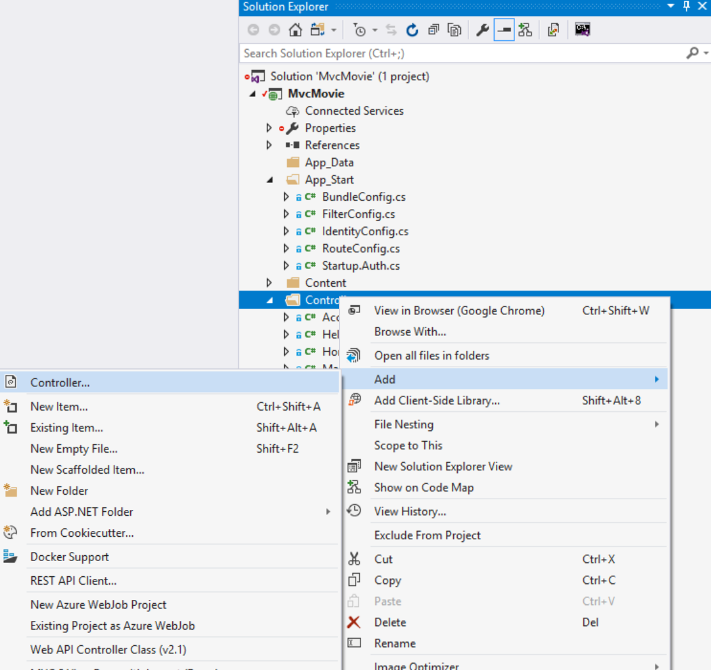

In the **Add Scaffold** dialog box, click **MVC 5 Controller with views, using Entity Framework**, and then click **Add**.

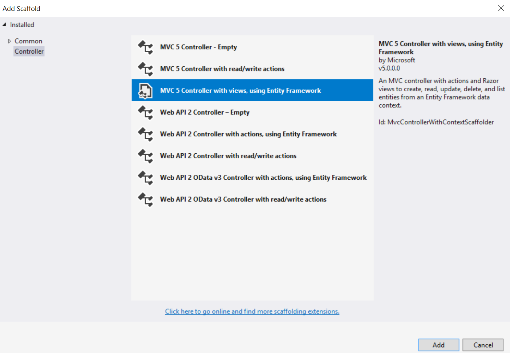

- For the Controller name enter **MoviesController**.
- Select **Movie (MvcMovie.Models)** for the Model class.
- Select **MovieDBContext (MvcMovie.Models)** for the Data context class.

 The image below shows the completed dialog.  
  
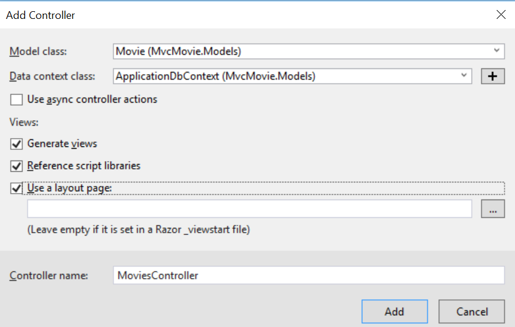   

Click **Add**. (If you get an error, you probably didn't build the application before starting adding the controller.) Visual Studio creates the following files and folders:

- *A MoviesController.cs* file in the *Controllers* folder.
- A *Views\Movies* folder.
- *Create.cshtml, Delete.cshtml, Details.cshtml, Edit.cshtml*, and *Index.cshtml* in the new *Views\Movies* folder.

Visual Studio automatically created the [CRUD](http://en.wikipedia.org/wiki/Create,_read,_update_and_delete) (create, read, update, and delete) action methods and views for you (the automatic creation of CRUD action methods and views is known as scaffolding). You now have a fully functional web application that lets you create, list, edit, and delete movie entries.

Run the application and click on the **MVC Movie** link (or browse to the `Movies` controller by appending */Movies* to the URL in the address bar of your browser). Because the application is relying on the default routing (defined in the *App\_Start\RouteConfig.cs* file), the browser request `http://localhost:xxxxx/Movies` is routed to the default `Index` action method of the `Movies` controller. In other words, the browser request `http://localhost:xxxxx/Movies` is effectively the same as the browser request `http://localhost:xxxxx/Movies/Index`. The result is an empty list of movies, because you haven't added any yet.

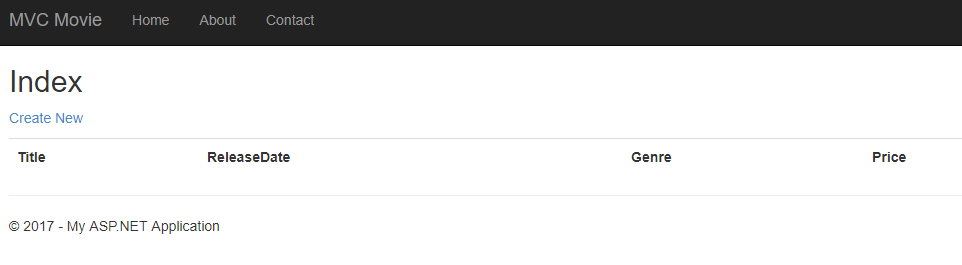

### Creating a Movie

Select the **Create New** link. Enter some details about a movie and then click the **Create** button.

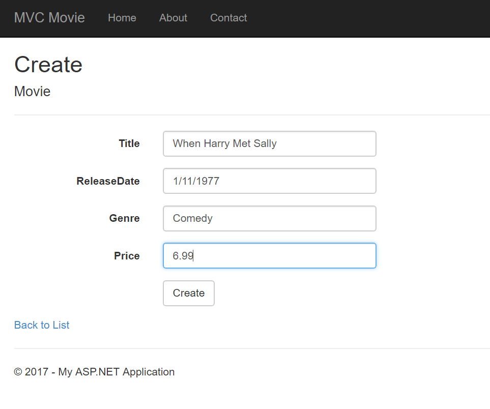

> [!NOTE]
> You may not be able to enter decimal points or commas in the Price field. To support jQuery validation for non-English locales that use a comma (&quot;,&quot;) for a decimal point, and non US-English date formats, you must include *globalize.js* and your specific *cultures/globalize.cultures.js* file(from [https://github.com/jquery/globalize](https://github.com/jquery/globalize) ) and JavaScript to use `Globalize.parseFloat`. I'll show how to do this in the next tutorial. For now, just enter whole numbers like 10.

Clicking the **Create** button causes the form to be posted to the server, where the movie information is saved in the database. You're then redirected to the */Movies* URL, where you can see the newly created movie in the listing.

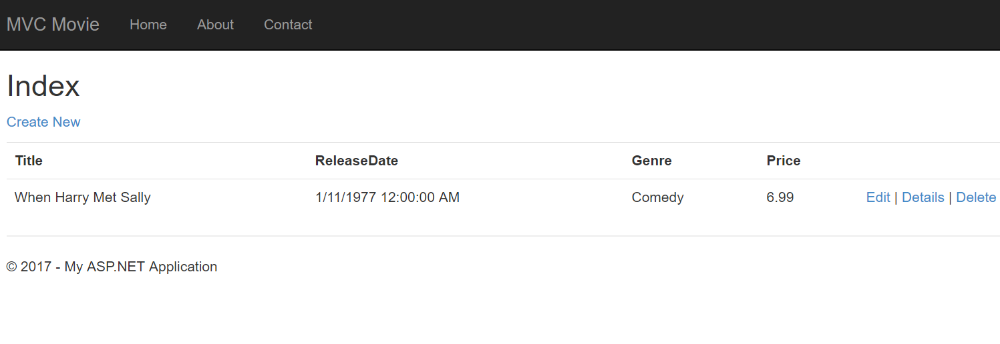

Create a couple more movie entries. Try the **Edit**, **Details**, and **Delete** links, which are all functional.

## Examining the Generated Code

Open the *Controllers\MoviesController.cs* file and examine the generated `Index` method. A portion of the movie controller with the `Index` method is shown below.

[!code-csharp[Main](accessing-your-models-data-from-a-controller/samples/sample1.cs)]

A request to the `Movies` controller returns all the entries in the `Movies` table and then passes the results to the `Index` view. The following line from the `MoviesController` class instantiates a movie database context, as described previously. You can use the movie database context to query, edit, and delete movies.

[!code-csharp[Main](accessing-your-models-data-from-a-controller/samples/sample2.cs)]

## Strongly Typed Models and the @model Keyword

Earlier in this tutorial, you saw how a controller can pass data or objects to a view template using the `ViewBag` object. The `ViewBag` is a dynamic object that provides a convenient late-bound way to pass information to a view.

MVC also provides the ability to pass *strongly* typed objects to a view template. This strongly typed approach enables better compile-time checking of your code and richer [IntelliSense](https://msdn.microsoft.com/en-us/library/hcw1s69b(v=vs.120).aspx) in the Visual Studio editor. The scaffolding mechanism in Visual Studio used this approach (that is, passing a *strongly* typed model) with the `MoviesController` class and view templates when it created the methods and views.

In the *Controllers\MoviesController.cs* file examine the generated `Details` method. The `Details` method is shown below.

[!code-csharp[Main](accessing-your-models-data-from-a-controller/samples/sample3.cs)]

The `id` parameter is generally passed as route data, for example `http://localhost:1234/movies/details/1` will set the controller to the movie controller, the action to `details` and the `id` to 1. You could also pass in the id with a query string as follows:

`http://localhost:1234/movies/details?id=1`

If a `Movie` is found, an instance of the `Movie` model is passed to the `Details` view:

[!code-csharp[Main](accessing-your-models-data-from-a-controller/samples/sample4.cs)]

Examine the contents of the *Views\Movies\Details.cshtml* file:

[!code-cshtml[Main](accessing-your-models-data-from-a-controller/samples/sample5.cshtml?highlight=1-2)]

By including a `@model` statement at the top of the view template file, you can specify the type of object that the view expects. When you created the movie controller, Visual Studio automatically included the following `@model` statement at the top of the *Details.cshtml* file:

[!code-cshtml[Main](accessing-your-models-data-from-a-controller/samples/sample6.cshtml)]

This `@model` directive allows you to access the movie that the controller passed to the view by using a `Model` object that's strongly typed. For example, in the *Details.cshtml* template, the code passes each movie field to the `DisplayNameFor` and [DisplayFor](https://msdn.microsoft.com/en-us/library/system.web.mvc.html.displayextensions.displayfor(VS.98).aspx) HTML Helpers with the strongly typed `Model` object. The `Create` and `Edit` methods and view templates also pass a movie model object.

Examine the *Index.cshtml* view template and the `Index` method in the *MoviesController.cs* file. Notice how the code creates a [`List`](https://msdn.microsoft.com/en-us/library/6sh2ey19.aspx) object when it calls the `View` helper method in the `Index` action method. The code then passes this `Movies` list from the `Index` action method to the view:

[!code-csharp[Main](accessing-your-models-data-from-a-controller/samples/sample7.cs?highlight=3)]

When you created the movie controller, Visual Studio automatically included the following `@model` statement at the top of the *Index.cshtml* file:

[!code-cshtml[Main](accessing-your-models-data-from-a-controller/samples/sample8.cshtml)]

This `@model` directive allows you to access the list of movies that the controller passed to the view by using a `Model` object that's strongly typed. For example, in the *Index.cshtml* template, the code loops through the movies by doing a `foreach` statement over the strongly typed `Model` object:

[!code-cshtml[Main](accessing-your-models-data-from-a-controller/samples/sample9.cshtml?highlight=1,4,7,10,13,16,19-21)]

Because the `Model` object is strongly typed (as an `IEnumerable<Movie>` object), each `item` object in the loop is typed as `Movie`. Among other benefits, this means that you get compile-time checking of the code and full IntelliSense support in the code editor:

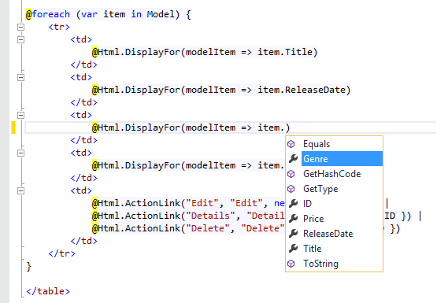

## Working with SQL Server LocalDB

Entity Framework Code First detected that the database connection string that was provided pointed to a `Movies` database that didn't exist yet, so Code First created the database automatically. You can verify that it's been created by looking in the *App\_Data* folder. If you don't see the *Movies.mdf* file, click the **Show All Files** button in the **Solution Explorer** toolbar, click the **Refresh** button, and then expand the *App\_Data* folder.

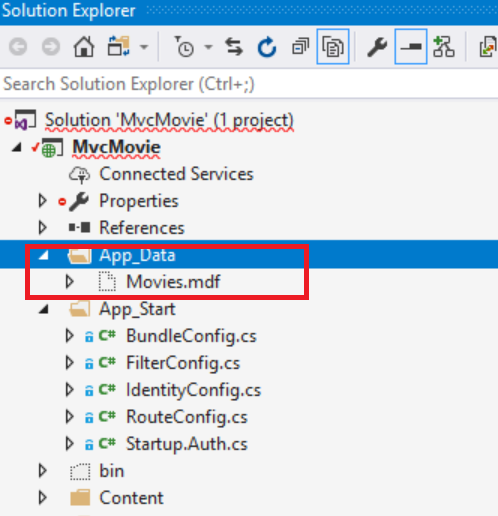

Double-click *Movies.mdf* to open **SERVER EXPLORER**, then expand the **Tables** folder to see the Movies table. Note the key icon next to ID. By default, EF will make a property named ID the primary key. For more information on EF and MVC, see Tom Dykstra's excellent tutorial on [MVC and EF](../getting-started-with-ef-using-mvc/creating-an-entity-framework-data-model-for-an-asp-net-mvc-application.md).

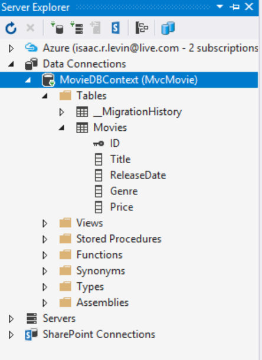

Right-click the `Movies` table and select **Show Table Data** to see the data you created.

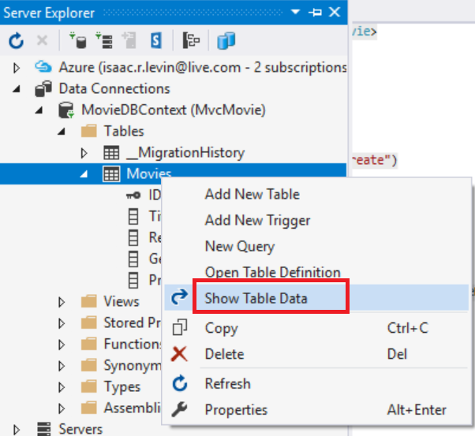 

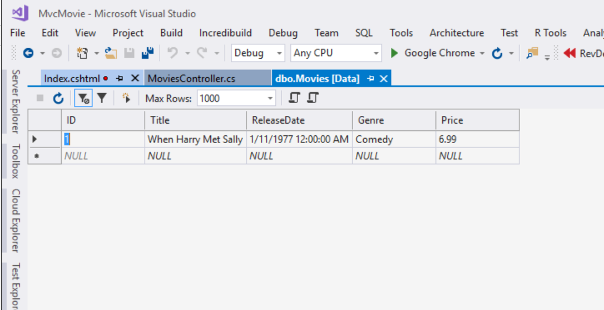

Right-click the `Movies` table and select **Open Table Definition** to see the table structure that Entity Framework Code First created for you.

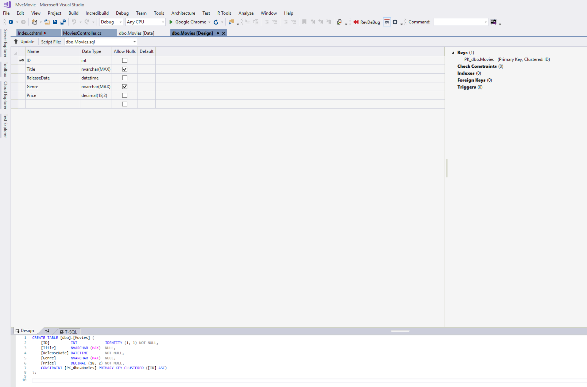

Notice how the schema of the `Movies` table maps to the `Movie` class you created earlier. Entity Framework Code First automatically created this schema for you based on your `Movie` class.

When you're finished, close the connection by right clicking *MovieDBContext* and selecting **Close Connection**. (If you don't close the connection, you might get an error the next time you run the project).

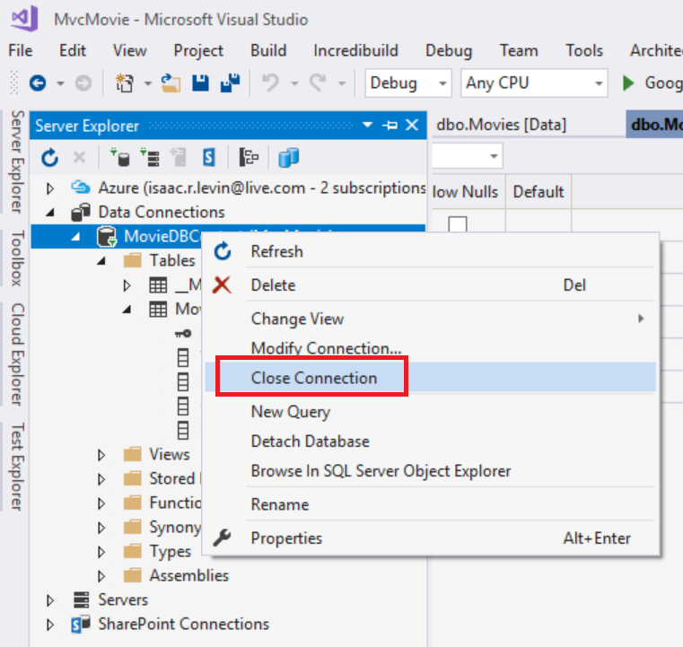

You now have a database and pages to display, edit, update and delete data. In the next tutorial, we'll examine the rest of the scaffolded code and add a `SearchIndex` method and a `SearchIndex` view that lets you search for movies in this database. For more information on using Entity Framework with MVC, see [Creating an Entity Framework Data Model for an ASP.NET MVC Application](../getting-started-with-ef-using-mvc/creating-an-entity-framework-data-model-for-an-asp-net-mvc-application.md).

>[!div class="step-by-step"]
[Previous](creating-a-connection-string.md)
[Next](examining-the-edit-methods-and-edit-view.md)